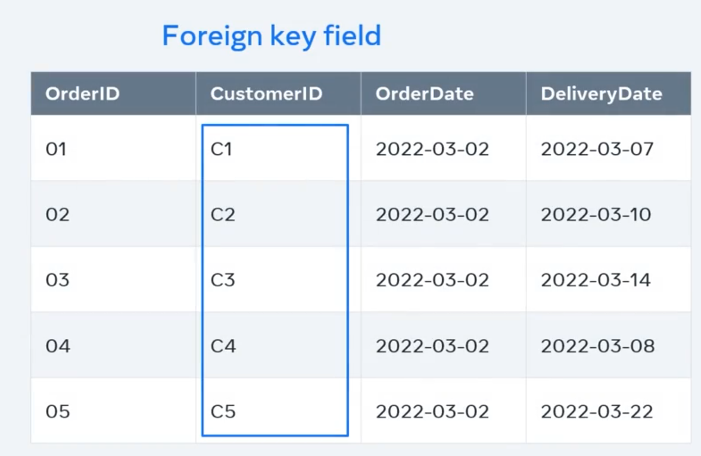

## Definition of Database

**What is data?**

In basic terms, data is facts and figures about anything. For example, if data were collected on a person, then that data might include their name, age, email, and date of birth. Or the data could be facts and figures related to an online purchase. This could be the order number, description, order quantity, and date, and even the customer's email. Data is crucial for individuals as well as organizations.

Where's all this data stored? In our digital world, data is no longer stored in manual files. Instead, developers use something called databases. **A database is a form of electronic storage in which data is organized systematically**. It stores and manipulates data electronically to make it more manageable, efficient, and secure.

A database looks like data organized systematically. This organization typically looks like a spreadsheet or a table. What exactly does the term systematic mean? All data contains elements or features and attributes by which they can be identified. For example, a person can be identified by attributes like their age, height, or hair color. This data is separated and stored in what's known as entities that represent those elements.

An entity is like a table. It contains rows and columns that store data relating to a specific element. In other words, these are relational elements. They're related to one another.

Whatever the source of the data a database will typically carry out the following actions, all of which developers such as yourself must be familiar with store the data form connections or relationships between segmented areas of the data, filter the data to show relevant records, search data to return matching records and have functions to lay the data to be updated, changed and deleted as required

## How Data is related?

In the database of your online store, you could have an order table and a customer table. To locate the details of a customer's order, you will check the order number against the customer ID. In other words, the database establishes a link between the data in the tables.

In customer table, the columns are `Customer ID`, `FirstName`, `LastName`, and `Email`. In relational database terms, these are fields. Then there are several rows which contain data for each of these fields.

In relational databases, they're known as records of the table. All these fields and rows work together to store information on the customer, also known as the entity. Every row and record in the customer table is an instance of the customer entity.

What's most important is that each of customers instances or records must be uniquely identifiable. you can use a field that contains only unique values like the customer ID. This is called a primary key field. It contains unique values that cannot be replicated elsewhere in the table.

Even if two customers share the same name, they'll still have separate customer IDs. This means that your database can determine which customer is the required one.

Let's look at the order table next. Just like the customer table, the order table also has fields and records. In this table, the primary key field is the order ID. But there's also a field named customer ID with the exact same data as the customer data.

What is the purpose of the customer ID in this table? The Customer ID is there to help identify who it is that place the order. By adding the customer ID field to the order table, our relationship is established between the customer table and the order table. Because of this relationship, you can pull data in a meaningful way from both tables. The customer ID field in the order table is known as the foreign key field. A foreign key is a field in one table that connects to the primary key field in the original table, which in this case is the customer table. The customer ID is the primary key of the customer table, but it becomes a foreign key in the order table. This way, the relationship is established and the data in these two tables are related.

## Database Evolution

**The history**

The history of databases begins in the 1960s with the computerization of databases. Computers emerged as a more cost-effective option for organizations. It also became easier to shift data storage and databases to computers.

The chronological order of the development of databases is as follows:

- (1970s-1990s) - Flat files, hierarchical and network
- (1980s-present) - Relational
- (1990s- present) - Object-oriented, object-relational, web-enabled

Flat files

Flat files databases were used during the 1970s-1990s. This is a type of database system that stores data in a single file or table. They are basically text files, where every line contains one record and fields either have fixed lengths or are separated by commas, whitespaces and tabs. Such a file cannot contain multiple tables.

Below is an example of what a flat file database looks like. This text file stores lines of data, where each line represents a record. The fields OrderID, CustomerID and OrderDate are separated by commas

**Hierarchical database systems**

Hierarchical database systems that were in use during the same era store data in a hierarchically arranged manner.

Think about it this way: parents can have many children, but one child can only have one parent. In other words, the database represents a one-to-many relationship: all attributes of a specific record are listed under an entity type.

Below is an example of how data is stored in a hierarchical database. In this case, it is data on college students who are taking different courses. A course can be assigned to only a single student, but a student can take as many courses as they want. Thus, there is a one-to-many relationship.

There are three students:

- John,
- Anil
- and Rohan

And there are four courses:

- C#,
- Perl,
- Python
- and Java.

Student and Course are the entity types. John takes C# and Anil takes both Python and Java. Rohan takes Perl.

**Network database systems**

Network databases were introduced by Charles Bachmann. Unlike the hierarchical database model, a network database allows multiple parent and child relationships. In other words, many-to many relationships. In network database terminology, a child record is known as a member. A member or child can be reached through more than one parent, which is called an owner.

A network database has a graph-like structure, and it allows you to represent more complex relationships among data.

Here's an example of a network database. A teacher can teach multiple courses and a course can have multiple teachers teaching it.

In this era, a language known as the SEQUEL query language was used to work with databases. Later on, with relational databases, this developed into SQL (Structured Query Language) which was made a standard query language to work with databases by the American National Standards Institute once relational database systems were introduced.

### Relational database system

The relational database system that was introduced in the 1980s is still the most used database system. It was invented by E. F. Codd and it’s the successor of hierarchical and network database systems. It was viewed as a major paradigm shift in database technology.

In a relational database system, data is stored in tables. The columns of the table hold attributes of the data. Each record usually has a value for each attribute, making it easy to establish the relationships between data points. In a relational database, each row in the table is a record with a unique ID attribute called the primary key. A relational database stores and provides access to data that are related to one another using an attribute known as a foreign key.

#### What is a relational database?

A relational database is a type of database that organizes data into rows and columns, which collectively form a table where the data points are related to each other.

Data is typically structured across multiple tables, which can be joined together via a primary key or a foreign key. These unique identifiers demonstrate the different relationships which exist between tables, and these relationships are usually illustrated through different types of data models. Analysts use SQL queries to combine different data points and summarize business performance, allowing organizations to gain insights, optimize workflows, and identify new opportunities.

For example, imagine your company maintains a database table with customer information, which contains company data at the account level. There may also be a different table, which describes all the individual transactions that align to that account. Together, these tables can provide information about the different industries that purchase a specific software product.

The columns (or fields) for the customer table might be Customer ID, Company Name, Company Address, Industry etc.; the columns for a transaction table might be Transaction Date, Customer ID, Transaction Amount, Payment Method, etc. The tables can be joined together with the common Customer ID field. You can, therefore, query the table to produce valuable reports, such as a sales reports by industry or company, which can inform messaging to prospective clients.

Relational databases are also typically associated with transactional databases, which execute commands, or transactions, collectively. A popular example that is used to illustrate this is a bank transfer. A defined amount is withdrawn from one account, and then it is deposited within another. The total amount of money is withdrawn and deposited, and this transaction cannot occur in any kind of partial sense. Transactions have specific properties. Represented by the acronym, ACID, ACID properties are defined as:

- `Atomicity`: All changes to data are performed as if they are a single operation. That is, all the changes are performed, or none of them are.
- `Consistency`: Data remains in a consistent state from state to finish, reinforcing data integrity.
- `Isolation`: The intermediate state of a transaction is not visible to other transactions, and as a result, transactions that run concurrently appear to be serialized.
- `Durability`: After the successful completion of a transaction, changes to data persist and are not undone, even in the event of a system failure.

**What is a relational database management system (RDBMS)**

While a relational database organizes data based off a relational data model, a relational database management system (RDBMS) is a more specific reference to the underlying database software that enables users to maintain it. These programs allow users to create, update, insert, or delete data in the system, and they provide: Data structure, Multi-user access, Privilege control, Network access.

#### Object-oriented databases

In the 1990s, object-oriented databases were introduced. This was when the object-oriented (OO) programming paradigm became popular and there was a need to represent data in a system as objects as well. Unlike relational databases, object-oriented databases work in the framework of real programming languages like Java and C++, for example.

Below is what an object-oriented database looks like. Instead of tables, there are entities or classes like Author, Book and Customer with their attributes and behaviors.

It’s possible to represent data according to OO concepts like inheritance and parent-child relationships among data. For example, an Author and Customer are both descendants of Person. Thus, a person is a generic entity that can represent both an Author and a Customer.

### NoSQL databases

Relational databases that are widely used even at present only allows to store structured data. Later on, there was a need to work more and more with unstructured data. This was when NoSQL databases came about as a response to the Internet and the need for faster speed and the processing of unstructured data.

NoSQL databases are preferred over relational databases because of their speed and flexibility in storing data. It does not store data in relations or tables that belong to a strict structure. Data can be stored in an ad-hoc manner and they allow to store and process high volumes of different kinds of data. NoSQL databases are capable of processing unstructured big data that’s generated by social media, IoT and others. Therefore, social platforms like Twitter, LinkedIn, Facebook, and Google for example makes use of NoSQL databases.

These are some of the advantages of NoSQL databases:

- Higher scalability
- Distributed
- Lower costs
- A flexible schema
- Can process unstructured and semi-structured data
- Has no complex relationships

Over time there were different types of NoSQL databases that were introduced:

While relational databases structure data into a tabular format, non-relational databases do not have as rigid of a database schema. In fact, non-relational databases organize data differently based on the type of database. Irrespective of the type of non-relational database, they all aim to solve for the flexibility and scalability issues inherent in relational models which are not ideal for unstructured data formats, like text, video, and images. These types of databases include:

- `Key-value store`: This schema-less data model is organized into a dictionary of key-value pairs, where each item has a key and a value. The key could be like something similar found in a SQL database, like a shopping cart ID, while the value is an array of data, like each individual item in that user’s shopping cart. It’s commonly used for caching and storing user session information, such as shopping carts. However, it's not ideal when you need to pull multiple records at a time. Redis and Memcached are examples of open-source databases with this data model.

- `Document store`: As suggested by the name, document databases store data as documents. They can be helpful in managing semi-structured data, and data are typically stored in JSON, XML, or BSON formats. This keeps the data together when it is used in applications, reducing the amount of translation needed to use the data. Developers also gain more flexibility since data schemas do not need to match across documents (e.g. name vs. first_name). However, this can be problematic for complex transactions, leading to data corruption. Popular use cases of document databases include content management systems and user profiles. An example of a document-oriented database is MongoDB, the database component of the MEAN stack.

- `Wide-column store`: These databases store information in columns, enabling users to access only the specific columns they need without allocating additional memory on irrelevant data. This database tries to solve for the shortcomings of key-value and document stores, but since it can be a more complex system to manage, it is not recommended for use for newer teams and projects. Apache HBase and Apache Cassandra are examples of open-source, wide-column databases. Apache HBase is built on top of Hadoop Distributed Files System that provides a way of storing sparse data sets, which is commonly used in many big data applications. Apache Cassandra, on the other hand, has been designed to manage large amounts of data across multiple servers and clustering that spans multiple data centers. It’s been used for a variety of use cases, such as social networking websites and real-time data analytics.

- `Graph store`: This type of database typically houses data from a knowledge graph. Data elements are stored as nodes, edges and properties. Any object, place, or person can be a node. An edge defines the relationship between the nodes. Graph databases are used for storing and managing a network of connections between elements within the graph. Neo4j (link resides outside IBM), a graph-based database service based on Java with an open-source community edition where users can purchase licenses for online backup and high availability extensions, or pre-package licensed version with backup and extensions included.

### What is Database Management System (DBMS)

A database management system is a software application which is used for managing different databases. It helps us to create and manage database. With the help of DBMS we take care following tasks –

1. Data Security
2. Data Backup
3. Manages huge amount of data
4. Data export & import
5. Serving multiple concurrent database requests
6. Gives us a way to manage the data using programming languages.

> We cannot interact with non-relational databases using SQL.

### What is SQL?

SQL is used to interact with relational databases. We often refer relational database as SQL database.

What sort of interactions do database engineers need to establish with databases? Some of the operations you could carry it in the data might require you to create, read, update, and delete data. These operations are also known as CRUD operations.

SQL is the standard language that can be used with all databases. It's particularly useful when working with relational databases, which require a language that can interact with structured data.

A database interprets and make sense of SQL instructions with the use of a Database Management System or DBMS. The DBMS takes responsibility for transforming SQL instructions into a form that's understood by the underlying database.

1. SQL stands for Structured Query Language, which is a standardised language for interacting with RDBMS (Relational Database Management System). Some of the popular relational database example are: MySQL, Oracle, mariaDB, postgreSQL etc.

2. SQL is used to perform C.R.U.D (Create, Retrieve, Update & Delete) operations on relational databases.

3. SQL can also perform administrative tasks on database such as database security, backup, user management etc.

4. We can create databases and tables using SQL.

**What is a Query**

A Query is a set of instruction given to the database management system, which tells RDBMS what information you would like to get, insert, update or delete from the database.

### Types of Structured Query Language (SQL Subsets)

In the above section, we learned what we do with the database using SQL. SQL is basically combination of four different languages, they are –

1. **DQL (Data Query Language)**

DQL is used to fetch the data from the database that already exists in the database. DQL command is: `SELECT`.

2. **DDL (Data Definition Language)**

DDL is used to define table schemas. DDL commands are: `CREATE`, `DROP` and `ALTER`.

3. **DCL (Data Control Language)**

DCL is used for user & permission management. It controls the access to the database. DCL commands are: `GRANT` and `REVOKE`.

4. **DML (Data Manipulation Language)**

DML is used for inserting, updating and deleting data from the database. DML commands are: INSERT, DELETE and UPDATE.

5. **TCL (Transaction Control Language)**

TCL is used for transaction management tasks in the database. TCL commands are: COMMIT and ROLLBACK.

#### Data Definition Language (DDL)

DDL helps you define data in your database. Before you can store data in the database.

You need to create the database and related objects like tables in which your data will be stored. For this, the DDL part of SQL has a command named `create`. Then you might need to modify already created database objects. For example, you might need to modify the structure of a table by adding a new column. You can perform this task with the DDL `alter` command. You can remove an object like a table from a database using the DDL `drop` command.

#### Data Manipulation Language (DML)

DML commands are used to manipulate data in the database, like inserting, updating or deleting data. Most crude operations fall under DML. To add data to a table, you can use the `insert` command. This command lets you specify the fields to add data to along with the values to be inserted. If you need to edit data that's already inserted into a table, just deploy the `update` command. And you can specify data to be removed by using the `delete` command.

#### Data Query Language (DQL)

To read data stored in a database, you can use data query language. DQL defines a select command to be able to retrieve data. `Select` lets you retrieve data from one or multiple tables letting you specify the data fields that you want based on preferred filter criteria.

#### Data Control Language (DCL)

using DCL commands, you control access to data stored in the database. `Grant` and `revoke` DDL commands are used to give users access privileges to data, and to revert access privileges already given to users.
