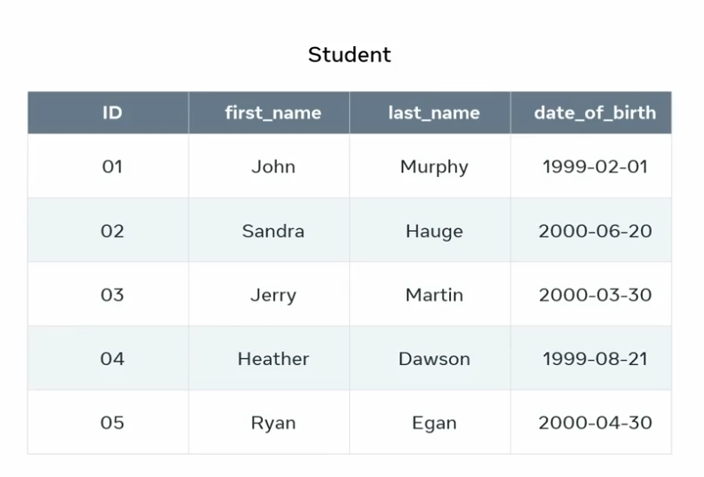

### SQL syntax introduction

to create collage database:

```sql
CREATE DATABASE collage;
```

you can create a table:

```sql
CREATE TABLE Student;
```

Now I need to populate the table with data. This is where I can use the data manipulation language or DML subset of SQL. To add table data, I use the insert into syntax. This inserts rows of data into a given table.

```sql
INSERT INTO table_name(
  column_ID,
  first_name,
  last_name,
  date_of_birth,
  email,
) VALUES (
  value1,
  value2,
  value3,
);
```



But what if I need to update or modify data?. For example, let's say I've input the wrong date of birth for a student. To change this data, I can use the update syntax, which is part of the DML subset of SQL.

```sql
UPDATE Student SET date_of_birth = '2002-10-12' WHERE ID = 02;
```

To remove all data on row 3 of the table. I can instruct my SQL to remove the data of the student on row 3

```sql
DELETE FROM Student WHERE ID = 03;
```

how would you read data stored in your database tables? That's where SQL, DQL or data query language comes in. The main syntax of DQL is select.

```sql
SELECT first_name, last_name FROM Student WHERE ID = 01;
```

## Common SQL Commands

The objective of this reading is to teach you how to name and explain the main commands in SQL. SQL is the most widely used database query language. It is designed for retrieving and managing data in a relational database. SQL can be used to perform different types of operations in the database such as accessing data, describing data, manipulating data and setting users roles and privileges (permissions).

Here you will learn about the main commands used in SQL. At a later stage you will explore relevant examples of how to use these commands with a detailed explanation of the SQL syntax for key operations such as to create, insert, update and delete data in the database.

The SQL Commands are grouped into four categories known as DDL, DML, DCL and TCL depending on their functionality, namely the type of operation they’re used to perform.  Let’s explore these commands in greater detail.

**Data Definition Language (DDL)**

The SQL DDL category provides commands for defining, deleting and modifying tables in a database. Use the following commands in this category.

**CREATE Command**

Purpose: To create the database or tables inside the database

Syntax to create a table with three columns:

```sql
CREATE TABLE table_name (column_name1 datatype(size), column_name2 datatype(size), column_name3 datatype(size));
```

**DROP Command**

Purpose: To delete a database or a table inside the database.

Syntax to drop a table:

```sql
DROP TABLE table_name;
```

**ALTER Command**

Purpose: To change the structure of the tables in the database such as changing the name of a table, adding a primary key to a table, or adding or deleting a column in a table.

1. Syntax to add a column into a table:

```sql
ALTER TABLE table_name ADD (column_name datatype(size));
```

2. Syntax to add a primary key to a table:

```sql
ALTER TABLE table_name ADD primary key (column_name);
```

**TRUNCATE Command**

Purpose: To remove all records from a table, which will empty the table but not delete the table itself.

Syntax to truncate a table:

```sql
TRUNCATE TABLE table_name;
```

**COMMENT Command**

Purpose: To add comments to explain or document SQL statements by using double dash (--) at the start of the line. Any text after the double dash will not be executed as part of the SQL statement. These comments are not there to build the database. They are only for your own use.

Syntax to COMMENT a line in SQL:

```sql
--Retrieve all data from a table
SELECT * FROM table_name;
```

**Data Query Language (DQL)**

The SQL DQL commands provide the ability to query and retrieve data from the database.  Use the following command in this category.

**SELECT Command**

Purpose: To retrieve data from tables in the database.

Syntax to select data from a table:

```sql
SELECT * FROM table_name;
```

## **Data Manipulation Language (DML)**

The SQL DML commands provide the ability to query, delete and update data in the database.  Use the following commands in this category.

**INSERT Command**

Purpose: To add records of data into an existing table.
Syntax to insert data into three columns in a table:

```sql
INSERT INTO table_name (column1, column2, column3) VALUES (value1, value2, value3);
```

**UPDATE Command**

Purpose: To modify or update data contained within a table in the database.

Syntax to update data in two columns:

```sql
UPDATE table_name SET column1 = value1, column2 = value2 WHERE condition;
```

**DELETE Command**

Purpose: To delete data from a table in the database.

Syntax to delete data:

```sql
DELETE FROM table_name WHERE condition;
```

## **Data Control Language (DCL)**

You use DCL to deal with the rights and permissions of users of a database system. You can execute SQL commands to perform different types of operations such as create and drop tables. To do this, you need to have user rights set up. This is called user privileges. This category deals with advanced functions or operations in the database. Note that this category can have a generic description of the two main commands. Use the following commands in this category:

`GRANT` Command to provide the user of the database with the privileges required to allow users to access and manipulate the database.

`REVOKE` Command to remove permissions from any user.

## **Transaction Control Language (TCL)**

The TCL commands are used to manage transactions in the database. These are used to manage the changes made to the data in a table by utilizing the DML commands. It also allows SQL statements to be grouped together into logical transactions. This category deals with advanced functions or operations in a database. Note that this category can have a generic description of the two main commands. Use the following commands in this category:

`COMMIT` Command to save all the work you have already done in the database.

`ROLLBACK` Command to restore a database to the last committed state.
