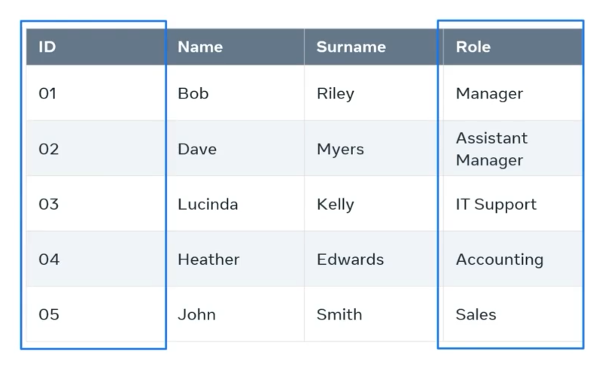
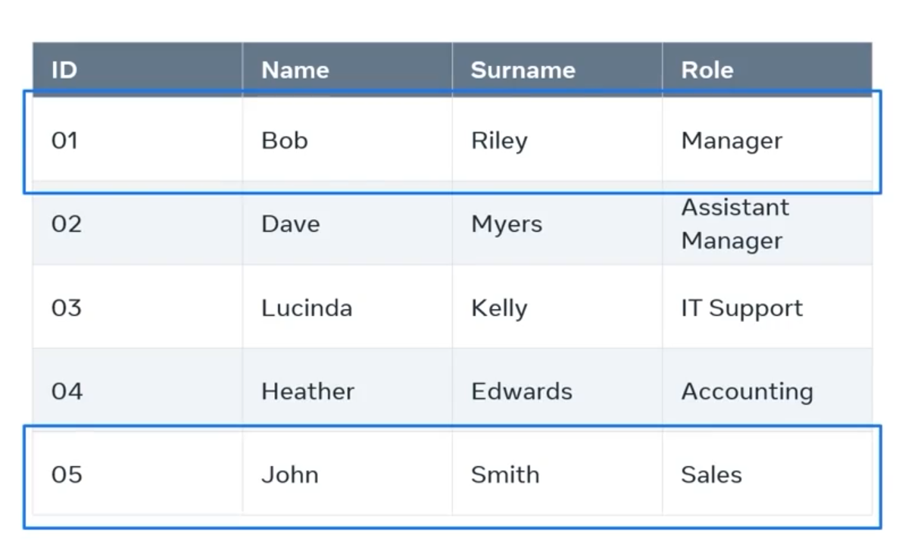
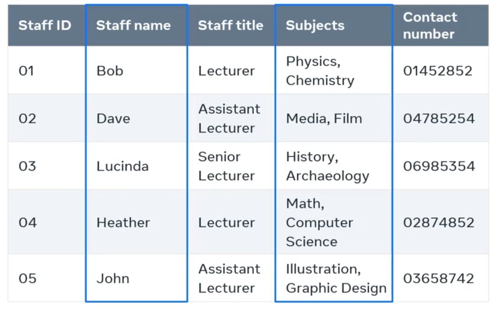

### What are table in database

In a more conceptual or logical sense, A table is also known as an entity and an object oriented databases or OO-DB An entity is an object that is attributes that are like columns or fields in a table. So in essence a table, entity and object all refer to the same concept.

within every table or columns. Also sometimes called fields or attributes. Each column or field has a unique name and data type. For example, I have a table that contains data on employees in a company. The table organizes the data in the columns such as I. D. And roll And each column can hold different types of data like numeric or string.

A set of columns or fields. Former row in relational database terminology. A row is known as a record. So a record is a combination of columns or fields that contain data in my employee table. For example, each rose a single employee record.

Every column has a data type. The data type of a column defines what type of value a column can hold like integer character, date and time and so on. It's up to the developer to decide the data type for each column. And it's also a guideline for sequel around what data type to expect in each column and how to interact with the underlying data stored physically. However, data types can vary depending on the database system.

Always referred to the documentation of the relevant database system to check what data types it supports. Generally all database systems support

- string data types for storing characters and strings of characters,
- numeric data types to store exact or whole numbers and approximate numbers,
- date and time data types to store information on date and time
- binary data types to store images, files and other information.

A domain is the set of legal values that can be assigned to an attribute basically this means making sure that the values of field can hold are well defined. For example, you can only place numbers in a numerical domain and you can only place characters or strings of characters in a string domain and each of these domains must include length values and other relevant rules that define its function. Each rower record in a table is also uniquely identified by what's known as a primary key.

### Tables overview

In this reading, you’ll find out more about tables in a relational database. You’ve been introduced to the concept of a table within a database by now and you have also reviewed a few examples of tables. And you’ve gained a basic understanding of what a primary key does in a table.

The main objective of this reading is to examine tables in more depth in terms of the structure of a table, data types, primary and foreign keys and the role they play in a table, as well as table constraints.

To refresh your memory, a table is the most basic type of database object in relational databases. It is responsible for storing data in the database. Like any other table, a database table also consists of rows and columns.

Just like in a spreadsheet of data, there are rows that run horizontally. These rows represent each record. Rows in turn span multiple columns.

Columns run vertically. They are like the definition of each field. Each column has a name that describes the data that is stored in it. Examples of column names could include FirstName, LastName, ProductID, Price and so forth.

Where the row intersects with a column is where a cell is located. A cell is where you store an item of data.

**What are data types?**

Every column in a table has a data type. These data types are defined by SQL or Structured Query Language. A data type defines the type of value that can be stored in a table column.

For example, here are some of the data types that are available:

- Numeric data types such as `INT`, `TINYINT`, `BIGINT`, `FLOAT`, `REAL`.
- Date and time data types such as `DATE`, `TIME`, `DATETIME`.
- Character and string data types such as `CHAR`, `VARCHAR`.
- Binary data types such as `BINARY`, `VARBINARY`.
- Miscellaneous data types such as:
  - Character Large Object (CLOB) for storing a large block of text in some form of text encoding.
  - Binary Large Object (BLOB) for storing a collection of binary data such as images.

Here’s an example of a table. This is the student table that stores data about a student such as:

- student ID,
- first name,
- last name,
- date of birth,
- home address,
- and faculty.

These are the table's columns.

There are also six rows within this table; one for each student. In other words, the table contains the records of six students.

Each cell in a row or record contains a piece of data such as student ID = 1, first name = Emily, last name = Williams and so on.

The student ID would probably have a data type of INT, for example. First name and last name would have a data type of VARCHAR and date of birth would have a data type of DATE.

**Tables in a relational database**

In a relational database there are multiple tables representing the structure of the back end of a software system. For example, in the context of a Student Information System, the tables might include Student, Teacher, Class and Subject.

In relational database terminology a table is also known as a relation. A table row or a record is also known as a tuple. For example, the student relation above has six tuples.

Each table or relation in a database has its own schema. Schema simply means the structure. The structure includes:

- the name of the table or relation,
- its attributes,
- their names
- and data type.

**What is a primary key?**

In a table, there is a field or column that is known as a key which can uniquely identify a particular tuple (row) in a relation (table). This key is specifically known as a primary key.

For example, in the student table, the student ID allows you to uniquely identify a particular row. The other columns like first name, last name, date of birth and others could contain duplicate or repeating data for multiple students. Therefore, they can't be used to uniquely identify a given student record. So, the student ID is the primary key of the student table.

In some cases, the primary key can comprise more than one column or field. This happens when a single column cannot make a record in a table uniquely identifiable. For example, in the table below, the EMP_ID values aren’t unique, so the column is not unique by itself. Thus, this column alone cannot be used as the primary key of this table. However, the EMP_ID and DEPT_ID columns together can make a record unique. Therefore, the primary key of this table is EMP_ID and DEPT_ID. This is also known as a composite primary key.

**What is a foreign key?**

Tables in a database do not stay isolated from each other. They need to have relationships between them. Tables are linked with one another through a key column (the primary key) of one table that’s also present in the related table as a foreign key. For example, the student table and the department table are linked via the student ID which is the primary key of the student table that’s also present in the Department table as a foreign key.

**Integrity constraints**

Every table in a database should abide by rules or constraints. These are known as integrity constraints.

There are three main integrity constraints:

1. Key constraints

2. Domain constraints

3. Referential integrity constraints

**What are key constraints?**

In every table there should be one or more columns or fields that can be used to fetch data from tables. In other words, a primary key. The key constraint specifies that there should be a column, or columns, in a table that can be used to fetch data for any row. This key attribute or primary key should never be NULL or the same for two different rows of data. For example, in the student table I can use the student ID to fetch data for each of the students. No value of student ID is null, and it is unique for every row, hence it can be the key attribute.

**What are domain constraints?**

Domain constraints refer to the rules defined for the values that can be stored for a certain column. For instance, you cannot store the home address of a student in the first name column. Similarly, a contact number cannot exceed ten digits.

**What are referential integrity constraints?**

When a table is related to another table via a foreign key column, then the referenced column value must exist in the other table. This means, according to the student and department examples, that values should exist in the student ID column in the student table because the two tables are related via the student ID column.

In this reading, you learned more about tables in a relational database as you explored the table in terms of its structure, data types, constraints, and the role of primary and foreign keys.

## Database structure overview

In this reading, you’ll find out more about the basic database structure. You’ve been introduced to what a table is in a database, the basic structure of a table, data types, what primary and foreign keys are and the roles they play in a table. You also learned about table constraints.

The main objective of this reading is to cover the basic structure of a database. In other words, you will learn more about tables, fields (or attributes), records, keys and table relationships.

**What is database structure?**

Database structure refers to how data is arranged in a database. Within a database, related data are grouped into tables, each of which consists of rows (also called tuples) and columns, like in a spreadsheet.

The structure of a database consists of a set of key components. These include:

- Tables or entities, where the data is stored.

- Attributes which are details about the table or entity. In other words, attributes describe the table.

- Fields, which are columns used to capture attributes.

- A record, which is one row of details about a table or entity.

- And the primary key, which is a unique value for an entity.

This image shows the basic structural elements of a database table.

Example of a table in a database with key elements of the structure highlighted.

**Table**

A table contains all the fields, attributes and records for a type of entity. A database will most probably contain more than one table.

**Fields**

Column headings are known as fields. Each field contains a different attribute. For every table, a unit of data is entered into each field. It’s also known as a column value. Each column has a data type. For example, the “agent_name” column has a data type of text, and the “commission” column has a numeric data type.
Column value or unit of data

Each individual piece of data entered into a column is a unit of data. These units are also called data elements or column values.

**Records**

A record consists of a collection of data for each entity. It’s also known as a row in the table.

**Data types**

To keep the data consistent from one record to the next, an appropriate data type is assigned to each column. The data type of a column determines what type of data can be stored in each column.

Data types are also a way of classifying data values or column values. Different kinds of data values or column values require different amounts of memory to store them. Different operations can be performed on those column values based on their datatypes.

### Logical database structure

The logical structure of a database is represented using a diagram known as the Entity Relationship Diagram (ERD). It is a visual representation of how the database will be implemented into tables during physical database design, using a Database Management System (DBMS) like MySQL or Oracle, for example.

A part of the logical database structure is how relationships are established between entities. These relationships are established between the instances of the entities. Accordingly, there can be three ways in which entity instances can be related to each other:

- One-to-one relationships
- One-to-many relationships
- Many-to-many relationships

This is also known as cardinality of relationships. The logical database structure which is represented using an ERD also depicts these relationships.

Here’s an example of an ERD that has all these elements.

Entity relationship diagram with a range of different relationships between entities.
**Physical database structure**

In the physical database structure, where entities are implemented as tables, the relationships are established using a field known as a foreign key. A foreign key is a field in one table that refers to a common field in another table (usually the primary key).

Let’s take the example of a database that contains two tables: student and department. The student table has a primary key of “Stud_id”, which is also present in the Department table as a foreign key. Therefore, the two tables are related to each other via the “Stud_id” field.

In this reading, you learned more about the basic database structure including tables, fields or attributes, records, keys and relationships between tables.

#### Types of keys in a database table

The relational database model is based on two main concepts, entities which are defined as tables and relations that connect to related tables.

Each table has relevant columns where each column represents an attribute of the table entity.

The league table keeps track of each team's position in the league, their name and the state they represent. The team's table tracks the team name, the team captain and the team coach, and the points table records the team's position in the league, the team's name and how many points the team has this season.

Notice that the team's table includes team name, which also belongs to the league table. These attributes could be of a simple attribute type that can hold a single value

for example, in a table of staff members in a college, each staff name attribute as a single value in each row. Or they could also have a multi value attribute that can have multiple values like a list of subjects taught. However multi value attributes should be avoided in relational database design.

Let's use the example of the staff table to explore some examples of attribute keys. Let's begin with the key attribute. This is a value used to uniquely identify an individual record of data in a table. For example in the staff table the key attribute is staff_ID This attribute has unique value in each row of the table so it's the perfect way to uniquely identify each record of data

**candidate key attributes**

This is any attribute that contains a unique value in each row of the table. In the case of the staff table, both the staff I. D. And contact numbers are examples of candidate keys. Each has a new unique value in each role. The other columns can contain repeated information so they're designated as non key attributes.

**A composite key**

is a key that is composed of two or more attributes to form a unique value in each new role in the staff table. An example of a composite key is a combination of the staff name and staff title, assuming that there isn't another instance of the same combination elsewhere on the table. A composite key is usually considered when a single attribute key can't be identified.

**An alternate key**

also known as the secondary key is a candidate key that was not selected to be the primary key. Just like a primary key. It's a column that contains a unique value in each field. For the staff table, the contact number is a secondary key on each roll

**The foreign key**

is an attribute on the table that references a unique key in another table. Typically a foreign key reference is the primary key of another table. For example, the staff I. D. Might also be a foreign key in one or more tables within the college database.
