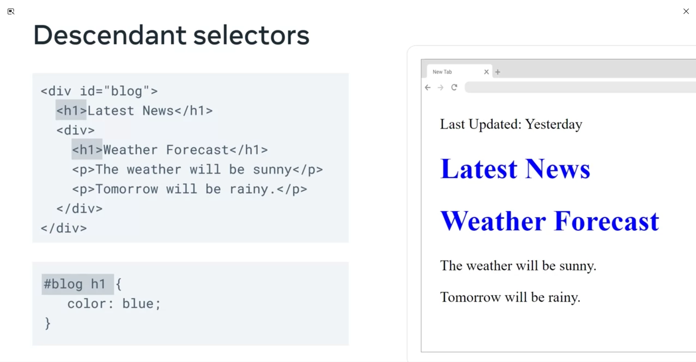
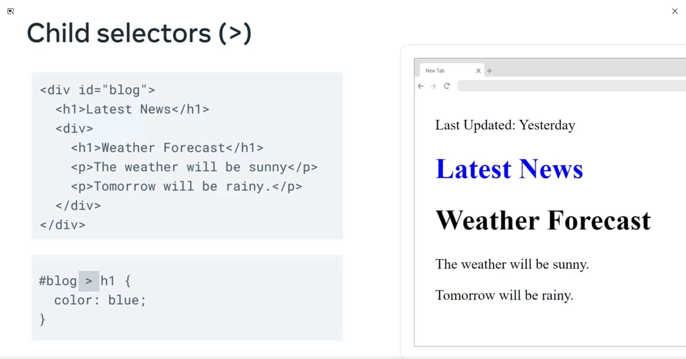
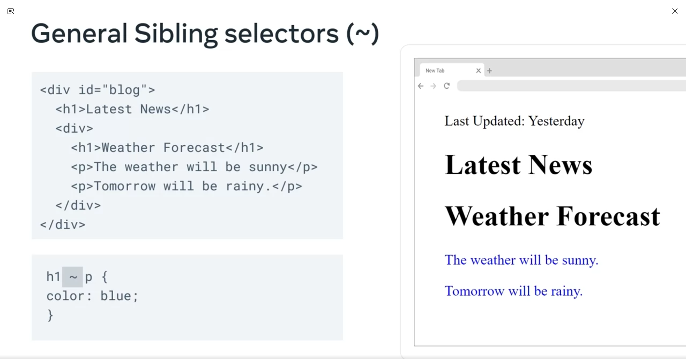
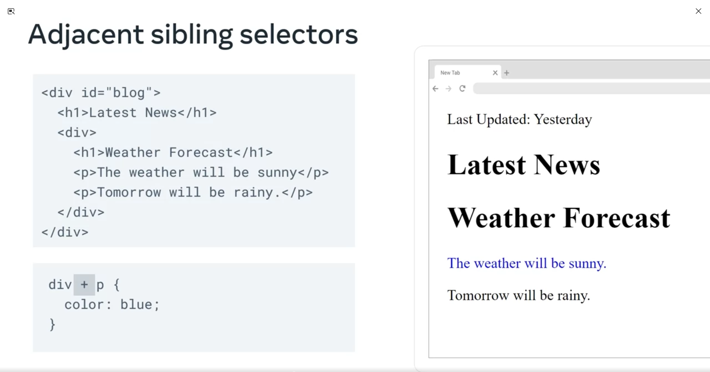
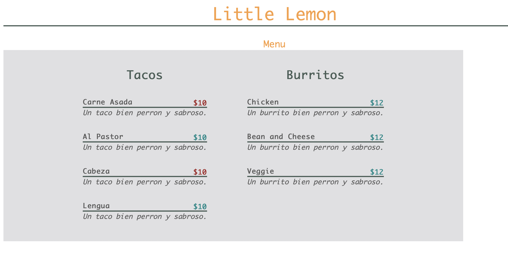

# CSS Selectors

As you build a website, the complexity of the code might increase to such a point that more than one CSS rule is applied to the same element. Or, you might accidentally add more than one rule over the same element. This results in conflicts as only one rule can be applied to a specific property. For example, the color of a certain p tag can either be blue or white, but not both. CSS engines use something called specificity to resolve these conflicts. Specificity is the ranking or score that helps CSS determine the final rule that will be applied to a given element.

How the element with the ‘highest’ specificity is selected by CSS, it is important to note that these rules only apply in cases where conflicts arise for the properties.

## Specificity hierarchy

CSS has a set of rules that it uses to ‘score’ or assign a certain weight to selectors and this creates a specificity hierarchy. Based on the weights, there are four categories in this hierarchy:

- Inline styles
- IDs
- Classes, attributes, and pseudo-classes
- Elements and pseudo-elements

### Inline styles

Inline styles are attached to the elements within your HTML code like with the ‘style’ attribute. inline styles have the highest specificity. That means that rules that are defined as inline styles will be applied irrespective of other rules.

For example, take these two rules that create a conflict in color styling for a p tag:

```css
<p style=“color: white;”> 
p{color: blue}
```
The p tag will be colored white because it is declared inside the inline tag.

### IDs

Next in the hierarchy are IDs and by now you know that they are represented by ‘#’.  For example: `#div`  

### Classes, attributes, and pseudo-classes

Classes, and the attributes inside the selectors, come next with what is called the pseudo-classes. 

For example:

- **.my-class**
- **p[“attribute”]**
- **div:hover**

### Elements and pseudo-elements

Finally, elements and something you call pseudo-elements have the lowest position in the specificity hierarchy. 

## Calculating scores

But by now you might wonder how is specificity calculated?

CSS uses the hierarchical model internally to calculate the specificity of the selectors used on a web page. But often as the size of CSS code increases, developers unavoidably face rule conflicts. In these cases, developers use the specificity hierarchy to calculate the precedence of CSS rules and to control the outcome of their web pages.

Let’s explore a practical example of how to determine the score of a few selectors.

- **#hello {} will be 0100**
- **div {} will be 0001 and**
- **div p.foo {} will be 0012**

In the order stated above, the four categories will be assigned values 1000, 100, 10 and 1 with the element selectors having the lowest value of 1. These scores will be calculated respectively for each element present inside the selector. The total score for these elements is then calculated and the one with the highest value has the highest specificity.

Let’s explore a couple of examples for clarity. Take note that the properties and values are not included in these examples to keep the focus on the selectors only.

### Example 1

```css
p {} 
div p {}
div p.foo {}
```

- p  => 1 element =>  0 0 0 1 => Score: 1
- div p => 2 elements => 0 0 0 2 => Score: 2
- div p.foo {} => 2 elements and 1 class selector => 0 0 1 2 => Score: 12

The third case has a total of 12 for the p tag and so has the highest specificity. The rules for the other two cases are then overridden and the rules inside the third case are applied.

### Example 2

- p#bar => 1 element & 1 ID =>  0 1 0 1 => Score: 101
- p.foo => 1 element & 1 class => 0 0 1 1 => Score: 11
- p.p.foo => 1 element & 2 class =>  0 0 2 1 => Score: 21

By now it should be clear that the case containing ID has a much higher score and the rules inside it will be applied.

##### Important Rules about specificty

- In the case of selectors with equal specificity, the latest or last written rule is the one that will be applied
- In general, ID selector should be applied in cases where you need to be certain about a rule
- Universal selectors have zero specificity value

'Cascading' in CSS means: the way in which CSS engines evaluate and apply the specificity rules is called ‘cascade’. Cascade is a type of small waterfall that falls in stages down the rocks and that is exactly how CSS behaves.

### Combination selectors

CSS makes it possible to combine more than one selector so that you can apply rules to elements based on their relationship with one another. You do this with combination selectors, and there are four main types.

- descendant selectors, 
- child selectors, 
- general sibling selectors 
- adjacent sibling selectors

Descendant selectors are useful if you need to select HTML elements that are contained within another selector.
The easiest way to remember descendant selectors is to think of a family. You pick a person in the family and then select all descendants, such as children, grandchildren and great grandchildren, who have, say, brown hair.

  

Child selectors on the other hand are more specific than descendant selectors. To go back to the family example, with child selectors you select a person and then select only their immediate and direct children who have red hair.

  

This is because it is the only h1 element that is a child of the element with the blog id attribute.

general sibling selectors, which apply rules to all the selectors of the same type that follow the first type. it allows you to select a person and then select all younger brothers with black hair.



Notice that the first paragraph element didn't turn blue, this is because the general sibling selector only select subsequent elements that match the selector.

In comparison to sibling selectors, you can use adjacent sibling selectors to target only the first or adjacent element that follows another element. this selector selects a person and then selects the next younger brothers.



This is because the adjacent sibling selector only selects the first subsequent element if it matches the selector.

```html
    <div class="menu-container">
        <div class="section">
            <h3 class="meal-type">Tacos</h2>
                <div class="item-name">
                    <div class="label">Carne Asada</div>
                    <b class="low">$10</b>
                    <div class="description"> Un taco bien perron y sabroso.</div>
                </div>
                <div class="item-name">
                    <div class="label">Al Pastor</div>
                    <b>$10</b>
                    <div class="description"> Un taco bien perron y sabroso.</div>
                </div>
        </div>
        <div class="section">
            <h3 class="meal-type">Burritos</h2>
                <div class="item-name">
                    <div class="label">Chicken</div>
                    <b>$12</b>
                    <div class="description"> Un burrito bien perron y sabroso.</div>
                </div>
                <div class="item-name">
                    <div class="label">Bean and Cheese</div>
                    <b>$12</b>
                    <div class="description">Un burrito bien perron y sabroso.</div>
                </div>
        </div>
    </div>
```
```css
.menu-container {
    max-width: 800px;
    display: flex;
    justify-content: center;
    background-color:#E0E0E2;
}
b {
    float: right;
    margin-top: -15px;
    color: darkcyan; 
}
div > h3 {
    font-size: 20px;
    margin: 20px;
    text-align: center;
    color: #495E57;
}
.label + .low {
  color: brown; 
}
div ~ div {
  color: rgb(90, 90, 90);
}
```

  

### Text effects cheat sheet

The effects developers use on text items on a web page are chosen mainly because of their styling and layout style. Interesting effects can be created by combining these with other CSS properties.

The visual representation of text content can be changed by four main properties: text-transform, font-style, font-weight and text-decoration.

| Property | Values | Description |
| --- | --- | --- |
| Text-transform | None, uppercase, lowercase, capitalize, full-width | Modify text properties |
| Font-style | Normal, italic, oblique | Font styling options such as italics |
| Font-weight | Normal, weight, lighter, bolder, 100-900 | Other font styling options like change of emphasis such as making text bold |
| Text-decoration | None, underline, overline, line-through | Shorthand for auxiliary elements added to text using other properties such as text-decoration-line |

The additional properties that help configure styling effects are below.

| Text-align | For horizontal alignment of text |
| --- | --- |
| Text-align-last | Alignment for the last line when text set to justify |
| Text-combine-upright | Multiple characters into the space of a single character placed upright like in Mandarin |
| Text-decoration-color | Color configuration of the text-decoration |
| Text-decoration-line | Line type in text-decoration such as underline, overline and so on |
| Text-decoration-style | Styles added to lines under text such as wavy, dotted and so on |
| Text-decoration-thickness | Thickness of the decoration line |
| Text-emphasis | Shorthand for other properties such as color and style |
| Text-indent | The indentation of the first line |
| Text-justify | Specifies the justification method used when text-align is "justify" |
| Text-orientation | Orientation of text in a line such as sideways, upright and so on |
| Text-shadow | Adds shadow to text |
| Text-underline-position | Declare position of underline set using the text-decoration property |

Other than these, there are some more properties that help modify the alignment and define the scope of text with their containers.

| Property | Values | Description |
| --- | --- | --- |
| Text-overflow | Clip, ellipsis | Determines overflow behavior of text with the container |
| Word-wrap | Normal, anywhere, break-word | Applies to inline elements, alias for overflow-wrap |
| Word-break | Normal, break-all, keep-all, break-word | Used for long words to decide if words should break or overflow |
| Writing-mode | Horizontal-tb, vertical-lr, vertical-rl | Can set the text direction vertical or horizontal |