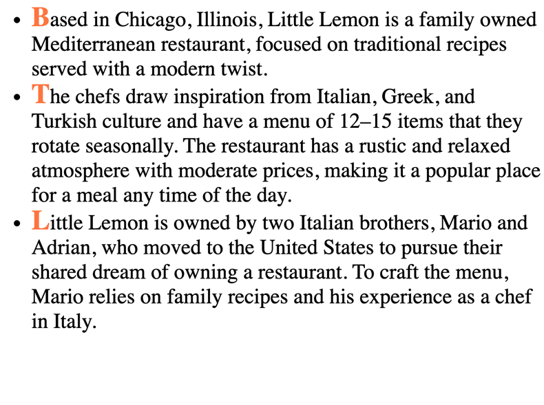
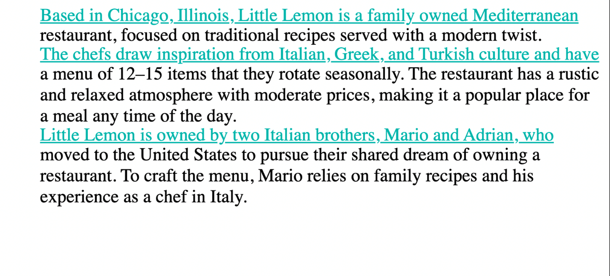
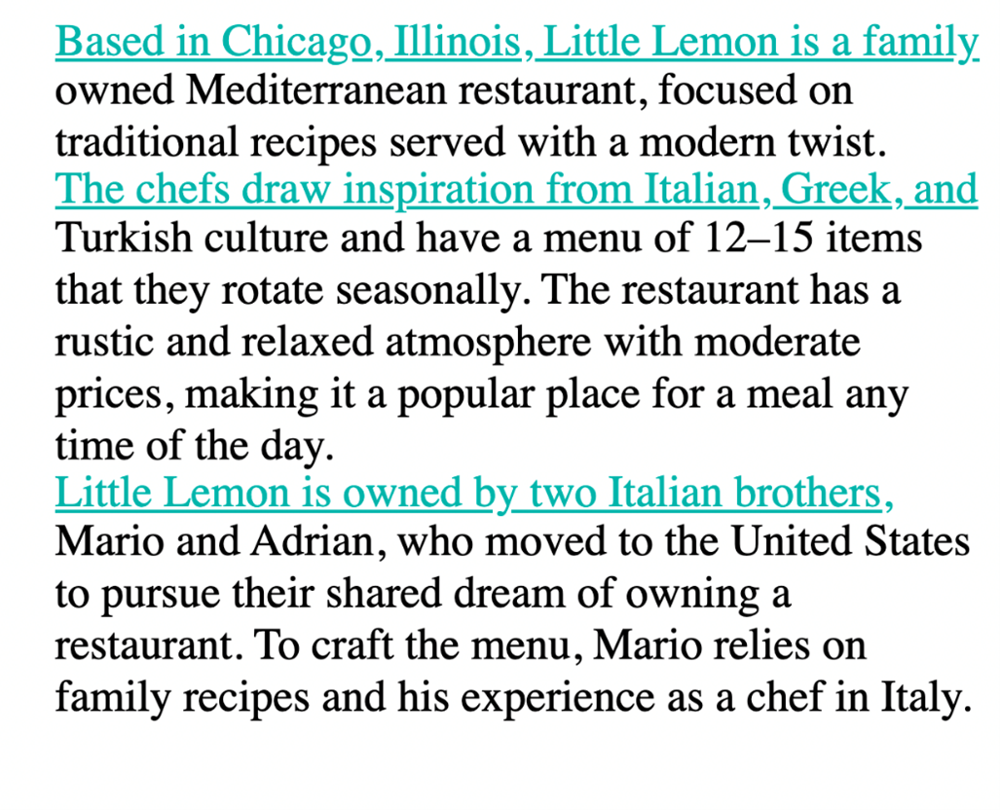
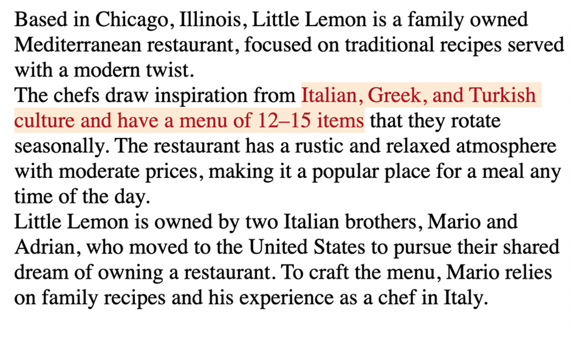
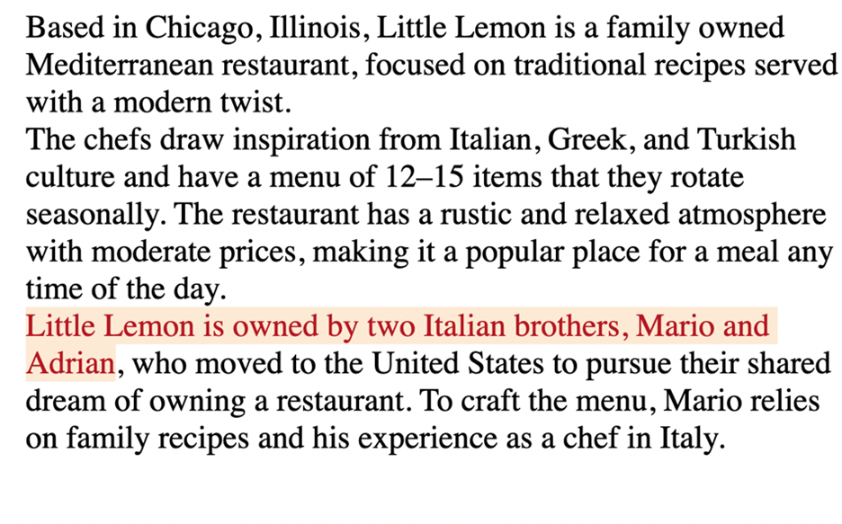
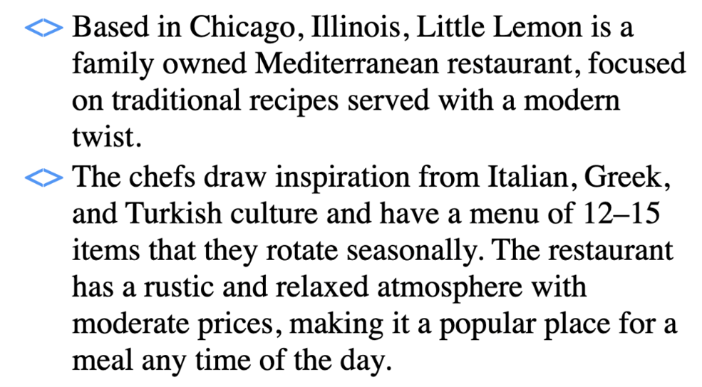
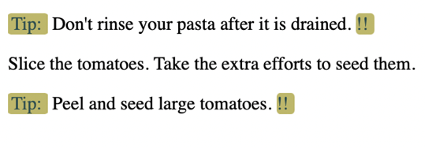

## Pseudo classes

pseudo-classes are state-based selectors, which means that they allow you to select elements based on their state. For example, the hover state. You use pseudo-class selectors to improve the interactivity of web pages by styling elements in response to user input.

##### The first group is user action states

- `:hover`: changes the style of an element when a cursor hovers over it. 
- `:active`: styles an element only while a user actively presses and holds the mouse button
- `:focus`: focuses styling on the element that you use it for

The active pseudo-class changes the properties of an element when the state of that element is active. 

##### Form state pseudo-classes

- `:disabled`, `:enabled`: generally used for buttons
- `:checked`, `:indeterminate`: used for checkboxes
- `:valid`, `:invalid`: in case of fields like emails and phone numbers 

##### specific position-based states

- `first-of-type` 
- `last-of-type`
- `nth-of-type`
- `nth-last-of-type`


## Pseudo-elements

```css
selector::pseudo-element {
property: value; }
```

*It is important to note that pseudo-elements use two colon characters instead of one.*

### ::first-letter

You can use first-letter to change the color of just the first letter of each of the three points in the example text.

```html
<!DOCTYPE html> 
<html> 
    <head> 
        <link rel="stylesheet" href="pseudo4.css"> 
    </head> 
<body> 
    <ul> 
        <li>Based in Chicago, Illinois, Little Lemon is a family-owned Mediterranean restaurant, focused on traditional recipes served with a modern twist. </li> 
    <li>The chefs draw inspiration from Italian, Greek, and Turkish culture and have a menu of 12–15 items that they rotate seasonally. The restaurant has a rustic and relaxed atmosphere with moderate prices, making it a popular place for a meal any time of the day.</li> 
    <li>Little Lemon is owned by two Italian brothers, Mario and Adrian, who moved to the United States to pursue their shared dream of owning a restaurant. To craft the menu, Mario relies on family recipes and his experience as a chef in Italy.</li> 
  </ul> 
</body> 
</html>
```
```css
li::first-letter { 
color:coral; 
font-size: 1.3em; 
font-weight: bold; 
line-height: 1; 
}
```


Although the code only changed the first letter of each bullet point, it makes a big difference in terms of presentation. Now let’s change the font in a different way.

### ::first-line

First-line will change the complete first line of each of the bullet points to light sea green.

```css
ul{
    list-style-type: none;
}
li::first-line {
    color: lightseagreen;
    text-decoration: underline;
    line-height: 1;
}
```



Because it’s only the first line of each bullet point, it almost functions like dividers between the three different points instead of having to rely on bullets.

Note that the contents of the line to which this pseudo-element is applied will change as you increase or decrease the size of your viewport.




### ::selection

Selection is another useful pseudo-element. For example, you may use it when you are taking notes on your device because it allows you to highlight specific text. The effect of it becomes obvious only after the user selects content. On web pages today, you will typically see inverted colors from white-black to black-white when selecting a portion of text.

```css
ul{
    list-style-type: none;
}

li::selection {
    color:brown;
    background-color: antiquewhite;
    line-height: 1;
}
```



And another example of the same text but with a different section selected and highlighted.



Different segments of the text are highlighted depending on the text that is selected at any given point.

### ::marker

Markers are typically used to add style elements to a list, for instance, to color bullet points. For example, you can enhance the user experience when you use a marker in the following way.

```css
li::marker {
    color: cornflowerblue;
    content: '<> ';
    font-size: 1.1em;
}
```


Now the bullet points are cornflower blue and they have the shape specified in the code.

### ::before and ::after

One more pair of pseudo-elements are the **::before** and **::after** pseudo-elements. They allow you to add content before and after an element on which they are allowed. In other words, new content can be added to a page without adding HTML code for it. You can also add styling options for this content. Let’s do an example where text is added both before and after some cooking guidelines to identify them as important tips.

```html
<body>
    <p id="tips"> Don't rinse your pasta after it is drained. </p>
    <p> Slice the tomatoes. Take the extra efforts to seed them. </p>
    <p id="tips"> Peel and seed large tomatoes. </p>
</body>
```
```css
#tips::before{
    background: darkkhaki;
    color:darkslategray;
    content: "Tip:";
    padding-left: 3px;
    padding-right: 5px;
    border-radius: 10%;
}
#tips::after{
    background:darkkhaki;
    color:darkslategray;
    content: "!!";
    padding-right: 5px;
    border-radius: 20%;
}
```


The “content” property is where the text for the guidelines goes. The word “tip” has been added before each guideline thanks to the rules added for **tips::before**. And, each of the three guidelines now has two exclamation marks after them thanks to the rules added for **tips::after**. Note how the second <p> element inside the HTML code remains unaffected. You don’t have to use after and before together like this, but sometimes it is useful to combine them.

The examples covered here illustrate that adding simple code for pseudo-elements can greatly enhance the appearance of websites. There are plenty of other pseudo-elements and some of them are more popular than others. You can follow your own style and explore the creative possibilities that pseudo-classes and pseudo-elements offer.


pseudo-classes that you can use to style links on web pages, namely web-link states. Although, you can use web-link states for many functionalities, developers often use them to style the color of links that a user already opened. For instance, a HTML file can have two a tags, each with its own href that links to a different page of a website. To give the links their initial color, you can use `:link`, and to let the links change color, once a user has visited these pages, you can use `:visited` 

The order in which you apply pseudo-classes in a document determines which style will be displayed. So be careful not to accidentally overwrite a style you want to set. Developers use the acronym LVHA to remind them of the order that they need to follow when writing pseudo-class rules. LVHA stands for link, visited, hover, active. So always apply pseudo-class styles in the correct order. First link, then visited, next hover, and lastly active. 


## CSS Pseudo cheat sheet
### Simple selectors

| Selector  | Syntax  | Example       |
|-----------|---------|---------------|
| Element   | element | div {}        |
| Class     | .class  | .alpha {} |
| ID        | #id     | #alpha {} |
| Universal | *       | * {}      |


### Variations of simple selectors

| Elements          | Syntax                    | Example            | Description                               |
|-------------------|---------------------------|--------------------|-------------------------------------------|
| Two classes       | .first-class.second-class | .alpha.beta {} | All elements with classes alpha and beta  |
| Element and class | element.class             | p.alpha {}     | All alpha class elements inside &lt;p&gt; |
| Two elements      | element, element          | p, div {}      | All &lt;p&gt; and &lt;div&gt; elements    |
| Two elements      | element element           | p div {}       | All &lt;div&gt; elements inside &lt;p&gt; |

### Descendant selectors/combinators

| Selector         | Syntax             | Example           | Description                                        |
|------------------|--------------------|-------------------|----------------------------------------------------|
| Descendant       | element element    | div p {}      | All &lt;p&gt; descendants of &lt;div&gt;           |
| Child            | element&gt;element | div &gt; p {} | All &lt;p&gt; direct descendants of &lt;div&gt;    |
| Adjacent Sibling | element+element    | div + p {}    | &lt;p&gt; element directly after &lt;div&gt;       |
| General Sibling  | element~element    | div ~ p {}    | All &lt;p&gt; element iterations after &lt;div&gt; |


### Attribute selectors

| Selector &nbsp; &nbsp; &nbsp; &nbsp; &nbsp; &nbsp; &nbsp; &nbsp; &nbsp;| Syntax              | Example              |
|--|---------------------|-------------------------------------------------------------------------------------|
| [attribute]        | [href] {}           | Selects all elements with a href attribute                                          |
| [attribute=value]  | [lang="fr"] {}      | Selects all elements with lang attribute that has a value of "fr"                   |
| [attribute~=value]| [input~=hello] {}   | Elements with input attribute containing the whitespace separated substring "hello" |
|[attribute\|=value]  | [lang\|=en] {} |  Elements with lang attribute value equal to "en" or "en-"(en hyphen)|
| [attribute^=value] | a[href^="https"] {} | Every &lt;a&gt; element with href attribute value begins with "https"               |
| [attribute$=value] | a[href$=".docx"] {} | Every &lt;a&gt; element with href attribute value ends with ".docx"                 |
| [attribute*=value] | a[href*="meta"] {}  | Every &lt;a&gt; element with href attribute value has substring "meta"              |

### Pseudo-class

| Pseudo-class         | Example                      | Description of selection                                                                                     |
|----------------------|------------------------------|-----------|
| :active              | a:active {}              | All active links&nbsp;                                                                                       |
| :checked             | input:checked {}         | All the checked &lt;input&gt; elements                                                                       |
| :default             | input:default {}         | All default &lt;input&gt; elements                                                                           |
| :disabled            | input:disabled {}        | All disabled &lt;input&gt; elements                                                                          |
| :empty               | div:empty {}             | All the &lt;div&gt; elements with no children                                                                |
| :enabled             | input:enabled {}         | All the enabled &lt;input&gt; elements                                                                       |
| :first-child         | p:first-child {}         | All the &lt;p&gt; elements who are the first child of a parent element                                       |
| :first-of-type       | p:first-of-type {}       | All the &lt;p&gt; element who are the first &lt;p&gt; element of a parent element                            |
| :focus               | input:focus {}           | Input element under focus                                                                                    |
| :fullscreen          | :fullscreen {}           | The element in full-screen mode                                                                              |
| :hover               | p:hover {}               | Action effect on mouse hover                                                                                 |
| :invalid             | input:invalid {}         | Input elements with an invalid value                                                                         |
| :last-child          | p:last-child {}          | All the &lt;p&gt; elements who are the last child of a parent element                                        |
| :last-of-type        | p:last-of-type {}        | All the &lt;p&gt; elements who are the last &lt;p&gt; element of a parent element                            |
| :link                | a:link {}                | All unvisited links                                                                                          |
| :not(selector)       | :not(div) {}             | All the elements that are not a &lt;div&gt; element                                                          |
| :nth-child(n)        | div:nth-child(3) {}      | All the &lt;p&gt; elements that are the third child of a parent element                                      |
| :nth-last-child(n)   | div:nth-last-child(3) {} | All the &lt;div&gt; elements which are the third child of a parent element, counting from last child element |
| :nth-last-of-type(n) | p:nth-last-of-type(2) {} | The second sibling from the last child of a parent element.                                                  |
| :nth-of-type(n)      | p:nth-of-type(2) {}      | The second sibling of a parent element.                                                                      |
| :only-of-type        | p:only-of-type {}        | All the &lt;p&gt; elements which are only &lt;p&gt; elements inside its parent                               |
| :only-child          | p:only-child {}          | All the &lt;p&gt; elements which are only child of a parent element                                          |
| :optional            | input:optional {}        | The input elements with no "required" attribute                                                              |
| :required            | input:required {}        | Selects input elements with the "required" attribute specified                                               |
| :root                | :root {}                 | The Root element of document                                                                                 |
| ::selection          | ::selection {}           | The portion of an element that is selected by a user                                                         |
| :valid               | input:valid {}           | All the input elements with a valid value                                                                    |
| :visited             | a:visited {}             | Selects all visited links        |

### Pseudo-element selectors

| Syntax         | Example                   | Description           |
|----------------|---------------------------|------------------|
| ::after        | p::after {}           | Inserts content after content of &lt;p&gt; element            |
| ::before       | p::before {}          | Inserts content before content of &lt;p&gt; element           |
| ::first-letter | p::first-letter {}    | Selects first letter of every &lt;p&gt; element               |
| ::first-line   | p::first-line {}      | Selects first line of every &lt;p&gt; element                 |
| ::placeholder  | input::placeholder {} | Selects input elements with "placeholder" attribute specified |
| ::marker       | ::marker {}           | Selects markers in a list                                     |
