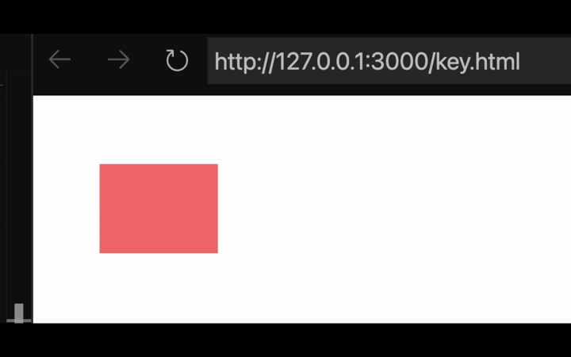

# Animation in CSS

### CSS Transform and Transition properties

The transform property modifies the spatial position of an element. For instance, it can change its scale and angle, but these changes are not very effective or user friendly because they are instantaneous to really create the illusion of motion.  
You need to control the speed of this effect. To do this, developers use the transition property in conjunction with the transformed property. 

```css
h1 {
    transform: rotate(0deg);
    transition: 2s;
}
h1:hover {
    transform: rotate(20deg);
}
```
by adding the transition property with the value transform to s the rotation will animate over two seconds. 


```css
* {
  padding: 0;
  margin: 0;
  color: pink;
}
.container {
  min-height: 100vh;
  background-color: bisque;
}
.letters {
  display: flex;
  justify-content: center;
  padding-top: 20px;
  margin-bottom: 20px;
  text-transform: uppercase;
  font-size: 60px;
}
.letters p {
  text-align: center;
  background-color: rgb(250, 150, 100);
  width: 70px;
  margin-right: 1.5px;
  border-radius: 15%;
  border-color: rgb(250, 125, 75);
  border-style: solid;
}
.letters:hover p:nth-child(even) {
  transform: rotateY(360deg);
  transition: 0.5s;
}
.letters:hover p:nth-child(odd) {
  transform: rotateX(360deg);
  transition: 1.5s;
}
```


When developers want to create complex animations, they use the animation property. But to control the execution of the steps of the animation, they use the `@keyframe` rule. 
```css
@keyframes animationname {keyframes-selector {css-style;}}

@keyframes animationname {
    from { color: blue; }
    to { color: red; }
}
```
The `@keyframe` rule specifies the name of the animation, and the individual keyframes for the animation. 

The animation name links the animation to a specific keyframe rule. The animation property has a number of subproperties like animation name, animation delay, and so on. 
```css
animation: name duration timing-funtion delay iteration-count direction fill-mode play-state;
```
You can use a shorthand CSS syntax to set all the subproperties of the animation property. 
```css
div{
    animation: myanimation 3s infinite;
}
```
But say you want one or more of them to have the default settings, you simply leave them out. However, each of the subproperties can be listed individually as well. 
```css
animation: name duration timing-funtion
```


The rules covered so far are for alignment and styling of web pages using CSS. Keyframes are a type of at-rule which are represented by the `@` suffix. At-rules are statements inside CSS that describe how to behave or perform certain actions.   
In line with that, keyframes are defined as `@keyframes` in the CSS code. `@keyframes` are part of the animation sequence and help in defining the steps inside it. Imagine an object on your web page moving from point A to point B. You can use the transition and transform properties to do that, but animation sequences are used to accomplish more complex behaviors in an easier way.

### from{} and to{} keywords and using percentages(%) syntax

```css
@keyframes animation-name { 
from { 
property-a: value-a; 
} 
to { 
property-a: value-b; 
} 
}
```

The `from` and `to` keywords are used inside the `@keyframes` rule to mark the transition of one or more properties and can be seen as the start and end points of that transition. As can be seen from the syntax, the values of `property-a` changes from `value-a` to `value-b`. To expand on the use of `from` and `to`, the @keyframes allows you to add more steps to your animation by using a percentage that represents the completion of the animation.

```css
@keyframes identifier { 
0% {transform: rotate(100deg);} 
30% {opacity: 1;} 
50% {opacity: 0.50;} 
70% {opacity: 1;} 
100% {transform: rotate(50deg);
}
```

The different percentages used in the example demonstrate the progression of the animation. Note that it doesn’t have to be the same property that you modify in these steps. That's not possible using the transition property, but you can do it with `@keyframes`. This flexibility is what makes `@keyframes` so powerful. Another advantage is how these animations can also loop infinitely, run forwards, reverse and alternate.

`@keyframes` are tied in with the animation-name to which they are going to be applied. To give an overview of the animation property, it consists of other sub-properties. Of these, animation-name and animation-duration must be defined while others such as timing-function, delay, direction, fill-more, iteration-count and so on can be added.

Animation property shorthand:

The shorthand for the animation property consists of the following properties with their default values:

- `animation-name: none`
- `animation-duration: 0s`
- `animation-timing-function: ease`
- `animation-delay: 0s`
- `animation-iteration-count: 1`
- `animation-direction: normal`
- `animation-fill-mode: none`
- `animation-play-state: running`
- `animation-timeline: auto`

If the values of any of these are not defined, you should assume that they are the default. Of these, the first property of the animation-name is what's used to tie it to the @keyframes rule.

Let’s now examine an example of how you can use @keyframes and the animation property.

##### Animation example

```html
<body> 
<div class="box"></div> 
</body> 
</html>
```
```css
body{ 
padding: 30px;} 
.box{
background-color: lightcoral;
width: 50px; 
height: 50px; 
animation: myanimation 3s infinite ease-in; 
} 
@keyframes myanimation{ 
from{width: 50px; 
} 
to{width: 100px; 
}
```


In the example, the width of the object changes from 50 pixels to 100 pixels over a span of 3 seconds and loops infinitely afterward.

This is a very simple example of how you can use the animation property with the help of @keyframes rule to create your desired animation.




# Animation and effects cheat sheet

### Transform property

`transform: transform function-values`

```css
.sample-class {
    transform: rotate(60deg);
}
```  
**Keyword-value type: none**  

```css
.sample-class {
    transform: none;
}
```

**Function-value type: matrix()**

Variations: matrix(), matrix3d()

```css
.sample-class {
     transform: matrix(1.0, 2.0, 3.0, 4.0, 5.0, 6.0);
}
```  

**Function-value type: rotate(deg)**  

Variations: rotate(), rotate3d(), rotateX(), rotate(), rotateZ()  

```css
.sample-class {
    transform: rotate3d(3,2,1, 100deg);
}
```

Note: In rotate3d(), the respective values represent x, y, z co-ordinate and degree of rotations

**Function-value type: translate(x,y)**

Variations: translate(), translate3d(), translateX(), translateY(), translateZ()

```css
.sample-class {
    transform: translate3d(10px, 20px, 30px);
}
```

Note: In translate3d(), the respective values represent translation along the x, y, z co-ordinates

**Function-value type: scale(factor)**

Variations: scale(), scale3d(), scaleX(), scaleY(), scaleZ()

```css
.sample-class {
    transform: scale3d(2, 1, 0.3);
}
```

Note: In scale3d(), the respective values represent scaling times along the x, y, z co-ordinates

**Function-value type: skew(deg, deg)**

Variations: skew(), skewX(), skewY()

```css
.sample-class {
    transform: skew(100deg);
}
```

**Global value types:**

```css
.sample-class {
    transform: inherit;
    transform: initial;
    transform: revert;
    transform: revert-layer;
    transform: unset;
}
```
Transform can be applied for rotate(), scale() and translate() that can be listed together. Each of these properties can have their own values and the actions will give a combined effect.

```css
.sample-class {
    transform: rotate(45deg) scale(1.5) translate(45px);
}
```
Additional property under transform:transform-origin Determines the anchor point for the centering of transform.

```css
.sample-class {
    transform-origin: 10px 10px;
}
```
```css
.sample-class {
    transform-origin: right bottom;
}
```

## Transition property

### Transition shorthand

Transition shorthand has four following sub-properties, each of which can also be individually defined.

- transition-property
- transition-duration
- transition-timing-function
- transition-delay

You have to list the values without naming them individually. Values skipped will be assigned their default values.

```css
/*transition: property duration timing-function delay;*/
transition: margin-left2s ease-in-out 0.5s;
```
# Animations and @keyframes

### animation property:

```css
/* animation: name duration timing-function delay iteration-count  
direction fill-mode play-state; */
.sample-class {
    animation: none 2 ease 0.5 4 normal none running;
}
```
The animation property is a shorthand for the sub-properties below:
```css
animation-name
animation-duration
animation-timing-function
animation-delay
animation-iteration-count
animation-direction
animation-fill-mode
animation-play-state
```

The values not mentioned are given default values. Animation-name property is used to tie-in the @keyframes rule.

## @keyframes

```css
@keyframes mymove {
  from {property: value}
  to { property: value }
}

@keyframes animation-name {
    from {bottom: 0px;}
    to {bottom: 100px;}
}
```
Percentage denotes the timing of the animation.

### Alternative syntax

```css
@keyframes animation-name {
/* declare actions here */
}

@keyframes animation-name {
    0%,100%{
        background-color: blue;
    }
    50% {
        background-color: green;
    }
}
```

### Multiple animations

Works the same as regular animation, multiple rules can be set.
```css
#some-class{
    animation: animation-a 2s linear infinite alternate, 
        animation-b 3s ease infinite alternate;
}
```

`<div id="ball"></div>`
```css
@keyframes bounce {
    from {
        transform: translate3d(0,0,0);
    }
    to {
        transform: translate3d(640px, 0,0);
    }
}
#ball {
    width: 80px;
    height: 80px;
    border-radius: 50%;
    background-color: #62687F;

    animation: bounce 2s linear;
    animation-direction: alternate;
    animation-iteration-count: infinite;
}
```
