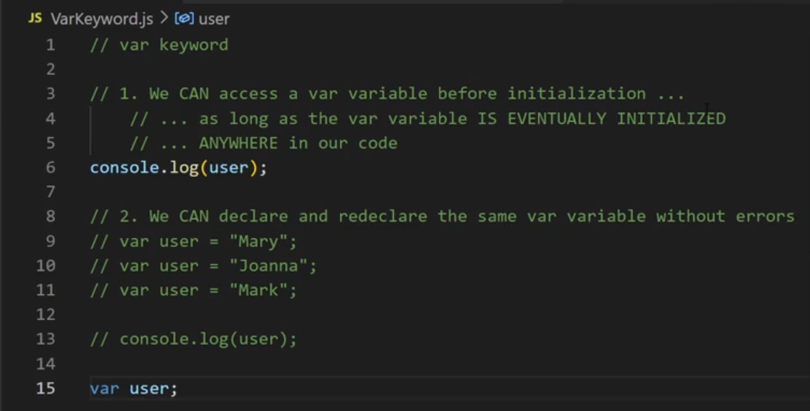
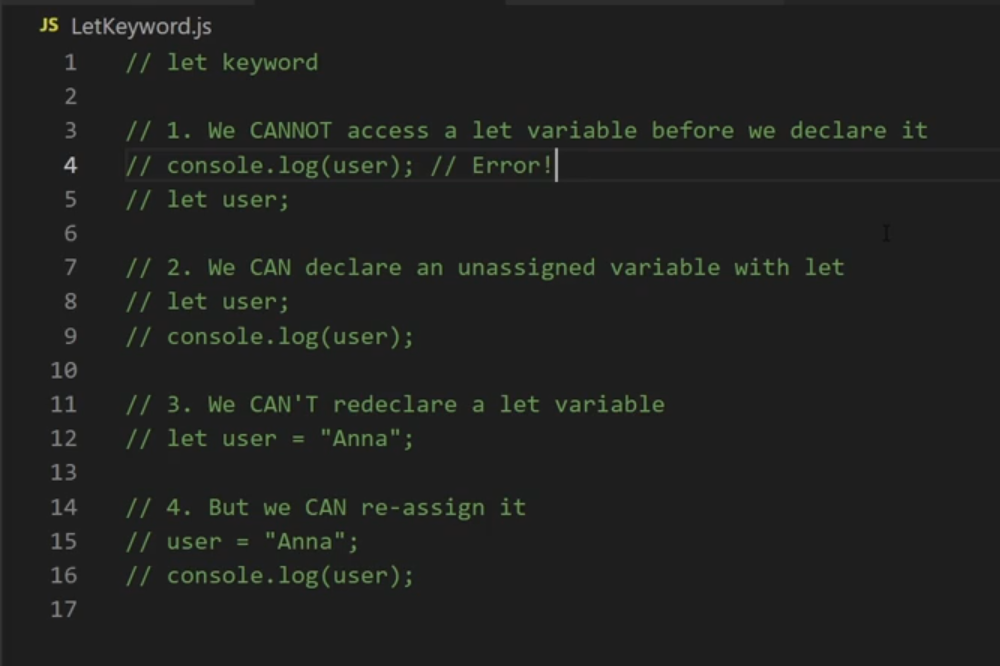
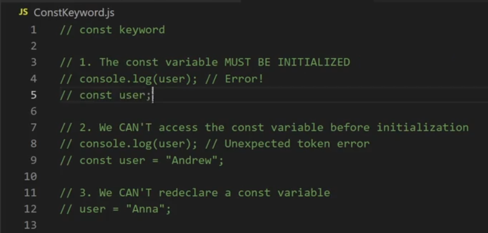

### Syntax, logical and runtime Errors

Most common errors in JavaScript:

- ReferenceError
- SyntaxError
- TypeError
- RangeError

There are some other errors in JavaScript. These other errors we won't discuss here:

- AggregateError
- Error
- InternalError
- URIError


### ReferenceError

A ReferenceError gets thrown when, for example, one tries to use variables that haven't been declared anywhere. An example can be, attempting to console log a variable that doesn't exist:  
```js
console.log(username);
```
If the variable named username hasn't been declared, the above line of code will result in the following output:
```bash
Uncaught ReferenceError: username is not defined
```

### SyntaxError

Any kind of invalid JavaScript code will cause a SyntaxError.
```js
var a "there's no assignment operator here";
```
The above line of code will throw the following error:  
```bash
Uncaught SyntaxError: Unexpected string
```

### TypeError

A TypeError is thrown when, for example, trying to run a method on a non-supported data type.
```js
"hello".pop() 
// Uncaught TypeError: "hello".pop is not a function`
```
as can be confirmed by running the above line of code, strings do not have all the array methods readily available to them, and trying to use some of those methods will result in a TypeError being thrown.

### RangeError

A RangeError is thrown when we're giving a value to a function, but that value is out of the allowed range of acceptable input values.

Here's a simple example of converting an everyday Base 10 number (a number of the common decimal system) to a Base 2 number(i.e binary number).

```js
(10).toString(2); 
// '1010'
```

The value of 2 when passed to the `toString()` method, is like saying to JavaScript:
```
convert the value of 10 of the Base 10 number system, 
to its counter-part in the Base 2 number system.
```
Besides using Base 2 number system, I can also use the Base 8, like this:  
```js
(10).toString(8); 
// 12
```
However, if I try to use a non-existing number system, such as an imaginary Base 100, since this number system effectively doesn't exist in JavaScript, I will get the RangeError, because a non-existing Base 100 system is out of range of the number systems that are available to the `toString()` method:  
```js
(10).toString(100); 
// Uncaught RangeError: toString() radix argument must be between 2 and 36`
```

## try-catch statement

```js
try {
  throw new ReferenceError();
} catch (err) {
  console.log(err);
  console.log("continue");
}
console.log("test is done");
```

##### Exercise: Defensive programming

Defensive programming is all about assuming that all the arguments a function will receive are of the wrong type, the wrong value or both.
In other words, you are assuming that things will go wrong and you are proactive in thinking about such scenarios before they happen, so as to make your function less likely to cause errors because of faulty inputs.

let's make sure that both of the arguments that are passed in satisfy the following criteria:

- The length of the word parameter cannot be less than 2.
- The length of the match parameter must be 1.
- The type of both the word and the match parameters must be string.

```js
function letterFinder(word, match) {
  for (var i = 0; i < word.length; i++) {
    if (word[i] == match) {
      //if the current character at position i in the word is equal to the match
      console.log("Found the", match, "at", i);
    } else {
      console.log("---No match found at", i);
    }
  }
}
```
Here are the tasks to complete:

- Just above the `for` loop in the `letterFinder` function definition, declare a variable named `condition1` and assign to it a check that makes sure that the type of word is a string AND that the length of the match variable is greater than or equal to 2.
- Declare a variable named `condition2` on the next line and assign to it and assign to it a check that makes sure that the type of match is a string AND that the length of the match variable is equal to 1.
- Write an if statement on the next line that checks that `condition1` is `true`, and `condition2` is `true`
- Move the rest of the function's body into the if statement you wrote in the previous step.
- Code an `else` block after the `if` condition and `console.log("Please pass correct arguments to the function")`
- As a failing test, run the `letterFinder` function and pass it with any two numbers as arguments.
- As a passing test, run the `letterFinder` function and pass it with correct arguments, such as: `letterFinder("cat", "c")`.


```js
function letterFinder(word, match) {
  var condition1 = typeof word == "string" && word.length >= 2;  
  //if the word is a string and the length is greater than or equal to 2
  var condition2 = typeof match == "string" && match.length == 1; //if the match is a string and the length is equal to 1
  if (condition1 && condition2) {
    //if both condition matches
    for (var i = 0; i < word.length; i++) {
      if (word[i] == match) {
        //check if the character at this i position in the word is equal to the match
        console.log("Found the", match, "at", i);
      } else {
        console.log("---No match found at", i);
      }
    }
  } else {
    //if the requirements don't match
    console.log("Please pass correct arguments to the function");
  }
}
letterFinder([], []);
letterFinder("cat", "c");
```

# Introduction to programming paradigms

There are actually several styles of coding, also known as paradigms. The most common paradigms are:  
- Functional Programming 
- Object Orianted Programming (OOP)

## The functional programming paradigm

In functional programming, we use a lot of functions and variables. In functional programming, functions return new values and then use those values somewhere else in the code.

```js
function getDistance(mph, h) {
  return mph * h;
}
var mph = 60;
var h = 2;
var distance = getDistance(mph, h); 
console.log(distance); // 120
```

Another style is object-oriented programming (OOP). In this style, we group data and functionality as properties and methods inside objects. For example, if I have a virtualPet object, I can give it a `sleepy` property and a `nap()` method:

```js
var virtualPet = {
  sleepy: true,
  nap: function () {},
};
```
In OOP, methods update properties stored in the object instead of generating new return values.
```js
//creating an object
var virtualPet = {
  sleepy: true,
  nap: function () {
    this.sleepy = false;
  },
};
console.log(virtualPet.sleepy); // true
virtualPet.nap();
console.log(virtualPet.sleepy); // false
```

OOP helps us model real-life objects. It works best when the grouping of properties and data in an object makes logical sense - meaning, the properties and methods "belong together".

To summarize this point, we can say that the **Functional Programming paradigm works by keeping the data and functionality separate. It's counterpart, OOP, works by keeping the data and functionality grouped in meaningful objects**.

There are many more concepts and ideas in functional programming:

* First-class functions
* Higher-order function
* Pure functions and side-effects

### First-class functions

It is often said that functions in JavaScript are “first-class citizens”. It means that a function in JavaScript is just another value that we can:

* pass to other functions
* save in a variable
* return from other functions

In other words, a function in JavaScript is just a value - from this vantage point, almost no different then a string, a number or an object .

For example, in JavaScript, it's perfectly normal to pass a function invocation to another function. 

```js
function addTwoNums(a, b) {
  console.log(a + b);
}
function randomNum() {
  return Math.floor(Math.random() * 10 + 1);
}
function specificNum() {
  return 42;
}

var useRandom = true;
var getNumber;

if (useRandom) {
  getNumber = randomNum;
} else {
  getNumber = specificNum;
}
addTwoNums(getNumber(), getNumber());
```

### Higher-order functions

A higher-order function is a function that has either one or both of the following characteristics:

* It accepts other functions as arguments
* It returns functions when invoked

There's no "special way" of defining higher-order functions in JavaScript. It is simply a feature of the language. The language itself allows me to pass a function to another function, or to return a function from another function.
Continuing from the previous section, consider the following code, in which I'm re-defining the addTwoNums() function so that it is a higher-order function:
```js
function addTwoNums(getNumber1, getNumber2) {
  console.log(getNumber1() + getNumber2());
}
```
You can think of the above function declaration of addTwoNums as describing how it will deal with the `getNumber1` and `getNumber2` inputs: once it receives them as arguments, it will then attempt invoking them and concatenating the values returned from those invocations.
```js
addTwoNums(specificNum, specificNum); 
// returned number is 84
addTwoNums(specificNum, randomNum);  
// returned number is 42 + some random number
```

### Pure functions and side-effects

A pure function returns the exact same result as long as it's given the same values. An example of a pure function is the addTwoNums() function from the previous section:
```js
function addTwoNums(a, b) {
  console.log(a + b);
}
```
This function will always return the same output, as long as you give it the same input. For example, as long as we give it a specific value, say, a = 5, and a = 6:  
`addTwoNums(5,6); // 11` the output will always be the same.

Another rule for a function to be considered pure is that it should not have side-effects.

A side-effect is any instance where a function makes a change outside of itself.
* changing variable values outside of the function itself, or even relying on outside variables
* calling a Browser API (even the console itself!)
* calling Math.random() - since the value cannot be reliably repeated

## Scoping

Block scope states that a variable declared in a block of code is only accessible inside that block.

All the other code outside of the code block cannot access it. Block scope is built when you declare variables using let or const. They become immediately scoped to the code block they were created in. The scope of these variables is contained within curly braces.

```js
let color = "red"; // Global scope

if (color == "red") {
  let color = "blue"; // Local scope
}
```

### Var

The var keyword is very lenient. Let's outline some characteristics of variables that are declared with `var`:



* You can use it in your code even before it is declared.
* You can redeclare the same variable when you use var.
* The variables are scoped to a function or if they are declared outside the function their scope is global.
```js
console.log(user);
// we can declare and redeclare the same var variable without errors
var user = "marry";
var user = "john";
var user = "mark";
console.log(user);
// mark
```
With ES6, the suggested way to declare variables is to use the `let` or `const` keywords.

### Let

- we cannot access a let varaible before we declare it
- we can declare an unassigned variable with let
- we cannot re-declare a let variable
- but we can re-assign it

```js
// we cannot access a let varaible before we declare it
console.log(user); 
// ReferenceError: Cannot access `user` before initialization
let user;
// we can declare an unassigned variable with let
let user;
console.log(user);
// we cannot re-declare a let variable
let user = "Anna";  
// SyntaxError identifier 'user' has already been declared
// but we can re-assign it
user = "Anna";
console.log(user);
```

### Const


- The const variable must be initialized
- we cannot access the const variable before initialization
- we cannot redeclare a const variable

```js
// The const variable must be initialized
console.log(user) 
// Uncaught ReferenceError: user is not defined 
const user;
// we cannot access the const variable before initialization
console.log(user) 
// Uncaught SyntaxError: Missing initializer in const declaration
const user = "Andrew"
// we cannot redeclare a const variable
user = "Anna"  // Uncaught TypeError: Assignment to constant variable.
```

* With a let or a const variable, you cannot use it in your code before you declare it.
* You can redeclare it using the variable keyword like you can with var.
* Finally, it's scoped to the block, even within if statements and loops, like the for or while loops.

- Use `let` if the value might change in the future.
- Use `const` if the value will never change.


