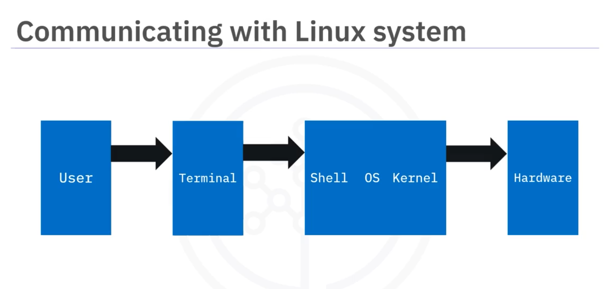
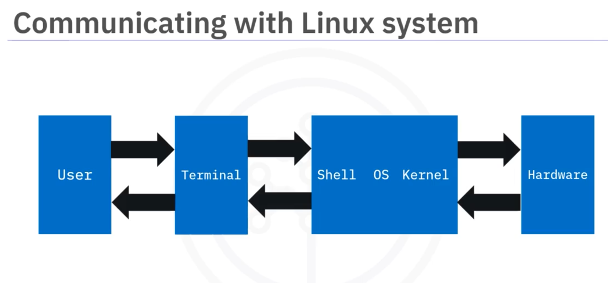

### overview on shell

The Linux shell is an OS-level application that interprets commands. In early versions
of Unix and Linux, the shell was the only way to interact with the operating system. Today,
you can also use graphical user interfaces, but the shell remains a popular and flexible choice and an easy way to run script files.
You can use shell commands to perform tasks such as

- moving and copying files,
- writing to and reading from files,
- extracting and filtering data, and
- searching for data.

There are many shell versions, but the base functionality of most is the same. Some popular examples include:

- Bash
- d Zsh.

### How are commands run

First, we have a user who wants to run a command. They enter the command in a terminal, which is then relayed to the shell.

The core components of the operating system and kernel translate the command for the hardware to perform.


When the hardware completes the command, the kernel reads any changes or results
and sends them back via the shell to the terminal
for the user’s information.



### Linux file system and file Directory structure

Let's explore some commonly used directories within the Linux file system. Some of them include `bin`, `sbin`, `ect`, `VAR`, `Temp`, `home`, and `boot`.

- The `bin` directory contains essential binary executables, where common Linux commands like `ps`, `ls`, `ping`, `grep`, `cp`, and `mv`. For example, `ls` in the command line executes the list command, displaying files and directories.

- Similarly, the `sbin` directory contains binaries crucial for system maintenance tasks such as `ip tables`, `reboot`, `Fdisc`, and `ifconfig`. For example, typing `ifconfig` retrieves network interface information.

- Next, the `ect` directory stores configuration files for installed programs. For example, after installing Apache on a Linux server, its configuration files would reside in `/etc/Apache`, governing its behavior and settings.

- The `var` directory stores variable data files that change or grow constantly. You can call these files variable data files. A perfect example is system logs. For example, Apache logs its activity in files located within the server's file system, facilitating troubleshooting and monitoring.

- In contrast to var, the `temp` partition houses temporary files that are automatically cleared upon system reboot. For example, temporary files created during software installations get stored in temp, ensuring system cleanliness and efficiency

- The `home` partition serves as the foundation for user-specific storage. Each user has a home directory to store their personal files with access restricted to only that user. For example, when you create a user named Warren, their home directory becomes `/home/Warren`, and only Warren will be able to edit or read pass from that specific directory This directory provides the user with a private space for files and settings.

- Finally, the slash `boot` partition contains boot-loaded files essential for system startup. For example, the Linux kernel and boot loader files reside in boot ensuring a smooth boot process.

## Linux Run Levels

The run level is a specific single-digit integer that helps define the operating state of the Linux-based operating system. However, each run level is delegated to various system configurations and allows to access various process combinations.

**What are run levels?**

The Run levels are the state of the init command and define the system services for which they operate. Numbers are useful for identifying run levels. Run levels play an important role in managing the Linux system.

Run level in Linux is a mode of operation that defines the services and processes that are available for users and the systems. Each run level defines specific services and is designed to perform different tasks.

| Run levels | Level name                                                 | Description                                                                             |
| ---------- | ---------------------------------------------------------- | --------------------------------------------------------------------------------------- |
| 0          | Halt the system                                            | Stop all system operations                                                              |
| 1          | Single-user mode                                           | Allows only one user to maintain the tasks                                              |
| 2          | Multi-user mode without network file system (NFS)          | Multiple users can access the system; however, they cannot share files over the network |
| 3          | Full multi-user mode (text-based)                          | Multiple users with full capabilities, however, cannot access graphics                  |
| 4          | Undefined or not used (reserved for user-defined settings) | No default function is available; however, users can customize                          |
| 5          | Full multi-user mode (with graphical user interface)       | Multiple users can access with a graphical interface for easier use                     |
| 6          | Reboot the system                                          | Restarts the system; you can refresh all operations                                     |

**Example of Run Levels**

Consider an administrator who wants to perform system maintenance that requires system access for the root user. For this, the administrator would use run level 1, single-user mode. Let's look at the step-wise process the administrator would follow to use Linux at the run level. This process ensures that maintenance and updates occur without disrupting user access or risking system integrity.

- Log in as the root user or a user with the sudo privileges role because changing run levels requires administrative permissions.
- Next, access the terminal window on the Linux system if the system is running in the graphical interface.
- Use the init command to change the run level. If the user has not logged in as a root user, the administrator would enter init 1 or sudo init 1 in the terminal to move to single-user mode. The init command prompts the system to terminate all processes and services that are not required for the single-user mode. Further, it will switch the system to run level 1.
- Now, perform the necessary system maintenance tasks. In single-user mode, the administrator has allowed access to all file systems and commands without networking services.
- Finally, return the system to its normal operational state after completing the maintenance tasks. The administrator would use the command init 5 to return to full multi-user mode with a graphical interface when the system operates in the graphical mode. However, the administrator would use init 3 when the systems are usually in a text-based multi-user mode.

How do run levels work?

Once the system completes the Linux system boot process, the kernel initiates the hardware and mounts the filesystems. Further, it passes control to the 'init' process, which is the first process from where Linux starts its process.

At this point, the system transitions from its initial boot state to the operational state by moving into one of the several predetermined run levels. These run levels define the types of services or processes that would be achieved to meet the system's or its users' requirements.

- Run level 0: Halt the system
- Run level 1: Single-user mode
- Run level 2: Multi-user mode without network file system (NFS)
- Run level 3: Full multi-user mode (text-based)
- Run level 4: Undefined or not used (reserved for user-defined settings)
- Run level 5: Full multi-user mode (with graphical user interface)
- Run level 6: Reboot the system

### user mainipulation

Run the following command to create user name guest. Only user with admin/root access is allowed to add user. Use the sudo prefix to run the command with admin privilege.

```bash
sudo useradd guest
```

Run the following command to create a group named analysts.

```bash
sudo groupadd analysts
```

Run the following command to verify and list the users and groups that have been added.

```bash
cat /etc/group
```

Run the following command to modify the group named analysts to developers.

```bash
sudo groupmod -n developers analysts
```

Run the following command to add the user guest to the group developers.

```bash
sudo usermod -a -G developers guest
```

Run the following command to delete the user guest from the group developers.

```bash
sudo gpasswd --delete guest developers
```

Run the following command to delete the group developers.

```bash
sudo groupdel developers
```

## Importand commands

### 3.9. Create and manage file archives

1. `tar` command

allows you to copy multiple files and directories into a single archive file. The following command creates an archive of the entire ‘/bin’ directory into a file named bin.tar.

The options used are as follows:

| Option | Description.                   |
| ------ | ------------------------------ |
| -c     | Create new archive file        |
| -v     | Verbosely list files processed |
| -f     | Archive file name              |

```bash
tar -cvf bin.tar /bin
```

To see the list of files in the archive, use -t option:

```bash
tar -tvf bin.tar /bin
```

To untar the archive or extract files from the archive, use -x option:

```bash
tar -xvf bin.tar
```

### Package and compress archive files

2. zip command allows you to compress files.

The following command creates a zip named config.zip and of all the files with extension .conf in the /etc directory.

```bash
    zip config.zip /etc/*.conf
```

The `-r` option can be used to zip the entire folder.

The following command creates an archive of the ‘/bin’ directory.

```bash
    zip -r bin.zip /bin
```

### find

Find command is used to search for files in a directory. You can search for files based on different categories like file name, file type, owner, size, timestamps etc.

Find command conducts the search in the entire directory tree starting from the directory name given.

This command finds all txt files in the subfolders of the /etc directory.

```bash
find /etc -name '*.txt'
```

Along with the listing of txt files, you may get some Permission denied errors.

That is normal, as you have limited access on the lab machine.

### Access Control Commands

Each file/directory has permissions set for the file owner, group owner and others.

The following permissions are set for each file:

read => r
write => w
execute => x

To see the permissions currently set for a file, run ls -l command.

For example, to see the permissions for a file named ‘usdoi.txt’ in your current directory,

```bash
ls -l usdoi.txt
```

A sample output looks like:

```bash
-rw-r–r– 1 theia theia 8121 May 31 16:45 usdoi.txt
```

The permissions set here are ‘rw-r–r–’

Here, owner has read and write permissions, group owner has read permission and others also have read permission.

### 4.1 chmod

`chmod` command lets you change the permissions set for a file.

The change of permissions is specified with the help of a combination of the following characters:

| Option     | Description                                                       |
| ---------- | ----------------------------------------------------------------- |
| r, w and x | representing read, write and execute permissions respectively     |
| u,g and o  | representing user categories owner, group and others respectively |
| +, -       | representing grant and revoke operations respectively             |

The command below removes read permission for all (user,group and other) on usdoi.txt.

```bash
    chmod -r usdoi.txt
```

Verify the changed permissions.

```bash
    ls -l usdoi.txt
```

Add read access to all on usdoi.txt.

```bash
    chmod +r usdoi.txt
```

To remove the read permission for ‘others’ category.

```bash
    chmod o-r usdoi.txt
```

### Linux security

| Security Measure                          | What?                                                                                        | How?                                                                                                                                                                            | Why?                                                                                                                              |
| ----------------------------------------- | -------------------------------------------------------------------------------------------- | ------------------------------------------------------------------------------------------------------------------------------------------------------------------------------- | --------------------------------------------------------------------------------------------------------------------------------- |
| Update your operating system              | Ensure your OS has the latest security patches and updates.                                  | • Search for and download updates using sudo apt update. • Upgrade the packages using sudo apt upgrade.                                                                         | Keeping your OS updated protects against known vulnerabilities and exploits.                                                      |
| Remove unused software and services       | Uninstall programs and disable services that are no longer needed.                           | • Uninstall unused programs using sudo apt-get remove program_name. • To remove all associated configuration files along with the program, use sudo apt-get purge program_name. | Reducing the number of software and services minimizes potential entry points for attackers.                                      |
| Close unused ports                        | Block unused network ports.                                                                  | Use a firewall or network settings to identify and close unused ports.                                                                                                          | Closing unused ports reduces the attack surface available to cybercriminals.                                                      |
| Install an antivirus/antimalware software | Install software that detects and removes malicious programs.                                | • Install reputable antivirus or antimalware software to detect and remove malicious programs. • Regularly scan your system for threats.                                        | Antivirus software protects your system from viruses, malware, and other malicious threats.                                       |
| Enable a firewall                         | Activate a security system that monitors and controls incoming and outgoing network traffic. | • Turn on the firewall through your system's security settings or install a third-party firewall. • Configure it to block unauthorized access.                                  | A firewall helps to protect your system by preventing unauthorized access and monitoring network traffic for suspicious activity. |
| Set up regular backups                    | Create consistent backups of your critical data                                              | • Use built-in or third-party backup tools to schedule regular backups.• Store backups in different secure locations both onsite and offsite.                                   | Regular backups provide a safety net in case of data corruption, accidental deletion, or cyberattacks such as ransomware.         |
| Secure SSH access                         | Harden Secure Shell (SSH) for secure remote access to your machine.                          | • Disable root login. • Use robust SSH keys in place of passwords. • Configure two-factor authentication (2FA) for SSH.                                                         | Hardening SSH access reduces the risk of unauthorized access and potential brute-force attacks.                                   |
| Monitor system logs                       | Regularly review system and application logs for suspicious activity.                        | Use log monitoring tools or centralized logging systems to regularly review logs.                                                                                               | Early detection of unusual activities through log monitoring allows for a swift response to potential security incidents.         |
