Layers, groups and frames
=========================

Layers
------

Figma documents can become overly complex because they typically contain a dense combination of images, objects, and text. Designers are sometimes tempted to leave their layers panel looking like organized chaos, making it difficult to find things.

Layer naming approaches
-----------------------

When who, and to what extent we name our layers depends on the maturity of our design and the stage of the design process we're in (ideation, collaboration, ready for handoff).

Conventions 
------------

Because every team is unique, the advice in this reading is just that - advice. Based on readability or how the developer team prefers to structure their components, you may develop your own methods of working. The person who names layers is also determined by the stage of your design process, the size of your team, and the level of involvement of your developers in the design process. To get you started, here are some methods: 

The Task
--------

Let's take the component below, for example: 

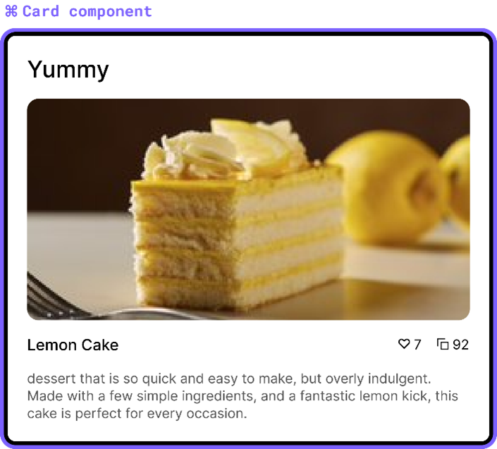
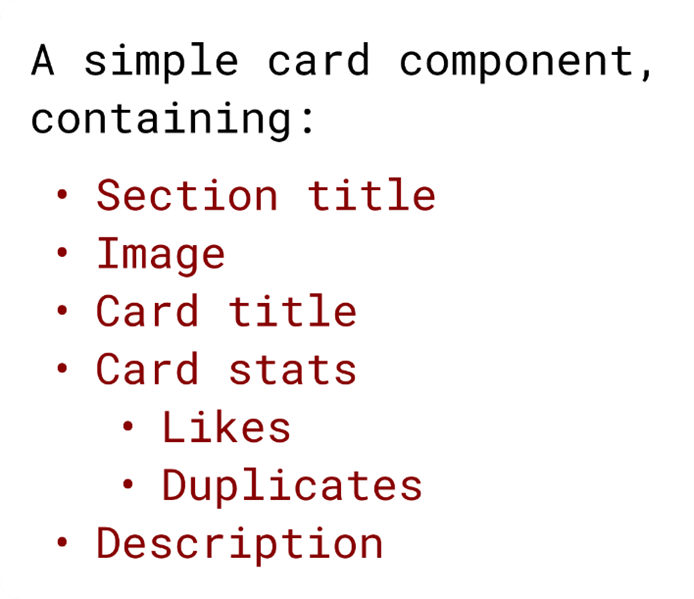

Design stage ideating
---------------------

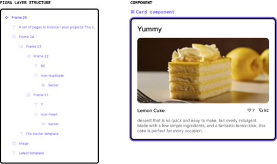

In this paradigm, there is no need to name layers because you are still in free-flow mode, generating ideas and focusing on solving the problem first. 

We're just having fun at this point, so we don't need to worry about layer naming or structure. The file creator does the naming for you. Because this is still very scrappy, don't worry about naming or even using specific elements (perhaps a rectangle will suffice for a button!). 

Refinement
----------

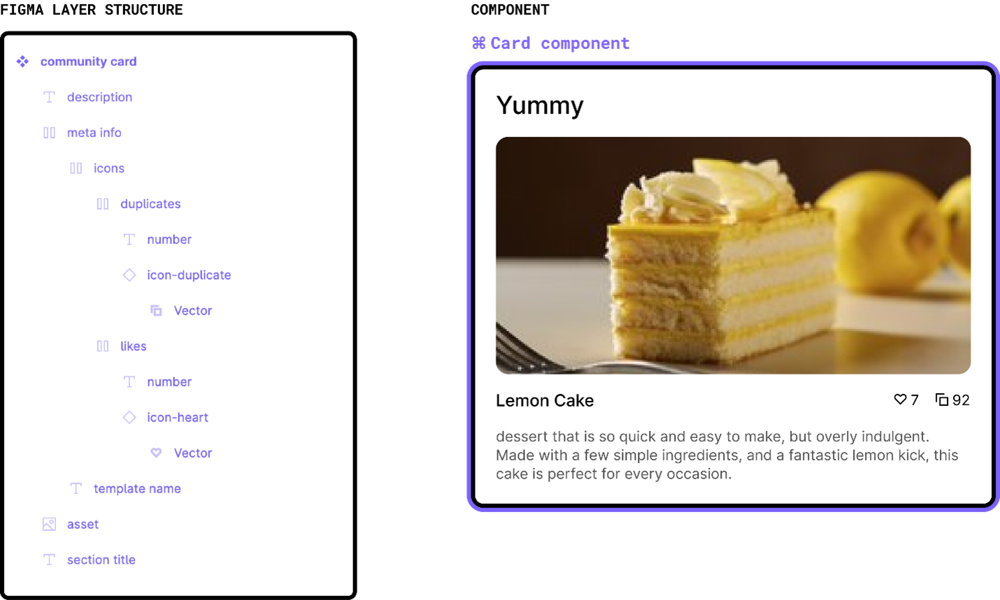

When you and your team are getting ready for approval from your key stakeholders, this is when you want to think about how easy it is for someone to digest your ideas and iterate on them, clear layer-naming greatly helps in this. 

Use descriptive layer names here. A card should be called a card, a number should be called a number, and a description should be called a description. At this point, you still own your designs but are brainstorming ideas with colleagues. This is an excellent time to name layers so that they make sense as a group. The simplest way to accomplish this is to be as descriptive as possible. 

Groups and frames
-----------------

When working with a large number of layers, you require a more formal method of bundling these. In other design software, you'd use a group for this, but Figma offers another option: frames. Frames appear to be very similar to Groups at first glance, so let's take a closer look and discover their unique characteristics. 

Let's begin with the fundamentals. Every graphics app now has grouping functionality: select some objects, press Command G on a Mac or Ctrl G on Windows, and your layer list will now look cleaner with a collapsible group. Groups are defined by their contents. Your group's boundaries are the outer edges of whatever is inside it. As a result, whenever you change the position or dimensions of an object, the bounds of the group will change accordingly. The parent element in your document is related to the group object. The group's constraints are set to "left" and "Top" by default, as shown by the dashed lines here:

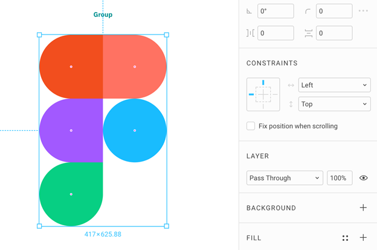

If the constraints are set to scale, your group will scale with its parent element. When you resize a group, the contents are always resized as well. You can keep the same aspect ratio by holding Shift while resizing. 

Frames
------

At first glance, there does not appear to be much distinction between groups and frames. You select your objects and press Command G on a Mac or Ctrl-Alt-G on Windows to convert them into a frame. They will collapse similarly in the layer list. When you create a frame, the initial dimensions are determined by its contents. The boundaries of your frame, on the other hand, are independent of what's inside. 

Your frame is similar to a window or, if you prefer, an artboard through which you can see the objects behind it. When you resize your frame, you are only resizing the window through which you are looking. Designing with frames is the key to unlocking Figma's most powerful features. You'll be able to create designs that are well-organized, beautifully styled, simple to use, scrollable and resizable. 

### Individual sizing

A frame's size is independent of its children, the nested layers. The size of the parent frame will not change if the children are moved or resized. This means that the parent frame can be the same size as or larger than its children. Allowing you to do things like internal add padding, create a "mask" effect, and enable scroll interaction in a prototype (examples of these below). In contrast to Groups, where the group must be the same size as its children. 

### Use styles

Frames, like rectangles, are objects that can be styled. They can be decorated with a fill, stroke, or shadow. They can also have rounded corners. With this level of adaptability, frames can be used to design almost anything. A button, for example, can be created using only a styled frame (blue with rounded corners) and a single text layer, unlike groups, where a second layer is required for the background (making auto layout impossible). 

### Overflow content

A frame's children (nested layers) can "overflow" past its bounds. With the help of "Clip Contents," those out-of-bounds children can be kept visible or hidden. 

### Resizing with constraints

Children of a frame can be applied to resizing constraints (nested layers). They are used to "constrict" or "pin" the children to the top, bottom, center, left or right of the frame or to scale as the size changes. 

### Auto-layout resizing

Auto-layout can be applied to frames to create a variety of (automatic) resizing behaviors. The direction a frame will grow, the spacing between children (nested layers), internal padding, and how each individual child will respond to changes are all determined by auto-layout. This is a very powerful feature that can be used in a variety of ways. 

### Layouts and grids

Grids and layouts can be applied to any frame, from a large device "artboard" to a UI region or a small component. These various frames can even be nested inside of another parent frame. When used with constraints, this is useful for maintaining consistent spacing across different container sizes and configuring resizing behavior. A desktop frame, for example, can have one layout for its nested page frame and another for its nested side navigation frame. Each has its resizing behavior. 

### Make components

To create a component, all component layers must be housed in a single frame. However, if these elements are housed in a group, Figma will automatically convert the group into a frame when you click "create component." 

Typography and best practice
============================

Typography is crucial in our interactions with products and interfaces. More than 90% of online information is in text form. It enhances user experience and usability, capturing users' attention and potentially helping achieve business goals. Because there is some ambiguity in typographic terminology, this reading will go over the essential terms that are especially important to you as a UX UI designer.

As a result, typography makes language visible and plays an essential role in design. Your Style Guide should also include a Typography study.

Lettering and typography
------------------------

It's critical to distinguish between lettering and typography. Both are popular today and often mixed up. They do, in fact, deal with letterforms, but in different ways. Typography is the layout and arrangement of content using pre-made letter systems such as typefaces and fonts. Lettering, however, entails creating letterforms for a specific use and purpose.

Typography terminology
----------------------

The term "typeface," also known as a font family, derives from physical print and refers to the faces of physical letter blocks. A typeface is made up of fonts, just like an album is made up of tracks or a book is made up of chapters. A typeface has multiple font weights and a consistent style across all characters, numbers, and symbols. Typefaces include Arial, Times New Roman and Comic Sans.

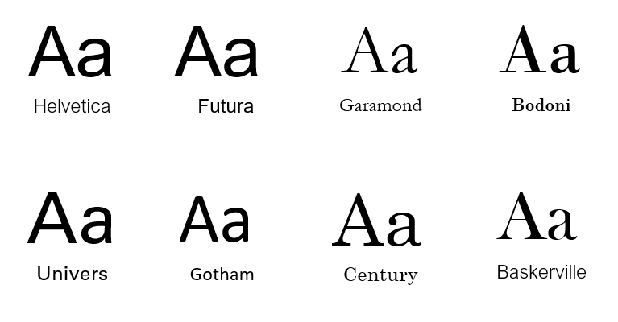

Typography elements
-------------------

Before examining the best design practices for improving user experience, let us look at the typography elements. 

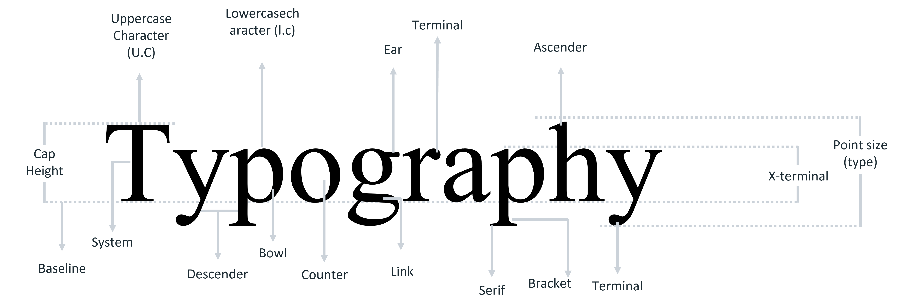

### Baseline

The baseline is the point at which the text line rests. It calculates the distance between the written content and other elements on the interface. 

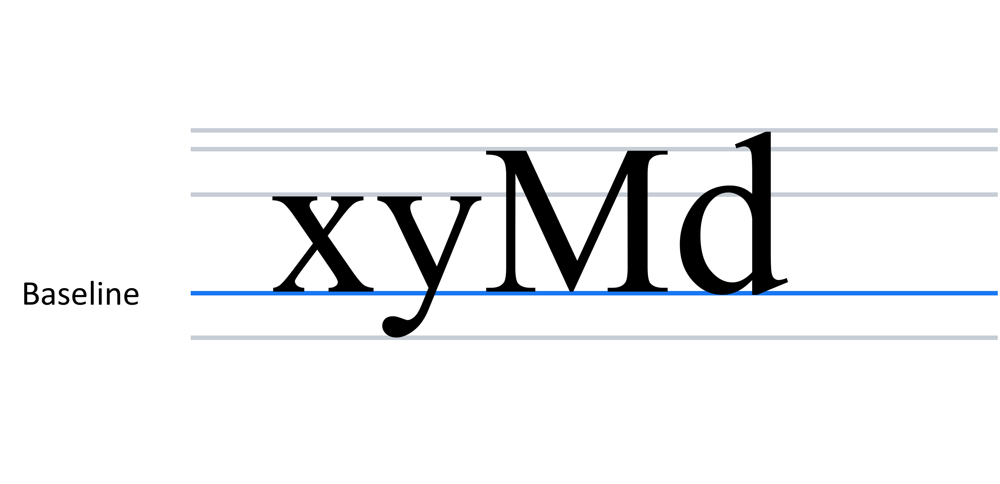

### Cap height

The cap height of a typeface refers to the height of the capital letters. The cap height indicates the height of flat letters such as M, H, T, or I, as opposed to round letters such as S, O, or Q, or pointy letters such as A and V, which overshoot. It should be noted that the cap height is less than the typeface's maximum height. 

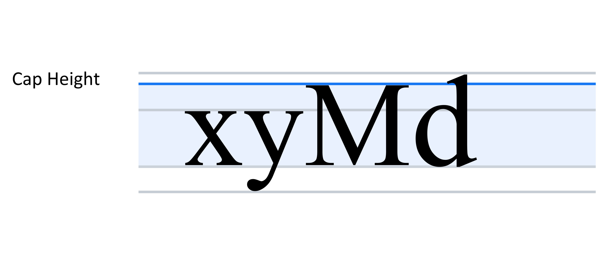

### X-Height

The X-height, also known as corpus size, is the distance between the lowercase "x baseline" and meanline. Because typefaces with very large x-heights have less white space between lines of type, this measure can be important for legibility. Because many letters have overshoots or rounded tops, measuring the top of flat characters like x, y, or z is easier, hence the name.

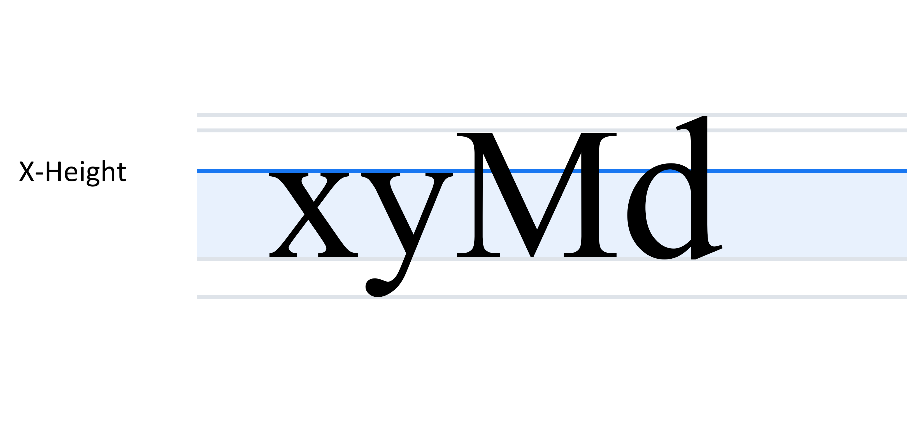

### Ascenders and descenders

An Ascender is a part of a letter that extends above the x-height or cap height, such as the stem of a lowercase b or d. Descenders are vertical downward strokes that extend beyond the baseline, such as the lowercase g or p.

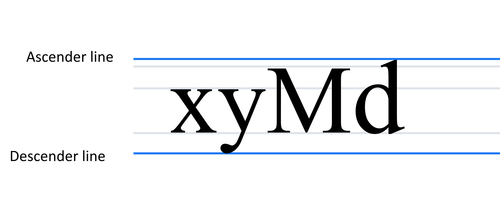

### Weight

The overall thickness of a typeface's stroke is referred to as its weight. Weights can range from extremely light to extremely heavy. The most well-known weights are:

1.  Light, 
    
2.  Regular,
    
3.  Medium, and 
    
4.  Bold. 
    

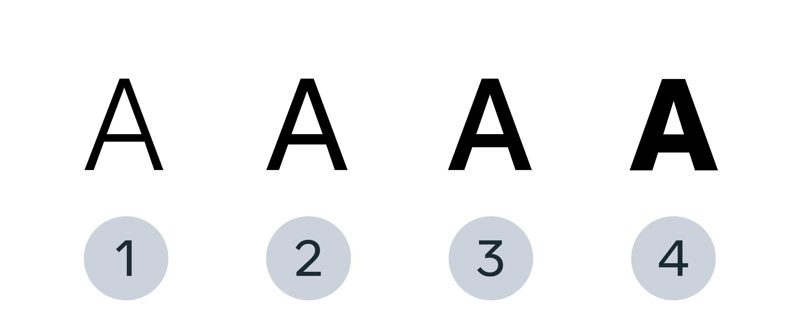

### Tracking

Tracking is the spacing between all a font's characters. Properly chosen tracking can make the copy visually appealing. Letter spacing, also known as tracking, is the consistent adjustment of the space between letters in a piece of text. 

### Kerning

Kerning is the space that exists between two specific letters. It differs from tracking in that it does not apply to all characters. 

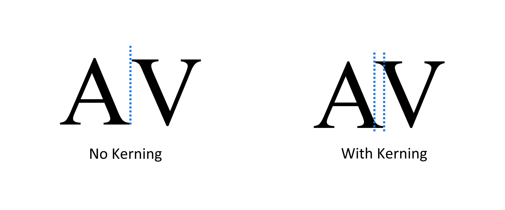

### Leading

The space between two lines of text is known as leading. 

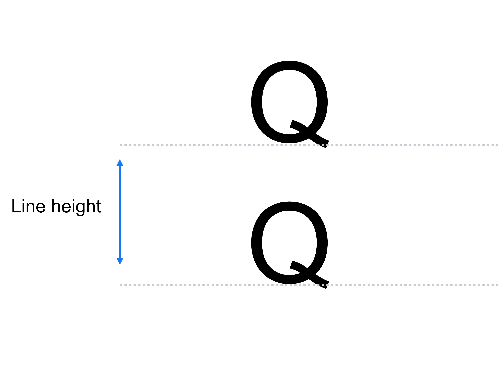

### White space

In typography, white space refers to the space between blocks of text. When used correctly, white spaces can make content more appealing and improve readability.

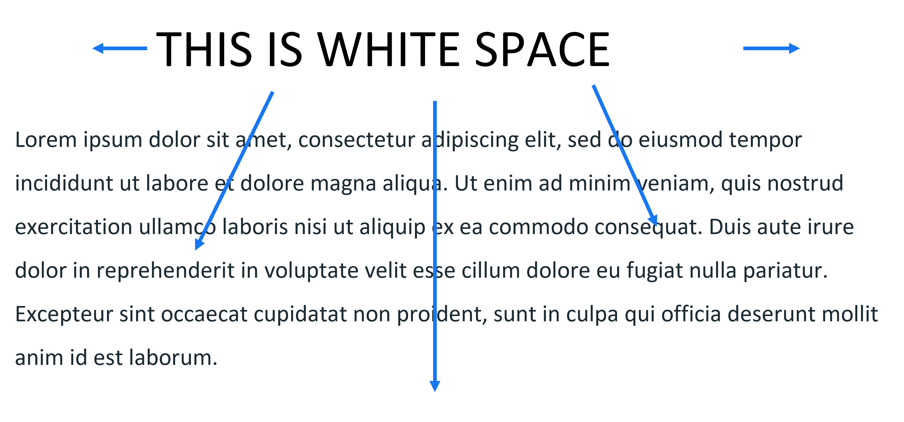

### Stroke

A straight or curved line forms the main body of a letter. 

### Serif

A stroke or foot-like element is connected to the end of the main strokes of some typefaces. Serif fonts are often more readable than sans-serif fonts because the tiny "feet" guide the reader's eyes to the next character. However, because of their small size, they may not always render properly on screens. 

### Sans serif

A typeface that does not have any strokes or extra elements at the bottom of a letter. Because of the lower resolution of screens, sans serifs are frequently used for digital interfaces. As technology advances and screens with higher resolutions become more common, this may no longer be a deciding factor when selecting a font. 

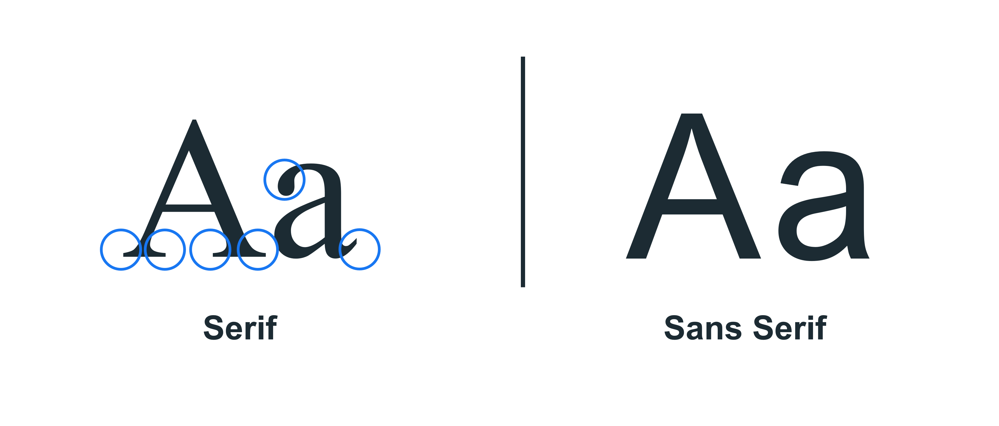

How typography can be used to improve user experience
-----------------------------------------------------

Because Typography contains so many elements, many designers overlook this discipline because mastering it takes time and practice. Remember that good typography is format-specific, and usability equals legibility. Let's go over a few key steps to ensure your next UI has legible typography that conveys the appropriate mood for your text.

### Hierarchy

The size of a text has a significant impact on the user's reading experience. Hierarchical elements should be used to separate the blocks and improve communication. The titles or headers, subtitles, and body text comprise a basic typography hierarchy. Because headings are at the top of the typographic hierarchy, they are larger and heavier.

Remember to start with a font size that is comfortable for your body text. As a general rule of thumb:

*   For desktops, use a font size of 16 points or higher for body text 
    
*   For iOS devices, use a text size of at least 11 point 
    
*   For Android devices, use at least 14 points for the main text 
    

Because different sizes of body text are common, choose typefaces that work well in different sizes.

### Text colors

Color selection is also essential. Colors are associated with various emotions as well as a visual hierarchy. As a result, it is a good idea to use different colors for titles, body text, links, buttons and error messages. Also, remember that the text color must contrast with the background color; this is critical for a good reading experience, and even though it may seem obvious, there still are a lot of non-legible buttons out there.

### Line length

Take note of the length of the text lines. Set a length limit so that it isn't too long and interferes with the reading experience. To determine the best line length for a text, use a simple formula based on font size: multiply it by 30. So, if your font size is 10px, the ideal reading line length is 300px.

### Avoid text walls

You should avoid creating a "wall of text." A wall of text, also known as a gray wall effect, is a single block of text that is devoid of any white space or other design elements. By inserting paragraph breaks at appropriate intervals, you can avoid the gray wall effect. You can also use the following design elements: images, quotations, headings and subheadings and bullet points. When working with long paragraphs, try to include anything that isn't text and breaks up the solid block. 

Final thoughts
--------------

With these guidelines and typography know-how at your disposal, you're ready to start experimenting with typefaces, fonts, and styles in search of the ideal reading experience. However, one final caveat is that you could follow all of the above guidelines and still overlook some aspects of typography that an average user will notice immediately. As a result, the final stage of any text design iteration is comprehensive user testing.

Find a broad group of internet users who can provide feedback on the readability of your text; combining human input into your typography will ensure that your website is an easy and enjoyable read.

Rapid prototyping
=================

In this reading, you will learn about rapid prototyping, its advantages, its cycle and the levels of fidelity you can use. Before investing time and money in developing an idea and creating a product, you should make sure it works as intended. You should test it to ensure that it is user-friendly and free of bugs and that it assists the user in carrying out their desired actions.

To accomplish this, you create a scaled-down version of your product. This is referred to as a prototype. Prototypes can be as simple as paper models or as complex as fully functional digital prototypes with which the user can interact. After creating a prototype, you will test it on some target users. You'll observe how users interact with the product to identify any usability or design flaws.

This reading focuses on rapid prototyping. 

 What is rapid prototyping?
---------------------------

Rapid prototyping is the process of creating a fast, preliminary version that closely resembles the final product. To understand rapid prototyping, it is helpful to consider where the term originated. The phrase "rapid prototyping" comes from the manufacturing industry. Rapid prototyping is used in manufacturing to create a 3D model of a product or a single component of a product. Before mass production of the product or part, the prototype can be tested.

Similarly, digital designers have adopted rapid prototyping as a quick and cost-effective way to build and test a working version of their product. Rapid prototyping in digital design is the process of iteratively mocking up an interface and validating it with users, stakeholders, and even teammates. However, what distinguishes it from standard prototyping?

Rapid prototyping is much faster in manufacturing than traditional prototyping, which can take months or even years. However, when it comes to creating digital products, designers should never take months or years to create and test a prototype. As a result, all digital design prototyping can be considered rapid. Prototyping tools like Figma can demonstrate the digital nature of rapid prototyping: they are designed to speed up an already quick process, allowing us to stitch together screens in minutes. 

Advantages of Rapid prototyping
-------------------------------

For starters, rapid prototyping provides us with visuals to ensure everyone is on the same page. It is not the same thing to describe a product as it is to see it. And while we can probably get away with descriptions within teams because we all speak the same language, they are useless to stakeholders, investors, or users. 

A rapid prototype eliminates miscommunication. Rapid prototyping also allows us to identify problems or pain points early in the design process. This allows us to address and solve problems before they reach development further along in the process, saving us valuable time and money.

 Finally, testing our work continuously and quickly allows us to validate that we are creating a product tailored to real user needs and desires. We will show them our rapid prototype, and they will be able to tell us whether or not it works. We build a rapid prototype of a product section that we want to validate in a relatively short period. We then show it to users or our team for feedback and make changes based on their responses. This process allows us to collect feedback early and frequently and build better products faster.

The Rapid Prototyping Cycle
---------------------------

Now that you know what a rapid prototype is let us look at how to create one.

1.  The first step is to create what you are testing. 
    
2.  Test it on users, stakeholders, or your team and make changes based on their feedback. 
    
3.  Repeat the procedure 
    

 That's the end of it! 

 The procedure isn't complicated, but it's incredibly beneficial.

It takes a lot of time and effort to prototype an entire product repeatedly! Even for a master prototyper, the process is not quick. It is also not necessary to create an entire product from the beginning. So, what do we construct?

We frequently prototype:

1.  Main functions and features and 
    
2.  New interactions and patterns.
    

1\. Main Functions and Features

Where will your users spend the majority of their time? Which features are they most likely to use? Start prototyping from there! Examine critical areas of your app or website to ensure they meet user expectations, needs, and desires.

2\. New interactions and patterns

Users now see traditional structures and experiences in apps and on websites. These are well-known among users. When they see them, they know how to use them. You need to prototype and test anything new that deviates from what users expect. If you're creating an exciting new login screen or a new, cool kind of checkout process, make a rapid prototype early on to test any change that may confuse users.

Rapid prototyping is not just for these two scenarios. Any section of your app can be prototyped and tested. However, only work on one part or feature at a time. If you try to address the entire product at once, you will end up with a prototype that is too large to be easily understood.

Fidelity level
--------------

You can test at various levels of fidelity. You will continue to work quickly, gather feedback, and revise to reflect it. The distinction is in the type of feedback you will receive.

Low-fidelity prototypes allow users to concentrate on how they will use a product. Is it effective?

Mid-fidelity prototypes allow users to concentrate on interactivity. They aid in the validation of element and screen behavior. These are frequently created using wireframes.

High-fidelity prototypes, which closely resemble the finished product, are created using tools such as Figma. When these are presented to users, they tend to focus on their visual design, making them unsuitable for the early stages. You would usually use them at the end to ensure that visual design decisions clearly communicate what they're supposed to.

So, what is the appropriate level of fidelity? It all depends on the stage of your project and what you want to measure or discover.

Final thoughts 
---------------

In this reading, you learned about rapid prototyping, its advantages, its cycle and the levels of fidelity you can use.