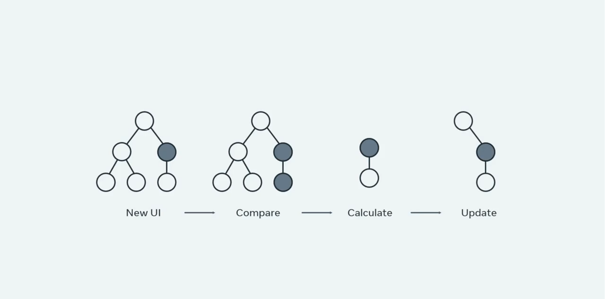

# JSX Dive Deep
### JSX, Components and Element

JSX is a syntax extension to JavaScript that React uses to describe what the UI should look like. However, even though JSX looks like HTML, it's essentially a more powerful abstraction that combines both markup and business logic into an entity called a **component**.  

So what is really happening from the moment you write JSX in your render function until Reacts creates the desired assets for your pages  

To understand all the steps involved, you need to be introduced to the concept of elements in React. 

By now, you already have a good understanding of components and how your entire UI is represented by a tree of them. 


You also know that the final web pages that React produces are nothing more than pure HTML, CSS, and JavaScript.

When react analyzes your rendering methods from all your components, it takes the whole JSX tree, starting from the root and creates an intermediary representation.  

This representation is essentially another tree similar to before, but where each node instead of being JSX is a plain object describing a **component instance** or **DOM Node** and its desired `properties`. 
```js
// JSX
const buttonTitle = 'Submit';
    return (
    <button className='button button-blue'>
        <span>
            {buttonTitle}
        </span>
    </button>
    )
```

This plane object is what React defines as an **element**. An element is just a way to represent the final HTML output as a **plain object**. 

```js
// Element
{
type: 'button',
props: {
    className: 'button button-blue',
    children: {
        type: 'span',
        children: 'Submit'
        }
    }
}
```

It consists primarily of two attributes, `type` and `props`.  

- **Type** defines the type of node such as a button   
- **props** encompasses all the properties the component receives in a single object. 

Observe how the elements can be nested as in the button example via the children property. When react creates the entire element tree starting from the root, the root element specifies all the child elements as the children prop. And each child element does the same thing until it reaches the end of the tree. 

##### What is important about this new structure Is   

**Both child and parent elements are just descriptions and not actual instances. In other words, they don't refer to anything on the screen when you create them, they're just objects after all.**   
But these objects are easy to traverse and of course are simpler than the actual DOM elements. 

So far, you have been introduced to an example of a tree transformation with simple DOM nodes like a button. In the element tree, this is specified as the `type` property, but the type of an element can also be a function corresponding to a React component.

Imagine you have created a component to encapsulate the traditional HTML button named `Submit` button. In this case, the type property of the element will point to the name of the component. 
```js
{
    type: SubmitButton,
    props: {
        color: 'blue',
        children: 'Submit'
    }
}
```
This is the fundamental idea of React, both user defined components and dom nodes can be nested and mixed with each other in the elementary. 

For example, if you were creating a `Logout` process for the Little Lemon restaurant app, you could do this with a `Logout` component in JSX. 
```js
// JSX
const Logout = () => { 
    <div>
        <p>Are you sure?</p>
        <SubmitButton color="blue">Yes</SubmitButton>
    </div>
}

// Elements tree
{
type: "div",
props: {
    children: [
    {
        type: "p", 
        props: {
            children: "Are you sure?",
        },
    },
    {
        type: SubmitButton,
        props: {
            color: "blue",
            children: "Yes",
        },
      },
    ],
  },
}
```
In this `Logout`  component, The JSX would translate to the following tree of elements. That allows you to mix and match components and dom elements as the type property without worrying about whether `SubmitButton` renders to a button, a div or something else entirely. This keeps components decoupled from each other, expressing their relationships through composition. 

---
```js
// Function Component
{
        type: SubmitButton,
        props: {
            color: "blue",
            children: "Yes",
        },
}
```
When react sees an element with a function type like the `SubmitButton`, it will know to ask that component what element it renders to with the given props. So React will ask `SubmitButton` again what it renders to and it will transform that into an element. React will keep repeating this process until it knows the underlying DOM tag elements for every component on the page.
```js
// Element
{
type: 'button',
props: {
    className: 'button button-blue',
    children: {
        type: 'span',
        children: 'Submit'
        }
    }
}
```
**Once React finishes the process of identifying all user defined components from the tree of elements, it will convert them into DOM elements. The result is what is generally known as the virtual DOM**. 

> A JavaScript alternative representation of the real DOM. 

Now, what are the steps involved when there is a new change in your UI.   
- First, React will take all your JSX and produce a new UI representation as a tree of elements.  
- Second, it will compare it with the previous representation that is kept in memory. 



- Third, it will calculate the difference in a tree, recall that since each node in the tree is a JavaScript object, this **Diffing operation** is very fast.  
- Finally based on that difference, it will apply the minimum number of changes to the underlying DOM Nodes in order to process the update, and that's it. 

### Component composition in React

Component composition is a pattern in React where you combine smaller, reusable components to build more complex user interfaces. It follows React's core principle: **"Compose components instead of building monolithic structures."** By leveraging composition, you can create flexible and maintainable applications.

##### How Component Composition Works

- Nesting Components:
    - A parent component can include child components in its JSX.
    - The parent controls the layout or structure, while child components handle specific responsibilities.
```js

function Header() {
  return <h1>Welcome to my website</h1>;
}

function Footer() {
  return <footer>© 2024 My Website</footer>;
}

function Page() {
  return (
    <div>
      <Header />
      <p>This is the main content of the page.</p>
      <Footer />
    </div>
  );
}

```

##### Passing Props for Customization:

- Parent components can pass data (via props) to child components, enabling dynamic rendering.
```js

function Button({ label, onClick }) {
  return <button onClick={onClick}>{label}</button>;
}

function App() {
  const handleClick = () => alert("Button clicked!");
  return <Button label="Click Me" onClick={handleClick} />;
}

```

##### Using children Prop for Flexibility:

- React's children prop allows you to pass JSX or components as children, enabling highly flexible layouts.
```js

function Card({ children }) {
  return <div className="card">{children}</div>;
}

function App() {
  return (
    <Card>
      <h2>Card Title</h2>
      <p>This is content inside the card.</p>
    </Card>
  );
}

```

##### Why Use Component Composition?

- Reusability: Build once, use across multiple parts of the app.
- Separation of Concerns: Divide responsibilities into smaller, focused components.
- Flexibility: Compose components in different ways to meet various design needs.
- Scalability: Simplifies managing large applications by structuring them hierarchically.

**Component Composition vs. Inheritance**

React emphasizes composition over inheritance. Instead of relying on class inheritance for code reuse, React uses composition to combine components and behaviors.
Example:

Instead of creating a base class for shared functionality:

```js
class BaseComponent extends React.Component {
  render() {
    return <div>Shared behavior here</div>;
  }
}
```
You use composition to reuse the functionality:
```js
function SharedComponent() {
  return <div>Shared behavior here</div>;
}

function ParentComponent() {
  return (
    <div>
      <SharedComponent />
    </div>
  );
}
```
**Key Takeaways**

- Component composition is a powerful React concept for building reusable and scalable UI.
- It encourages a modular design, making code easier to read, test, and maintain.
- Use props and children for customization and flexibility.
- Prefer composition over inheritance for combining behaviors.

### Component composition with children

When designing React components, one of the most important properties developers tend to overlook is the children prop. The children prop which is a special property all components have, is the foundation for the React powerful composition model.

There are two main features that enable component composition; containment and specialization.

### Containment

Containment is when a component is designed to "contain" other components or elements. It focuses on how components encapsulate children without dictating their layout or behavior. This is commonly achieved using the children prop.
Example of Containment
A Generic Container Component:

```js
function Container({ children }) {
  return <div className="container">{children}</div>;
}
```

Using the Container:
```js
function App() {
  return (
    <Container>
      <h1>Welcome to My App</h1>
      <p>This is a paragraph inside the container.</p>
    </Container>
  );
}
```


**Key Points of Containment**:

- Flexibility: Parent components decide what to render inside the container.
- Use Case: Wrapping elements, like modal dialogs, cards, or layout components.

### Specialization

Specialization is when a more specific component is created by building on a generic component. It focuses on extending or customizing a generic component to create specialized versions for specific use cases.
Example of Specialization
A Generic Button Component:
```js
function Button({ label, onClick }) {
  return <button onClick={onClick}>{label}</button>;
}
```

**Specialized Components:**

```js
function PrimaryButton(props) {
  return <Button {...props} style={{ backgroundColor: "blue", color: "white" }} />;
}

function DangerButton(props) {
  return <Button {...props} style={{ backgroundColor: "red", color: "white" }} />;
}
```
**Using Specialized Components:**

```js
function App() {
  return (
    <div>
      <PrimaryButton label="Save" onClick={() => alert("Saved!")} />
      <DangerButton label="Delete" onClick={() => alert("Deleted!")} />
    </div>
  );
}
```
**Key Points of Specialization:**

- Extensibility: Creates components tailored for specific tasks by reusing logic and structure from a generic component.
- Use Case: Customizing behavior, appearance, or additional logic.

### Combining Containment and Specialization

Often, Containment and Specialization are used together to create complex UIs.
Example: A Dialog Component

**Generic Dialog (Containment):**
```js
function Dialog({ children, title }) {
  return (
    <div className="dialog">
      <h2>{title}</h2>
      <div>{children}</div>
    </div>
  );
}
```
**Specialized Dialogs:**

```js
function AlertDialog({ message }) {
  return (
    <Dialog title="Alert">
      <p>{message}</p>
    </Dialog>
  );
}

function ConfirmDialog({ message, onConfirm, onCancel }) {
  return (
    <Dialog title="Confirmation">
      <p>{message}</p>
      <button onClick={onConfirm}>Yes</button>
      <button onClick={onCancel}>No</button>
    </Dialog>
  );
}
```
**Using the Dialogs:**

```js
function App() {
  return (
    <div>
      <AlertDialog message="This is an alert message." />
      <ConfirmDialog 
        message="Are you sure you want to delete?" 
        onConfirm={() => alert("Deleted!")} 
        onCancel={() => alert("Canceled!")} 
      />
    </div>
  );
}
```

**Differences between Containment and Specialization**

| Aspect	| Containment	| Specialization |
|----------|---------|--------|
| Purpose | Encapsulates child components.	| Extends or customizes a generic component.|
| Focus	| Layout or wrapping other elements.	| Adding specific functionality or appearance.|
| Implementation |	Uses children prop for flexibility. |	Builds on a base component with additional props or logic. |
| Example Use Case |	Cards, modals, or containers.	| Buttons, alerts, or dialog variations. |

By using Containment and Specialization, you can create modular, scalable, and readable components that align with React's compositional philosophy.

---

For these component boxes, the recommended approach is to use the children prop to pass children elements directly as their content.
```js
function Dialog(props) {
    return (
        <div className="model">
            {props.children}
        </div>
    )
}
```

Here you have a `Dialog` component which acts as the box, taking care of styling the container to make it look like a model window. 

By using the children prop, it has become a generic component to which we can provide any valid JSX as children.

To illustrate that, the `ConfimationDialog` 
component has been defined, which uses the `Dialog` component and renders as children a title and a description.
```js
function ConfimationDialog() {
    return (
        <Dialog>
            <h1 className="Dialog-title">
                Thanks
            </h1>
            <p className="Dialog-message">
                We'll process your order in less than 24 hours.
            </p>
        </Dialog>
    )
}
```
This example also showcases the second feature of component composition, specialization. 

- Specialization defines components as being special cases of other components. In this example, the confirmation dialog is a special case of dialog. 

I want to build a generic `Dialog` component that will contain a `title`, a `description`, and a warning `button` to make sure users are aware of the action's consequences all using component composition.

The button uses the children prop to specify its text, and the alert is a generic box that renders an overlay in the background and a white modal in the center of the screen. The children prop determines the content of that modal. 
```js
const Button = ({children, backgroundColor}) => {
    return <button style={{backgroundColor}}>{children}</button>
}

const Alert = ({children}) => {
    <>
        <div className="Overlay" />
        <div className="Alert">{children}</div>
    </>
}
```
```js
const DeleteButton = () => {
    return <Button backgroundColor="red">Delete</Button>
}
```
This illustrates the second feature of component composition which is containment. I can customize the content of the box in any way I would like by just providing JSX as its children.
```js
function App() {
    return (
        <div className="App">
            <header>Little Lemon Restaurant</header>
            <Alert>
                <h4>Delete Account</h4>
                <p>Are you want to proceed? You will miss all your delicious recipes!</p>
            </Alert>
    )
}
``` 
### Types of Children

In JSX expressions, the content between an opening and closing tag is passed as a unique prop called children. There are several ways to pass children, such as rendering string literals or using JSX elements and JavaScript expressions. It is also essential to understand the types of JavaScript values that are ignored as children and don’t render anything. Let’s explore these in a bit more detail:

**String literals**

String literals refer to simple JavaScript strings. They can be put between the opening and closing tags, and the children prop will be that string.

`<MyComponent>Little Lemon</MyComponent>`

In the above example, the `children` prop in `MyComponent` will be simply the string “Little Lemon”. 

There are also some rules JSX follows regarding whitespaces and blank lines you need to bear in mind, so that you understand what to expect on your screen when those edge cases occur.
1. JSX removes whitespaces at the beginning and end of a line, as well as blank lines:
```js
<div>    Little Lemon   </div>
 <div>
   Little Lemon
 </div>
```
2. New lines adjacent to tags are removed:
```js
<div>

  Little Lemon
</div>
```
3. JSX condenses new lines that happen in the middle of string literals into a single space:
```js
<div>
  Little
  Lemon
</div>
```

That means that all the instances above render the same thing.

##### JSX Elements

You can provide JSX elements as children to display nested components:
```js
<Alert>
  <Title />
  <Body />
</Alert>
```

JSX also enables mixing and matching different types of children, like a combination of string literals and JSX elements:
```js
<Alert>
  <div>Are you sure?</div>
  <Body />
</Alert>
```

A React component can also return a bunch of elements without wrapping them in an extra tag. For that, you can use React Fragments either using the explicit component imported from React or empty tags, which is a shorter syntax for a fragment. A React Fragment component lets you group a list of children without adding extra nodes to the DOM. 

The two code examples below are equivalent, and it’s up to your personal preference what to choose, depending on whether you prefer explicitness or a shorter syntax:
```js
return (
  <React.Fragment>
    <li>Pizza margarita</li>
    <li>Pizza diavola</li>
  </React.Fragment>
);

return (
  <>
    <li>Pizza margarita</li>
    <li>Pizza diavola</li>
  </>
);
```
##### JavaScript Expressions

You can pass any JavaScript expression as children by enclosing it within curly braces, {}. The below expressions are identical:

`<MyComponent>Little Lemon</MyComponent>`

`<MyComponent>{'Little Lemon'}</MyComponent>`

This example is just for illustration purposes. When dealing with string literals as children, the first expression is preferred.

Earlier in the course, you learned about lists. JavaScript expressions can be helpful when rendering a list of JSX elements of arbitrary length:
```js
function Dessert(props) {
  return <li>{props.title}</li>;
}

function List() {
  const desserts = ['tiramisu', 'ice cream', 'cake'];
  return (
    <ul>
      {desserts.map((dessert) => <Item key={dessert} title={dessert} />)}
    </ul>
  );
}
```

Also, you can mix JavaScript expressions with other types of children without having to resort to string templates, like in the example below:
```js
function Hello(props) {
  return <div>Hello {props.name}!</div>;
}
```
##### Functions

Suppose you insert a JavaScript expression inside JSX. In that case, React will evaluate it to a string, a React element, or a combination of the two. However, the children prop works just like any other prop, meaning it can be used to pass any type of data, like functions. Function as children is a React pattern used to abstract shared functionality 

##### Booleans, Null and Undefined, are ignored

false, null, undefined, and true are all valid children. They simply don’t render anything. The below expressions will all render the same thing:

`<div />`

`<div></div>`

`<div>{false}</div>`

`<div>{null}</div>`

`<div>{undefined}</div>`

`<div>{true}</div>`

Again, this is all for demonstration purposes so that you know what to expect on your screen when these special values are used in your JSX. 

When used in isolation, they don’t offer any value. However, boolean values like true and false can be useful to conditionally render React elements, like rendering a Modal component only if the variable `showModal` is true
```js
<div>
  {showModal && <Modal />}
</div>
```

However, keep in mind that React still renders some "false" values, like the 0 number. For example, the below code will not behave as you may expect because 0 will be printed when props.desserts is an empty array:
```js
<div>
  {props.desserts.length &&
    <DessertList desserts={props.desserts} />
  }
</div>
```
To fix this, you need to make sure the expression before && is always boolean:
```js
<div>
  {props.desserts.length > 0 &&
    <DessertList desserts={props.desserts} />
  }
</div>

<div>
  {!!props.desserts.length &&
    <DessertList desserts={props.desserts} />
  }
</div>
```
**Conclusion**

You have learned about different types of children in JSX, such as how to render string literals as children, how JSX elements and JavaScript expressions can be used as children, and the boolean, null or undefined values that are ignored as children and don’t render anything.