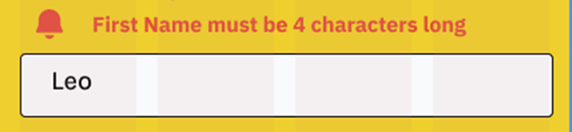
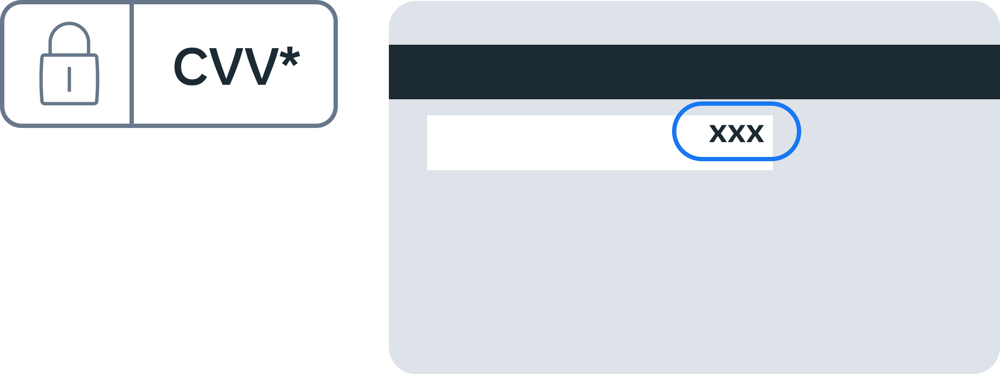

## Summary: Components in UI Design

As a UI/UX designer—like in the case of the Little Lemon restaurant website—you may encounter the concept of component-driven design. This approach is essential for building efficient, scalable, and consistent user interfaces.
### What is a Component?

A component is a standalone, reusable part of a design. It could be something simple like a button or something complex like a header that contains several smaller components (e.g., buttons, search bar, navigation menu).

Components can be:

- Atomic (small, like a button)
- Composite (built from multiple smaller components, like a full header)
- Reusable across different parts of the UI

Think of components as interchangeable building blocks that let you construct or reconstruct UI layouts quickly and consistently.

### Why Use Components?

- Efficiency: Faster design and development
- Consistency: Uniform look and feel
- Scalability: Easy to manage and adapt across multiple screens or features
- Improved UX: Users learn interfaces faster when elements are consistent

### Design Systems: A Step Further

A Design System is a comprehensive set of reusable design components, patterns, and guidelines that help design products at scale—similar to a brand style guide, but for digital products.
Key Elements of a Design System:

- Design Guidelines: Rules that reflect the brand’s values, tone, and style.
- Design Pattern Library: A collection of common, reusable UI patterns (like modals, cards, navigation menus) that solve frequent design problems.
- UI Kit / Component Library: A toolkit of UI elements (buttons, sliders, forms, etc.) ready for use.
- Process Design Guidelines: Best practices that guide how to apply design patterns and principles during the actual design workflow.

### Additional Clarification & Insight

- Component-driven design is closely tied to atomic design methodology (`atoms → molecules → organisms → templates → pages`), where small components are assembled into larger units.

- Design systems are living documents/tools, often evolving over time, especially in larger companies. They’re crucial for maintaining cross-team consistency and reducing design-developer handoff issues.

## Little Lemon form breakdown

### The importance of forms

Anyone who uses an app or website has a specific goal in mind. A form is frequently the only thing that stands between the user and their goal. Forms continue to be one of the essential types of user interactions on the web and in apps. Forms are frequently regarded as the final step in achieving one's objectives. Users should be able to complete forms quickly and easily. Let's examine Little Lemon's current checkout form in detail, which demonstrates some common errors in form design. 

### The layout

First, the text fields where the user needs to input data are in the center and not aligned to the left as in best practice. The checkout button is not apparent and there is no basket or information about what the user is buying.

### What about the length?

**Include a progress indicator**

Typically, checking out is a multi-step process. This means the customer will have to go through several steps before his or her order is complete. To make this process usable, include a progress indicator that indicates where the customer is in the checkout process and how much time is left to complete the process. 

**Include only vital fields**

A record number of shoppers are researching potential purchases on their smartphones. Meanwhile, the bigger question is whether those users are willing to purchase on their mobile devices. Everyone has answered dreaded questions, such as 'How did you hear about us?' While they may serve the seller, they do nothing for the buyer.

While these questions are annoying on a desktop, they can be fatal on mobile. In his excellent book Web Forms: Filling in The Blanks, Luke Wroblewski stated: 

"Any question you ask people in a Web form requires them to parse it, formulate a response and then input their answer in the affordance you have provided on the form. Being vigilant about every question you ask allows you to remove questions that are not absolutely necessary or can be asked at a better time or place or can be inferred automatically. And the fewer questions you ask, the better the odds are of people completing your forms quickly and easily."

Little Lemon's checkout demonstrates how a simple experience can quickly become complicated. Pages display unnecessary fields such as Middle Initial, Evening Phone and Mobile Phone, while breaking fields apart, the Address field has three imposing lines and a City (rather than just one for a postal code), plus the user is expected to retype their email address.

### Required fields and errors

After filling out the form fields and clicking submit, an error message is received, preventing a user from continuing: "First Name must be at least 4 characters." There are two issues to address based on the screenshot: 

First Name is not a required field because it lacks an asterisk (*) to indicate that the form field requires input. Using an asterisk to indicate required fields on forms, according to the Nielsen Norman Group, is a simple way to improve usability.  The form field has a minimum character count. Small details like this have a significant impact on the end-user experience in user-centered design. At least 220 three-character names exist. In some ways, this is dehumanizing because the system regards someone as unreal or invalid.    
 
### Required fields: a solution

An asterisk or the text required indicates that a form field is required. Check that all required form fields are marked. Include feedback to highlight errors such as empty required fields, invalid email (for example, when the email lacks a '@' sign), and so on. Why do we even have a limit? 

### Character limits

Character limits are a type of technical limitation that should be brought to light during developer-designer collaboration. Lower- and upper-character limits would be required by a system for two reasons: security and storage.

Validation should be performed on the input to ensure that it is of the correct type, length, format, and range. As a result, when users log in to access information, it can be validated against the database. A vulnerability that allows users to enter fields freely would result in inaccurate data and the possibility of bots breaking into your system.

Maximum character limits are used in storage because it is impossible to store a name that is legitimately 1,073,741,823 bytes long. The longest name in the world is only 747 characters long. 

### Character limits: a solution

Remove the minimum number of characters requirement. Implement a maximum character requirement that works for the vast majority of names in the database - 50 characters are an excellent place to start. Why even have a limit? Character limits are a type of technical limitation that *should* be brought to light during developer-designer collaboration. A system would require lower- and upper-character limits for security and storage. 

Validation should be performed on the input to ensure that it is of the correct type, length, format and range. As a result, when users log in to access information, it can be validated against the database. A vulnerability that allows users to enter fields freely would result in messed-up data and the possibility of bots breaking into your system. 
**Email**

The user is only ordering a meal, so do they need to confirm their email? If it is important, consider that when users are confirming their email in separate fields, they frequently make typos. The requirement that users type their email in two text fields increases the likelihood of typos. 
Email confirmation: a solution

So, the best approach would be to send a confirmation link to the user. This is the most user-friendly approach because it requires the least amount of user effort. 

**Payment not explaining the CVV**

Like AVS, CVV or CVC is an ambiguous acronym. Make sure to explain it. 

### CVV: a solution

The image below depicts that CVV is located on the back of your bank card, and it is the last three digits printed. 

### Final thoughts

One of the most frustrating aspects of using the internet is form validation. If it's unclear to a user what they are doing wrong and there's no easy way to fix it, they are much more likely to give up and move on to another site when filling out a form. 

Use of menu icons in navigation
===============================

Which menu icon should you use for navigation? 
-----------------------------------------------

In this reading, you will explore the different types of menu icons and their usage. Navigation icons can be found all over the Internet and on different websites. With the rise of smartphones and tablets used to browse the Internet, these icons are frequently used in mobile versions of websites and apps.

Except for the menu icons, there is no official name for any of these icons, as different icon creators, such as Font Awesome and Material Design, use different names for all their icons, making it difficult to identify the names of these icons. So, what are icons, and what are they used for? Icons are small graphics on the screen representing a computer program, file or function. These specific icons also represent menus on your website. 

Let's explore the most used icons that are used on websites by designers. 

Navigation icons
----------------

Navigation icons help your users to find information with the click of a button. They are the main means of finding content in the app or website. Let's cover these icons in greater detail. 

### Hamburger menu

The hamburger menu name is straightforward. It reflects the fact that it resembles two buns and a patty. The hamburger icon, which can be found in the top or bottom corner of websites and apps, informs users that there is more to discover beyond these three lines. 

You can use it to display the application or website's menu area, especially if there are multiple sections. It is best to avoid this icon whenever possible in the desktop view of your site. 

### Kebab menu

The 'kebab' icon has three vertical dots and originated in Google's Material Design. It is a menu icon that opens a menu with more options. The icon is usually located in the upper right or left corner of a screen or window. 

### The Meatballs menu

The meatball menu icon is a horizontal three-dot menu that opens a menu with more options. Typically, the icon is found in the upper-right corner of a screen or window. They are used to display actions for a specific item or open a menu. They are easier to repeat and use on the web for elements such as tables and other horizontally oriented elements because they are horizontal. 

### The Bento menu

The bento menu, named after bento boxes, is grid-based.

It is frequently used to open a menu with different applications, solutions, or functions within the same product, allowing you to switch between them quickly.

### The Döner menu

Today, the most widely used filter symbol is this popular Turkish dish, döner. Using it together with the "sort by" options is preferable, but it is found in most modern applications when it is combined with global filters. While the hamburger menu consists of three lines of equal length stacked on top of each other, the döner menu is made up of a vertical stack of three lines of varying sizes: This user interface element consists of a collection of filters. 

### Other types of menus

Other types of menu icons exist as well. These include the candy box, cheeseburger, veggie burger and so on and represent something specific. So, if you use one of these icons, it is critical that the context and meaning are clear to the users. 

Final thoughts
--------------

Fewer people may get lost and require assistance navigating a specific site by explaining what these icons mean and showing examples of where to find them. These tiny little icons are the keys to a site or application's standard functionality.

**Tip:** To familiarize yourself with common app icons, check the websites you visit, the games you play or the application you use on your phone or another mobile device. These small icons are the key to finding the features you're looking for in games and web apps.

🔹 Best Practices in Content and Navigation Design
==================================================

You're gaining confidence with each design iteration, and feedback—though repetitive—is proving valuable. Feedback from users like Tillie (“I have no idea where I am”) highlights a need to improve **content organization and navigation**. This lesson explores **how to structure content and design navigation** with usability in mind.

📌 Overview
-----------

*   Learn how to structure content with **usability** in mind.
    
*   Understand **navigation best practices** using **content strategy** and **information architecture**.
    
*   Explore methods to ensure users feel oriented and confident on your site.
    

🧠 Understanding Content & Navigation
-------------------------------------

UX design thrives on continuous dialogue with users. Two essential methodologies for structuring and delivering content effectively are:

1.  **Content Strategy**
    
2.  **Information Architecture**
    

While both fields are deep and multifaceted, this lesson provides an introduction to their **core principles**. Additional resources are available for deeper learning.

📘 Content Strategy
-------------------

Content strategy is about presenting content meaningfully to:

*   Promote products
    
*   Align business and UX goals
    
*   Serve the needs of user personas and scenarios
    

### 🔑 Four Key Elements of Content Strategy

1.  **Prioritization**
    
    *   Determine the relevance and hierarchy of content for the user.
        
    *   Focus on what matters most.
        
2.  **Organization**
    
    *   Framework for grouping, labeling, and linking related content.
        
    *   Helps users navigate intuitively.
        
3.  **Presentation**
    
    *   How content pieces are assembled visually on the interface.
        
    *   Affects readability and user engagement.
        
4.  **Specifications**
    
    *   Define content requirements for each piece of content.
        
    *   Ensures consistency and alignment with goals.
        

🗂️ Information Architecture (IA)
---------------------------------

IA is about understanding how to organize content so users can navigate efficiently.

*   Especially crucial for **larger websites** with many content sections.
    
*   Helps you design intuitive navigation structures based on user expectations.
    

### 🧪 Card Sorting Exercise

An easy and effective method to uncover intuitive navigation paths.

**How to conduct it:**

*   Write each piece of content or feature (e.g., “Menu,” “About”) on sticky notes.
    
*   Ask users to group these notes into categories that make sense to them.
    
*   Analyze groupings to create logical sections on the website.
    

**Benefits:**

*   Reveals users' mental models
    
*   Guides menu layout and content grouping
    

🏁 Final Thoughts
-----------------

Improving content and navigation design isn't just about aesthetic or technical choices—it’s about **creating clarity, orientation, and usability**. By applying content strategy and information architecture, you'll better align your designs with both **business goals** and **user needs**.