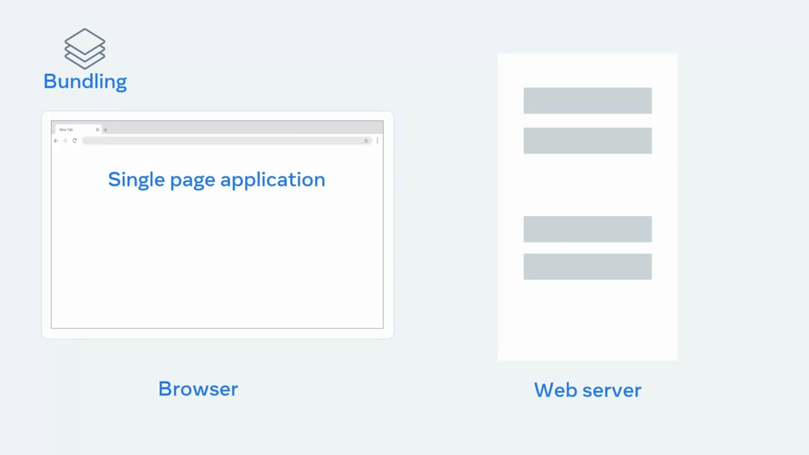
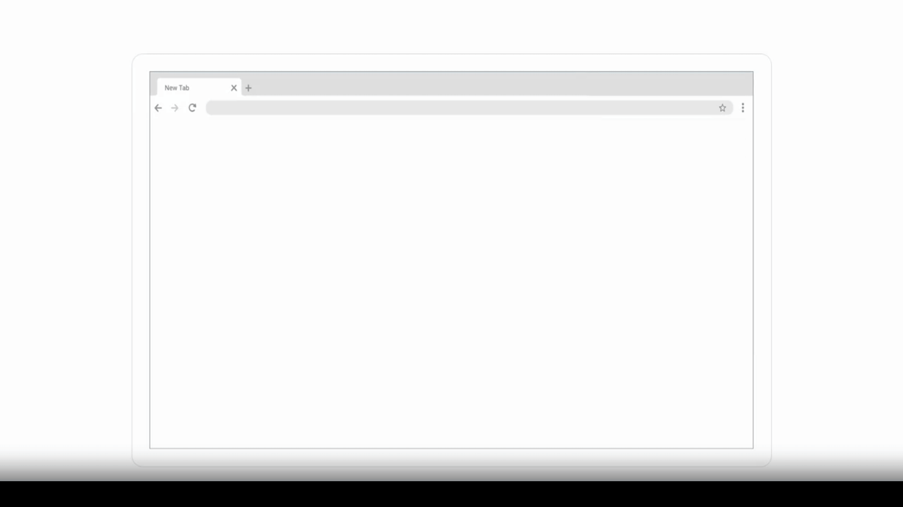
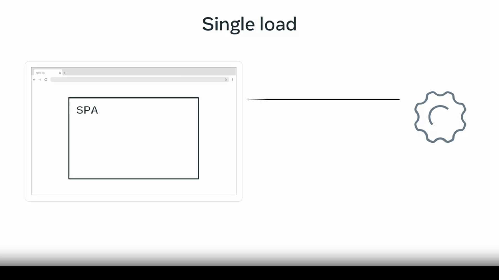

# Single page Application

## Static and dynamic content

when you open a website,
a web server sends the website's content to your browser.
The content can be static or dynamic.

### Static content

is files that the server transfers just
as they are stored on the web server,
such as videos ▶️ or images 🖼️.

### Dynamic content

on the other hand, is generated when the `HTTP` request is made.
For example, the content may be generated based on input from a user, or when you visit a news website, it would be based on the current date. What actually happens, is that the
**web server communicates with another kind of server**
called an application server or a back-end. The application server generates the dynamic content that the web server sends back to the user's browser.

examples of how websites update static and dynamic content. Say for instance, you want to watch a video on a website, you click on the Play button and a request is sent to the web server.

The web server responds by sending the file to your browser. Now, how does this compare to dynamic content? Because dynamic content is generated while you use a website, it typically takes longer to generate than it takes to send back static content.

For example, when you log in to a website, the web server communicates with an application server to check that you are in fact you have account. The application server confirms your enrollment and specifies what content should show for your profile specifically. Application servers perform more complex processing than web servers. For instance, they have to run the application logic, communicate with the database, and check permissions.

---

### Caching

_Application servers typically have
a limited capacity on
how many requests they can process per second._

---

But fortunately, this is
where the web server can help out.  
Web servers use a process called caching
instead of generating content
dynamically for every request.

> Caching means the web server
> keeps a copy of dynamic content.

If the content is requested again,
the web server can immediately send
this cached version instead of passing
the request again to the application server.

_On the first request for dynamic content,
the web server checks if the content exists in the cache._  
If it does not exist,

- **the content is requested from
  the application server and stored in the cache**.

- The web server then sends back
  the dynamic content to the browser.

**On subsequent requests**,

- the web server
  immediately sends back the content stored in the cache.

_This reduces the amount of
dynamic content that_

- the application server has to generate.

_Then, after a period of time
or with the next user interaction,_

- the web server updates the cache with the latest content.

# SPA

**How traditional website works.**
_Before the advent of modern JavaScript frameworks_,

> most websites were implemented
> as multi-page applications.

But this makes traditional
applications resource intensive to web
servers.  
because sending entire web pages
for every request consumes
excessive **_bandwidth and uses
CPU time_** to generate dynamic pages.  
_If your website is complex_,
the site browsing experience may appear slow to users.
It will be even slower if they have
a poor or limited internet connection.  
_To solve this problem_,
many web developers build their web applications as SPAs.

It's called single-page, but that doesn't
mean your website has only one page of content.  
What it means is that there is
only one HTML page
that gets sent from the server to the browser,
but that page will update its content
as your users interact with your website.  
A SPA allows the user to interact with
the website without the application
needing to download entire new web pages.  
Instead, it rewrites
the current web page as the user interacts with it.  
The result is a browsing experience that feels
faster and more responsive to user input.  
When the user navigates to
the web application in the browser,
the web server returns
the necessary resources to run the application.

A SPA has two approaches to serving code and resources.
React.js

The first is called bundling,
and the second approach is known as
lazy loading or code splitting.
With bundling, when

the browser requests the application,
the server returns and loads all necessary HTML,
CSS, and JavaScript immediately.
With lazy loading,
the browser requests
the application and the server returns
only the minimum HTML,
CSS, and JavaScript needed to load the application.
Additional resources are downloaded as required.

For example, when a user
navigates a specific section of the application,
both approaches are valid.
The choice depends on the size,
complexity, and bandwidth
requirements of the application.
For instance, with the bundling approach,
if your application is complex
and has a lot of resources,
your bundles will grow quite
large and take a long time to download.  
You could end up with a site that is
slower than a traditional web application.  
___
Let's explore an example.  
Imagine you have a site dedicated to reviewing movies,
people never know what to watch next so you decide to
install a feature that randomly
suggests the movie for a user.  
You create a web page that
has a what to watch next button.  
You want to display a random movie name
when the button is clicked.  
In a traditional website,
when the button is clicked,
the browser will send a post request to the web server.  
The web server returns
a new web page containing the button and movie name.  
The web browser then renders the new page.  
In an SPA, when the button is clicked,
the browser will send a post request to the web server.  
The web server will return a JSON object.  

The application reads the object and
updates by displaying the text of the movie name.  
That's more efficient because the rest of
the page remains as it was and it's
content does not need to be sent
by the server and rendered by the browser.

But what if you need to update the majority of
the page to display a different form of content?
Well, let's explore that scenario.  
Suppose you are building a web application
that has two pages.  
One page shows the latest news and
the other page shows the current user's profile page.  
Navigation bar at the top of
the site contains a link to each page.  
In the traditional websites,
when the user clicks a profile link,
the web browser sends the request to the web server.  
The web server generates
the entire HTML page
and sends it back to the web browser.  
The web browser then renders a new web page.  
In a single-page application,
different pages are broken into templates,
also known as views.  

Each view will have HTML code
that can be updated by the application.  
For instance, the profile page would have a username,
a first name, and a last name.  
The web browser sends the request to
the web server and the web server sends back
a file called a JavaScript Object
Notation or JSON object.  
This contains only the data to be displayed,
such as the user's first name and last name,
and the SPA will update the HTML.
This is much smaller than sending an entire web page.  
The web browser then updates the web page by inserting
the template with items
replaced by the values in the JSON object.  

For your next website,
consider whether its comrlexity suits
a traditional multi-page application
or would perform better as an SPA.  
Remember that a single-page application
has two methods of delivery resources.  
Delivering all resources immediately or
delivering resources dynamically as required.

If all resources are
delivered when the application is loaded,
the single-page application must
include the views for every page on initial load.  
If resources are loaded dynamically,
the single-page application requests the views as
required and stores views
in the browser for subsequent requests.
