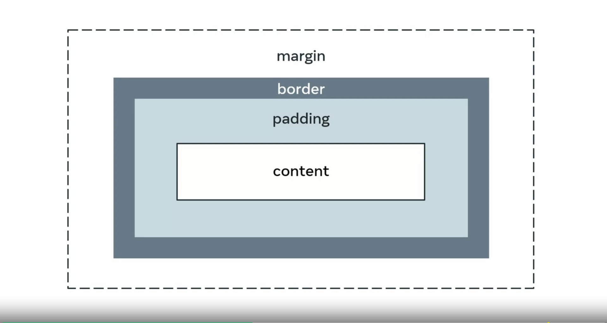
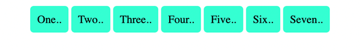
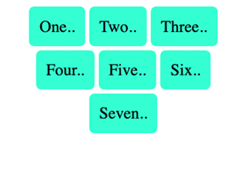
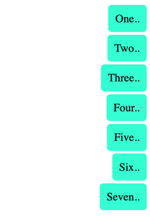
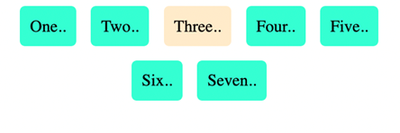

# CSS Layouts

The browser window that is visible to the user on the screen is called the view ports. 

An important property is the display property. What does it do you ask? The display property specifies the type of box that you want to use for a given html element.

box models, allocate rectangles or boxes to html elements. So CSS rules can be applied

  

The main difference between the two is that flex box is one dimensional while grid as the word implies is two dimensional. 

### Flex box

Flex box is short for flexible box model and it was introduced before the grid layout.

flex box adds responsiveness to CSS with float elements and positioning one dimensional refers to the fact that a given flex box container will arrange items in either a column or a row along its axis. The flex box container applied over an element can flex to shrink or expand.

### CSS grid

CSS grid is similar to the flex box except it creates a two dimensional grid along both the row and column axes.

the grid increases dimensionality and helps to create an advanced layout with relative ease. It can also lead to increased complications later. If the element rules are not systematically defined

CSS layouts is all about how the content of your web page is organized. Flexboxes, grids and boxes are all popular CSS layout options. Which of the following statements about CSS layouts are correct? Select all that apply.        


### Understanding flexbox

Much like the div and box container that you can create using HTML, flexbox is a type of container. Flexbox can overcome the limitations caused by containers such as block and inline because it does a better job of scaling over larger web pages and also provides more dynamic control of the containers. This is because it can grow, shrink and align the items inside it which give better control to the programmer over the contents and styling of the items inside the container. 

Before learning about the common layouts built using the flexbox, it is important to understand the properties inside it and how flexbox works. Let's examine some of the important characteristics of flexboxes and the properties that can be used to configure them.

Flexbox is single-dimensional, which means you can align it either along a row or a column and it is set to row alignment by default. There are two axes, the main and cross-axis, much like the x and y-axis used in coordinate geometry. When aligned along the row, the horizontal axis is called the main axis and the vertical axis is called the cross axis. For the items present inside the flexbox container, the placement starts from the top-left corner moving along the main or horizontal axis. When the row is filled, the items continue to the next row. Note that with the help of a property called flex-direction, you can instead flip the main axis to run vertically and the cross axis will then be horizontal. In such a case, the items will start from top left and move down along the vertical main axis. The properties you choose will help better control alignment, spacing, direction and eventually styling of the container and items present inside it. 

Let's now examine some of the important properties that will allow you to configure a flexbox.

  
### Flexbox properties

```html
<body>
  <div class="flex-container">
    <div class="box box1">  One..</div>
    <div class="box box2">  Two..</div>
    <div class="box box3">  Three..</div>
    <div class="box box4">  Four..</div>
    <div class="box box5">  Five..</div>
    <div class="box box6">  Six..</div>
    <div class="box box7">  Seven..</div>
  </div>
</body>
```
```css
.box{
    background-color: aquamarine;
    border-radius: 5px;
    margin: 2px;
    padding: 10px;
}
```
  

There are seven div containers inside the HTML file.

The corresponding CSS file contains rules for all seven div tags that have the box class. Note how two class names are given for each of the tags, one that is common among all classes and another independent of it. The style is applied to all the containers. 

Now let's add properties to the flex container by converting it into flex. 

**`display: flex;`**
```css
.flex-container{
    display: flex;
}
```

The output is now seven flex containers that run from left to right starting in the top left corner.

  

### Alignment properties

Let's examine a few alignment properties inside the flex. There are four main properties used to align a flex container and items present inside it:  

- `justify-content`. For item alignment on main axis.
- `align-items`. For item alignment on cross axis.
- `align-self`. For unique flex items on cross axis.
- `align-content`. Used for packing flex lines and control over space.

Of these, justify-content and align-items are frequently used for the respective two axes. 

Let's first examine the use of justify-content which has a value of 'left' by default.
**`justify-content`**
```css
.flex-container{
    display: flex;
    justify-content: center
}
```

  

**`flex-wrap:`**

The default for this property is `nowrap` which means the items will span the entire width of the axis. 
```css
.flex-container{
    display: flex;
    justify-content: center;
    flex-wrap: wrap;
}
```



The items will now be wrapped to the size of the available viewport.   

**`flex-direction`**

This property is used to set the main axis, which is a `row` by default. It basically means you are changing your `main` axis from horizontal rows to vertical columns. 

```css
.flex-container{
    display: flex;
    justify-content: center;
    flex-direction: column;
    flex-wrap: wrap;
}
```
  
The output looks like the original output; however, it is now actually a flex.

Now let's align the items again and examine a couple of the other properties mentioned earlier.   

**`align-items`**

The alignment on the cross-axis is done with the help of this property. Let's change the value for it to `flex-end`. 

```css
.flex-container{
    display: flex;
    justify-content: center;
    flex-direction: column;
    flex-wrap: wrap;
    align-items:flex-end;
}
```
   

The term `end` refers to the right side of the page as the left side is seen as the beginning.   

**`align-self`**

This property can be used on individual items inside the flex. 
```css
.flex-container{
    display: flex;
    justify-content: center;
    flex-direction: column;
    flex-wrap: wrap;
    align-items:flex-end;
}
.box3{
    background-color: blanchedalmond;
    align-self: center;
}
```
   

Here the color and alignment of the third box have been changed and it overrides the properties set using align-items.     

**`gap`**

gap property can be used to create space between the items along the main axis. You can also individually configure the gaps in rows and columns using row-gap and column-gap properties.   
```css
.flex-container{
    display: flex;
    justify-content: center;
    flex-direction: column;
    flex-wrap: wrap;
    align-items:flex-end;
    gap:10px;
}
.box3{
    background-color: blanchedalmond;
    align-self: center;
}
```

  

There is a clear change in spacing between the items. 
The final set of properties are flex-grow, flex-shrink and flex-basis. Together these determine how the flex takes up space, grows or shrinks according to the space available.
These are the sub-properties of a property called flex. Together all three properties can also be given values with the help of something called the shorthand notation in CSS. Shorthand notation helps you make your code compact and also easy to write and follow. The values left empty in shorthand notation are given their default values. 
```css
.flex-container{
flex: 0 1 auto;
}
```
Here for the flex-container class, there is a set rule for the flex property. The values correspond to the three properties, namely the flex-grow set to 0, flex-shrink to 1 and flex-basis to auto. The flex-basis sets the initial size of the container. and together they define the rigidity or flexibility and dynamism you want to add to the flexbox. 

To demonstrate the effect of this, the code has to be modified slightly by removing the flex-direction value set to `column`. This will change it to default `row` and the output will again be centrally aligned and horizontal best-distributed between two rows. 

  

The rest of the remaining code is unchanged. However, the output will change if the code is modified with the addition of the flex property inside the flex item box3 class. 
```css
.box3{
    background-color: blanchedalmond;
    align-self: center;
    flex: 1 1 auto;
}
```

  

The third box now takes up the entire free space available because flex-growth's value has been set to 1. So if we have `flex-grow` set to 1, the children will all set to equal size. And if one of the children has a value of 1.5, that child would take up more space as compared to the others.

It's important to understand how the changes in the main and cross axis affect the way you imagine and manipulate the flexbox. Once you've had more practice you'll be more comfortable with the use of these properties, and it will become easier to use flexboxes and understand the flow and alignment of items inside the flexbox. 


##### CSS units of measurement

A web page, as you know it, is two-dimensional. In other words, it has width and height. There are a number of other ways you can express this such as vertical and horizontal, length and breadth, x and y axis and so on. Another property of a web page is its size which can either be static or dynamic. When you've encountered enough CSS code, you will note a number of different ways in which the values for the same property can be declared using different units of measurement. Most of these units of measurement are used to account for the dynamism and dimensionality of a web page. 

Let's examine the most widely used units of measurement. They can broadly be categorized as Absolute and Relative units. 

##### Absolute units

Absolute units are constant across different devices and have a fixed size. They are useful for activities like printing a page. They are not so suitable when it comes to the wide variety of devices in use today that have different viewport sizes. Because of this, absolute units are used when the size of the web page is known and will remain constant. 

The table for absolute units can be seen below:

| Unit | Name                | Comparison               |
|------|---------------------|--------------------------|
| Q    | Quarter-millimeters | 1Q = 1/40th of 1cm       |
| mm   | Millimeters         | 1mm = 1/10th of 1cm      |
| cm   | Centimeters         | 1cm = 37.8px = 25.2/64in |
| in   | Inches              | 1in = 2.54cm = 96px      |
| pc   | Picas               | 1pc = 1/6th of 1in       |
| pt   | Points              | 1pt = 1/72nd of 1in      |
| px   | Pixels              | 1px = 1/96th of 1in      |


Of these, the pixels and centimeters are most frequently used for defining properties. 
Relative values

When you create a web page, you will almost never have only a single element present inside it. Even in case of containers such as flexboxes and grids, there’s usually more than one element present that rules are applied to. Relative values are defined ‘in relation’ to the other elements present inside the parent element. Additionally, they are defined ‘in relation’ to the viewport or the size of the visible web page. Given the dynamic nature of web pages today and the variable size of devices in use, relative units are the go-to option in many cases. Below is a list of some of the important relative units. 

| Unit | Description and relativity                                                  |
|------|-----------------------------------------------------------------------------|
| em   | Font size of the parent where present.                                      |
| ex   | x-co-ordinate or height of the font element.                                |
| ch   | Width of the font character.                                                |
| rem  | Font size of the root element.                                              |
| lh   | Value computed for line height of parent element.&nbsp;                     |
| rlh  | Value computed for line height of root element which is &lt;html&gt;.&nbsp; |
| vw   | 1% of the viewport width.                                                   |
| vh   | 1% of the viewport height.                                                  |
| vmin | 1% of the smaller dimension of viewport.                                    |
| vmax | 1% of the larger dimension of viewport.                                     |
| %    | Denotes a percentage value in relation to its parent element.&nbsp;         |

Many of these units are used in terms of the relative size of fonts. Some units are more suitable depending on the relative context. Like when the dimensions of the viewport are important, it's more appropriate to use vw and vh. In a broader context, the relative units you will see most frequently used are percentage, em, vh, vw and rem. 

Much like the absolute and relative units discussed above, certain properties have their own set of acceptable values that need to be taken into account. For example, color-based properties such as `backgroundcolor` will have values such as `hexadecimal`, `rgb()`, `rgba()`, `hsl()`, `hsla()` and so on. Each property should be explored on an individual basis and practicing with the code will help you to decide which of these units of measurement are the most suitable choice. 