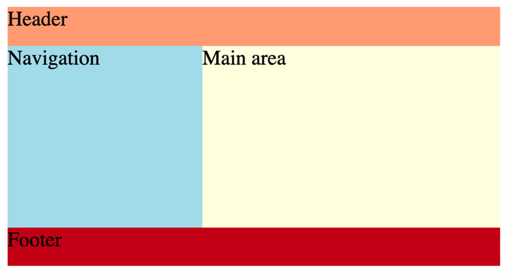
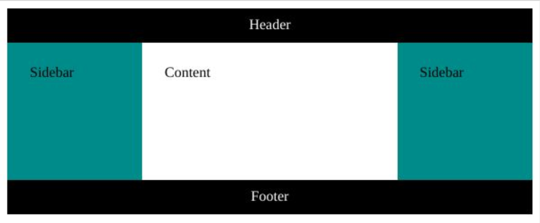

# Grids and flexbox cheat sheet

## Grid

The syntax for creating a grid:
```css
selector{
    display: grid; /* or inline-grid */
}
```
**Grid shorthand consists of the following properties with default values:**

- `grid`
  - A grid will allow you organize the various elements on your page.

- `grid-template-rows: none`
  - This feature allows you configure your elements so that they are organized similarly to rows on a table.
- `grid-template-columns: none`
  - This feature allows you configure your elements but with this setting the elements are organized like columns on a table.
- `grid-template-areas: none`
  - This feature allows you configure the names of a grid and how they sit in relation to one another.
- `grid-auto-rows: auto`
  - Default setting for all row sizes that have not been explicitly configured.
- `grid-auto-columns: auto`
  - Default setting for all column sizes that have not been explicitly configured.
- `grid-auto-flow: row`
  - Default location for rows that are not explicitly allocated.
- `column-gap: normal`
  - This sets the gap between the columns
- `row-gap: normal`
  - This sets the gap between the rows

### Grid properties for container

- `grid-template-columns: measurement units | % units |repeat()`
  - Defines the line names, and maintains a constant size of column items. Can accept a range of different measurement sizes.
- `grid-template-rows: measurement units | % units |repeat()`
  - Defines the line names, and maintains a constant size of rows. Can accept a range of different measurement sizes.
- `grid-auto-columns: measurement unit (fixed value for all columns)`
  - Determines the default size for columns that have not been explicitly configured.
- `grid-auto-rows: measurement unit (fixed value for all rows)`
  - Determines the default size for rows that have not been explicitly configured.
- `grid-template: “header header” auto`
  - This allows you define and maintain named cells on a grid
- `“main right” 75vh`
  - This defines two cells named main and right, that have a sizing of 75% of the viewport height.
- `“footer footer” 20rem`
  - This defines two cells named footer and footer, that have a sizing of 20 root em (rem). This defines the size in relation to the html font size.

### Gap

- `grid-gap: measurement units`
  - Determines the gap between rows and columns
- `grid-column-gap: measurement units`
  - Determines the gap between columns
- `grid-row-gap: m-unit-1  m-unit-2`
  - Determines the gap between columns

### Alignment
- `justify-items: start | center | end | stretch`
  - Defines the default space that is allot to each item on the grid
- `align-items: start | center | end | stretch`
  - Defines the default space related to an item along the grid’s block axis
- `place-items: start | stretch /* shorthand for two properties above */`
  - This feature allows you align items with  the block and inline directions.

### Justification

- `justify-content: start | center | end | stretch | space-between | space-evenly | space-around`
  - Defines browser allocation of space to content items in relation to the main-axis
- `align-content: start | center | end | stretch | space-between | space-evenly | space-around`
  - Defines browser allocation of space to content items in relation to cross axis and block axis
- `place-content: center | start`
  - This feature allows you align items with  the block and inline directions.

### Positioning

- `grid-auto-flow: row | column | dense`
  - This relates to how the items are placed automatically within the grid
- `grid-auto-columns: measurement units`
  - This relates to the size for columns created without specific size specifications
- `grid-auto-rows: measurement units`
  - This relates to the size for rows created without specific size specifications

### Grid properties for items (child)

- `grid-column: column position /* E.g. 1/2  */`
  - Allows for specifying where on the grid the column is to start.
- `grid-column-start: column start position`
  - This property determines the starting column position an item is placed on a grid.
- `grid-column-end: column end position`
  - This property determines the end column position an item is placed on a grid.
- `grid-row: row position /* E.g. 1/2  */`
  - Allows for specifying where on the grid the row is to start.
- `grid-row-start: row start position`
  - This property determines the starting row position an item is placed on a grid.
- `grid-row-end: row end position`
  - This property determines the end row position an item is placed on a grid.

### Justification and alignment

- `justify-self: start | center | end | stretch`
  - Determines how  an item is positioned inside its aligned container in relation to the appropriate axis.
- `align-self: start | center | end | stretch`
  - Aligns an item within a grid area.
- `place-self: start | stretch /* shorthand for two properties above */`
  - This setting lets one align and justify an item within a block.

## Flexbox

The syntax for creating a flexbox:
```css
selector{
    display: flex | inline-flex
}
```

Here the selector can refer to any of the following flex attributes

- Attribute selector
- Class Selector
- ID Selector
- Type Selectors
- Universal Selectors

The display relates to how you want the selector to be shown. Setting display to flex makes the given selector a flex box. Setting display to inline-flex makes the selector a flex box container while will be inline.

### Properties for flexbox container

`flex-direction: row | row-reverse | column | column-reverse`

It is possible to specify the direction your elements will follow. Traditionally text goes from left to right which is flex’s default setting however it can be set from right to left or even top to bottom. The four flex-direction are:

- row : organized from left to right
- row-reverse: organized from right to left
- column: organized from top to bottom
- column-reverse: organized from bottom to top.

`flex-wrap: wrap | nowrap`

The standard layout is to plot the elements from left to right in a straight line. The wrap feature allows you customize this to match the size of the window displaying the page.

- wrap: Automatically wrap the items with as the window space gets smaller.
- Nowrap: Default setting, items remain rigid and don’t respond to adjustments made to the window size.

`align-items: flex-start | flex-end | center |Stretch`

This determines how the flex items are to be positioned on the page. Items can be aligned in a variety of ways

- Flex-start: Similar to standard writing, items start at the top left-hand corner and are positioned from left to right
- Flex-end: Position begins in the bottom right hand corner.
- Center: Item is positioned from the center.
- Stretch: item expands to fill the container.

`justify-content: flex-start | flex-end | center | space-between | space-evenly`

Justify-content determines the alignment of the flex items.

- Flex-start: goes from right to left along the main axis.
- Flex-end: goes from left to right along the main axis.
- Center: Starting at the middle, alignments expands from there.
- Space-between: first and last item are flush with the left and right wall respectively, every other item is evenly spaced.
- Space-evenly: each item is equidistant from each other and the boundary wall

### Properties for flexbox items (child)

`flex-grow: factor of flex’s main size`

This attribute enables the flex container to grow proportionally to the other containers present.

`flex-shrink: factor of flex’s main size`

This allows elements to shrink in relation to items around it.

`flex-basis: auto | factor of main’s size | measurement unit`

The sets the initial main size of an item. It can be overridden if other stylized elements are configured.

`order:position in flex /* Set ascending by default */`

The standard positioning of items is by source order, however this feature will enable you to configure where the items appear on the page.

`align-self:  start | center | end | stretch`

This determines where on the page the child items will be positioned. Similar to the main flex attributes, start is to the left and end is to the right.


Grid areas are a way to group one or more grid cells. The grid template area is an extension of this concept where you can give names to these grid areas. Once you have the names defined, you can address these new grid area items by their names and configure them accordingly.

The property grid-template-areas is usually placed inside the body tag or any container where the grid needs to be placed, the same way that you would define the rules for the grid. The main difference is, in case of grid-template-areas the values present will be the different names.

### Grid template area

##### Process

The process isn’t prescriptive but these are the steps in general:

- Define the grid using display property
- Set the height and width of the grid
- Set the grid-template-areas with the appropriate name identifiers
- Add the appropriate sizes for the rows inside the grid using grid-template-rows property
- Add the appropriate sizes for the columns inside the grid using grid-template-columns property

But how exactly do you use these names and where do they come from? The names that you use inside the grid template areas are the HTML tags that you have used. Or, where you need to get more specific, you designate a class name to these tags. Once the names are assigned, you define the properties for each class the same way that you define them conventionally. Let's examine an example. Example:

```html
<head> 
    <link rel="stylesheet" href="gridta.css"> 
</head> 
<body> 
    <header> Header </header> 
    <nav class="nav-bar"> Navigation </nav> 
    <main> Main area </main> 
    <footer> Footer </footer> 
</body>
```
```css
body { 
    display: grid; 
    height: 200px; 
    grid-template-areas: "head head" 
                         "nav  main" 
                         "footer  footer"; 
    grid-template-rows: 30px 1fr 30px; 
    grid-template-columns: 150px 1fr; 
  } 
  header { 
    grid-area: head; 
    background-color: lightsalmon; 
  } 
  .nav-bar { 
    grid-area: nav; 
    background-color: lightblue; 
  } 
  main { 
    grid-area: main; 
    background-color: lightyellow; 
  } 
   footer { 
    grid-area: footer; 
    background-color: firebrick; 
  }
```

  

Though there are five sets of rules, logically the CSS code is divided into two sections. The first is where you define the rules for the grid inside the body selector. And second is where you allocate specific rules for the different grid areas. The way these grid areas are distributed is according to how you have defined the names inside the grid-template-areas property. In the example above the relevant code is:

```css
grid-template-areas: "head head"
                         "nav  main"
                         "footer  footer";
```

The ‘head’ is written twice to imply two columns and the rest of the content follows the usual convention. The number of rows will be the number of ‘pairs of quotes’ you have used which in this case is three. Namely  “head head”, “nav main” and “footer footer”. Once you know the number of rows and columns, the values for those will be set by grid-template-rows and grid-template-columns. Since these are three and two respectively here, you need to add that many values. The height simply gives the overall value of the height for the grid.

Note that the number of times you wrote “header” did not have to be two. You could write more of those and if you align the rest of the grid-names correctly, the height and width of the grid-areas will be distributed proportionately.

Let’s return to the example. If you keep all other properties the same but you change the grid-template-areas as follows:

```css
grid-template-areas: "head head head"
                         "nav  main main"
                         "footer  footer footer";
```

The output will remain the same as you have fixed the value of the third row to “30px”. The example is simple for the sake of clarity, but if you had used relative values, you would’ve seen an observable change in the comparable sizes of nav and main grid-areas.

Grid-areas are convenient when you have a clear schematic of what you want in a grid. It’s also easier to configure individual areas if you can address them by their names. Let’s say you are designing a resume on your website, you will be able to name the different areas such as ‘Bio’, ‘Education’, ‘Work experience’ and so on. And it’s easier to use these labels when you are defining the rules. Creating a block diagram using pen and paper before starting to work on a grid is always a good idea.

```html
<body>
    <div class="container">
        <header class="header"> Header </header>
        <main class="main"> Content </main>
        <div class="sidebar left"> Sidebar </div>
        <div class="sidebar right"> Sidebar </div>
        <footer class="footer"> Footer </footer>
    </div>
</body>
```

```css
.container {
  display: grid;
  max-width: 900px;
  min-height: 50vh;
  grid-template-columns: 100%;
  grid-template-rows: auto auto 1fr auto auto;
  grid-template-areas: "header" "left" "main" "right" "footer";
}
@media (min-width: 440px) {
  .container {
    grid-template-columns: 150px 1fr 150px;
    grid-template-rows: auto 1fr auto;
    grid-template-areas: "header header header" "left main right" "footer footer footer";
  }
}
.header {
  grid-area: header;
  padding: 10px;
  background-color: black;
  color: #fff;
  text-align: center;
}
.main {
  grid-area: main;
  padding: 25px;
}
.left {
  grid-area: left;
  background-color: peachpuff;
}
.right {
  grid-area: right;
}
.footer {
  grid-area: footer;
  padding: 10px;
  background-color: black;
  color: #fff;
  text-align: center;
}
.sidebar {
  padding: 25px;
  background-color: darkcyan;
}
```

  

- The grid template areas are defined as "header" "left" "main" "right" "footer" but for a small device with a screen width of 440px or less, it is defined as "header header header" "left main right" "footer footer footer" using a media query.
- The grid-rows property value also changes based on the media query.
- The values for the number of rows you add for grid-template-rows and number of columns you add for grid-template-columns must match the dimensions of the grid-template-areas.  
- grid-area that has undefined rules will appear empty. (Does not happen with the example above.)
- Each CSS rule specifies which grid area they belong to by using the grid-area CSS property.
- The selectors of each rule used are element tags in HTML or classes, as we have used here. 