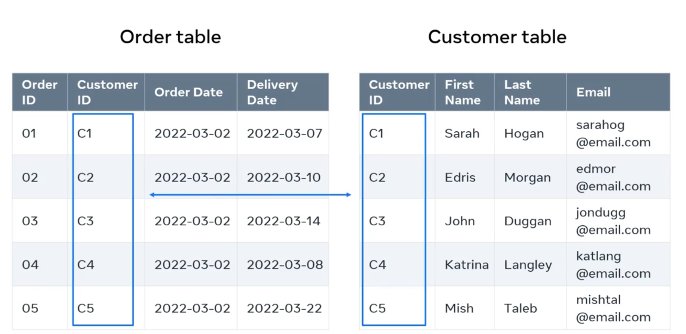
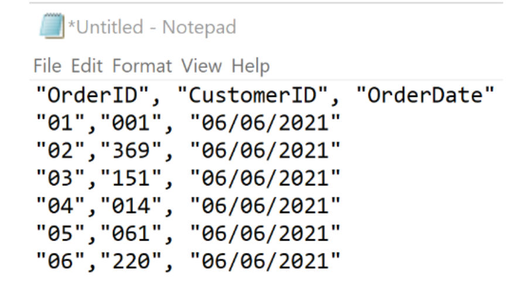
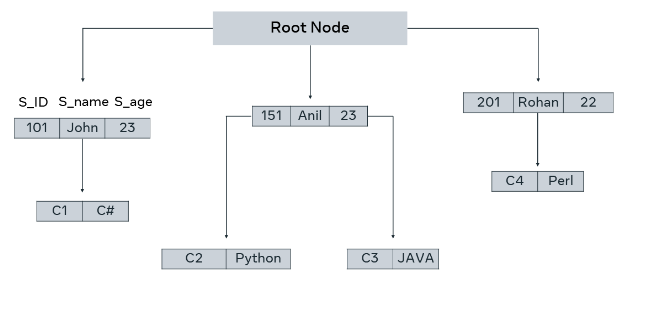
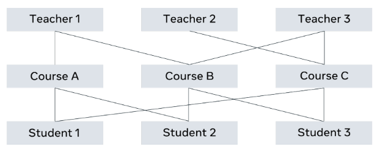
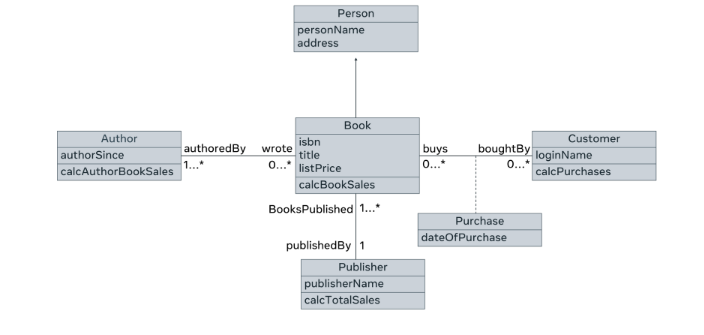
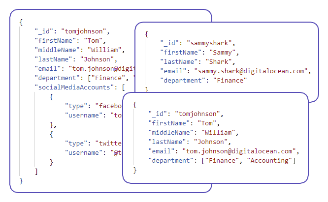
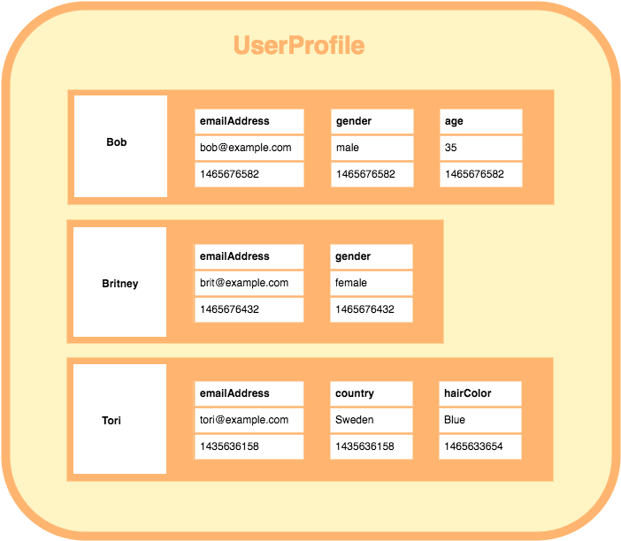
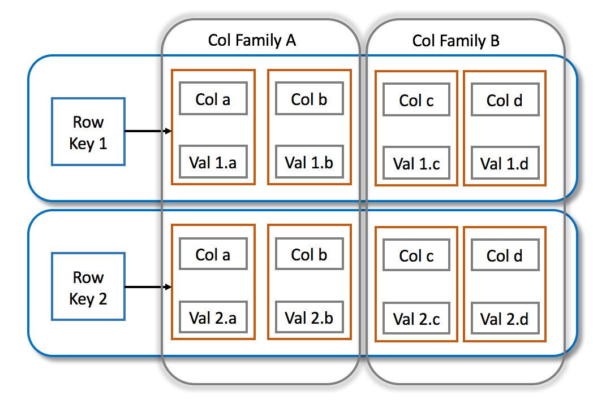
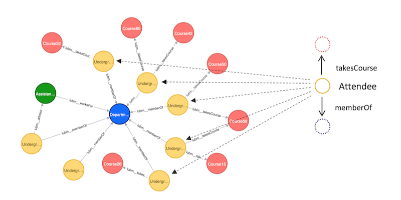

# Introduction to Databases

### 1. What is a Database?

- **Data**: Raw facts and figures (e.g., name, age, order ID, product quantity). Essential for individuals and organizations.
- **Database**: An **electronic, systematically organized storage** for data. It manages, stores, and manipulates data efficiently and securely.
  - Looks like a spreadsheet or **tables**.
  - Data is organized into **entities**, which are like tables.
  - **Entities (Tables)** contain **rows** (records) and **columns** (fields/attributes).
  - **Core Database Actions**: Store, connect/relate, filter, search, update, change, delete data.

### 2. How Data is Related: Relational Concepts

- **Relational Database**: Organizes data into **tables** (also called relations), where data points are related to each other.
  - Each **row** in a table is a **record** (an instance of the entity).
  - Each **column** is a **field** or **attribute**.
- **Primary Key (PK)**: A field in a table that contains **unique values** for each record. It uniquely identifies each row in its _own_ table.
  - **Fact**: Cannot be null or duplicated within the table.
  - **Example**: `Customer ID` in a `Customer` table.
- **Foreign Key (FK)**: A field in one table that **references the Primary Key of another table**. It establishes a **relationship** between two tables.
  - **Fact**: A Foreign Key doesn't have to be unique in its own table. It can contain null values (unless constrained otherwise).
  - **Example**: `Customer ID` in an `Order` table (referencing `Customer ID` in the `Customer` table) links an order to a specific customer.
  - **Diagram**:

```
Customer Table:               Order Table:
+------------+----------+     +----------+------------+------------+
| CustomerID (PK) | Name |     | OrderID (PK) | CustomerID (FK) | OrderDate |
+------------+----------+     +----------+------------+------------+
| 1          | Alice    |     | 101      | 1          | 2025-01-15 |
| 2          | Bob      |     | 102      | 1          | 2025-01-20 |
+------------+----------+     | 103      | 2          | 2025-01-22 |
                                +----------+------------+------------+
```



- **ACID Properties of Transactions** (in Relational Databases): Ensure data reliability.
  - **Atomicity**: All or nothing. (e.g., bank transfer: either both withdrawal and deposit succeed, or neither does).
  - **Consistency**: Data remains valid; transactions bring database from one valid state to another.
  - **Isolation**: Concurrent transactions don't interfere with each other; they appear to run sequentially.
  - **Durability**: Once a transaction is committed, changes are permanent, even if the system fails.

### 3. Database Evolution (History & Types)

- **1960s**: Computerization of databases begins.
- **1970s-1990s**:

  - **Flat Files**: Data in a single file/table, typically text, with fields separated by delimiters (e.g., CSV). Simple, but limited to one table.  
    

  - **Code Concept**: Each line is a record, `field1,field2,field3`.

  - **Hierarchical Databases**: Data arranged in a tree-like, one-to-many relationship (parent can have many children, child has one parent).

  

  - **Network Databases**: More complex, graph-like structure allowing many-to-many relationships (child can have multiple parents). Introduced by Charles Bachmann.

  

  - **Language**: `SEQUEL` query language used, predecessor to SQL.

- **1980s-Present**:
  - **Relational Databases (RDBMS)**: Invented by E. F. Codd. Data stored in tables with columns (attributes) and rows (records). Most widely used.
    - **SQL (Structured Query Language)**: Became the standard query language for RDBMS (ANSI standard).
- **1990s-Present**:

  - **Object-Oriented Databases (OODBMS)**: Represent data as objects, aligning with OO programming languages (Java, C++). Support inheritance.

  

  - **NoSQL Databases**: Emerged for **unstructured/semi-structured data**, web applications, and big data. Offer higher scalability, flexibility (flexible schema), distributed nature, and lower costs.

    - **NoSQL Types**:
      - **Key-Value Store**: Simple dictionary-like `(key: value)` pairs. Good for caching, session data. (e.g., Redis, Memcached).

    

    - **Document Store**: Stores data as flexible "documents" (e.g., JSON, XML, BSON). Good for content management, user profiles. (e.g., MongoDB).
      
    - **Wide-Column Store**: Stores data in column families. Efficient for sparse datasets and massive amounts of data across clusters. (e.g., Apache HBase, Apache Cassandra).  
      
      
    - **Graph Store**: Stores data as **nodes** (entities) and **edges** (relationships) with properties. Ideal for complex relationships/networks. (e.g., Neo4j).
      
      ]

### 4. Database Management Systems (DBMS)

- **DBMS**: Software application used for managing databases (creating, updating, inserting, deleting data).
- **RDBMS (Relational DBMS)**: A specific type of DBMS designed for relational databases.
- **DBMS Features**: Data structure, multi-user access, privilege control, network access, data security, backup, import/export, handling concurrent requests.
- **Key Fact**: We **cannot interact with non-relational databases using SQL**. SQL is specifically for RDBMS.

### 5. SQL (Structured Query Language)

- **SQL**: Standardized language for **interacting with RDBMS (relational databases)**.
- **CRUD Operations**: The core operations performed with SQL:
  - **C**reate
  - **R**ead (Retrieve)
  - **U**pdate
  - **D**elete
- **How it Works**: A DBMS interprets SQL instructions and transforms them for the underlying database.
- **Examples of Popular RDBMS**: MySQL, Oracle, MariaDB, PostgreSQL.
- **Query**: A set of instructions given to the DBMS to retrieve, insert, update, or delete data.

### 6. SQL Subsets (Types of SQL Commands)

SQL commands are categorized into different subsets based on their purpose:

- **DQL (Data Query Language)**: Used to **fetch/retrieve data**.
  - **Command**: `SELECT`
  - **Concept**: Ask the database for specific information.
    ```sql
    SELECT first_name, last_name FROM Student WHERE ID = 01;
    -- or select all
    SELECT * FROM Student;
    ```
- **DDL (Data Definition Language)**: Used to **define/manage database schema/structure**.

  - **Commands**:

    - `CREATE`: Create databases, tables, etc.
      - **Code Example**:
      ```sql
      CREATE DATABASE MyDatabase;
      CREATE TABLE Students (ID INT, Name VARCHAR(255));
      ```
    - `ALTER`: Modify existing database objects (e.g., add/remove/modify columns in a table).

      - **Code Example**:

      ```sql
      ALTER TABLE Students ADD Age INT;
      ```

    - `DROP`: Delete database objects (e.g., tables).
      - **Code Example**:
      ```sql
      DROP TABLE Students;
      -- to drop a column
      ALTER TABLE Students DROP COLUMN Age;
      ```
      - **Syntax to add a primary key**:
      ```sql
      ALTER TABLE table_name ADD primary key (column_name);
      ```
    - `TRUNCATE`: To remove all records from a table, which will empty the table but not delete the table itself.
      - **code Example**
      ```sql
        TRUNCATE TABLE Students;
      ```

- **DML (Data Manipulation Language)**: Used to **manipulate data within tables**. (Most CRUD operations).
  - **Commands**:
    - `INSERT`: Add new rows/records into a table.
      - **Code Example**:
      ```sql
      INSERT INTO Students (ID, Name) VALUES (1, 'Alice');
      ```
      - **Multible rows**
      ```sql
      INSERT INTO Students (ID, Name) VALUES (1, 'Alice'), (2, 'Bob');
      ```
    - `UPDATE`: Modify existing data in rows.
      - **Code Example**:
      ```sql
      UPDATE Students SET Age = 20 WHERE ID = 1;
      ```
    - `DELETE`: Remove existing rows/records from a table.
      - **Code Example**:
      ```sql
      DELETE FROM Students WHERE ID = 1;
      ```
      - **Common operation**
        - distinct from DELETE (without WHERE).
- **DCL (Data Control Language)**: Used for **user & permission management** (controlling access).
  - **Commands**:
    - `GRANT`: Give users access privileges.
    - `REVOKE`: Remove users' access privileges.
- **TCL (Transaction Control Language)**: Used for **transaction management** (ensuring ACID properties).
  - **Commands**:
    - `COMMIT`: Save changes permanently.
    - `ROLLBACK`: Undo changes.
