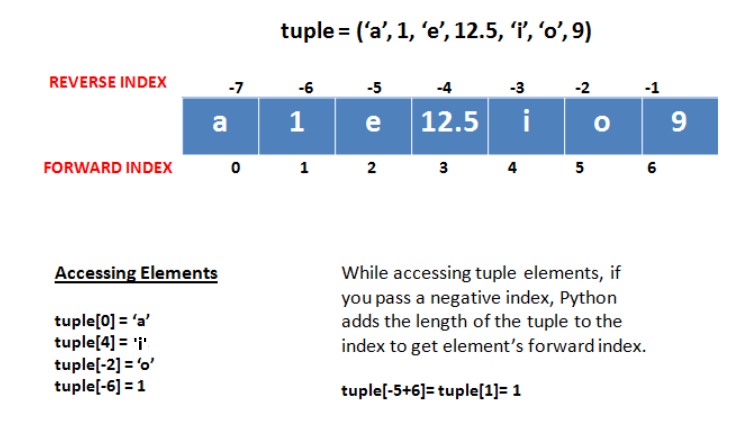
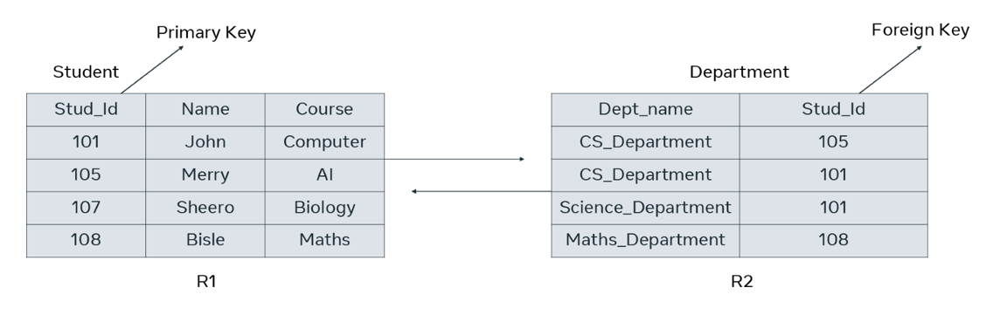
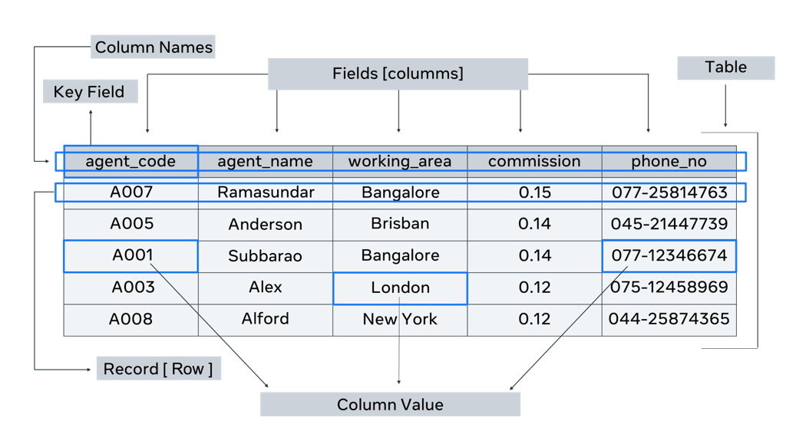
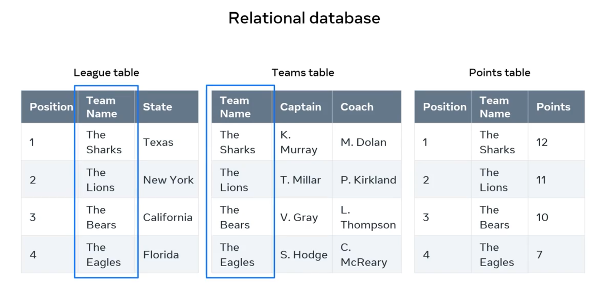

## Database Fundamentals: Tables, Structure & Keys

This section covers the core building blocks of databases, focusing on relational database principles.

### 1. What are Tables (Entities / Relations)?

- **Concept**: A table is the fundamental object in a relational database for storing data. It systematically organizes data.
- **Synonyms**:
  - In a **conceptual/logical sense**, a table is also called an **Entity**.
  - In **relational database terminology**, a table is often referred to as a **Relation**.
  - In **Object-Oriented Databases (OO-DB)**, a table conceptually maps to an **Object** or **Class**.
- **Structure**: Like a spreadsheet, tables consist of rows and columns.
  - **Columns**: Also called **Fields** or **Attributes**.
    - Run vertically.
    - Each column has a **unique name** (e.g., `ID`, `Name`, `Role`).
    - Describes a specific characteristic or attribute of the entity.
  - **Rows**: Also called **Records** or **Tuples**.
    - Run horizontally.
    - A single row represents a **complete instance** of the entity (e.g., one employee record, one student record).
    - A record is a combination of data from multiple columns.
  - **Cell**: The intersection of a row and a column, where a single item of data is stored.

### 2. Data Types & Domains

- **Data Type**: Every column has a data type, which defines the **type of value** it can hold (e.g., numbers, text, dates).
  - Determines how SQL interacts with the data and how it's stored physically.
  - **Developer's Responsibility**: Crucial for developers to assign appropriate data types.
  - **Database System Dependent**: Data types can vary between different DBMS (e.g., MySQL, SQL Server). Always consult specific documentation.
  - **General Categories (Supported by most DBMS)**:
    - **Numeric**: For whole (`INT`, `TINYINT`, `BIGINT`) or approximate numbers (`FLOAT`, `REAL`, `DECIMAL`/`NUMERIC` for exact decimals).
    - **String/Character**: For text (`CHAR`, `VARCHAR`).
    - **Date and Time**: For dates (`DATE`), times (`TIME`), or both (`DATETIME`, `TIMESTAMP`).
    - **Binary**: For storing raw binary data like images, files (`BINARY`, `VARBINARY`, `BLOB`, `CLOB`).
      - `BLOB` (Binary Large Object): For large binary data (images, audio, video).
      - `CLOB` (Character Large Object): For large blocks of text.
    - **Miscellaneous/Other**: (e.g., `BOOLEAN` for true/false).
- **Domain**: The **set of legal values** that can be assigned to an attribute (column).
  - Ensures values are well-defined and adhere to specific rules (e.g., only numbers in a numeric domain, contact number not exceeding 10 digits).
  - Includes defining value lengths and other relevant rules.

### 3. Keys in Database Tables (Crucial for Relationships & Uniqueness)

Keys are attributes (columns) or sets of attributes used to uniquely identify records and establish relationships between tables.

> In mathematics, a tuple is an ordered sequence of values. The values can be repeated, but their number is always finite. A tuple is often represented by a comma-delimited list whose values are enclosed in parentheses, although they're sometimes enclosed in square brackets.

- **Primary Key (PK)**:
  - A column (or set of columns) that **uniquely identifies each row (tuple)** in its _own_ table.
  - **Properties**:
    - Must contain **unique values** (no duplicates).
    - Cannot contain `NULL` values (i.e., it must always have a value).
  - **Purpose**: Essential for referencing individual records within a table.
  - **Example**: `Student_ID` in a `Student` table.
- **Composite Primary Key**:
  - A primary key that consists of **two or more columns combined** to uniquely identify a record.
  - Used when a single column alone cannot guarantee uniqueness.
  - **Example**: `(EMP_ID, DEPT_ID)` if neither `EMP_ID` nor `DEPT_ID` is unique on its own, but their combination is.
    
- **Candidate Key**:
  - Any attribute (or set of attributes) that contains **unique values** for each row in a table.
  - A table can have multiple candidate keys.
  - **Properties**: Must be unique and minimal (cannot remove any column from it and still have uniqueness).
  - **Relationship to PK**: One candidate key is chosen to be the **Primary Key**.
  - **Example**: In a `Staff` table, both `Staff_ID` and `Contact_Number` might be candidate keys if both are unique.
- **Alternate Key (Secondary Key)**:
  - A **candidate key that was _not_ chosen** to be the primary key.
  - Still possesses the uniqueness property.
  - **Example**: If `Staff_ID` is the PK, then `Contact_Number` (if unique) would be an alternate key.
- **Foreign Key (FK)**:
  - An attribute (or set of attributes) in one table that **references the Primary Key of another table**.
  - Establishes **relationships** (links) between tables.
  - **Purpose**: Allows you to connect related data across different tables (e.g., connect an order to a customer).
  - **Example**: `Stud_id` in a `Department` table referring to `Stud_id` (PK) in the `Student` table.
    

### 4. Database Structure Overview

- **Database Structure**: How data is arranged and organized within a database.
- **Key Components**:

  - **Tables (Entities)**: Where data is stored.
  - **Attributes (Fields / Columns)**: Details describing the table/entity.
  - **Records (Rows / Tuples)**: One complete set of details for an entity instance.
  - **Keys (Primary, Foreign)**: For unique identification and establishing relationships.
  - **Column Value / Data Element**: Each individual piece of data in a cell.

  

#### Logical Database Structure (Conceptual Design)

- **Representation**: Typically represented visually using an **Entity-Relationship Diagram (ERD)**.
  

- **Purpose**: Shows how entities (tables) are related to each other conceptually, before physical implementation.
- **Relationships (Cardinality)**: Describes how instances of entities relate:
  - **One-to-One (1:1)**: One instance of entity A relates to one instance of entity B.
  - **One-to-Many (1:M)**: One instance of entity A relates to many instances of entity B.
  - **Many-to-Many (M:N)**: Many instances of entity A relate to many instances of entity B. (Often resolved into two 1:M relationships with an intermediary table in physical design).

#### Physical Database Structure (Implementation)

- **Implementation**: Entities from the logical design are built as actual tables in a DBMS (e.g., MySQL, Oracle).
- **Relationships are Established using Foreign Keys**: A Foreign Key in one table links to the Primary Key in another table, creating the physical connection between related data.
  

### 5. Integrity Constraints (Rules for Data Quality)

Rules that ensure the accuracy, consistency, and reliability of data in a database.

- **Key Constraints**:
  - Ensures that every table has a column (or columns) that can uniquely identify each row (i.e., a primary key).
  - The primary key must be `UNIQUE` and `NOT NULL`.
- **Domain Constraints**:
  - Define the rules for the **allowed values** that can be stored in a specific column.
  - Ensures data type compatibility and adherence to specific value formats (e.g., an age column only accepts positive integers).
- **Referential Integrity Constraints**:
  - Applies when tables are linked via foreign keys.
  - States that if a foreign key column in one table references a primary key in another table, then the value in the foreign key column **must exist** as a primary key value in the referenced table, or it must be `NULL` (if allowed).
  - **Purpose**: Prevents "orphan" records and maintains valid relationships.
