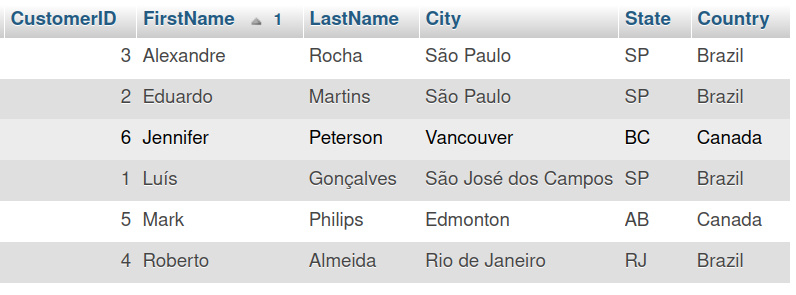
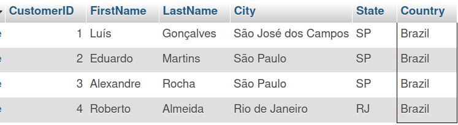
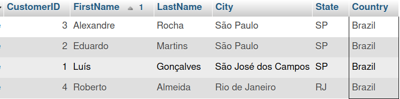
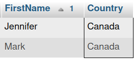

# **ORDER BY and WHERE**

**The chinook database example**

This exercise relies on the well-known “chinook sample” database, which is widely used for demos and testing purposes. It has been implemented on the Coursera platform as well and it’s a good idea for you to familiarize yourself with it since you’re going to use it to complete this exercise. The chinook sample database consists of the following database schema.


### Before you start

To complete this exercise you need to do the following steps first to setup the Chinook database and create the Customer table.

1. Create the chinook database and use it in MySQL terminal.

```sql
CREATE DATABASE Chinook;

```

2. Create Customer table as follows (Copy and paste the code in the terminal)

```sql
CREATE TABLE Customer (
CustomerId INT NOT NULL,
FirstName VARCHAR(40) NOT NULL,
LastName VARCHAR(20) NOT NULL,
Company VARCHAR(80),
Address VARCHAR(70),
City VARCHAR(40),
State VARCHAR(40),
Country VARCHAR(40),
PostalCode VARCHAR(10),
Phone VARCHAR(24),
Fax VARCHAR(24),
Email VARCHAR(60) NOT NULL,
SupportRepId INT,
CONSTRAINT PK_Customer PRIMARY KEY  (CustomerId)
);
```

3. Insert the following records of data into the Customer table (Copy & Paste code in the terminal)

```sql
INSERT INTO Customer (CustomerId, FirstName, LastName, Company, Address, City, State, Country, PostalCode, Phone, Fax, Email, SupportRepId) VALUES (1, 'Luís', 'Gonçalves', 'Embraer - Empresa Brasileira de Aeronáutica S.A.', 'Av. Brigadeiro Faria Lima, 2170', 'São José dos Campos', 'SP', 'Brazil', '12227-000', '+55 (12) 3923-5555', '+55 (12) 3923-5566', 'luisg@embraer.com.br', 3);
INSERT INTO Customer (CustomerId, FirstName, LastName, Company, Address, City, State, Country, PostalCode, Phone, Fax, Email, SupportRepId) VALUES (2, 'Eduardo', 'Martins', 'Woodstock Discos', 'Rua Dr. Falcão Filho, 155', 'São Paulo', 'SP', 'Brazil', '01007-010', '+55 (11) 3033-5446', '+55 (11) 3033-4564', 'eduardo@woodstock.com.br', 4);

INSERT INTO Customer (CustomerId, FirstName, LastName, Company, Address, City, State, Country, PostalCode, Phone, Fax, Email, SupportRepId) VALUES
(3, 'Alexandre', 'Rocha', 'Banco do Brasil S.A.', 'Av. Paulista, 2022', 'São Paulo', 'SP', 'Brazil', '01310-200', '+55 (11) 3055-3278', '+55 (11) 3055-8131', 'alero@uol.com.br', 5);

INSERT INTO Customer (CustomerId, FirstName, LastName, Company, Address, City, State, Country, PostalCode, Phone, Fax, Email, SupportRepId) VALUES
(4, 'Roberto', 'Almeida', 'Riotur', 'Praça Pio X, 119', 'Rio de Janeiro', 'RJ', 'Brazil', '20040-020', '+55 (21) 2271-7000', '+55 (21) 2271-7070', 'roberto.almeida@riotur.gov.br', 3);

INSERT INTO Customer (CustomerId, FirstName, LastName, Company, Address, City, State, Country, PostalCode, Phone, Fax, Email, SupportRepId) VALUES (5, 'Mark', 'Philips', 'Telus', '8210 111 ST NW', 'Edmonton', 'AB', 'Canada', 'T6G 2C7', '+1 (780) 434-4554', '+1 (780) 434-5565', 'mphilips12@shaw.ca', 5);

INSERT INTO Customer (CustomerId, FirstName, LastName, Company, Address, City, State, Country, PostalCode, Phone, Fax, Email, SupportRepId) VALUES (6, 'Jennifer', 'Peterson', 'Rogers Canada', '700 W Pender Street', 'Vancouver', 'BC', 'Canada', 'V6C 1G8', '+1 (604) 688-2255', '+1 (604) 688-8756', 'jenniferp@rogers.ca', 3);

```

### Tasks Instructions

Please attempt the tasks below before you continue so you can check and compare your answers with the solution.

- `Task 1`: Write a SQL statement to display CustomerID, FirstName, LastName, City, State and Country from customer s table.
- `Task 2`: Write a SQL statement to sort the result set in the ascending order by first name.
- `Task 3`: Filter the result set data based on a condition where country = Brazil.

### Display data in customer table

Before you start sorting and filtering data, let’s display some of the customer data content that already exists in the database. This can be done by writing the following SELECT statement, which retrieves all data from the customer table.

```sql
select CustomerID, FirstName, LastName, City, State, Country from Customer;
```


**Sort the result set of data**

You can make it easier for the users of the database to find relevant customers by sorting the data. For example, you can sort the data alphabetically from A-Z by using the customers' first names. This can be done by adding the ORDER BY clause to the previous SQL statement as follows.

```sql
select CustomerID, FirstName, LastName, City, State, Country from Customer ORDER BY FirstName;
```



Notice now that all data from the customers table is displayed again. However, it’s now sorted by the "FirstName" column in alphabetical order. This makes it easier for the users of the database to find the customers they are looking for.

**Filter the result set of data**

You can make it even easier for users to find specific customers by filtering data based on certain criteria. For example, determining which customers are from a specific country, such as Brazil. In this case, you can add the condition to the previous SQL statement by using the "WHERE" clause as shown below.

```sql
select CustomerID, FirstName, LastName, City, State, Country from Customer WHERE Country = "Brazil";
```



The output result of the SQL statement displays only customers from
Brazil.

To make it even better, you can display all customers from Brazil by alphabetical order. To do this you can add the ORDER BY clause at the end of the previous SQL statement as follows.

```sql
select CustomerID, FirstName, LastName, City, State, Country from Customer WHERE Country = "Brazil" ORDER BY FirstName;

```



The output result of the SQL statement should now display all customers from Brazil in alphabetical order.

You have now learned how to sort and filter data using the SQL clauses ORDER BY and WHERE.

### Additional task (optional)

Test your knowledge with the following exercise. You are required to write a SQL statement to display only the name and the country for customers from Canada. Once you complete the SQL statement, run the query.

**Solution**

```sql
SELECT FirstName, Country FROM Customer WHERE Country = "Canada" ORDER BY FirstName;
```


