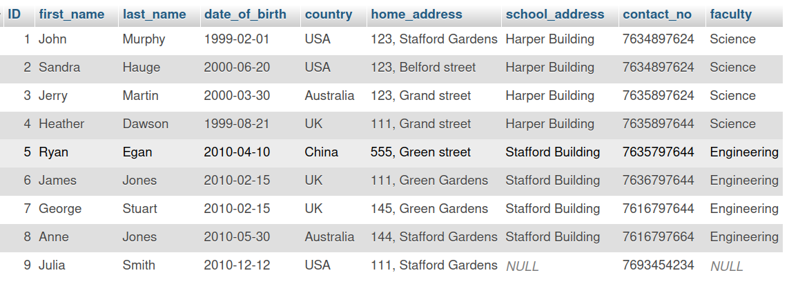

## SQL `SELECT DISTINCT` Clause: Eliminating Duplicates

`DISTINCT` is useful for retrieving a set of unique values when there are duplicate column values in a table. It is used with the SELECT statement, so it’s commonly referred to as SELECT DISTINCT. In short, what DISTINCT does is to findunique values within a column, or columns, of a table.

### 1\. What is the `SELECT DISTINCT` Clause?

- **Purpose**: The primary purpose of `DISTINCT` is to return **only unique (different)** values from the specified column(s) in the `SELECT` statement. It eliminates duplicate rows from the query's output.
- **Analogy**: Imagine you have a long list of items, and some appear multiple times. `DISTINCT` acts like a filter that gives you only one instance of each unique item.
- **Placement**: The `DISTINCT` keyword is placed immediately after `SELECT` and before the column names.

### 2\. Why is `DISTINCT` Needed? (The Problem of Duplicates)

- Database tables often contain columns with repeating values (duplicates). For example, a `Country` column in a `Students` table will have the same country listed for multiple students.
- If you simply use `SELECT column_name FROM table_name;`, you will get every instance of the value, including all duplicates.
- `DISTINCT` solves this by ensuring that each unique value appears only once in the result set.



### 3\. Basic Syntax and Application to a Single Column

- **Syntax**:

  ```sql
  SELECT DISTINCT column_name
  FROM table_name;
  ```

- **Example (without DISTINCT, showing duplicates):**

  - **Goal**: List all countries students are from (including duplicates).
  - **SQL Code**:
    ```sql
    SELECT Country
    FROM Student_Table;
    ```
  - **Result (conceptual)**: Australia, China, UK, US, US, Australia, ... (multiple duplicates)

- **Example (with DISTINCT, eliminating duplicates):**

  - **Goal**: List all _unique_ countries students are from.
  - **SQL Code**:
    ```sql
    SELECT DISTINCT Country
    FROM Student_Table;
    ```
  - **Result (conceptual)**: Australia, China, UK, US (each appearing only once).
  - **Explanation**: The query processes the `Country` column, identifies all unique values, and then returns only those unique values, suppressing any repeats.

### 4\. `DISTINCT` with Multiple Columns

- **Concept**: When `DISTINCT` is applied to multiple columns, it returns a unique combination of values across _all specified columns_. A row is considered a duplicate only if the values in _all_ the `DISTINCT` columns are identical to another row.
- **Syntax**:
  ```sql
  SELECT DISTINCT column1, column2, ...
  FROM table_name;
  ```
- **Example**: Determine unique `Faculty` and `Country` combinations.
  - **Goal**: Find which countries are represented by students in _each different faculty_.
  - **SQL Code**:
    ```sql
    SELECT DISTINCT Faculty, Country
    FROM Student_Table;
    ```
  - **Explanation**: The query will return a row for each unique pairing of `Faculty` and `Country`. For example, if there are multiple students who are 'Science' from 'USA', only one 'Science', 'USA' row will appear. If there's a 'Science' from 'USA' and an 'Engineering' from 'USA', both combinations will appear as they are distinct pairs.


### 5\. How `DISTINCT` Handles `NULL` Values

- **Concept**: The `DISTINCT` clause treats `NULL` as a **unique value** when determining distinctness.
- **Behavior**: If a column has `NULL` values, `DISTINCT` will return only **one `NULL`** in the result set, treating all `NULL`s as identical to each other for the purpose of duplicate removal, but different from any non-NULL value.
- **Example**: If a student has a `NULL` `Faculty` and `USA` `Country`.

  - **Scenario**:

    | Faculty | Country |
    | :------ | :------ |
    | Science | USA     |
    | Science | USA     |
    | NULL    | USA     |
    | NULL    | UK      |

  - **SQL Code**:
    ```sql
    SELECT DISTINCT Faculty, Country
    FROM Student_Table;
    ```
  - **Result (conceptual)**:

    | Faculty | Country |
    | :------ | :------ |
    | Science | USA     |
    | NULL    | USA     |
    | NULL    | UK      |

  - **Explanation**: `NULL` is treated as a distinct value for combinations. `(NULL, USA)` is a unique combination, and `(NULL, UK)` is another unique combination, both different from `(Science, USA)`.

### 6\. Key Takeaways for Revision

- `SELECT DISTINCT` is used to remove **duplicate rows** from a query's result set.
- It operates on the **combination of all columns** specified after `DISTINCT`.
- `DISTINCT` treats `NULL` as a **unique value** for the purpose of identifying unique combinations.
- It's crucial for generating unique lists or reports (e.g., unique countries, unique product categories).
- The original data in the table is **not modified**; only the output of the query is affected.

---

### **Using SELECT DISTINCT on a single column**

If there’s a table named invoices with the same BillingCountry repeated in many instances, you can run the following query to identify what they are:

```sql
SELECT BillingCountry
FROM invoices
ORDER BY BillingCountry;

// output
+----------------+
| BillingCountry |
+----------------+
| Argentina      |
| Argentina      |
| Argentina      |
| Argentina      |
| Argentina      |
| Argentina      |
| Argentina      |
| Australia      |
| Australia      |
| Australia      |
| Australia      |
| Australia      |
| Australia      |
| Australia      |
| Austria        |
| Austria        |
| Austria        |
| Austria        |
| Austria        |
| Austria        |
| Austria        |
| Belgium        |
| Belgium        |
| Belgium        |
| Belgium        |
+----------------+
-- (Output limit exceeded, 25 of 412 total rows shown)
```

When you look at the result, you’ll notice that there are duplicate values in the BillingCountry column. How can you obtain a list of unique billing countries where the invoices have been raised? Let’s change the SELECT statement by adding the DISTINCT keyword and then run it again.

```sql
SELECT DISTINCT BillingCountry

FROM invoices

ORDER BY BillingCountry;
// output
+----------------+
| BillingCountry |
+----------------+
| Argentina      |
| Australia      |
| Austria        |
| Belgium        |
| Brazil         |
| Canada         |
| Chile          |
| Czech Republic |
| Denmark        |
| Finland        |
| France         |
| Germany        |
| Hungary        |
| India          |
| Ireland        |
| Italy          |
| Netherlands    |
| Norway         |
| Poland         |
| Portugal       |
| Spain          |
| Sweden         |
| USA            |
| United Kingdom |
+----------------+
```

This time, the duplicate values are gone and only a unique set of billing countries are returned as the result. Where there are repeating values in the BillingCountry column, for example for Argentina, Australia and Austria. The above SELECT DISTINCT query will eliminate those duplicate rows and generate the result as a unique set of values.

### **Using SELECT DISTINCT on multiple columns**

If you inspect the values in the BillingCountry and BIllingCity columns, you’ll notice that the same billingCity repeats for a single billing country. You can run the following code to verify this.

```sql
SELECT BillingCountry, BillingCity
FROM invoices;

// output
+----------------+---------------+
| BillingCountry | BillingCity   |
+----------------+---------------+
| Germany        | Stuttgart     |
| Norway         | Oslo          |
| Belgium        | Brussels      |
| Canada         | Edmonton      |
| USA            | Boston        |
| Germany        | Frankfurt     |
| Germany        | Berlin        |
| France         | Paris         |
| France         | Bordeaux      |
| Ireland        | Dublin        |
| United Kingdom | London        |
| Germany        | Stuttgart     |
| USA            | Mountain View |
| USA            | Redmond       |
| USA            | Cupertino     |
| USA            | Reno          |
| USA            | Madison       |
| Canada         | Halifax       |
| France         | Paris         |
| United Kingdom | Edinburgh     |
| Australia      | Sidney        |
| Chile          | Santiago      |
| India          | Bangalore     |
| Norway         | Oslo          |
| Brazil         | São Paulo     |
+----------------+---------------+
(Output limit exceeded, 25 of 412 total rows shown)
```

You can run a query that adds the DISTINCT keyword to the SELECT statement.

```sql
SELECT DISTINCT BillingCountry, BillingCity
FROM invoices
ORDER BY BillingCountry, BillingCity;

// output
+----------------+---------------------+
| BillingCountry | BillingCity         |
+----------------+---------------------+
| Argentina      | Buenos Aires        |
| Australia      | Sidney              |
| Austria        | Vienne              |
| Belgium        | Brussels            |
| Brazil         | Brasília            |
| Brazil         | Rio de Janeiro      |
| Brazil         | São José dos Campos |
| Brazil         | São Paulo           |
| Canada         | Edmonton            |
| Canada         | Halifax             |
| Canada         | Montréal            |
| Canada         | Ottawa              |
| Canada         | Toronto             |
| Canada         | Vancouver           |
| Canada         | Winnipeg            |
| Canada         | Yellowknife         |
| Chile          | Santiago            |
| Czech Republic | Prague              |
| Denmark        | Copenhagen          |
| Finland        | Helsinki            |
| France         | Bordeaux            |
| France         | Dijon               |
| France         | Lyon                |
| France         | Paris               |
| Germany        | Berlin              |
+----------------+---------------------+
(Output limit exceeded, 25 of 53 total rows shown)
```

**Note: The ORDER BY clause is added here to sort the values for easy reference.**

The result is a unique set of billing cities retrieved for the billing countries. Basically, there are no duplicate values in the  BillingCity column. In other words, when you do a DISTINCT of multiple columns, it looks for a combination of unique values in all those columns. In this example, all combinations of BillingCountr and  BillingCity in the result are unique.

### **NULL values in a DISTINCT column**

Let’s say there are NULL values in a DISTINCT column(s). For example, in the BillingCity column. You can run the same query as before to get the unique billing cities within the billing countries.

```sql
SELECT DISTINCT BillingCountry, BillingCity
FROM invoices
ORDER BY BillingCountry, BillingCity;
```

Provided that for some records the BillingCity column has NULL values, you’ll receive records with a combination of some value for BillingCountry and NULL for BillingCity.

So, it's important to know that SELECT DISTINCT treats any NULL values in the DISTINCT column(s) as unique. Therefore, in this case, it looks for a combination of unique BillingCountry and BillingCity values. Any NULL values in the BillingCity column are considered unique values. For example, **Argentina – NULL** could be one unique combination and **Australia – NULL** could be another.

### **Using DISTINCT with SQL aggregate functions**

DISTINCT can also be used with SQL aggregate functions like COUNT, AVG, MAX and so on. In this case, you must specify an expression that’s written using some aggregate function. Therefore, it’s not only column names that you can use DISTINCT with but also with expressions.

What if you want to find out the number of unique countries of the customers in the customer table? Run a SELECT statement that uses the aggregate function COUNT on the country column along with DISTINCT.

For example:

```sql
SELECT COUNT(DISTINCT country)

FROM customers;
// output
+-------------------------+
| COUNT(DISTINCT country) |
+-------------------------+
|                      24 |
+-------------------------+
```

The result that you get is the number of unique countries that the customers come from. Using DISTINCT on the country column/field gives a unique list of countries and the COUNT aggregate function counts the number of results.

Here are some important points to remember in terms of `SELECT DISTINCT`:

- When only one column or expression is provided in the DISTINCT clause, the query will return the unique values for that column.
- When more than one column or expression is provided in the DISTINCT clause, the query will retrieve unique **combinations** for those columns.
- The DISTINCT clause doesn't ignore NULL values in DISTINCT column(s). NULL values are considered as unique values by DISTINCT.
