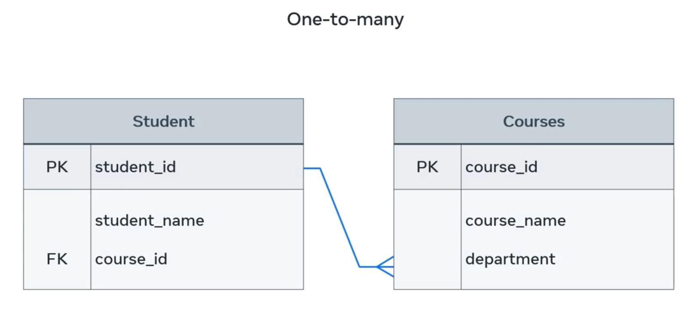
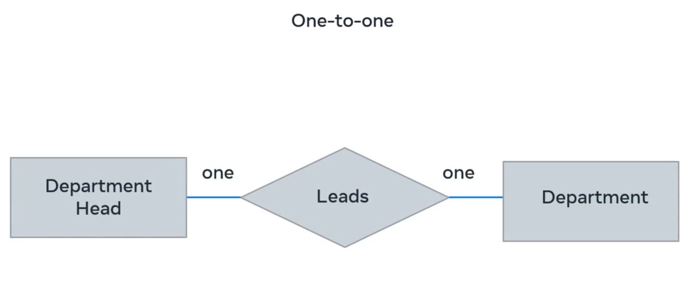
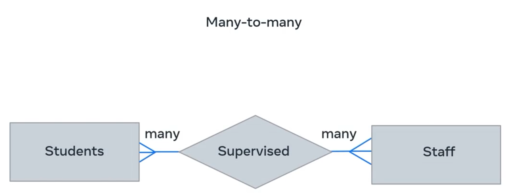
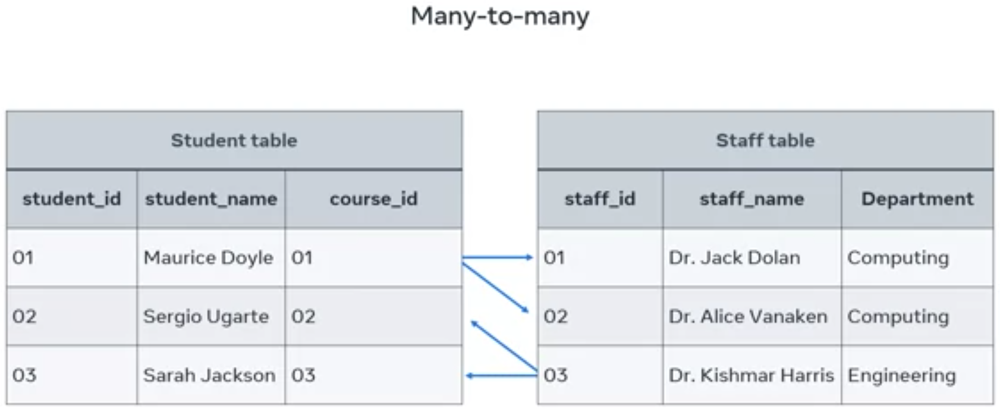
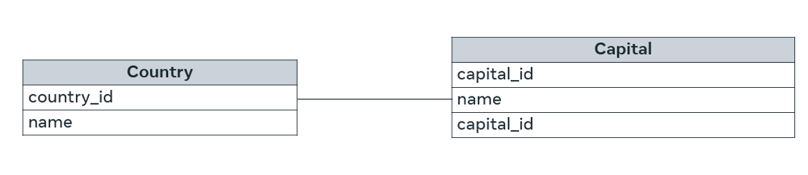
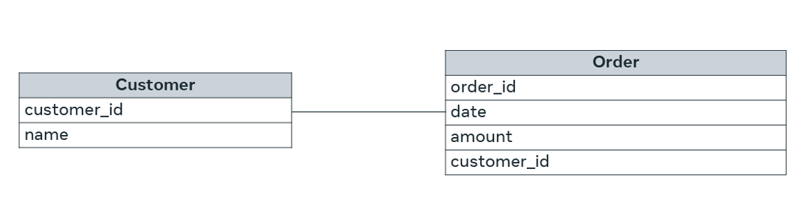
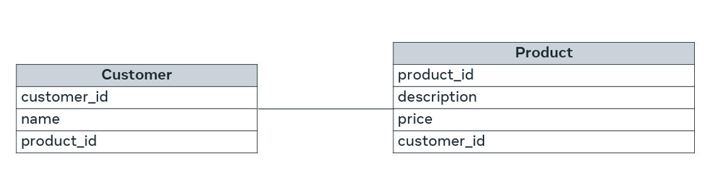

## Relational Database Design: Relationships & ERDs

Understanding relational database design is crucial for effectively structuring your data and extracting meaningful information. The relational model dictates how tables are structured and, most importantly, how they are connected through relationships.

### 1. The Relational Model Basics

- **Core Idea**: The relational model organizes data into **tables** (also called relations), which consist of rows (records/tuples) and columns (attributes/fields).
- **Key Principle**: Data is stored in separate, distinct tables, but these tables are linked together to represent real-world connections between data.
- **Purpose**: Proper relational design helps manage complex data efficiently and ensures data integrity. It's essential to know _which_ pieces of data relate to _which_ other pieces.

### 2. Relationships Between Tables

Relationships define how records in one table are associated with records in another table. There are three primary types of relationships in a relational database:

1. **One-to-Many (1:M)**:

    - **Concept**: A single record in the "one" table can be linked to **multiple** records in the "many" table.
    - **Example**:
      - **Student to Course**: One student can be enrolled in many courses.
        
      - **Analogy**: One parent has many children.
    - **Implementation**: Typically, the **primary key** from the "one" side table is included as a **foreign key** in the "many" side table.
      - Example: `course_id` (PK in `Course` table) appears as `course_id` (FK) in the `Enrollment` (or `Student`) table.
        

2. **One-to-One (1:1)**:

    - **Concept**: A single record in one table is associated with **exactly one** record in another table. This is less common but used when certain attributes are rarely needed or for security/performance partitioning.
    - **Example**:
      - **Department Head to Department Location**: One department head is located in one department building, and one department building has one department head.
        
      - **Analogy**: A person has one passport; a passport belongs to one person.
    - **Implementation**: Both tables typically share the same primary key, or one table's primary key is a foreign key in the other table and is also unique.

3. **Many-to-Many (M:N)**:
    - **Concept**: Multiple records in one table can be associated with **multiple** records in another table, and vice-versa.
    - **Example**:
      - **Student to Staff (Supervision)**: Many students can be supervised by many staff members, and one staff member can supervise many students.
        
      - **Analogy**: Many students take many courses (and many courses have many students).
    - **Implementation**: These relationships **cannot be directly represented** in a relational database. They are resolved by introducing an **intermediate (or junction/associative) table**. This junction table contains foreign keys from _both_ of the original tables, breaking the M:N relationship into two 1:M relationships.
      - Example: `Student` (M:N) `Staff` would become `Student` (1:M) `Student_Staff_Project` (M:1) `Staff`.
        

### 3. Entity-Relationship Diagrams (ERDs) Basics

- **Purpose**: ERDs are visual tools used to **model the logical structure of a database**, illustrating entities (tables) and the relationships between them. They are crucial for designing and understanding relational databases.
- **Basic Components**:
  - **Entities**: Represented by **rectangles**. These are the main "things" or objects about which you want to store data (e.g., `Student`, `Course`, `Shipment`).
  - **Relationships**: Represented by **diamonds**. These describe how entities are associated (e.g., "enrolled in," "ships," "delivers," "leads," "supervises").
  - **Attributes**: Listed within the entity rectangles. These are the characteristics or properties of the entity (e.g., `ID`, `Name`, `Salary`).
- **Cardinality (Crow's Foot Notation)**: Symbols used on the relationship lines to indicate the number of instances of one entity that can be associated with instances of another entity.
  - **One**: A single straight line.
  - **Many**: A "crow's foot" symbol (three-pronged fork).
- **Depicting Keys in ERDs (More Complex ERDs)**:
  - While simple ERDs show basic entities and relationships, more detailed ERDs will also indicate **Primary Keys (PK)** and **Foreign Keys (FK)** within the entity boxes. This shows the actual columns that facilitate the relationships.

# Relational model

**What is the relational model?**

The relational model is built around three main concepts which are:

- Data,
- Relationships,
- and constraints.

It describes a database as “a collection of inter-related relations (or tables)”.

## **Fundamental concepts of the relational model**

### **Relation**

A relation represents a file that stores data. It’s also known as a table. Within a table there are rows and columns. Each row represents a group of related data values. A row, or record, is also known as a tuple. Columns in a table are also known as fields or attributes. These columns define or describe a row. Therefore, a record or a row consists of a set of attributes.

### **Column**

A table stores pieces of data or facts as columns. In other words, the principal storage unit of a database is a column (attribute). When determining the columns for your table, think about the pieces of data that need to be stored within that table. Each column is a generic representation of the piece of data that needs to be stored. Each table cell that becomes a part of a row will have a specific instance of a piece of data.

| ID  | First Name | Last Name |
| --- | ---------- | --------- |
| 1   | John       | Smith     |
| 2   | Mish       | Azerrad   |
| 3   | Peter      | Klien     |

## **Domain**

The domain is a set of acceptable values that a column is allowed to contain. The domain depends on the data type of the column. Namely whether it is numeric, or text based. The domain of ID has a set of acceptable and possible values that are numeric such as 1, 2 and 3. The domain of First Name has a set of acceptable and possible values that are text based, which is people’s first names. In the ID column, it’s not possible to store values such as “John” or “001”. Similarly, the First Name column can’t accept any numeric pieces of data.

## **Record or tuple**

A record, also known as a tuple, is a row within a table. If a table has columns for ID, First Name and Last Name, then one record or tuple would have one person's ID, first name and last name. Another record would have another person’s full personal information.

## **Key**

Each row or tuple has one or more attributes, known as a relation key, that can uniquely identify a specific row. This is also known as the primary key.

## **Degree**

Degree is the number of columns or attributes within a relation. A student table that stores the student's name, address, phone number and email address would have a degree of four.

## **Cardinality**

Cardinality refers to how many records there are within a particular table in a database. If you have 100 students in your student table, with all their information organized into individual rows, then that table has a cardinality of 100.

## **What are constraints?**

In the relational model, every relation needs to meet three conditions. These three conditions must be met for a relation to be valid. They are called relational integrity constraints and they are:

1. Key constraints
2. Domain constraints
3. Referential integrity constraints

## **Key constraints**

The key constraint revolves around the key attribute(s). In the relational model, a key attribute is an identifier that can be used to refer to a record. It must also be unique for each record. For example, you can use the `Student_ID` in the `Student` table as the key. This means that there can’t be two students with the same `Student_ID`. If so, it would be invalid and cause an issue when it comes to accessing or retrieving the data. Also, a key attribute cannot have NULL values. This is the requirement that should be met by the Key constraint.

## **Domain constraints**

Domain constraints are all about the requirement of inserting values that have a valid data type. There are a variety of data types that can be included within a table, namely numeric, text and date, in the case of the example. If an attempt is made to store an incorrect data typed value to an attribute, it’s declared a violation of domain constraints. For instance, if an attribute requires a numeric value to be entered, and the value you are attempting to enter uses letters instead of numbers, then it would be invalid.

## **Referential integrity constraints**

A database has multiple tables that refer to one another. Referential integrity constraints are based on the concept of foreign keys. A foreign key is a key attribute present in a table, which is also a primary key of another table to which it needs to be linked. Through this key, it references the other table to which it’s related. For example, the `Order_ID` is present in the `Order_Item` table as a foreign key, which is also the primary key of the `order` table. So, the `order` table and the `Order_Item` table are related to each other because the `Order_Item` table references the `order` table via the `Order_ID` attribute. The referential integrity constraint states that if a relation refers to a key attribute of another relation, then that key element must exist. In other words, there must be matching values in the two tables for that attribute.

## **Types of relationships**

In the relational model, there are three types of relationships that can exist between tables.

1. One-to-one
2. One-to-many
3. Many-to-many

## **One-to-one**

In order to understand one-to-one relationships, let’s take the example of two tables: Table A and Table B. A one-to-one (1:1) relationship means that each record in Table A relates to one, and only one, record in Table B. Likewise, each record in Table B relates to one, and only one, record in Table A.

Here is a diagram that illustrates the example:

Here, every country has one, and only one, capital. And every capital belongs to one and only one country.

## **One-to-many**

If there are two tables, Table A and Table B, a one-to-many (1:N) relationship means a record in Table A can relate to zero, one, or many records in Table B. Many records in Table B can relate to one record in Table A.

Let’s examine the following relationship between customers and orders.

Here, each customer can place many orders. Many records in the order table can relate to only one record in the customer table.

## **Many-to-many**

If there are two tables, Table A and Table B, a many-to-many (N:N) relationship means many records in Table A can relate to many records in Table B. And many records in Table B can relate to many records in Table A. Let’s examine this example of many-to-many relationship between customer and product with the use of a diagram. In the diagram, customers can purchase various products, and products can be purchased by many customers.

Usually, many-to-many relationships are not kept in a data model. They are broken down into two one-to-many relationships by introducing a junction or middle table.

To conclude, there are many benefits to the relational database model. This includes the ability to design and develop a meaningful system of information, and the ability to access and retrieve every single piece of data stored in the database.
