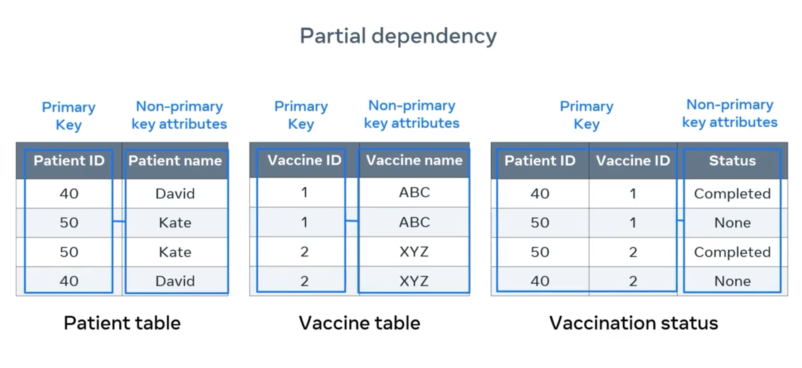

# Database Normalization

The normalization process aims to minimize data duplications, avoid errors during data modifications, and simplify data queries from the database. The three fundamental normalization forms are known as:

- First Normal Form (1NF)
- Second Normal Form (2NF)
- Third Normal Form (3NF)

In this reading, you will learn how to apply the rules that ensure that a database meets the criteria of these three normal forms.

The following example includes fictitious data required by a Medical Group Surgery based in London to generate relevant reports. Doctors work in multiple regions and various councils in London. And once patients book an appointment, they are given a slot ID at their local surgery. There might be multiple surgeries in the same council but with different postcodes, where one or more councils belong to a particular region. For example, East or West London.

| Doctor ID | Doctor name | Region      |          Patient ID           |           Patient name            | Surgery Number | Surgery council | PostCode |          Slot ID           |     Total Cost     |
| :-------: | :---------: | ----------- | :---------------------------: | :-------------------------------: | :------------: | :-------------: | :------: | :------------------------: | :----------------: |
|    D1     |    Karl     | West London | P1   <br><br>P2   <br><br> P3 | Rami   <br><br>Kim   <br><br>Nora |       3        |     Harrow      |  HA9SDE  | A1  <br><br>A2  <br><br>A3 |   1500 1200 1600   |
|    D1     |    Karl     | East London |        P4  <br><br>P5         |        Kamel  <br><br>Sami        |       4        |     Hackney     |  E1 6AW  |       A1  <br><br>A2       |     2500 1000      |
|    D2     |    Mark     | East London |        P5  <br><br>P6         |        Sami  <br><br>Norma        |       4        |     Hackney     |  E1 6AW  |       A3  <br><br>A4       |     1500 2000      |
|    D2     |    Mark     | West London |         P7 <br><br>P1         |        Rose  <br><br>Rami         |       5        |     Harrow      |  HA862E  |       A4  <br><br>A5       | 1000  <br><br>1500 |

The data listed in the table are in an unnormalized form. Repeating groups of data appear in many cases, for instance, doctors, regions, and council names. There are also multiple instances of data stored in the same cell, such as with the patient name and total cost columns. This makes it difficult to update and query data.  Moreover, it is not easy to choose a unique key and assign it as a primary key.

This unnormalized table can be written in SQL form as follows:

```sql
CREATE TABLE Surgery 
    (DoctorID VARCHAR(10),
    DoctorName VARCHAR(50),
    Region VARCHAR(20),
    PatientID VARCHAR(10),
    PatientName VARCHAR(50),
    SurgeryNumber INT, Council VARCHAR(20),
    Postcode VARCHAR(10),
    SlotID VARCHAR(5),
    TotalCost Decimal);
```

## **First normal form**

To simplify the data structure of the surgery table, let’s apply the first normal form rules to enforce the data atomicity rule and eliminate unnecessary repeating data groups. **The data atomicity rule means you can only have one single instance value of the column attribute in any table cell**.

The atomicity problem only exists in the columns of data related to the patients. Therefore, it is important to create a new table for patient data to fix this. In other words, you can organize all data related to the patient entity in one separate table, where each column cell contains only one single instance of data, as depicted in the following example:

| Patient ID | Patient name | Slot ID | Total Cost |
| ---------- | ------------ | ------- | ---------- |
| P1         | Rami         | A1      | 1500       |
| P2         | Kim          | A2      | 1200       |
| P3         | Nora         | A3      | 1600       |
| P4         | Kamel        | A1      | 2500       |
| P5         | Sami         | A2      | 1000       |
| P6         | Norma        | A5      | 2000       |
| P7         | Rose         | A6      | 1000       |

This table includes one single instance of data in each cell, which makes it much simpler to read and understand. However, the patient table requires two columns, the patient ID and the Slot ID, to identify each record uniquely. This means that you need a composite primary key in this table. To create this table in SQL you can write the following code:

```sql
CREATE TABLE Patient
 (PatientID VARCHAR(10) NOT NULL,
  PatientName VARCHAR(50),
  SlotID VARCHAR(10) NOT NULL,
  TotalCost Decimal, 
  CONSTRAINT PK_Patient
  PRIMARY KEY (PatientID, SlotID));
```

Once you have removed the patient attributes from the main table, you just have the doctor ID, name, region, surgery number, council and postcode columns left in the table.

| Doctor ID | Doctor name | Region      | Surgery Number | Surgery council | Postcode |
| --------- | ----------- | ----------- | -------------- | --------------- | -------- |
| D1        | Karl        | West London | 3              | Harrow          | HA9SDE   |
| D1        | Karl        | East London | 4              | Hackney         | E1 6AW   |
| D2        | Mark        | West London | 4              | Hackney         | E1 6AW   |
| D2        | Mark        | East London | 5              | Harrow          | HA862E   |

You may have noticed that the table also contains repeating groups of data in each column. You can fix this by separating the table into two tables of data: the doctor table and the surgery table, where each table deals with one specific entity.

### **Doctor table**

| Doctor ID | Doctor name |
| --------- | ----------- |
| D1        | Karl        |
| D2        | Mark        |

### **Surgery table**

| Surgery Number | Region      | Surgery council | Postcode |
| -------------- | ----------- | --------------- | -------- |
| 3              | West London | Harrow          | HA9SDE   |
| 4              | East London | Hackney         | E1 6AW   |
| 5              | West London | Harrow          | HA862E   |

In the doctor table, you can identify the doctor ID as a single-column primary key. This table can be created in SQL by writing the following code:

```sql
CREATE TABLE Doctor
  (DoctorID VARCHAR(10),
  DoctorName VARCHAR(50), PRIMARY KEY (DoctorID)
  );
```

Similarly, the surgery table can have the surgery number as a single-column primary key. The surgery table can be created in SQL by writing the following code:

```sql
CREATE TABLE Surgery 
 (SurgeryNumber INT NOT NULL,
 Region VARCHAR(20), Council VARCHAR(20),
 Postcode VARCHAR(10), PRIMARY KEY (SurgeryNumber)
 );
```

By applying the atomicity rule and removing the repeating data groups, the database now meets the first normal form.

## **Second normal form**

In the second normal form, you must avoid partial dependency relationships between data. **Partial dependency refers to tables with a composite primary key. Namely, a key that consists of a combination of two or more columns, where a non-key attribute value depends only on one part of the composite key**.

Since the patient table is the only one that includes a composite primary key, you only need to look at the following table.

| **Patient ID** | Patient name | **Slot ID** | Total Cost |
| -------------- | ------------ | ----------- | ---------- |
| P1             | Rami         | A1          | 1500       |
| P2             | Kim          | A2          | 1200       |
| P3             | Nora         | A3          | 1600       |
| P4             | Kamel        | A1          | 2500       |
| P5             | Sami         | A2          | 1000       |
| P5             | Sami         | A3          | 1000       |
| P6             | Sami         | A4          | 1500       |
| P7             | Norma        | A5          | 2000       |
| P8             | Rose         | A6          | 1000       |
| P1             | Rami         | A7          | 1500       |

In the patient table, **you must check whether any non-key attributes depend on one part of the composite key.** For example, the patient's name is a non-key attribute, and it can be determined by using the patient ID only.

Similarly, you can determine the total cost by using the Slot ID only. This is called **partial dependency, which is not allowed in the second normal form. This is because all non-key attributes should be determined by using both parts of the composite key, not only one of them.**

This can be fixed by splitting the patient table into two tables: patient table and appointment table. In the patient table you can keep the patient ID and the patient's name.

| Patient table  |                  |
| -------------- | ---------------- |
| **Patient ID** | **Patient name** |
| P1             | Rami             |
| P2             | Kim              |
| P3             | Nora             |
| P4             | Kamel            |
| P5             | Sami             |
| P7             | Norma            |
| P8             | Rose             |

The new patient table can be created in SQL using the following code:

```sql
CREATE TABLE Patient
 (PatientID VARCHAR(10) NOT NULL,
 PatientName, VARCHAR(50), PRIMARY KEY (PatientID)
 );
```

However, in the appointment table, you need to add a unique key to ensure you have a primary key that can identify each unique record in the table. Therefore, the appointment ID attribute can be added to the table with a unique value in each row.

| **Appointment Id** | **Slot ID** | Total Cost |
| ------------------ | ----------- | ---------- |
| 1                  | A1          | 1500       |
| 2                  | A2          | 1200       |
| 3                  | A3          | 1600       |
| 4                  | A1          | 2500       |
| 5                  | A2          | 1000       |
| 6                  | A3          | 1000       |
| 7                  | A4          | 1500       |
| 8                  | A5          | 2000       |
| 9                  | A6          | 1000       |
| 10                 | A7          | 1500       |

The new appointments table can be created in SQL using the following code:

```sql
CREATE TABLE Appointments
 (AppointmentID INT NOT NULL,
  SlotID, VARCHAR(10), 
  TotalCost Decimal, PRIMARY KEY (AppointmentID)
 );
```

You have removed the partial dependency, and all tables conform to the first and second normal forms.

## **Third normal form**

For a relation in a database to be in the third normal form, **it must already be in the second normal form (2NF).** In addition, **it must have no transitive dependency. This means that any non-key attribute in the surgery table may not be functionally dependent on another non-key attribute in the same table.** In the surgery table, the postcode and the council are non-key attributes, and the postcode depends on the council. Therefore, if you change the council value, you must also change the postcode. This is called transitive dependency, which is not allowed in the third normal form.

| Surgery number | Region      | Surgery council | Postcode |
| -------------- | ----------- | --------------- | -------- |
| 3              | West London | Harrow          | HA9SDE   |
| 4              | East London | Hackney         | E1 6AW   |
| 5              | West London | Harrow          | HA862E   |

In other words, changing the value of the council value in the above table has a direct impact on the postcode value, because each postcode in this example belongs to a specific council. This transitive dependency is not allowed in the third normal form. To fix it you can split this table into two tables: one for the region with the city and one for the surgery.

### **Location table**

| Surgery number | Postcode |
| -------------- | -------- |
| 3              | HA9SDE   |
| 4              | E1 6AW   |
| 5              | HA862E   |

The new surgery location table can be created in SQL using the following code:

```sql
CREATE TABLE Location 
 (SurgeryNumber INT NOT NULL,
  Postcode VARCHAR(10), PRIMARY KEY (SurgeryNumber)
 );
```

### **Council table**

| Surgery council | Region      |
| --------------- | ----------- |
| Harrow          | West London |
| Hackney         | East London |

The new surgery council table can be created in SQL using the following code:

```sql
CREATE TABLE Council 
 (Council VARCHAR(20) NOT NULL,
  Region VARCHAR(20), PRIMARY KEY (Council)
 );
```

This ensures the database conforms to first, second, and third normal forms. The following diagram illustrates the stages through which the data moves from the unnormalized form to the first normal form, the second normal form, and finally to the third normal form.


However, it’s important to link all tables together to ensure you have well-organized and related tables in the database. This can be done by defining foreign keys in the tables.


The third normal form is typically good enough to deal with the three anomaly challenges – insertion, update, and deletion anomalies – that the normalization process aims to tackle. Completing the third normal form in a database design helps to develop a database that is easy to access and query, well-structured, well-organized, consistent, and without unnecessary data duplications.

## Database Normalization: Understanding Second Normal Form (2NF)

Database normalization is a progressive process aimed at optimizing database structure to reduce data redundancy, improve data integrity, and enable more accurate data analysis and retrieval. The **Second Normal Form (2NF)** is a key step in this process, building upon the First Normal Form (1NF).

### 1. The Need for Normalization

Often, database tables can contain duplicate data and multiple values within columns, making it challenging to view, search, and sort information efficiently. Normalization provides a systematic way to deal with these challenges by structuring tables optimally.

### 2. Prerequisite: First Normal Form (1NF)

Before a table can be in 2NF, it *must first be in 1NF*. This means:

- Each column contains atomic (indivisible) values.
- There are no repeating groups of columns.
- Each row is unique.

### 3. Core Concepts for 2NF: Functional & Partial Dependency

Understanding these two types of dependencies is crucial for grasping 2NF.

- **Functional Dependency**:
  - **Concept**: Describes a relationship between two attributes (columns) in a table where the unique value of one column (the **determinant**) determines the value of another column (the **dependent**).
  - **Analogy**: If you know the value of X, you can uniquely determine the value of Y. We write this as **X → Y**.
  - **In relation to Primary Keys**: If a column `Y` is functionally dependent on `X` (where `X` is the primary key), it means that for every unique value in `X`, there is exactly one corresponding value in `Y`.
  - *Example*: In a `Student` table (`Student_ID`, `Name`, `Date_of_Birth`), `Student_ID` (as the primary key) functionally determines both `Name` and `Date_of_Birth`. This means `Student_ID` → `Name` and `Student_ID` → `Date_of_Birth`.  
  **You can't use `Name` or `Date_of_Birth` alone to uniquely identify a student if duplicates exist.**
  > you can't retrieve student data by student name if there is more that one student that has the same name.

- **Partial Dependency**:
  - **Concept**: Occurs in tables that have a **composite primary key** (a primary key made up of two or more columns). A partial dependency exists when a **non-key attribute** (a column that is not part of the primary key) is functionally dependent on **only a *part* of the composite primary key**, rather than the entire composite primary key.
  - **Problem**: This violates the 2NF rule and leads to redundancy and update anomalies.

#### **Vaccination table**

```bash
+------------+------------+--------------+--------------+-----------+
| Patient ID | Vaccine ID | Vaccine name | Patient name | Status    |
+------------+------------+--------------+--------------+-----------+
| 40         | 1          | ABC          | David        | Completed |
| 50         | 1          | ABC          | Kate         | None      |
| 50         | 2          | XYZ          | Kate         | Completed |
| 40         | 2          | XYZ          | David        | None      |
+------------+------------+--------------+--------------+-----------+
```

- *Example*: Consider a `Vaccination` table with a composite primary key of (`Patient ID`, `Vaccine ID`).
  - If `Vaccine Name` depends *only* on `Vaccine ID` (i.e., `Vaccine ID` → `Vaccine Name`), but `Vaccine Name` is a non-key attribute in the `Vaccination` table, then this is a partial dependency.
  - Similarly, if `Patient Name` depends *only* on `Patient ID` (i.e., `Patient ID` → `Patient Name`), this is also a partial dependency.
  - However, `Status` (e.g., vaccination status) *does* depend on the full composite key (`Patient ID`, `Vaccine ID`) because you need both to know a specific patient's status for a specific vaccine.

### 4. Second Normal Form (2NF) Criteria & Remediation

A table is in **Second Normal Form (2NF)** if it meets two conditions:

1. It is already in **First Normal Form (1NF)**.
2. **All non-key attributes are fully functionally dependent on the *entire* primary key**. This means there are **no partial dependencies**.

- **How to Upgrade a Table to 2NF**:
    1. **Identify Entities**: Analyze the original table and identify all distinct entities represented by the columns.
    2. **Decomposition (Breaking Up Tables)**: Break down the table into multiple smaller tables, ensuring that each new table's non-key attributes are fully dependent only on that table's primary key.
    3. **Eliminate Redundancy**: This process removes unnecessary replication of data that was previously duplicated due to partial dependencies.



- **Application Example (Vaccination Table)**:
  - **Original Problem**: A `Vaccination` table with composite primary key (`Patient ID`, `Vaccine ID`) contains partial dependencies because `Vaccine Name` depends only on `Vaccine ID`, and `Patient Name` depends only on `Patient ID`.
  - **2NF Solution**: Break the original table into three separate tables:  
        1. **`Patient` Table**: Contains `Patient ID` (PK) and `Patient Name`.  
        2. **`Vaccine` Table**: Contains `Vaccine ID` (PK) and `Vaccine Name`.  
        3. **`Vaccination_Status` Table**: Contains `Patient ID` (FK), `Vaccine ID` (FK), and `Status`. The composite primary key here would be (`Patient ID`, `Vaccine ID`). All attributes (`Status`) are fully dependent on the *entire* composite key.

## Database Normalization: Understanding Third Normal Form (3NF)

The **Third Normal Form (3NF)** is a crucial step in database normalization, building upon the First Normal Form (1NF) and Second Normal Form (2NF). Its primary goal is to eliminate redundant data that arises from a specific type of dependency called **transitive dependency**.

### 1. Prerequisite for 3NF

Before a table can be in 3NF, it *must already be in 1NF and 2NF*. This means:

- All column values are atomic (1NF).
- There are no repeating groups (1NF).
- All non-key attributes are fully functionally dependent on the *entire* primary key (2NF).

### 2. Core Concept for 3NF: Transitive Dependency

- **Definition**: A transitive dependency occurs when a **non-key attribute** in a table is functionally dependent on **another non-key attribute**. In simpler terms, a non-key attribute determines the value of another non-key attribute.
- **Analogy**: If A determines B (A → B), and B determines C (B → C), then A transitively determines C through B (A → C via B). If B and C are both non-key attributes, and A is the primary key, then the dependency B → C is a transitive dependency that violates 3NF.
- **Problem**: Transitive dependencies lead to data redundancy. If the value of the intermediate non-key attribute (B) changes, you might need to update many rows to maintain consistency, increasing the risk of anomalies.

### 3. Third Normal Form (3NF) Criteria & Remediation

A table is in **Third Normal Form (3NF)** if it meets three conditions:

1. It is already in **Second Normal Form (2NF)**.
2. **No non-key attribute is transitively dependent on the primary key**. This means there are **no transitive dependencies**.

- **How to Upgrade a Table to 3NF**:
    1. **Identify Transitive Dependencies**: Look for non-key attributes that are determined by other non-key attributes.
    2. **Decomposition**: Split the original table into two or more new tables.
        - Create a new table for the transitively dependent non-key attributes and the non-key attribute that determines them. The determinant non-key attribute becomes the primary key of this new table.
        - Leave the determinant non-key attribute in the original table, but now it acts as a **foreign key** linking back to the new table.
    3. **Eliminate Redundancy**: This process removes the redundant storage of the transitively dependent data.

```
| ID | Author          | Language  | Country  | Book title              |
|----|-----------------|-----------|----------|-------------------------|
| 1  | Marit Hagen     | Norwegian | Norway   | Norway's Olympic Heroes |
| 2  | Michel Lloris   | French    | France   | A Guide to Toulouse     |
| 3  | Cormac O'Dwyer  | Irish     | Ireland  | Bridges of Dublin       |
| 4  | Michel Lloris   | Spanish   | Spain    | Artists of Granada      |
| 5  | Lucas Pavard    | French    | France   | Nantes Hiking Trails    |
| 6  | Maren Riise     | Norwegian | Norway   | Norwegian Cuisine       |
```

- **Application Example (Best-Selling Books Table)**:
  - **Original Problem**: A `Books` table has `Book ID` (PK), `Title`, `Author Name`, `Author Language`, and `Country`.
    - `Book ID` (PK) determines `Title`, `Author Name`, `Author Language`, `Country`. (This is fine).
    - However, `Author Language` (non-key) determines `Country` (non-key), and `Country` (non-key) determines `Author Language`. This is a **transitive dependency** (`Author Language` ↔ `Country`). For example, if the language is French, the country is always France (in the European context).
  - **3NF Solution**:
        1. **Create a new table for the transitive dependency**:
            - `Language_Country` table with `Language` (PK) and `Country`.
        2. **Modify the original table**:
            - The original `Books` table now keeps `Book ID` (PK), `Title`, `Author Name`, and `Author Language`.
            - The `Author Language` column in the `Books` table now acts as a **Foreign Key** referencing the `Language` (PK) in the new `Language_Country` table.
            - The `Country` column is removed from the `Books` table, as it can now be derived via the join.

- **Result**:
  - `Books` table: (`Book ID`, `Title`, `Author Name`, `Author Language` (FK))
  - `Language_Country` table: (`Language` (PK), `Country`)

    This decomposition ensures that:
  - All non-key attributes in `Books` depend only on `Book ID`.
  - All non-key attributes in `Language_Country` depend only on `Language`.
  - Redundant storage of `Country` based on `Language` is eliminated.

### 4. Key Benefits of 3NF

- **Reduced Data Redundancy**: Eliminates repetitive data caused by transitive dependencies.
- **Improved Data Integrity**: Changes to a dependent non-key attribute (like `Country` based on `Language`) only need to be made in one place (the `Language_Country` table), reducing the risk of inconsistencies.
- **Easier Updates and Deletions**: Prevents update and deletion anomalies that arise when data is duplicated.
- **Optimized Database Structure**: Contributes to a cleaner, more efficient, and robust database design.

**In summary**: 3NF is about ensuring that non-key attributes do not depend on other non-key attributes. By identifying and resolving transitive dependencies, you create a more streamlined and reliable database structure, making it easier to manage and query your data.
