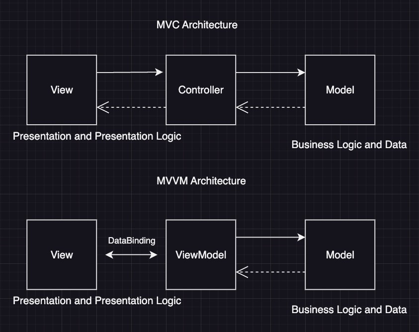

MVC (Model-View-Controller) and MVVM (Model-View-ViewModel) are both architectural patterns used in software development to separate an application's concerns. MVC is a more established pattern, while MVVM is often preferred for modern applications with complex user interfaces. MVVM's data binding capabilities and separation between View and ViewModel can lead to more maintainable and testable code, especially in dynamic, data-driven applications [according to BrightMarbles](https://brightmarbles.io/blog/differences-between-mvc-and-mvvm/).

MVC (Model-View-Controller):

-   **Model:** Represents the application's data and business logic.

-   **View:** Displays the data to the user and handles user interactions.

-   **Controller:** Handles user input, updates the model, and selects the appropriate view to display.

MVVM (Model-View-ViewModel):

-   **Model:** Similar to MVC, represents the application's data and business logic.

-   **View:** Displays the data to the user and handles user interactions, but it's primarily bound to the ViewModel.

-   **ViewModel:** Exposes data from the Model in a way that is convenient for the View. It also handles commands and logic related to the View's behavior.

## **Data Binding:**
    
MVVM utilizes data binding, allowing the View and ViewModel to stay synchronized automatically. Changes in the ViewModel are reflected in the View, and vice versa, without manual code. MVC typically relies on the Controller to update the View after changes in the Model.
    

**Complexity:**
    
MVC is generally considered simpler to understand and implement for smaller applications with less complex UIs. MVVM can handle more complex UIs and data interactions more efficiently due to its data binding and separation of concerns.
    

## Testability

MVC provides good testability, particularly with unit testing the Model and Controller components. However, testing the View can be challenging due to its tight coupling with the Controller.

MVVM enhances testability with better separation of concerns. The ViewModel can be tested independently of the View and the Model, as it does not have direct dependencies on them. Unit testing the ViewModel becomes more manageable, resulting in more comprehensive and focused tests.

## Flexibility and Extensibility

MVC offers flexibility, allowing for different View and Controller implementations. This flexibility can be useful when adapting the application to changing requirements or integrating with various UI frameworks.

MVVM provides enhanced flexibility through the use of data binding. The separation of the View and ViewModel enables easier UI customization and reusability. Different Views can be bound to the same ViewModel, or multiple ViewModels can be used with a single View.
    

-   **Maintainability:**
    
    MVVM's separation of concerns and data binding can lead to more maintainable code, as changes in one part of the application are less likely to affect other parts.
    

-   **Use Cases:**
    
    MVC is well-suited for traditional web applications, while MVVM is often preferred for single-page applications, mobile apps, and other scenarios with complex user interfaces notes Medium.
    

In essence, MVC is a good starting point for many projects, especially smaller ones. MVVM is a powerful alternative that excels in handling complex, dynamic user interfaces, and offers better testability and maintainability for those scenarios.


## Differences Between MVC and MVVM

The main differences between MVC and MVVM are, as follows:



### Separation of Concerns

MVC separates the application into three main components:

-   Model: Represents the data and business logic of the application.
-   View: Handles the presentation layer and user interface.
-   Controller: Manages the interaction between the Model and the View.

MVVM also emphasize separation of concerns, but with three different components:

-   Model: Represents the data and business logic, similar to MVC.
-   View: Handles the UI and presentation layer, akin to MVC.
-   ViewModel: Acts as an intermediary between the View and the Model, exposing data and commands for data binding.

### View-Model Communication

In MVC, the View communicates directly with the Controller to handle user interactions and updates. The Controller then interacts with the Model to retrieve or update data. The View does not directly reference the Model.

In MVVM, the View communicates with the ViewModel through data binding. The ViewModel exposes properties and commands that the View binds to. The ViewModel, in turn, interacts with the Model to retrieve or update.

**BM Insight**: People who are only planning to join the guild of mobile software architects can choose from many entrance doors. Our blog post [Mastering Mobile: 7 Essential Tips for Junior Developers in the World of Mobile Development](https://brightmarbles.io/blog/tips-for-junior-mobile-developers/) is one such gateway, so give it a read and see what it takes to go this way.

## Data Binding

MVC typically does not have built-in data binding capabilities. The View relies on the Controller to retrieve data from the Model and update the UI manually.

MVVM introduces powerful data binding capabilities. Data binding establishes a connection between the View and the ViewModel, allowing automatic synchronisation of data between them. When data changes in the ViewModel, the View is automatically updated, and user interactions trigger commands in the ViewModel.


## Conclusion

MVC and MVVM are both effective architectural patterns that promote separation of concerns. MVC provides a straightforward and widely adopted approach, while MVVM introduces data binding and a clearer separation between the View and ViewModel.

The choice between MVC and MVVM depends on the specific requirements of the project, the complexity of the UI, and the need for testability and flexibility. Understanding the differences between these patterns helps developers make informed decisions and create well-structured, maintainable applications. This blog will help you make the right decision.


**Example using a simplified approach (without a framework like Knockout.js or Vue.js):**

```js
// 1. Model
class UserModel {
    constructor(name, email) {
        this.name = name;
        this.email = email;
    }

    // Example of business logic in the Model
    validateEmail() {
        return this.email.includes('@');
    }
}

// 2. ViewModel
class UserViewModel {
    constructor(userModel) {
        this.userModel = userModel;
        this.displayUserName = userModel.name;
        this.displayUserEmail = userModel.email;
        this.isValidEmail = userModel.validateEmail();

        // A simple way to "observe" changes for demonstration
        this.onUserNameChange = null;
    }

    // Method to update the Model and trigger View updates
    updateUserName(newName) {
        this.userModel.name = newName;
        this.displayUserName = newName;
        if (this.onUserNameChange) {
            this.onUserNameChange(newName);
        }
    }
}

// 3. View (simplified HTML and JavaScript interaction)
const userModel = new UserModel("John Doe", "john.doe@example.com");
const userViewModel = new UserViewModel(userModel);

// Initial rendering of the View
const userNameElement = document.getElementById('userName');
const userEmailElement = document.getElementById('userEmail');
const emailStatusElement = document.getElementById('emailStatus');
const nameInput = document.getElementById('nameInput');
const updateNameButton = document.getElementById('updateNameButton');

userNameElement.textContent = userViewModel.displayUserName;
userEmailElement.textContent = userViewModel.displayUserEmail;
emailStatusElement.textContent = userViewModel.isValidEmail ? 'Valid Email' : 'Invalid Email';

// Bind ViewModel updates to View elements
userViewModel.onUserNameChange = (newName) => {
    userNameElement.textContent = newName;
};

// Handle user interaction from the View
updateNameButton.addEventListener('click', () => {
    const newName = nameInput.value;
    userViewModel.updateUserName(newName);
});

// HTML structure (in your index.html)
/*
<div id="userProfile">
    <h2 id="userName"></h2>
    <p id="userEmail"></p>
    <p id="emailStatus"></p>
    <input type="text" id="nameInput" placeholder="New Name">
    <button id="updateNameButton">Update Name</button>
</div>
*/
```

- The `UserModel` is the Model, holding the user's data and a validation method.
- The `UserViewModel` is the ViewModel, preparing data for display and handling the updateUserName command. It also includes a basic mechanism (onUserNameChange) to notify the View of changes.
- The HTML elements and the JavaScript code that manipulates them directly based on the ViewModel constitute the View. User interactions (like clicking the button) are captured by the View and delegated to the ViewModel.
