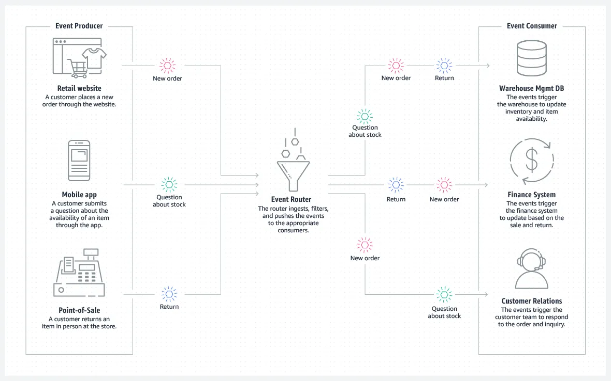

# What is Event-Driven Architecture

Event-driven architecture is a software design pattern that allows decoupled applications to asynchronously publish and subscribe to events through an event broker (modern messaging-oriented middleware).

Event-driven architecture is a method of developing enterprise IT systems that allows information to flow in real time between applications, microservices, and connected devices as events occur throughout the business.

The event-driven architecture enables loose coupling of applications by introducing a middleman known as an event broker. This means that applications and devices do not need to know where they are sending information or where the information they are consuming comes from.

An event-driven architecture uses events to trigger and communicate between decoupled services and is common in modern applications built with microservices. An event is a change in state, or an update, like an item being placed in a shopping cart on an e-commerce website. Events can either carry the state (the item purchased, its price, and a delivery address) or events can be identifiers (a notification that an order was shipped).

Event-driven architectures have three key components: event producers, event routers, and event consumers. A producer publishes an event to the router, which filters and pushes the events to consumers. Producer services and consumer services are decoupled, which allows them to be scaled, updated, and deployed independently.

## What does the term "event" mean in EDA?

A change in state is called an event. In an event-driven architecture, everything that happens within and to your enterprise is an event — customer requests, inventory updates, sensor readings, and so on.

## Why should you use an event-driven architecture?

The value of knowing about a given event and being able to react to it degrades over time. The more quickly you can get information about events where they need to be, the more effectively your business can react to opportunities to delight a customer, shift production, and reallocate resources.

That's why event-driven architecture, which pushes information as events happen, is a better architectural approach than waiting for systems to periodically poll for updates, as is the case with the API-led approach most companies take today.

Event-driven architecture ensures that when an event occurs, information about that event is sent to all of the systems and people that need it. It's a simple concept, but these events have had quite the journey. They need to efficiently move through a multitude of applications written in many different languages, using different APIs, leveraging different protocols, and arriving at many endpoints such as applications, analytics engines, and user interfaces.

If they don't get there? Connected “things” can't connect, the applications and systems you rely on fail, and people across your company can't react to situations that need their attention.

## The Advantages of Event-Driven Architecture

The main advantages of event-driven architecture are improved responsiveness, scalability, and agility in business. The ability to respond to real-time information and quickly and easily add new services and analytics significantly improves business processes and the customer experience. Despite the fact that modernizing IT infrastructure can be costly,

## With event-driven architecture, you can do the following:

- Everything happens as soon as possible, and nothing is waiting on anything else.
- You don't have to consider what's happening downstream, so you can add service instances to scale.
- Topic routing and filtering can divide up services quickly and easily, as in command query responsibility segregation.
- To add another service, you can just have it subscribe to an event and have it generate new events of its own; there's no impact on existing services.

## Event-Driven Architecture Use Cases

The benefits of event-driven architecture covered above are especially relevant in use cases where a single change can have huge consequences, rippling all the way down the chain. One of the most common questions people have is, “When should you use event-driven architecture?” The answer lies in what you are trying to accomplish with your data.

Businesses looking to take advantage of real-time data in their daily activities are turning to event-driven architecture as the backbone for use cases that can benefit the most. According to a 2021 survey, the top 4 use cases for event-driven architecture were:

- Integrating applications
- Sharing and democratizing data across applications
- Connecting IoT devices for data ingestion and analytics
- Event-enabling microservices

## Examples of Event-Driven Architecture

The value of event-driven architecture transcends industries and can be applied to small businesses as well as large multinational corporations. Retailers and banks can use it to aggregate data from point-of-sale systems and across distribution networks to execute promotions, optimize inventory, and offer excellent customer service.

## Retail and eCommerce: An Example of Event-Driven Architecture

This is an example of event-driven architecture from a retail perspective. Notice that no systems (inventory, finance, or customer support) are polling to ask if there are any new events; they are simply filtered and routed in real-time to the services and applications that have registered their interest.

**Fig 2. eCommerce Event-Driven Architecture.**

## Common Event-Driven Architecture Concepts That You Should Know

There are eight key architectural concepts that need to be understood for event-driven architecture to be successful:

1. Event broker
2. Event portal
3. Topics
4. Event mesh
5. Deferred execution
6. Eventual consistency
7. Choreography
8. Command Query: Responsibility Segregation

## 1\. Event Broker

An **event Broker** is a middleware (which can be software, an appliance, or SaaS) that routes events between systems using the publish-subscribe messaging pattern. All applications connect to the event broker, which is responsible for accepting events from senders and delivering them to all systems subscribed to receive them.

It takes good system design and governance to ensure that events end up where they are needed and effective communication between those sending events and those who need to respond. This is where tooling—such as an **event portal**—can help capture, communicate, document, and govern event-driven architecture.

## 2\. Event Portal

As organizations look to adopt an event-driven architecture, many are finding it difficult to document the design process and understand the impacts of changes to the system. **Event portals** let people design, create, discover, catalog, share, visualize, secure, and manage events and event-driven applications. Event portals serve three primary audiences:

1.  Architects use an event portal to define, discuss, and review events, data definitions, and application relationships.
2.  Developers use an event portal to discover, understand, and reuse events across applications, lines of business, and between external organizations.
3.  Data scientists use an event portal to understand event-driven data and discover new insights by combining events.

## 3\. Topics

Events are tagged with metadata that describes the event, called a “topic.” A topic is a hierarchical text string that describes what's in the event. Publishers just need to know what topic to send an event to, and the event broker takes care of delivery to systems that need it. Application users can register their interest in events related to a given topic by _subscribing_ to that topic. They can use wildcards to subscribe to a group of topics that have similar topic strings. By using the correct topic taxonomy and subscriptions, you can fulfill two rules of event-driven architecture:

1.  A subscriber should subscribe only to the events it needs. The subscription should do the filtering, not the business logic.
2.  A publisher should only send an event once, to one topic, and the event broker should distribute it to any number of recipients.

## 4\. Event Mesh

An event mesh is created and enabled through a network of interconnected event brokers. It's a configurable and dynamic infrastructure layer for distributing events among decoupled applications, cloud services, and devices by dynamically routing events to any application, no matter where these applications are deployed in the world, in any cloud, on-premises, or IoT environment. Technically speaking, an event mesh is a network of interconnected event brokers that share consumer topic subscription information and route messages amongst themselves so they can be passed along to subscribers.

## 5\. Deferred Execution

If you're used to REST-based APIs, the concept of deferred execution can be tricky to comprehend. The essence of event-driven architecture is that when you publish an event, you don't wait for a response. The event broker “holds” (persists) the event until all interested consumers accept or receive it, which may be sometime later. Acting on the original event may then cause other events to be emitted that are similarly persistent.

So event-driven architecture leads to cascades of events that are temporally and functionally independent of each other but occur in a sequence. All we know is that **event A** will at some point cause something to happen. The execution of the logic-consuming **event A** isn't necessarily instant; its execution is deferred.

## 6\. Eventual Consistency

Following on from this idea of deferred execution, where you expect something to happen later but don't wait for it, is the idea of **eventual consistency**. Since you don't know when an event will be consumed and you're not waiting for confirmation, you can't say with certainty that a given database has fully caught up with everything that needs to happen to it and doesn't know when that _will_ be the case. If you have multiple stateful entities (database, MDM, ERP), you can't say they will have exactly the same state; you can't assume they are consistent. However, for a given object, we know that it will become consistent _eventually._

## 7\. Choreography

Deferred execution and eventual consistency lead us to the concept of choreography. To coordinate a sequence of actions being taken by different services, you could choose to introduce a master service dedicated to keeping track of all the other services and taking action if there's an error. This approach, called _orchestration,_ offers a single point of reference when tracing a problem, but also a single point of failure and a bottleneck.

With event-driven architecture, services are relied upon to understand what to do with an incoming event, frequently generating new events. This leads to a “dance” of individual services doing their own things but, when combined, producing an implicitly coordinated response, hence the term choreography.

## 8\. CQRS: Command Query Responsibility Segregation

A common way of scaling microservices is to separate the service responsible for doing something (a command) from the service responsible for answering queries. Typically, you have to answer many more queries than for an update or insert, so separating responsibilities this way makes scaling the query service easier.

Using event-driven architecture makes this easy since the topic should contain the verb, so you simply create more instances of the query service and have it listen to the topics with the query verb.

## The 6 Principles of Event-Driven Architecture

There we have it, some main principles of event-driven architecture:

1.  Use a network of event brokers to make sure the right “things” get the right events.
2.  Use topics to make sure you only send once and only receive what you need.
3.  Use an event portal to design, document, and govern event-driven architecture across internal and external teams.
4.  Use event broker persistence to allow consumers to process events when they're ready (deferred execution).
5.  Remember, this means not everything is up-to-date (eventual consistency).
6.  Use topics again to separate out different parts of a service (command query responsibility segregation).

## Benefit 

### Scale and fail independently

By decoupling your services, they are only aware of the event router, not each other. This means that your services are interoperable, but if one service has a failure, the rest will keep running. The event router acts as an elastic buffer that will accommodate surges in workloads.

### Develop with agility

You no longer need to write custom code to poll, filter, and route events; the event router will automatically filter and push events to consumers. The router also removes the need for heavy coordination between producer and consumer services, speeding up your development process.

### Audit with ease

An event router acts as a centralized location to audit your application and define policies. These policies can restrict who can publish and subscribe to a router and control which users and resources have permission to access your data. You can also encrypt your events both in transit and at rest.

### Cut costs

Event-driven architectures are push-based, so everything happens on-demand as the event presents itself in the router. This way, you're not paying for continuous polling to check for an event. This means less network bandwidth consumption, less CPU utilization, less idle fleet capacity, and less SSL/TLS handshakes.

## When to use this architecture

### Cross-account, cross-region data replication

You can use an event-driven architecture to coordinate systems between teams operating in and deploying across different regions and accounts. By using an event router to transfer data between systems, you can develop, scale, and deploy services independently from other teams.

### Resource state monitoring and alerting

Rather than continuously checking on your resources, you can use an event-driven architecture to monitor and receive alerts on any anomalies, changes, and updates. These resources can include storage buckets, database tables, serverless functions, compute nodes, and more.  

### Fanout and parallel processing

If you have a lot of systems that need to operate in response to an event, you can use an event-driven architecture to fanout the event without having to write custom code to push to each consumer. The router will push the event to the systems, each of which can process the event in parallel with a different purpose.  

### Integration of heterogeneous systems

If you have systems running on different stacks, you can use an event-driven architecture to share information between them without coupling. The event router establishes indirection and interoperability among the systems, so they can exchange messages and data while remaining agnostic.  

### Should you use an event-driven architecture?

Event-driven architectures are ideal for improving agility and moving quickly. They're commonly found in modern applications that use microservices, or any application that has decoupled components. When adopting an event-driven architecture, you may need to rethink the way you view your application design. To set yourself up for success, consider the following:

-   The durability of your event source. Your event source should be reliable and guarantee delivery if you need to process every single event.
-   Your performance control requirements. Your application should be able to handle the asynchronous nature of event routers.
-   Your event flow tracking. The indirection introduced by an event-driven architecture allows for dynamic tracking via monitoring services, but not static tracking via code analysis.
-   The data in your event source. If you need to rebuild state, your event source should be deduplicated and ordered
