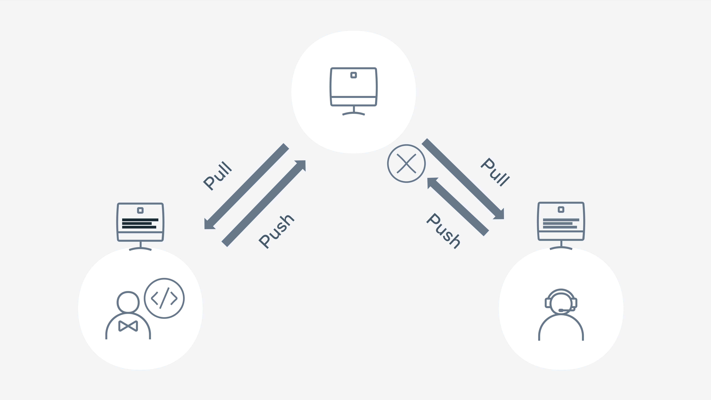

# Git 
### What is Git and GitHub?

Git is a version control system designed to help users keep track of changes to files within their projects. 

Git was designed to fix the problem that it's created, Linus Torvalds was having with managing the huge challenge of keeping track of all changes to the kernel, the operating system for Linux  
Linux has thousands of contributors who commit changes and updates daily. Git was designed to help with the challenge of tracking all these changes and updates.

GitHub is a Cloud-based hosting service that lets
you manage Git repositories from a user interface.
A Git repository is used to track
all changes to files in a specific folder,
and keep a history of all those changes. 

### Connecting to GitHub
When using Github via the Coursera platform, it is required to authenticate using a Personal Access Token over HTTPS. A Personal Access Token is a special password that you use instead of your actual account password. When you're finished using the token, you can revoke it so that it can no longer be used. It is also possible to set an expiry time for the token. This helps to keep your account secure.

This token can now be used when connecting to a repository over HTTPS.

When accessing a repository and using HTTPS authentication, make sure you have access/permission to connect, and then just use the HTTPS address for the Git repository itself. 

If you plan to use Github from your local device, the recommended way to authenticate is using Secure Shell, or SSH for short. This requires the creation of keys: a public and a private key. The advantage of using SSH is that you don't need to enter in your credentials when interacting with the remote repository. The keys are generated and stored on your local machine and then the public key is copied to the Github server. After you finish setting up, every operation will be authenticated using the keys.

### How Git works
when I clone a repo or initialize git in a dir there is a folder with `.git` name, it's hidden and used to track all the changes.  
This folder is automatically created when you create a repository.

> In Linux, any folder starting with a dot is a hidden folder.

As the repository was created on GitHub, it was not required for us to run it. GitHub handled all of this as part of its create new repo flow. 

### Workflow
Git uses workflows which can be broken into three states namely,
- modified, 
- staged, 
- committed. 

Let's start with the first state, adding removing and updating any file inside the repository is considered a modified state. Git knows the file has changed, but does not track it.

In order for Git to track a file, it needs to be put in the staged area. Once added, any modifications are tracked. Which offers a security blanket prior to committing the changes. Then, the last state is the committed state. Committing a file in Git is like a save point in many ways. Git will save the file, and have a snapshot of the current changes.


Suppose you have a workflow that contains the three stages just mentioned, as well as the remote repository:
- A file is added from the working directory to the staging area.
- From there the file is committed,  
- And then pushed to the remote repository.
- From the remote repository, the file can now be fetched and checked out, or merged to a working directory.

### Git commands, Add and commit
if you want to create a repo you either create it on GitHub and clone it on your machine or you initialize it on your machine and then push it to new repo (also need to create one on github)
##### Steps
First, create a repo on github

```bash
git init
git remote add origin <repo_link>
git push -u origin main
```
or you can clone the repo 
```bash
git clone <repo_link>
```
___
Before I add any files or make any changes, it's always good practice to check if any changes or commits are currently there. I can do this by using the `git status` command. 

Git status also displays what branch I'm on. 
```
on branch main
your branch is up to date with 'origin/main'
nothing to commit, working tree clean
```
This means that all the latest files on my local machine are exactly the same as what is displayed on the GitHub UI. 

Let's add a file 
```bash
echo "# test" >> README.md
```
the output of `git status` after adding a file
```bash
On branch main
No commits yet
Untracked files:
  (use "git add <file>..." to include in what will be committed)
	README.md
nothing added to commit but untracked files present (use "git add" to track)
```

Now git is telling me that I have an untracked file. It's also telling me that I have nothing added to the commit but that untracked files are present and that I should use git add to track them.  

The purpose of the git add command is that I'm essentially prompting git and letting it know that I want to track this file, and that it will be included as part of my commit. 
To do so:
```bash
git add README.md
``` 
to add readme file to staging phase if I want to add all my modification to staging phase I can type:
```bash
git add .
```
if I run `git status` now I'd get:
```bash
On branch main
No commits yet
Changes to be committed:
  (use "git rm --cached <file>..." to unstage)
	new file:   README.md
```

it's telling me that there are staged changes to be committed, which is this new file It prompts me asking if I want to revert those changes through:  
`git rm --cached README.md` or with
`git restore --stage README.md`  
Running the command will unstage the file from the commit.

How to run the git commit command.
First, type in `git commit`, you can pass in a flag of -m which stands for message, allowing you to type in a message which will be attached to the commit so, the final result:  
```bash
git commit -m "Adding a new file"

[main (root-commit) bc02976] Adding a new file
 1 file changed, 1 insertion(+)
 create mode 100644 README.md
```
if I run status command 
```bash
On branch main
Your branch is up to date with 'origin/main'.

nothing to commit, working tree clean
```
## Branches

To create a new branch, I use the `git checkout` command:
```bash
git checkout -B feature/lesson
``` 

But this is just one way to create a branch. I could also use `git branch` and pass in the name as well.
```bash
git branch feature/lesson
```
These methods are the same and
can both be used to create a branch.
The key difference between them is
that `git branch` just creates a branch.
But `git checkout -B` moves
me from the main branch into the branch that I created. 

I can verify that I've been moved between branches by running the `git branch` command.   
this command list all branches in the repo and which one I'm in.  
This will then tell me if I have switched from the main branch to one of the feature lesson branches, any changes that I make will now only occur in this new branch. 

It's important to remember that the main branch has no indication or knowledge of any of these changes even when push code to the main repository, this is because that branch exists in isolation.   
The new branch needs to be merged back into the main branch to recognize changes in the feature/lesson branch. 

This is where it'll come in with a pull request. The purpose of a pull request is to obtain a peer review of changes made to the branch.   
In other words, to validate that the changes are correct when coding, many teams will have conditions around the unit tests and integration tests. These conditions will usually include validating that the standards have been met for merging back into the main line, a team will also check for any issues that might have been missed. 

To push the changes to the remote repo:
```bash
git push -u origin feature/lesson
```
It's good practice to specify `-u`. This means that I'm only going to get updates from the upstream, which in this case will be the main branch. The result of this is that the origin won't be my main branch anymore. Instead, it's feature lesson. 
```bash
Enumerating objects: 4, done.
Counting objects: 100% (4/4), done.
Delta compression using up to 12 threads
Compressing objects: 100% (2/2), done.
Writing objects: 100% (3/3), 294 bytes | 294.00 KiB/s, done.
Total 3 (delta 0), reused 0 (delta 0), pack-reused 0 (from 0)
remote: 
remote: Create a pull request for 'feature/lesson' on GitHub by visiting:
remote:      https://github.com/omar-nafea/test/pull/new/feature/lesson
remote: 
To github.com:omar-nafea/test.git
 * [new branch]      feature/lesson -> feature/lesson
branch 'feature/lesson' set up to track 'origin/feature/lesson'.
```
It will then prompt me to create a pull requests that can be compared against another branch, in this case, the main branch. 

Next If I go to repo on github I'll see a compare & pull request green button and I'll click on it

A pull request lets the team know that I've made new changes that I want them to review and that I also want to approve or request changes to the actual pull request itself.  
Another thing to note on the GitHub UI is that I'm comparing this with the main branch. I've essentially cut a branch from the main called feature/lesson. 

And I made changes on this branch wether modifing the code or add more files or removing files the point is it's different from main branch so it need to be merged

I then click create pull request. The team will then review the changes and either approve or decline them. Once approved, you can then merge your changes to the main branch. 


Team decide on the naming conventions to use. In a lot of cases when adding a new feature, you can add the keyword feature then followed by the branch name, like a URL path, such as `feature/lesson` in this example. 

I'm going to merge the branch. Then I'll confirm the merge. Once confirmed, I'm presented with the option to delete the branch. 


I can then confirm that by going back to my command line.
Next, I look at `git status` again to check if there is something to commit. At this point, there's nothing outstanding. I'm still in the `feature/lesson` branch.
I can check out my main branch by
typing `git checkout main`.
Then I run the `git pull` command.
I'll then receive the latest changes that were merged in from the feature branch that I just created. 

```bash
remote: Enumerating objects: 1, done.
remote: Counting objects: 100% (1/1), done.
remote: Total 1 (delta 0), reused 0 (delta 0), pack-reused 0 (from 0)
Unpacking objects: 100% (1/1), 907 bytes | 907.00 KiB/s, done.
From github.com:omar-nafea/test
   bc02976..6e3e37b  main       -> origin/main
Updating bc02976..6e3e37b
Fast-forward
 hello.txt | 1 +
 1 file changed, 1 insertion(+)
 create mode 100644 hello.txt
```

## Remote vs. local

Remote refers to any other remote repository to which developers can push changes. This can be a centralized repository, such as one provided by Git hub or repositories on other developer devices. 

The remote code is accessed through a URI which is unique and only accessible to those who have permission local.   
local On the other hand refers to your machine which can be a laptop, desktop and is only accessible to you 

if there is a project is stored on a remote server. When a user wants to copy this project to their local device, they need to either perform a `clone` if it's the first time or pull it to get the latest changes. 

The user can make changes to the project after clone it and push those changes back to the server. **Other users working on the code base won't see those changes on their local machines unless they pull the latest changes from the server**. 

One of the advantages of it is that you can work offline and then commit your changes when you are ready. 

if I need to check the connection of a repo to github I type: `git remote -v`  
```
origin	git@github.com:omar-nafea/FullStack.git (fetch)
origin	git@github.com:omar-nafea/FullStack.git (push)
```
In this case we're going to add this URL to the remote settings by using the command.  
`git remote add` specifying a name and then passing in URI, the name that is typically used here is `origin`.
So I'll stick with that. So again the full command with the URL should read `git remote add origin git@github.com:gittutorials101/myfirstrepo.git.`

This time when I execute the `git remote -v command`. I have this set up against the `gittutorials101` which sits up on Git hub. 

What I'm going to do next is use the `git pull` command which will connect with 
the GitHub server, and pull down all the changes from the repository. 

So on my local I now have all the changes, but when I check the directory it's blank.   
The reason for this is that I haven't set up a branch that matches with what I have on the server repository. Fortunately I can change that by performing the command. `git checkout main` **Which will set up a branch main on my local that tracks the branch main from the remote**.
And now when I check my folder it confirms that I have files available on my local. 

### Push and pull

Before we begin, let's go over
the command line and perform the command git status. after committing changes and before push it to remote repo
```
On branch main
Your branch is ahead of 'origin/main' by 1 commit.
  (use "git push" to publish your local commits)
nothing to commit, working tree clean
```
Git tells me that my branch is ahead of the origin main branch by one commit. What this means is that all the changes that I have on my local repository are currently ahead of what is stored in the remote repository on GitHub that ties into Git's distributed workflow in which you can work in an offline state and then only ever communicate with a remote repository when you use the commands of git push or git pull. 

```bash
git push origin main

Enumerating objects: 7, done.
Counting objects: 100% (7/7), done.
Delta compression using up to 12 threads
Compressing objects: 100% (4/4), done.
Writing objects: 100% (4/4), 961 bytes | 961.00 KiB/s, done.
Total 4 (delta 2), reused 0 (delta 0), pack-reused 0 (from 0)
remote: Resolving deltas: 100% (2/2), completed with 2 local objects.
To github.com:omar-nafea/FullStack.git
   879b532..51b71ce  main -> main
```

After pushing  
Let's refresh the page on the GitHub website. You can see that my changes now appears on github. That's taken the commit snapshots that I have in my local repository and pushed it up to the remote repository. Git has then compared those files with what's on the remote repository to find any conflicts or problems.  
If none are found, it'll just merge them straight through, which is classed as an auto merge. If there are any conflicts, my push will fail.  
Before doing a push, it's also good practice to perform a `git pull` in order to get the latest changes from the remote repository and reduce the odds of encountering a conflict. 


Normally when you're working on a project, you could have several developers all submitting with different branches, different code, and different features. In order for you to get those changes, you need to use the git pull command. 

If I do changes directly from github ui or other developer do changes and he pushed it remotely   
The changes now appear on the UI. But because I haven't used the git pull command on my local machine yet, I should have no content on my local machine of the changes that happened remotely


I need to run the command `git pull`  
This will get the latest changes from the remote repository. If any new changes were added, it'll be reflected in the shell output. I run the command, and in this case, Git tells me that one file has changed with one insertion. 
```bash
git pull
remote: Enumerating objects: 5, done.
remote: Counting objects: 100% (5/5), done.
remote: Compressing objects: 100% (2/2), done.
remote: Total 3 (delta 0), reused 0 (delta 0), pack-reused 0 (from 0)
Unpacking objects: 100% (3/3), 973 bytes | 973.00 KiB/s, done.
From github.com:omar-nafea/test
   6e3e37b..3b9e05a  main       -> origin/main
Updating 6e3e37b..3b9e05a
Fast-forward
 hello.txt | 1 +
 1 file changed, 1 insertion(+)
```


### Resolving conflicts

Conflicts will normally occur when you try to merge a branch that may have competing changes. Git will normally try to automatically merge (auto-merge), but in the case of a conflict, it will need some confirmation. The competing changes need to be resolved by the end user. This process is called merging or rebasing. 

The developer must look at the changes on the server and their local and validate which changes should be resolved.

A merge conflict example is when two developers work on their dependent branches. Both developers are working on the same file called Feature.js. Each of their tasks is to add a new feature to an existing method.  
Developer 1 has a branch called feature1, and   
developer 2 has a branch called feature2. 

Developer 1 pushes the code with the changes to the remote repository. Developer 2 pushes their changes.  



Let's walk through how this would happen in Git. Both developers 1 and 2 check out the main repository on Monday morning. They both have the same copy. Both developers check out a new branch - feature 1 and 2.
```
git checkout -b feature1
```
```
git pull
git checkout -b feature2
```
Developer 1 makes their changes to a file called Feature.js and then commits the changes to the repository for approval via a PR (pull request)
```
git add Feature.js
git commit -m 'chore: added feature 1!!'
git pull origin main
git push -u origin feature1
```

The PR is reviewed and then merged into the main branch. Meanwhile, Developer 2 is starting to code on his feature. Again, they go through the same process as Developer 1:
```
git add Feature.js
git commit -m 'chore: added feature 2!!!'
git pull origin main

From github.com:demo/demo-repo
 * branch            main       -> FETCH_HEAD
   9012934..d3b3cc0  main       -> origin/main
Auto-merging Feature.js
CONFLICT (content): Merge conflict in Feature.js
Automatic merge failed; fix conflicts and then commit the result.
```
Git lets us know that a merge conflict has occurred and needs to be fixed before it can be pushed to the remote repo. Running git status will also give us the same level of detail:
```
git status
On branch feature2
You have unmerged paths.
  (fix conflicts and run "git commit")
  (use "git merge --abort" to abort the merge)

Unmerged paths:
  (use "git add <file>..." to mark resolution)
        both modified:   Feature.js

no changes added to commit (use "git add" and/or "git commit -a")
```
In order to merge, Developer 2 needs to see and compare the changes from Developer 1. It is good practice to first see what branch is causing the merge issue. Developer 2 runs the following command:
```
git log --merge

commit 79bca730b68e5045b38b96bec35ad374f44fe4e3 (HEAD -> feature2)
Author: Developer 2 
<developer2@demo.com>
Date:   Sat Jan 29 16:55:40 2022 +0000

    chore: add feature 2

commit 678b0648107b7c53e90682f2eb8103c59f3cb0c0
Author: Developer 1 
<developer1@demo.com>
Date:   Sat Jan 29 16:53:40 2022 +0000

    chore: add feature 1
```
We can see from the above code that the team's conflicting changes occurred in feature 1 and 2 branches. Developer 2 now wants to see the change that is causing the conflict.
```bash
git diff

diff --cc Feature.js
index 1b1136f,c3be92f..0000000
--- a/Feature.js
+++ b/Feature.js
@@@ -1,4 -1,4 +1,8 @@@
  let add = (a, b) => {
++<<<<<<< HEAD
 +  if(a + b > 10) { return 'way too much'}
++=======
+   if(a + b > 10){ return 'too much' }
++>>>>>>> d3b3cc0d9b6b084eef3e0afe111adf9fe612898e
    return a + b;
  }
```
The only difference is the wording in the return statement. Developer 1 added 'too much,' but Developer 2 added 'far too much. Everything else is identical in terms of merging and it's a pretty easy fix. Git will show arrows `<<< >>>` to signify the changes. Developer 2 removes the markers so the code is ready for submission:
```
let add = (a, b) => {
  if(a + b > 10) { return 'way too much'}
  return a + b;
}
```
```
git add Feature.js
git commit -m 'fix merge conflicts'
git push -u origin feature2
```
Developer 2 has now fixed a merge conflict and can create their PR to get the code merged into the main line.


### Forking

In previous lessons, you have touched on workflows such as branching and how they can be used to simplify a process for a team. Forking is another type of workflow. The key difference between branching and forking is that the workflow for forking creates a new repository entirely. Branching cuts a new branch from the same repository each time and each member of the team works on the single repository.

Let's take a simple example of how forking works. In the diagram below the coolgame repo has been forked by Joe. The entire contents and the history of the repository are now stored in Joe's account on GitHub. Joe is now free to make edits and changes to the repository at his own will. You, the owner of the coolgame repository can continue to work as normal and not know about Joe's edits or changes.

                 

Joe created a new branch on his repository and added a new cool feature that he felt was needed. In order for Joe to get his feature back into the original repository, he will need to create a PR as normal but instead of comparing with the main branch, it needs to be compared with the original repository. Essentially the two repositories are compared against each other. The owner of the original repository can then review the PR and choose to accept or decline the new feature.

Let us take a look at how you can fork an existing repository that is available on GitHub. For this example, we used a repository we can access on GitHub.

Step 1: If you have access to your own repository on GitHub, you can access this now to follow along.

Step 2: Click on the Fork button on the top right of the page.

  

Step 3: It will then prompt you to fork the repository to your desired account. Choose the account you wish to fork to.

  

Step 4: Github will then clone the repository into your chosen GitHub account.

In a couple of steps, you have successfully forked a repository into our own GitHub account. The full repository is cloned and allows us to work directly in that repository as if it was our own.

On the landing page of the GitHub repository, it will show directly under the repository name that it was forked from Meta-Front-End-Developer-PC/forking-lesson.

  


Other subtle differences in the GitHub UI on a forked branch is the top information bar above the files.


It now shows that the branch is up to date with forking-lesson:main. It also adds a Fetch upstream drop-down to allow you to pull and merge the latest changes from the original repository.
GitHub shows that the branch is up to date.
Example

Let's run through a typical flow of creating a new branch and adding some new content.

Step 1: Clone the repository.

Step 2: Create a new branch.

`git checkout -b test/forking-example`

Step 4: Create a new file and commit it to the repository.

`touch text.txt`  
`git add .`  
`git commit -m 'chore: testing'`   

Step 5 Push the branch to your remote repository.

`git push -u origin test/forking-example` 

Step 6: Go to Github and click the Compare & pull request button. If it's not available, click on the branch dropdown button and change it from main to the branch name of test/forking-example:

  


After clicking the Compare & pull request button it will now redirect to the original repository in order to create the PR.
  


Each repository will have its own guidelines for submitting PRs against them and usually provide a how-to contribute guide. As you can see, in order to get the changes from our forked repository, you need to compare it against the original. This gives a lot of control to the repository owners of the original and they get to decide what makes the cut to be merged in.

In this lesson you covered the basics of forking a repository, adding some changes, and then creating a PR to get it back to the original repository.
