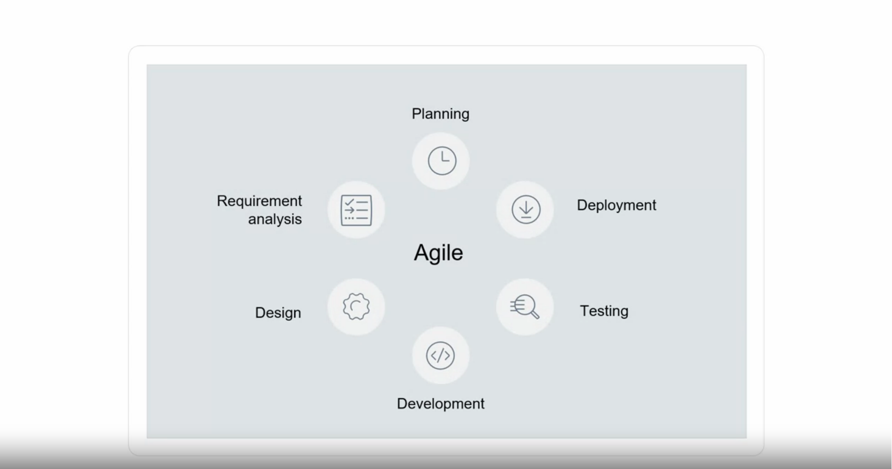
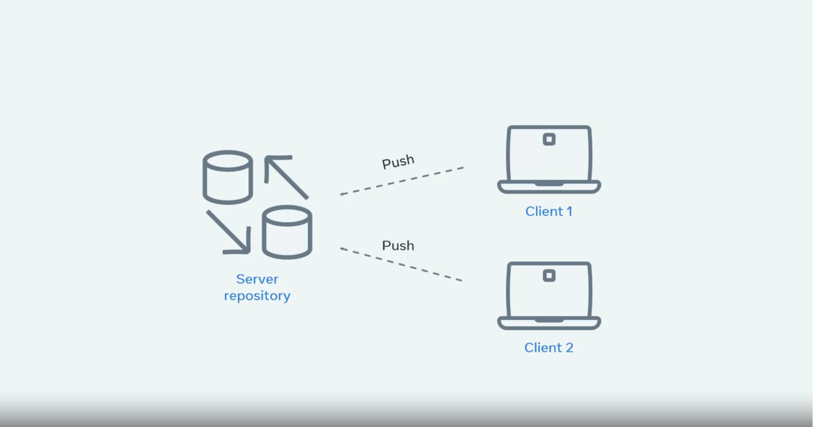

# Introduction to version control

Version control is a system that records all changes and modifications to files for tracking purposes. 

The primary goal of any version control system is to keep track of changes. It achieves this by allowing developers access to the entire change history with the ability to revert or roll back to a previous state or point in time. 

There are different types of changes such as: Adding new files, Modifying, Updating files, Deleting files.

Benefits associated with version control.
These include: Revision history, Identity, Collaboration, Automation, Efficiency.

***Revision history*** provides a record of all changes in a project. It provides developers with the ability to revert to a stable point in time in cases where code edits cause issues or bugs

All changes made are always recorded with the ***Identity*** of the user that made them. Combining this feature with the revision history allows teams to see not only when the changes occurred, but also who made the changes. 

Version control system allows the team to submit their code and keep track of any changes that need to be made.

Developers working on a task create a ***Peer review*** once the code is ready for inspection. The peer review aims to get other developers on your team to review the code and provide feedback where necessary. 

You and your team may work using processes from the agile methodology. In an agile process, a team normally plan and execute two weeks of work to complete, which is called an iteration.   

  

Each iteration has a list of tasks to complete before the two weeks ends. These tasks, while complex in some cases, are aided by having version control in place. 

## Systems of version control and tools

Version control systems can be split into two types or categories.

### Centralized version control systems

Centralized version control systems, or CVCS for short, contain a server and a client.

- The server contains the main repository that houses the full history of versions of the code base.
- Developers working on projects using a centralized system need to pull down the code from the server to their local machine. This gives the developer their own working copy of the code base.
- The server holds the full history of changes. The client has the latest code, but every operation needs to have a connection to the server itself.  
- In a centralized version control system, the server is the central copy of the project. After making changes to the code, the developer needs to push the changes to the central server so that other developers can see them.  

  

- The advantage of CVCS is that they are considered easier to learn than their distributed counterparts. They also give more access controls to users.   
- The disadvantage is that they can be slower given that you need to establish a connection to the server to perform any actions. 

## Distributed version control systems. 

Distributed version control systems or DVCS for short, are similar to the centralized model.

- You still need to pull code down from the server to view the latest changes.
- The key difference is that every user is essentially a server and not a client.  

This means that every time you pull down code from the distributed model, **you have the entire history of changes on your local system**. 

The advantage of DVCS, you don't need to be connected to the server to add your changes or view a file's history. It works as if you are actually connected to the server directly but on your own local machine. You only ever need to connect to the server to pull down the latest changes or to push your own changes. 

Version Control must be complemented by other tools and procedures to ensure quality and efficiency throughout the software development process:

#### Workflow

Using Version Control without a proper workflow is like building a city without traffic lights; without appropriate management, everything will turn into chaos.

For example, let’s say you’re working on a big project and editing a file. Another developer also starts editing a file. Both of you submit the file to the VCS at the same time. Now there’s a conflict! How should the conflict be resolved? A good workflow will have a process for resolving conflicts.

Another example is when a new junior developer is joining your team. If the project code is used for a critical system, it is risky to allow them to submit code changes directly. To solve this, many developers use a peer review system where another developer must review code before it can be merged in.

##### Continuous Integration

Continuous Integration, or CI, is used to automate the integration of code changes from multiple developers into a single main stream. Using a workflow whereby small changes are merged frequently, often many times per day, will reduce the number of merge conflicts.

This process is widespread in test-driven software development strategies. CI is often used to automatically compile the project and run tests on every code change to ensure that the build remains stable and prevent regressions in functionality.

##### Continuous Delivery

Continuous Delivery is an extension of Continuous Integration. Once the changes have been merged into the main stream, a Continuous Delivery system automatically packages the application and prepares it for deployment. This helps avoid human error when packaging the application.

##### Continuous Deployment

Continuous Deployment is an extension of Continuous Delivery. The goal of Continuous Deployment is to deploy and release software to customers frequently and safely. The strategy commonly involves automatically deploying to a test environment first (also known as staging) to validate the deployment package and software changes. Once validated, it can automatically deploy to the live environment (also known as production) for customers.

### A history of revisions
When working with a team of developers, it's essential for the codebase to have a source of truth that has all historical changes. Version control systems play an integral part in aiding this process by providing a full history of changes of every single file added to its repository. 

The revision history will record the essential data points so any developer can walk through the entire project from start to its current state. Every change that has occurred on the project should be easily accessible by a simple command.

##### The process

After writing the code, After all the code changes, the developer will push their changes to the repository and create something called a `pull request`. Developers will then peer review the pull request to approve request changes or decline. 

When working on a single project, there's usually some level of crossover between the developers.  
When this does occur, the history of revisions can help aid the developers in seeing the full life cycle of changes that have occurred.  
It is also essential for merging conflicts where multiple developers have made changes that may need to be resolved prior to the code being approved.  
The history will show who made the change, for what reason, the code itself and its changes, and the date and time of when they occurred.   

### Development Environments

Every development team prior to releasing their new features or changes needs to verify that the code they do release is not going to cause any issues or bugs. In order to achieve this, they normally set up multiple environments for different ways to test and verify.  A common practice is for teams to have a developer environment, a UAT or QA environment, and a staging environment. The main purpose of this flow is to find any potential issues that may arise due to changes or new features being added to the codebase. The more ways to test the changes the less likely bugs will be introduced.

### Staging

The staging environment should mimic your production environment. The reason for this is because you want to test the code in an environment that matches what you have in production. This allows teams to spot or find any potential issues prior to them getting to production. The closer the staging environment is to your production, the more accurate your testing is going to be. Staging environments can also be used for testing and verifying new features and allow other teams including QA or stakeholders to see and use those features as a pre-trial. Staging should also cover all areas of the architecture of the application including the database and any other services that may be required. Areas that benefit from staging environments include:

##### New Features

Developers submitting new features along with feature flags for turning them on and off should always do a testing round in a staging environment. They allow teams to verify that the feature works, it can be turned on and off via configuration flags and also that it does not break or interfere with existing functionality.

##### Testing

As the staging environment mimics your production environment, it's also a great place to run tests. QA teams will normally use it to verify new features, configuration changes or software updates/patching. The types of testing covered will be Unit testing, Integration testing and performance testing. All except performance testing can also be carried out in production. Performance can also be completed in production but only at specific times - usually out of hours as it will have a drastic effect on the user experience.

Sometimes it is not always feasible to have an exact replication either due to costs or time. Certain areas can be cut back - for example, if your service is load balanced on 10 virtual machines in production, you could still have 4 virtual machines in staging. The underlying architecture is the same but the overall performance may be different.

##### Migrations

Staging is a perfect place to test and verify data migrations. Snapshots can be taken from production and used to test your migration scripts to confirm your changes will not break anything. If in the case it does cause an issue, you simply rollback and try again. Doing something like a migration in production is extremely risky and error-prone.

##### Configuration Changes

Configuration can also cause headaches for teams, especially in a large cloud-based architecture. Having a staging environment will allow you to spot any potential issues or bottlenecks.

### Production

Production is live. It's out there for people to see and/or interact with. Any issues or problems you may have had should have been caught and fixed in the staging environment. The staging area gives the team a safety net to catch these possible issues. Any code that is deployed to production should have been tested and verified before the deployment itself. 

##### Downtime

Downtime for any service especially customer facing will most likely be revenue impacting. If customers can not access or use your website or app to its full capabilities, it will most likely have a cost involved. Take for example an e-commerce company that allows users to buy goods and services online. If they release a new feature to their shopping cart which actually breaks the payment process, this will have an impact on customers not being able to buy goods online.

##### Vulnerabilities

Cyber-security should also play a big role in what gets released in production. Any updates to software such as patching or moving to the latest version should be checked and verified. This is also the same rule for not upgrading software when critical updates are released.

##### Reputation

Downtime or issues in production is damaging for a company as it does not instill confidence in end users. If something is down or broken it can cause the company to lose potential customers.
