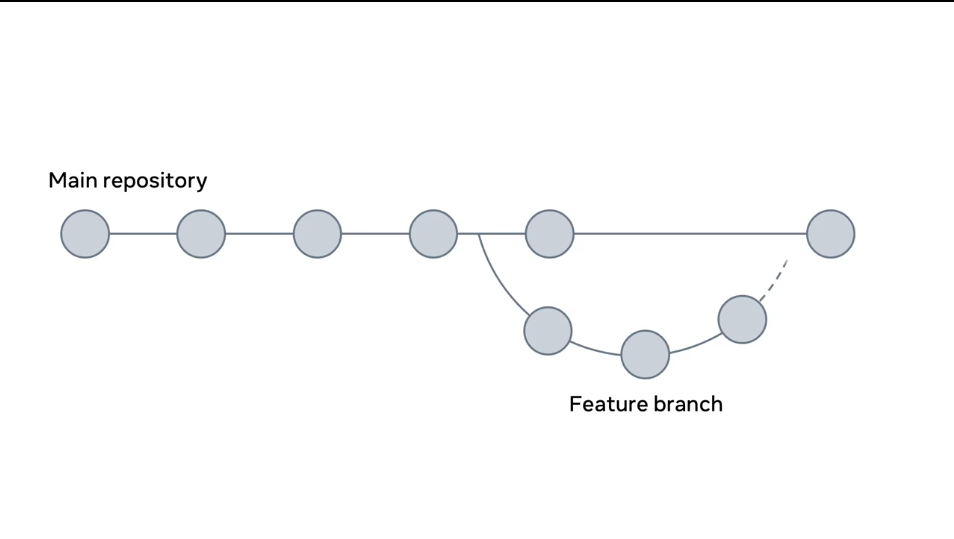
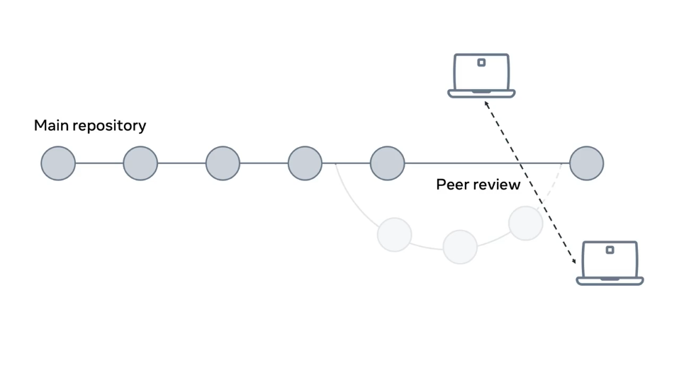
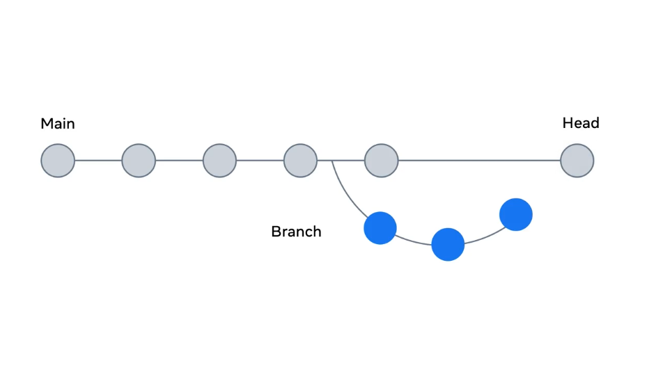
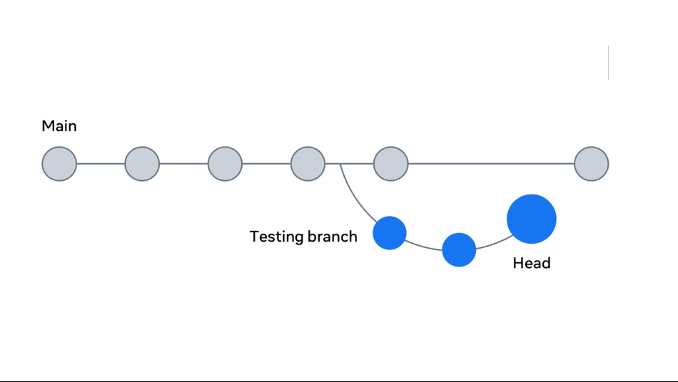
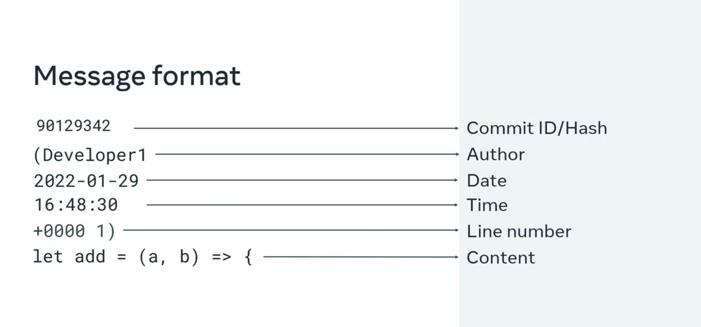

## Workflow

- first need to pull the project down from a remote repository to your local machine.  
- When you're done making changes, you have to push the changes you made back to the remote repository so other developers can see them.  

##### Feature branching
Feature branching means you create a new branch from the main line and work on this dedicated branch until the task is completed.  
  

Every code base has a main repository which is essentially _**the source of truth**_ for the application. All changes such as:   
- add 
- edit  
- delete  

are submitted directly to the feature branch, the main branch stays as is. When you are ready and happy with the code you have added, you have to commit the changes and then push to the server repository.   
To commit, you push the changes and as it's a feature branch, a pull request follows.   
The pull request is compared to the main branch, so developers who peer reviewed the code can see exactly what was changed.  
Once it's reviewed and approved, it can then be merged into the mainline. 
  


Before creating a new branch, ***Always ensure you have the latest code.***  
You can do this by running the `git pull` command to pull the latest code from the remote repository.  
Next you need to create your new branch. `git checkout -b name_of_new_branch`  

Next, let's make changes ,type `git add .`  
Next, we need to commit the changes, `git commit -m "updated"`  
Now changes added to the local branch, this means that the file is only visible locally to you.  
To allow other developers to see the changes, you need to push the file to the remote repository:  
`git push -u origin feature/my-new-feature`   

## HEAD

`.git` folder is responsible for keeping track of all changes across the project.   

### How does it know what branch you're currently on?

It keeps a special pointer called head which is one of the files inside the dot git folder. This file refers to the current committee you are viewing.   
```bash
ll -a .git
drwxr-xr-x   8 omar users  4096 Oct 21 17:48 .
drwxr-xr-x   9 omar users  4096 Oct 20 12:59 ..
# this the HEAD file 
-rw-r--r--   1 omar users    21 Oct 18 14:55 HEAD
```



### How to identify the current committee you are working on?  

In git we only work on a single branch at a time. This file also exists inside
the `.git` folder 
```bash
cd .git
cat HEAD
# ref: refs/heads/main
cat refs/heads/main
3b9e05a33dd422420e41de73058cca97682408f5
```
This single hashed ID is a reference for the current commit. Let's switch branches to see how the head is moved to point to a new branch. 
```bash
git checkout testing
git branch
# main
# * testing
```


This moves the head to point to the testing branch. We have two branches, the main and testing branch. When you run the `checkout` command, it moves the head to now point to the testing branch, to check the contents of the head file inside the dot git folder.   

  


Now let's demonstrate how git head works with a simple example. 


```bash
git branch
#   feature/lesson
# * main
cat .git/refs/heads/main
# 3b9e05a33dd422420e41de73058cca97682408f5
git checkout feature/testing-branches
cat .git/HEAD
# ref: refs/heads/feature/testing-branches
cat refs/heads/feature/testing-branches
# 0775718a3f6c04c961918c550e814387d95dea90
vim README.md
# modifying the file
git add .
cat refs/heads/feature/testing-branches
# 0775718a3f6c04c961918c550e814387d95dea90
# Notice even after add the file (staging phase) it doesn't affect the commit id
git commit -m "updating README file"
cat refs/heads/feature/testing-branches
# 6e48196461932c5b9eabaf268a9a05db89c57ebd
# Notice only after commiting the new modification it give me the new commit id 
# And If I type git log I'll git all commit ids
```
```bash
git log feature/lesson
commit 6e48196461932c5b9eabaf268a9a05db89c57ebd (feature/lesson)
Author: omar-nafea <omarahmednafea248@gmail.com>
Date:   Wed Oct 23 10:41:28 2024 +0300

    Updated

commit 0775718a3f6c04c961918c550e814387d95dea90 (origin/feature/lesson)
Author: omar-nafea <omarahmednafea248@gmail.com>
Date:   Sun Oct 20 17:43:56 2024 +0300

    adding test file

commit bc02976866dac136b6dd08efdcb3d9285f2686e4
Author: omar-nafea <omarahmednafea248@gmail.com>
Date:   Sun Oct 20 17:27:20 2024 +0300

    Adding a new file
```
### log

Remember I can get the log by `git log` of 
- file
- branch
- commits


### Git Diff
Git diff will compare the previous version of the file with your current one to find any differences. It will then tell you specifically what content has been removed as well as what content has been added to the file.


Diff is used to make comparisons against files on your local repository. It can also be used against commits and against branches.

If I made a change in any file (hello.txt for example)

Next, I'm going to use the git diff tool to compare the updated file against the head.  
Because we haven't yet completed a commit. It's not available for a comparison against another commit. I'll input git diff passing the head as the first option, and then finally the file name.  

This then returns an output showing the changes that occurred in each file. Here, the line starting with a minus symbol represents
what it originally was. While the line with a plus symbol shows what it is now.  

`git diff HEAD hello.txt`
```bash
diff --git a/hello.txt b/hello.txt
index f3c51d9..9d66f23 100644
--- a/hello.txt
+++ b/hello.txt
@@ -1,2 +1,2 @@
-testing text
 this is a change to use git pull
+try diff command
```


In addition to individual files, you can also make comparisons against previous commits. I'll start by using the `git log` command to display my history of commits. I'll also use the `--pretty` flag here so that each one is shown in `oneline`. Each commit has its own ID code. So I'll perform a `git diff` command on the codes from the most recent commit and from the very first one.  
```bash
git log --pretty=oneline
3be1af5883b7eeecab1cef3100dcc92019c540e8 (HEAD -> main) Updated
3b9e05a33dd422420e41de73058cca97682408f5 (origin/main) Update hello.txt
6e3e37beb847a1868df65cafabf47419b84bc633 Merge pull request #1 from omar-nafea/feature/lesson
0775718a3f6c04c961918c550e814387d95dea90 (origin/feature/lesson) adding test file
bc02976866dac136b6dd08efdcb3d9285f2686e4 Adding a new file
```
If I compared two commits IDs,
```bash
git diff 3be1af5883b7eeecab1cef3100dcc92019c540e8 0775718a3f6c04c961918c550e814387d95dea90
# the output:
diff --git a/hello.txt b/hello.txt
index 6ad7048..390fe2b 100644
--- a/hello.txt
+++ b/hello.txt
@@ -1,2 +1 @@
-this is a change to use git pull and stuff
-try diff command
+testing text
```
Git will go through all the files, note all the changes that have occurred, and return the differentiation between the two.

how to use git diff to compare branches
```bash
git branch
#   feature/lesson
# * main
git diff main feature/lesson
# the output:
diff --git a/hello.txt b/hello.txt
index 6ad7048..1a24f47 100644
--- a/hello.txt
+++ b/hello.txt
@@ -1,2 +1,2 @@
-this is a change to use git pull and stuff
-try diff command
+testing text
+changing commit id
```

### Git Blame

git has a
very helpful command for keeping track of
who did what and when. It's called git blame. 

One of the core functions of git is its ability to track and record the full
history of changes for every file in
the repository.  

In order to view and
verify those changes, git provides a set of
tools to allow users to step through the
history and view the edits made to each file.

The git blame command
is used to look at changes of a specific
file and show the dates, times, and users who
made the changes.

To run the git blame command, type git blame and the name of the file. git will returns a list of all changes on the file.

```bash
git blame hello.txt
3be1af58 (omar-nafea 2024-10-23 11:05:23 +0300 1) this is a change to use git pull and stuff
3be1af58 (omar-nafea 2024-10-23 11:05:23 +0300 2) try diff command
```



- The ID is a reference ID of the commit. The same ID might appear in several lines. This happens when a single commit has been made by
the same developer. 
- The author is the person who created the commit. 
- The timestamp is the date and time when the changes were committed. 
- Line number represents the location in the file or the exact line where the changes were made. 
- The content is the code that was added to the file.

If I want to apply this to actual multi- developer project

```bash
cd mkdocs
git blame setup.py
30cdac47a (Oleh Prypin     2022-10-07 00:42:48 +0200  1) """Installation using setup.py is no longer supported.
30cdac47a (Oleh Prypin     2022-10-07 00:42:48 +0200  2) Use `python -m pip install .` instead."""
fca0ff6f9 (Tom Christie    2014-01-11 21:04:32 +0000  3) 
fca0ff6f9 (Tom Christie    2014-01-11 21:04:32 +0000  4) import sys
fca0ff6f9 (Tom Christie    2014-01-11 21:04:32 +0000  5) 
30cdac47a (Oleh Prypin     2022-10-07 00:42:48 +0200  6) from setuptools import setup
c3ab1cc95 (Dougal Matthews 2015-04-10 19:11:57 +0100  7) 
30cdac47a (Oleh Prypin     2022-10-07 00:42:48 +0200  8) sys.exit(__doc__)
fca0ff6f9 (Tom Christie    2014-01-11 21:04:32 +0000  9) 
30cdac47a (Oleh Prypin     2022-10-07 00:42:48 +0200 10) # Fake reference so GitHub still considers it a real package for statistics purposes.
fca0ff6f9 (Tom Christie    2014-01-11 21:04:32 +0000 11) setup(
ad7df6390 (Dougal Matthews 2015-04-21 16:32:37 +0100 12)     name="mkdocs",
fca0ff6f9 (Tom Christie    2014-01-11 21:04:32 +0000 13) )
```


git blame offers a flag to visual specific lines

```bash
git blame -L 5,10 setup.py
fca0ff6f9 (Tom Christie    2014-01-11 21:04:32 +0000  5) 
30cdac47a (Oleh Prypin     2022-10-07 00:42:48 +0200  6) from setuptools import setup
c3ab1cc95 (Dougal Matthews 2015-04-10 19:11:57 +0100  7) 
30cdac47a (Oleh Prypin     2022-10-07 00:42:48 +0200  8) sys.exit(__doc__)
fca0ff6f9 (Tom Christie    2014-01-11 21:04:32 +0000  9) 
30cdac47a (Oleh Prypin     2022-10-07 00:42:48 +0200 10) # Fake reference so GitHub still considers it a real package for statistics purposes.
```

tips around git blame now. Firstly, you can change the format of how the list is displayed.
if you run git blame -l, followed by the filename, the hash dash ID is in its full length form.

```bash
git blame -l setup.py
30cdac47a93a1752645a343e8732cc57e9e28ba1 (Oleh Prypin  2022-10-07 00:42:48 +0200 1) """Installation using setup.py is no longer supported.
30cdac47a93a1752645a343e8732cc57e9e28ba1 (Oleh Prypin  2022-10-07 00:42:48 +0200 2) Use `python -m pip install .` instead."""
fca0ff6f93b6478eac6f2a6d77f46bed5044750f (Tom Christie 2014-01-11 21:04:32 +0000 3) 
fca0ff6f93b6478eac6f2a6d77f46bed5044750f (Tom Christie 2014-01-11 21:04:32 +0000 4) import sys
fca0ff6f93b6478eac6f2a6d77f46bed5044750f (Tom Christie 2014-01-11 21:04:32 +0000 5) 
```

You can also control if you want to show email addresses or change the date format.


Secondly, another aspect of using git blame
is that you can see detail changes or the
actual commit changes of a specific hash dash ID.
Now, I will use ID with a `git log -p ID` This gives you the actual
change occurred in that commit.


##### conclusion

git blame will display to you the point where it was changed, git log will give you the detail of the change. I always use the two in conjunction to get more details about what changes occurred.


```bash
git log -p 3be1af5883b7eeecab1cef3100dcc92019c540e8
commit 3be1af5883b7eeecab1cef3100dcc92019c540e8 (HEAD -> main)
Author: omar-nafea <omarahmednafea248@gmail.com>
Date:   Wed Oct 23 11:05:23 2024 +0300

    Updated

diff --git a/hello.txt b/hello.txt
index f3c51d9..6ad7048 100644
--- a/hello.txt
+++ b/hello.txt
@@ -1,2 +1,2 @@
-testing text
-this is a change to use git pull
+this is a change to use git pull and stuff
+try diff command

commit 3b9e05a33dd422420e41de73058cca97682408f5 (origin/main)
Author: omar nafea <90737656+omar-nafea@users.noreply.github.com>
Date:   Mon Oct 21 14:53:35 2024 +0300

    Update hello.txt

diff --git a/hello.txt b/hello.txt
index 390fe2b..f3c51d9 100644
--- a/hello.txt
+++ b/hello.txt
@@ -1 +1,2 @@
 testing text
+this is a change to use git pull

commit 6e3e37beb847a1868df65cafabf47419b84bc633
Merge: bc02976 0775718
Author: omar nafea <90737656+omar-nafea@users.noreply.github.com>
Date:   Sun Oct 20 18:08:40 2024 +0300

    Merge pull request #1 from omar-nafea/feature/lesson
    
    adding test file

commit 0775718a3f6c04c961918c550e814387d95dea90 (origin/feature/lesson)
Author: omar-nafea <omarahmednafea248@gmail.com>
Date:   Sun Oct 20 17:43:56 2024 +0300

    adding test file

diff --git a/hello.txt b/hello.txt
new file mode 100644
index 0000000..390fe2b
--- /dev/null
+++ b/hello.txt
@@ -0,0 +1 @@
+testing text

commit bc02976866dac136b6dd08efdcb3d9285f2686e4
Author: omar-nafea <omarahmednafea248@gmail.com>
Date:   Sun Oct 20 17:27:20 2024 +0300

    Adding a new file

diff --git a/README.md b/README.md
new file mode 100644
index 0000000..83c831f
--- /dev/null
+++ b/README.md
@@ -0,0 +1 @@
+# test
```