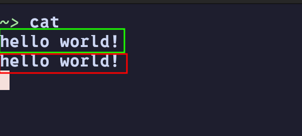
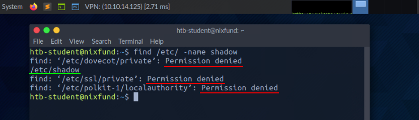
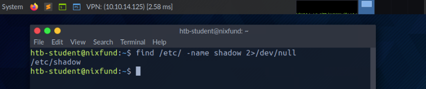
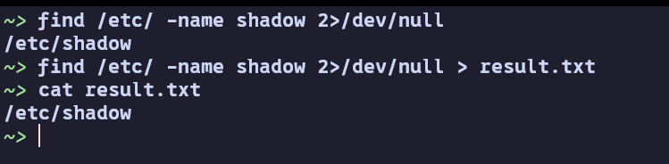
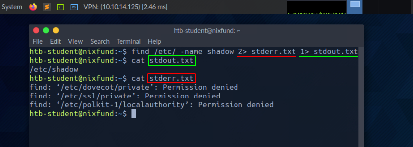
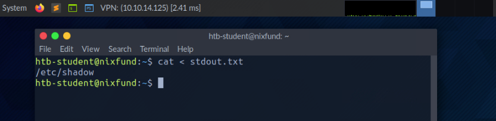
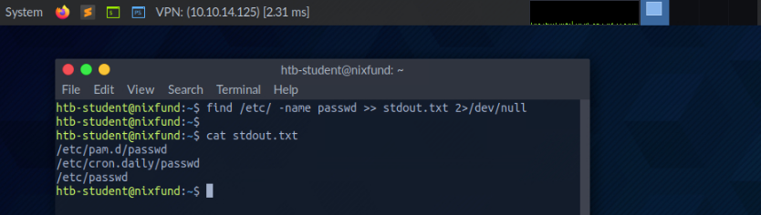
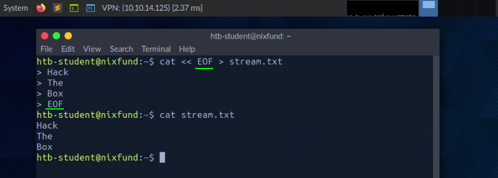
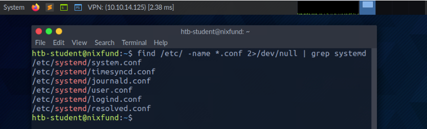
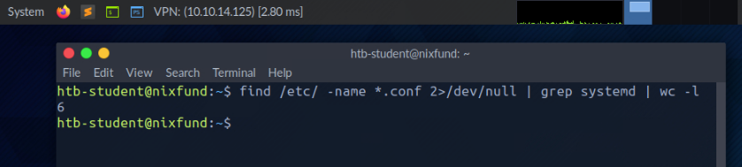

# Introductoin to Linux

### Philosophy

| Principle                                                   | Description                                                                                                                                                    |
|-------------------------------------------------------------|----------------------------------------------------------------------------------------------------------------------------------------------------------------|
| Everything is a file                                        | All configuration files for the various services running on the Linux operating system are stored in one or more text files.                                   |
| Small, single-purpose programs                              | Linux offers many different tools that we will work with, which can be combined to work together.                                                              |
| Ability to chain programs together to perform complex tasks | The integration and combination of different tools enable us to carry out many large and complex tasks, such as processing or filtering specific data results. |
| Avoid captive user interfaces                               | Linux is designed to work mainly with the shell (or terminal), which gives the user greater control over the operating system.                                 |
| Configuration data stored in a text file                    | An example of such a file is the /etc/passwd file, which stores all users registered on the system.                                                            |

### Components

| Component       | Description|
|-----------------|-------------------------------------------------------------------------------------------------------------------------------------------------------------------------------------------------------------------------------------------------------------------------------------------------------------------------------------------------|
| Bootloader      | A piece of code that runs to guide the booting process to start the operating system. Parrot Linux uses the GRUB Bootloader.                                                                                                                                                                                                                    |
| OS Kernel       | The kernel is the main component of an operating system. It manages the resources for system's I/O devices at the hardware level.                                                                                                                                                                                                               |
| Daemons         | Background services are called "daemons" in Linux. Their purpose is to ensure that key functions such as scheduling, printing, and multimedia are working correctly. These small programs load after we booted or log into the computer.                                                                                                        |
| OS Shell        | The operating system shell or the command language interpreter (also known as the command line) is the interface between the OS and the user. This interface allows the user to tell the OS what to do. The most commonly used shells are Bash, Tcsh/Csh, Ksh, Zsh, and Fish.                                                                   |
| Graphics server | This provides a graphical sub-system (server) called "X" or "X-server" that allows graphical programs to run locally or remotely on the X-windowing system.                                                                                                                                                                                     |
| Window Manager  | Also known as a graphical user interface (GUI). There are many options, including GNOME, KDE, MATE, Unity, and Cinnamon. A desktop environment usually has several applications, including file and web browsers. These allow the user to access and manage the essential and frequently accessed features and services of an operating system. |
| Utilities       | Applications or utilities are programs that perform particular functions for the user or another program.|

### Linux Architecture

| Layer          | Description|
|----------------|----------------------------------------------------------------------------------------------------------------------------------------------------------------------------------------------------------------------------------------------------------------------------------------------------|
| Hardware       | Peripheral devices such as the system's RAM, hard drive, CPU, and others.                                                                                                                                                                                                                          |
| Kernel         | The core of the Linux operating system whose function is to virtualize and control common computer hardware resources like CPU, allocated memory, accessed data, and others. The kernel gives each process its own virtual resources and prevents/mitigates conflicts between different processes. |
| Shell          | A command-line interface (CLI), also known as a shell that a user can enter commands into to execute the kernel's functions.                                                                                                                                                                       |
| System Utility | Makes available to the user all of the operating system's functionality.                                                                                                                                                                                                                           |
### File System Hierarchy

The Linux operating system is structured in a tree-like hierarchy and is documented in the Filesystem Hierarchy Standard (FHS). Linux is structured with the following standard top-level directories:

| Path   | Description                                                                                                                                                                                                                                                                                                                        |
|--------|------------------------------------------------------------------------------------------------------------------------------------------------------------------------------------------------------------------------------------------------------------------------------------------------------------------------------------|
| `/`      | The top-level directory is the root filesystem and contains all of the files required to boot the operating system before other filesystems are mounted, as well as the files required to boot the other filesystems. After boot, all of the other filesystems are mounted at standard mount points as subdirectories of the root. |
| `/bin`   | Contains essential command binaries.                                                                                                                                                                                                                                                                                               |
| `/boot`  | Consists of the static bootloader, kernel executable, and files required to boot the Linux OS.                                                                                                                                                                                                                                     |
| `/dev`   | Contains device files to facilitate access to every hardware device attached to the system.                                                                                                                                                                                                                                        |
| `/etc`   | Local system configuration files. Configuration files for installed applications may be saved here as well.                                                                                                                                                                                                                        |
| `/home`  | Each user on the system has a subdirectory here for storage.                                                                                                                                                                                                                                                                       |
| `/lib`   | Shared library files that are required for system boot.                                                                                                                                                                                                                                                                            |
| `/media` | External removable media devices such as USB drives are mounted here.                                                                                                                                                                                                                                                              |
| `/mnt`   | Temporary mount point for regular filesystems.                                                                                                                                                                                                                                                                                     |
| `/opt`   | Optional files such as third-party tools can be saved here.                                                                                                                                                                                                                                                                        |
| `/root`  | The home directory for the root user.                                                                                                                                                                                                                                                                                              |
| `/sbin`  | This directory contains executables used for system administration (binary system files).                                                                                                                                                                                                                                          |
| `/tmp`   | The operating system and many programs use this directory to store temporary files. This directory is generally cleared upon system boot and may be deleted at other times without any warning.                                                                                                                                    |
| `/usr`   | Contains executables, libraries, man files, etc.                                                                                                                                                                                                                                                                                   |
| `/var`   | This directory contains variable data files such as log files, email in-boxes, web application related files, cron files, and more.                                                                                                                                                                                                |

The `PS1` variable in Linux systems controls how your command prompt looks in the terminal. It's like a template that defines the text you see each time the system is ready for you to type a command. By customizing the `PS1` variable, you can change the prompt to display information such as your username, your computer's name, the current folder you're in, or even add colors and special characters. This allows you to personalize the command-line interface to make it more informative or visually appealing.

In addition to displaying basic information like your username and current folder, you can customize the command prompt to show other useful details such as the `IP address`, `date`, `time`, and the `success/failure` of the last command. This customization is especially helpful during penetration tests because it allows you to keep track of your actions more effectively. For instance, you can set the prompt to show the full path of the current working directory instead of just its name, and even include the target's IP address if needed. Using tools like script or reviewing the `.bash_history` file (located in the user's home directory), you can record all the commands you've used and organize them by date and time, which aids in documentation and analysis.

The prompt can be customized using special characters and variables in the shell’s configuration file (`.bashrc` for the Bash shell). For example, we can use: the `\u` character to represent the current username, `\h` for the hostname, and `\w` for the current working directory.

[bash prompt generator](https://bash-prompt-generator.org/)

### System Information

system details, processes, network configurations, users/user settings, and directories

Below is a list of essential tools to help gather this information. Most of these tools come pre-installed. However, this knowledge is not only crucial for routine Linux tasks, but also plays a key role when assessing security configurations, identifying vulnerabilities, or preventing potential security risks in Linux operating systems.

| Command  | Description                                                                                                                        |
|----------|------------------------------------------------------------------------------------------------------------------------------------|
| whoami   | Displays current username.                                                                                                         |
| id       | Returns users identity                                                                                                             |
| hostname | Sets or prints the name of current host system.                                                                                    |
| uname    | Prints basic information about the operating system name and system hardware.                                                      |
| pwd      | Returns working directory name.                                                                                                    |
| ifconfig | The ifconfig utility is used to assign or to view an address to a network interface and/or configure network interface parameters. |
| ip       | Ip is a utility to show or manipulate routing, network devices, interfaces and tunnels.                                            |
| netstat  | Shows network status.                                                                                                              |
| ss       | Another utility to investigate sockets.                                                                                            |
| ps       | Shows process status.                                                                                                              |
| who      | Displays who is logged in.                                                                                                         |
| env      | Prints environment or sets and executes command.                                                                                   |
| lsblk    | Lists block devices.                                                                                                               |
| lsusb    | Lists USB devices                                                                                                                  |
| lsof     | Lists opened files.                                                                                                                |
| lspci    | Lists PCI devices means any device that can connect into the motherboard by utilizing the PCI slot     |


### Logging In via SSH

Secure Shell (SSH) refers to a protocol that allows clients to access and execute commands or actions on remote computers. On Linux-based hosts and servers, as well as other Unix-like operating systems, SSH is one of the permanently installed standard tools and is the preferred choice for many administrators to configure and maintain a computer through remote access. It is an older and very proven protocol that does not require or offer a graphical user interface (GUI). For this reason, it works very efficiently and occupies very few resources. We use this type of connection in the following sections, and in most of the other module lab exercises, to offer the possibility to try out the learned commands and actions in a safe environment  
We can connect to our targets with the following command:    
```bash
omarNafea@htb[/htb]$ ssh htb-student@[IP address]
```
#### Whoami

This quick and easy command can be used on both Windows and Linux systems to get our current username. During a security assessment, we obtain reverse shell access on a host, and one of the first bits of situational awareness we should do is figuring out what user we are running as. From there, we can figure out if the user has any special privileges/access.

```bash
cry0l1t3@htb[/htb]$ whoami

# cry0l1t3
```

#### Id

The id command expands on the whoami command and prints out our effective group membership and IDs. This can be of interest to penetration testers looking to see what access a user may have and sysadmins looking to audit account permissions and group membership. In this output, the hackthebox group is of interest because it is non-standard, the adm group means that the user can read log files in /var/log and could potentially gain access to sensitive information, membership in the sudo group is of particular interest as this means our user can run some or all commands as the all-powerful root user. Sudo rights could help us escalate privileges or could be a sign to a sysadmin that they may need to audit permissions and group memberships to remove any access that is not required for a given user to carry out their day-to-day tasks.

```bash
cry0l1t3@htb[/htb]$ id

# uid=1000(cry0l1t3) gid=1000(cry0l1t3) groups=1000(cry0l1t3),1337(hackthebox),4(adm),24(cdrom),27(sudo),30(dip),46(plugdev),116(lpadmin),126(sambashare)
```
#### Uname

Let's dig into the uname command a bit more. If we type man uname in our terminal, we will bring up the man page for the command, which will show the possible options we can run with the command and the results.  

```
NAME
       uname - print system information

SYNOPSIS
       uname [OPTION]...

DESCRIPTION
       Print certain system information.  With no OPTION, same as -s.

       -a, --all
              print all information, in the following order, except omit -p and -i if unknown:

       -s, --kernel-name
              print the kernel name

       -n, --nodename
              print the network node hostname

       -r, --kernel-release
              print the kernel release

       -v, --kernel-version
              print the kernel version

       -m, --machine
              print the machine hardware name

       -p, --processor
              print the processor type (non-portable)

       -i, --hardware-platform
              print the hardware platform (non-portable)

       -o, --operating-system
              print the operating system
```

```bash
uname -a
```
```
Linux omar-nafea 6.12.10-arch1-1 #1 SMP PREEMPT_DYNAMIC Sat, 18 Jan 2025 02:26:57 +0000 x86_64 GNU/Linux
```
From the above command, we can see that the kernel name is Linux, the hostname is box, the kernel release is 4.15.0-99-generic, the kernel version is #100-Ubuntu SMP Wed Apr 22 20:32:56 UTC 2020, and so on. Running any of these options on their own will give us the specific bit output we are interested in.

#### Uname to Obtain Kernel Release

Suppose we want to print out the kernel release to search for potential kernel exploits quickly. We can type uname -r to obtain this information.

```bash
uname -r

# 4.15.0-99-generic
```

With this info, we could go and search for "4.15.0-99-generic **exploit**," and the first result immediately appears useful to us.

Though a bit tedious, we can learn much from studying the manpages for common commands. We may even find out things that we did not even know were possible with a given command. 
This information is not only used for working with Linux. However, it will also be used later to discover vulnerabilities and misconfigurations on the Linux system that may contribute to privilege escalation. 

## Navigation

```bash
$ ls -l

total 32
drwxr-xr-x 2 cry0l1t3 htbacademy 4096 Nov 13 17:37 Desktop
drwxr-xr-x 2 cry0l1t3 htbacademy 4096 Nov 13 17:34 Documents
drwxr-xr-x 3 cry0l1t3 htbacademy 4096 Nov 15 03:26 Downloads
drwxr-xr-x 2 cry0l1t3 htbacademy 4096 Nov 13 17:34 Music
drwxr-xr-x 2 cry0l1t3 htbacademy 4096 Nov 13 17:34 Pictures
drwxr-xr-x 2 cry0l1t3 htbacademy 4096 Nov 13 17:34 Public
drwxr-xr-x 2 cry0l1t3 htbacademy 4096 Nov 13 17:34 Templates
drwxr-xr-x 2 cry0l1t3 htbacademy 4096 Nov 13 17:34 Videos
```

Using `ls` without any additional options will display the directories and files only. However, we can also add the `-l` option to display more information on those directories and files

First, we see the total amount of blocks (1024-byte) used by the files and directories listed in the current directory, which indicates the total size used. That means it used 32 blocks * 1024 bytes/block = 32,768 bytes (or 32 KB) of disk space. Next, we see a few columns that are structured as follows

| Column Content | Description                                                                      |
|----------------|----------------------------------------------------------------------------------|
| drwxr-xr-x     | Type and permissions                                                             |
| 2              | Number of hard links to the file/directory                                       |
| cry0l1t3       | Owner of the file/directory                                                      |
| htbacademy     | Group owner of the file/directory                                                |
| 4096           | Size of the file or the number of blocks used to store the directory information |
| Nov 13 17:37   | Date and time                                                                    |
| Desktop        | Directory name                                                                   |


However, we will not see everything that is in this folder. A directory can also have hidden files that start with a dot at the beginning of its name (e.g., .bashrc or .bash_history). Therefore, we need to use the command ls -la to list all files of a directory

```bash
~>~ ls -la
total 172
drwx------ 31 omar users 12288 Jan 27 12:03 .
drwxr-xr-x  4 root root   4096 Sep  4 18:57 ..
-rw-------  1 omar users  9641 Jan 27 12:03 .bash_history
-rw-r--r--  1 omar users  1690 Jan 25 13:05 .bashrc
drwxr-xr-x 36 omar users  4096 Jan 25 12:22 .cache
drwx------ 35 omar users  4096 Jan 25 07:46 .config
drwxr-xr-x  2 omar users  4096 Jan 21 17:29 Desktop
drwxr-xr-x  2 omar users  4096 Jan 24 14:47 Documents
drwxr-xr-x  9 omar users  4096 Nov 29 11:56 dotfiles
drwxr-xr-x 12 omar users 12288 Jan 27 11:55 Downloads
-rwxr-xr--  1 omar users    99 Jan 21 19:27 .fehbg
drwxr-xr-x 36 omar users  4096 Jan 25 12:18 fonts
drwxr-xr-x 17 omar users  4096 Jan 26 17:29 Fullstack
-rw-r--r--  1 omar users    63 Jan 25 09:45 .gitconfig
drwxr-xr-x  7 omar users  4096 Jan 13 06:39 knowledge
drwx------  6 omar users  4096 Jan 25 12:22 .local
drwx------  4 omar users  4096 Sep  4 20:02 .mozilla
drwx------  4 omar users  4096 Jan 21 17:09 .mozilla.backup
drwxr-xr-x  2 omar users  4096 Jan 21 17:29 Music
drwxr-xr-x  6 omar users  4096 Nov  5 14:51 my-app
drwxr-xr-x  5 omar users  4096 Sep 25 14:30 .npm
drwx------  3 omar users  4096 Jan 21 17:29 .nv
drwxr-xr-x  4 omar users  4096 Jan 21 18:32 Pictures
drwx------  3 omar users  4096 Jan 21 18:02 .pki
drwxr-xr-x 13 omar users  4096 Jan 25 12:22 powerline
-rw-r--r--  1 root root     26 Jan 25 08:57 .profile
drwxr-xr-x  6 omar users  4096 Oct 20 12:55 programming
drwxr-xr-x  2 omar users  4096 Jan 21 17:29 Public
drwxr-xr-x  7 omar users  4096 Nov 10 17:05 react_1
drwxr-xr-x  3 omar users  4096 Jan 21 18:08 .src
drwx------  2 omar users  4096 Jan 21 21:16 .ssh
drwxr-xr-x  2 omar users  4096 Jan 21 17:29 Templates
drwxr-xr-x  3 omar users  4096 Jan 22 20:21 .var
drwxr-xr-x  4 omar users  4096 Jan 21 18:14 Videos
drwxr-xr-x  3 omar users  4096 Sep  4 20:16 .vscode-oss
drwxr-xr-x  3 omar users  4096 Jan 21 17:10 .vscode-oss.backup
-rw-r--r--  1 omar users   388 Jan 25 08:21 .wget-hsts
-rw-------  1 omar users     0 Jan 22 18:12 .Xauthority
```

To list the contents of a directory, we do not necessarily need to navigate there first. We can also use “ls” to specify the path where we want to know the contents  

`ls -l /var/`

Let us change to the /dev/shm directory. 

`cd /dev/shm`

Since we were in the home directory before, we can quickly jump back to the directory we were last in.

```bash
cry0l1t3@htb[/dev/shm]$ cd -

cry0l1t3@htb[~]$
```

The shell also offers us the auto-complete function, which makes navigation easier. If we now type cd /dev/s and press [TAB] twice, we will get all entries starting with the letter “s” in the directory of /dev/.

```bash
cry0l1t3@htb[~]$ cd /dev/s [TAB 2x]

shm/ snd/
```
If we add the letter “h” to the letter “s,” the shell will complete the input since otherwise there will be no folders in this directory beginning with the letters “sh”. If we now display all contents of the directory, we will only see the following contents

```bash
cry0l1t3@htb[/dev/shm]$ ls -la /dev/shm

total 0
drwxrwxrwt  2 root root   40 Mai 15 18:31 .
drwxr-xr-x 17 root root 4000 Mai 14 20:45 ..
```

The first entry with a single dot (.) indicates the current directory we are currently in. The second entry with two dots (..) represents the parent directory /dev. This means we can jump to the parent directory with the following command

```bash
cry0l1t3@htb[/dev/shm]$ cd ..

cry0l1t3@htb[/dev]$
```

Since our shell is filled with some records, we can clean the shell with the command clear. First, however, let us return to the directory /dev/shm before and then execute the clear command to clean up our terminal.

```bash
cry0l1t3@htb[/dev]$ cd shm && clear
```

Another way to clean up our terminal is to use the shortcut [Ctrl] + [L]. We can also use the arrow keys (↑ or ↓) to scroll through the command history, which will show us the commands that we have used before. But we also can search through the command history using the shortcut [Ctrl] + [R] and type some of the text that we are looking for

In Linux, files in a directory are assigned an inode number by the filesystem. To get the inode number (index number) of a file, you can use the ls command with the -i flag

```bash
ls -i

# 123456 file1.txt
# 123457 file2.txt
# 123458 file3.txt
```

To get the inode number of a specific file:

```bash
ls -i file1.txt 

# 123456 file1.txt
```

**Alternative: Using stat**

The stat command can also show the inode number of a file:

**stat filename**

Look for the line starting with Inode in the output:
```bash
~/Fullstack stat GYM.md
  File: GYM.md
  Size: 0               Blocks: 0          IO Block: 4096   regular empty file
Device: 8,1     Inode: 25165825    Links: 1
Access: (0644/-rw-r--r--)  Uid: ( 1000/    omar)   Gid: (  984/   users)
Access: 2025-01-26 17:29:15.533721577 +0200
Modify: 2025-01-26 17:29:14.577011109 +0200
Change: 2025-01-26 17:29:14.577011109 +0200
 Birth: 2025-01-26 17:29:14.577011109 +0200
```

Here, the Inode value is 123456.

Create an Empty File

`omarNafea@htb[/htb]$ touch info.txt`

Create a Directory

`omarNafea@htb[/htb]$ mkdir Storage`

When organizing your system, you may need to create multiple directories within other directories. Manually running the mkdir command for each one would be time-consuming. Fortunately, the mkdir command has the -p (parents) option, which allows you to create parent directories automatically.

```bash
omarNafea@htb[/htb]$ mkdir -p Storage/local/user/documents
```
We can look at the whole structure after creating the parent directories with the tool tree.

```bash
omarNafea@htb[/htb]$ tree .
```
```bash
.
├── info.txt
└── Storage
    └── local
        └── user
            └── documents

4 directories, 1 file
```

You can create files directly within specific directories by specifying the path where the file should be stored, and you can use the single dot (.) to indicate that you want to start from the current directory. This is a convenient way to work within your current location, without needing to type the full path. Therefore, the command for creating another empty file looks like this:

**Create userinfo.txt**

```bash
omarNafea@htb[/htb]$ touch ./Storage/local/user/userinfo.txt

omarNafea@htb[/htb]$ tree .

.
├── info.txt
└── Storage
    └── local
        └── user
            ├── documents
            └── userinfo.txt

4 directories, 2 files
```
With the command mv, we can move and also rename files and directories. The syntax for this looks like this:

```bash
omarNafea@htb[/htb]$ mv <file/directory> <renamed file/directory>
```

First, let us rename the file info.txt to information.txt and then move it to the directory Storage.

**Rename File**

```bash
omarNafea@htb[/htb]$ mv info.txt information.txt
```

Now let us create a file named readme.txt in the current directory and then copy the files information.txt and readme.txt into the Storage/ directory.

```bash
omarNafea@htb[/htb]$ touch readme.txt
```
**Move Files to Specific Directory**
```bash
omarNafea@htb[/htb]$ mv information.txt readme.txt Storage/
omarNafea@htb[/htb]$ tree .
.
└── Storage
    ├── information.txt
    ├── local
    │   └── user
    │       ├── documents
    │       └── userinfo.txt
    └── readme.txt

4 directories, 3 files
```

Let us assume we want to have the `readme.txt` in the `local/` directory. Then we can copy them there with the paths specified.

**Copy readme.txt**
```bash
omarNafea@htb[/htb]$ cp Storage/readme.txt Storage/local/
```
Now we can check if the file is thereby using the tool tree again.
```bash
omarNafea@htb[/htb]$ tree .

.
└── Storage
    ├── information.txt
    ├── local
    │   ├── readme.txt
    │   └── user
    │       ├── documents
    │       └── userinfo.txt
    └── readme.txt

4 directories, 4 files
```

On Linux systems, there are several files that can be tremendously beneficial for penetration testers, due to misconfigured permissions or insufficient security settings by the administrators. One such important file is the /etc/passwd file. This file contains essential information about the users on the system, such as their usernames, user IDs (UIDs), group IDs (GIDs), and home directories.

Historically, the /etc/passwd file also stored password hashes, but now those hashes are typically stored in /etc/shadow, which has stricter permissions. However, if the permissions on /etc/passwd or other critical files are not set correctly, it may expose sensitive information or lead to privilege escalation opportunities.

As penetration testers, identifying files with improper rights or permissions can provide key insights into potential vulnerabilities that might be exploited, such as weak user accounts or misconfigured file access that should otherwise be restricted. Understanding these files is vital when assessing the security posture of a system.

## Find Files and Directories

### Which

One of the common tools is which. This tool returns the path to the file or link that should be executed. This allows us to determine if specific programs, like cURL, netcat, wget, python, gcc, are available on the operating system. Let us use it to search for Python in our interactive instance.
Find Files and Directories

```bash
omarNafea@htb[/htb]$ which python

# /usr/bin/python
```
If the program we search for does not exist, no results will be displayed.

### Find

Another handy tool is find. Besides the function to find files and folders, this tool also contains the function to filter the results. We can use filter parameters like the size of the file or the date. We can also specify if we only search for files or folders.

```bash
omarNafea@htb[/htb]$ find <location> <options>
```
Let us look at an example of what such a command with multiple options would look like.
```bash
omarNafea@htb[/htb]$ find / -type f -name *.conf -user root -size +20k -newermt 2020-03-03 -exec ls -al {} \; 2>/dev/null

-rw-r--r-- 1 root root 136392 Apr 25 20:29 /usr/src/linux-headers-5.5.0-1parrot1-amd64/include/config/auto.conf
-rw-r--r-- 1 root root 82290 Apr 25 20:29 /usr/src/linux-headers-5.5.0-1parrot1-amd64/include/config/tristate.conf
-rw-r--r-- 1 root root 95813 May  7 14:33 /usr/share/metasploit-framework/data/jtr/repeats32.conf
-rw-r--r-- 1 root root 60346 May  7 14:33 /usr/share/metasploit-framework/data/jtr/dynamic.conf
-rw-r--r-- 1 root root 96249 May  7 14:33 /usr/share/metasploit-framework/data/jtr/dumb32.conf
-rw-r--r-- 1 root root 54755 May  7 14:33 /usr/share/metasploit-framework/data/jtr/repeats16.conf
-rw-r--r-- 1 root root 22635 May  7 14:33 /usr/share/metasploit-framework/data/jtr/korelogic.conf
-rwxr-xr-x 1 root root 108534 May  7 14:33 /usr/share/metasploit-framework/data/jtr/john.conf
-rw-r--r-- 1 root root 55285 May  7 14:33 /usr/share/metasploit-framework/data/jtr/dumb16.conf
-rw-r--r-- 1 root root 21254 May  2 11:59 /usr/share/doc/sqlmap/examples/sqlmap.conf
-rw-r--r-- 1 root root 25086 Mar  4 22:04 /etc/dnsmasq.conf
-rw-r--r-- 1 root root 21254 May  2 11:59 /etc/sqlmap/sqlmap.conf
```
Now let us take a closer look at the options we used in the previous command. If we hover the mouse over the respective options, a small window will appear with an explanation. These explanations will also be found in other modules, which should help us if we are not yet familiar with one of the tools.

| Option              | Description                                                                                                                                                                                                                                                                    |
|---------------------|--------------------------------------------------------------------------------------------------------------------------------------------------------------------------------------------------------------------------------------------------------------------------------|
| `-type f`             | Hereby, we define the type of the searched object. In this case, 'f' stands for 'file'.                                                                                                                                                                                        |
| `-name *.conf`        | With '-name', we indicate the name of the file we are looking for. The asterisk (*) stands for 'all' files with the '.conf' extension.                                                                                                                                         |
| `-user root`          | This option filters all files whose owner is the root user.                                                                                                                                                                                                                    |
| `-size +20k`          | We can then filter all the located files and specify that we only want to see the files that are larger than 20 KiB.                                                                                                                                                           |
| `-newermt 2020-03-03` | With this option, we set the date. Only files newer than the specified date will be presented.                                                                                                                                                                                 |
| `-exec ls -al {} \;`  | This option executes the specified command, using the curly brackets as placeholders for each result. The backslash escapes the next character from being interpreted by the shell because otherwise, the semicolon would terminate the command and not reach the redirection. |
| `2&gt;/dev/null`      | This is a STDERR redirection to the 'null device', which we will come back to in the next section. This redirection ensures that no errors are displayed in the terminal. This redirection must not be an option of the 'find' command.                                        |

### Locate

It will take much time to search through the whole system for our files and directories to perform many different searches. The command locate offers us a quicker way to search through the system. In contrast to the find command, locate works with a local database that contains all information about existing files and folders. We can update this database with the following command.

```bash
omarNafea@htb[/htb]$ sudo updatedb
```

If we now search for all files with the ".conf" extension, you will find that this search produces results much faster than using find.

```bash
omarNafea@htb[/htb]$ locate *.conf

/etc/GeoIP.conf
/etc/NetworkManager/NetworkManager.conf
/etc/UPower/UPower.conf
/etc/adduser.conf
<SNIP>
```
However, this tool does not have as many filter options that we can use. So it is always worth considering whether we can use the locate command or instead use the find command. It always depends on what we are looking for.

## File Descriptors in Linux

**What are File Descriptors?**

A file descriptor (FD) is a unique integer that the operating system uses to identify an open file or device. When you open a file, the OS returns a file descriptor, which you can then use to read, write, or perform other operations on the file.
Think of a file descriptor like a ticket to a concert. Just as a ticket gives you access to the concert, a file descriptor gives **your program** access to the file.

**How File Descriptors Work**

Here's a step-by-step explanation of how file descriptors work:

- `Open`: When you open a file, the OS checks if the file exists and if you have the necessary permissions to access it. If everything checks out, the OS creates a new file descriptor and returns it to your program.
- `Assign`: The OS assigns the file descriptor to the file, and your program can use this FD to interact with the file.
- `Use`: Your program can now use the file descriptor to read, write, or perform other operations on the file.
- `Close`: When you're done with the file, your program closes the file descriptor, and the OS releases the resources associated with the file.

These file descriptors are inherited by child processes and are used for input/output operations

A file descriptor (FD) in Unix/Linux operating systems is a reference, maintained by the kernel, that allows the system to manage Input/Output (I/O) operations. It acts as a unique identifier for an open file, socket, or any other I/O resource. In Windows-based operating systems, this is known as a file handle. 

**Essentially, the file descriptor is the system's way of keeping track of active I/O connections, such as reading from or writing to a file.**

Think of it as a ticket number you get when checking in your coat at a coatroom. The ticket (file descriptor) represents your connection to your coat (file or resource), and whenever you need to retrieve your coat (perform I/O), you present the ticket to the attendant (operating system) who knows exactly where your coat is stored (which resource the file descriptor refers to). Without the ticket, you'd have no way of efficiently accessing your coat among the many others stored, just as without a file descriptor, the operating system wouldn't know which resource to interact with. 

By default, the first three file descriptors in Linux are:

1. Data Stream for Input
    - <a style="color: #9fef00">STDIN – 0</a>
2. Data Stream for Output
    - <a style="color: #9fef00">STDOUT – 1</a>
3. Data Stream for Output that relates to an error occurring.
    - <a style="color: #9fef00">STDERR – 2</a>

### STDIN and STDOUT

Let us see an example with cat. When running cat, we give the running program our standard input (STDIN - FD 0), marked green, wherein this case "SOME INPUT" is. As soon as we have confirmed our input with [ENTER], it is returned to the terminal as standard output (STDOUT - FD 1), marked red.



### STDOUT and STDERR

In the next example, by using the find command, we will see the standard output (STDOUT - FD 1) marked in green and standard error (STDERR - FD 2) marked in red.
File Descriptors and Redirections
```bash
omarNafea@htb[/htb]$ find /etc/ -name shadow
```


In this case, the error is marked and displayed with "Permission denied". We can check this by redirecting the file descriptor for the errors (FD 2 - STDERR) to "/dev/null." This way, we redirect the resulting errors to the "null device," which discards all data.

```bash
omarNafea@htb[/htb]$ find /etc/ -name shadow 2>/dev/null
```


### Redirect STDOUT to a File

Now we can see that all errors (STDERR) previously presented with "Permission denied" are no longer displayed. The only result we see now is the standard output (STDOUT), which we can also redirect to a file with the name results.txt that will only contain standard output without the standard errors.
File Descriptors and Redirections

```bash
omarNafea@htb[/htb]$ find /etc/ -name shadow 2>/dev/null > results.txt
```


### Redirect STDOUT and STDERR to Separate Files

We should have noticed that we did not use a number before the greater-than sign (>) in the last example. That is because we redirected all the standard errors to the "null device" before, and the only output we get is the standard output (FD 1 - STDOUT). To make this more precise, we will redirect standard error (FD 2 - STDERR) and standard output (FD 1 - STDOUT) to different files.

```bash
omarNafea@htb[/htb]$ find /etc/ -name shadow 2> stderr.txt 1> stdout.txt
```


### Redirect STDIN

As we have already seen, in combination with the file descriptors, we can redirect errors and output with greater-than character (>). This also works with the lower-than sign (<). However, the lower-than sign serves as standard input (FD 0 - STDIN). These characters can be seen as "direction" in the form of an arrow that tells us "from where" and "where to" the data should be redirected. We use the cat command to use the contents of the file "stdout.txt" as STDIN.
File Descriptors and Redirections

```bash
omarNafea@htb[/htb]$ cat < stdout.txt
```


### Redirect STDOUT and Append to a File

When we use the greater-than sign (>) to redirect our STDOUT, a new file is automatically created if it does not already exist. If this file exists, it will be overwritten without asking for confirmation. If we want to append STDOUT to our existing file, we can use the double greater-than sign (>>).
File Descriptors and Redirections

```bash
omarNafea@htb[/htb]$ find /etc/ -name passwd >> stdout.txt 2>/dev/null
```


### Redirect STDIN Stream to a File

We can also use the double lower-than characters (<<) to add our standard input through a stream. We can use the so-called End-Of-File (EOF) function of a Linux system file, which defines the input's end. In the next example, we will use the cat command to read our streaming input through the stream and direct it to a file called "stream.txt."
File Descriptors and Redirections

```bash
omarNafea@htb[/htb]$ cat << EOF > stream.txt
```


### Pipes

Another way to redirect STDOUT is to use pipes (|). These are useful when we want to use the STDOUT from one program to be processed by another. One of the most commonly used tools is grep, which we will use in the next example. Grep is used to filter STDOUT according to the pattern we define (filter we specify). In the next example, we use the find command to search for all files in the "/etc/" directory with a ".conf" extension. Any errors are redirected to the "null device" (/dev/null). Using grep, we filter out the results and specify that only the lines containing the pattern "systemd" should be displayed.
File Descriptors and Redirections

```bash
omarNafea@htb[/htb]$ find /etc/ -name *.conf 2>/dev/null | grep systemd
```


The redirections work, not only once. We can use the obtained results to redirect them to another program. For the next example, we will use the tool called wc, which should count the total number of obtained results.
File Descriptors and Redirections

```bash
omarNafea@htb[/htb]$ find /etc/ -name *.conf 2>/dev/null | grep systemd | wc -l
```



## Filter Contents

There are two powerful tools for this - more and less. These are known as pagers, and they allow you to view the contents of a file interactively, one screen at a time. While both tools serve a similar purpose, they have some differences in functionality, which we'll touch on later.

Using more and less, you can easily scroll through large files, search for text, and navigate forward or backward without modifying the file itself. This is especially useful when you're working with large logs or text files that don't fit neatly into one screen

### More

```bash
omarNafea@htb[/htb]$ cat /etc/passwd | more
```
The /etc/passwd file in Linux is like a phone directory for users on the system. It includes details such as the username, user ID, group ID, home directory, and the default shell they use.

After we read the content using cat and redirected it to more, the already mentioned pager opens, and we will automatically start at the beginning of the file.

```
root:x:0:0:root:/root:/bin/bash
daemon:x:1:1:daemon:/usr/sbin:/usr/sbin/nologin
bin:x:2:2:bin:/bin:/usr/sbin/nologin
sys:x:3:3:sys:/dev:/usr/sbin/nologin
sync:x:4:65534:sync:/bin:/bin/sync
<SNIP>
--More--
```
With the [Q] key, we can leave this pager. We will notice that the output remains in the terminal.

### "Group" in linux system

A Linux system, a "group" is a collection of users who share common access rights and permissions to certain files, directories, and resources. Groups are used to manage user access and permissions in a more efficient and organized way.
Here's a brief overview:

**Why Groups?**

Imagine you have a team of developers working on a project, and you want to give them all access to a specific directory without giving them root access or individual ownership. That's where groups come in.

**How Groups Work**

**Group Creation**: A group is created by the system administrator using the groupadd command.
**Group Membership**: Users are added to a group using the usermod command. A user can be a member of multiple groups.
**Group Ownership**: A group can own files, directories, and resources. When a user creates a file, the file's group ownership is set to the user's primary group.
**Permissions**: Group permissions determine what actions members of the group can perform on files, directories, and resources owned by the group.

**Types of Groups**

**Primary Group**: A user's primary group is the default group they belong to. When a user creates a file, the file's group ownership is set to the user's primary group.
**Secondary Group**: A user can be a member of multiple secondary groups, which provide additional access rights and permissions.

**Commands for Managing Groups**

- `groupadd`: Create a new group
- `groupdel`: Delete a group
- `groupmod`: Modify a group's properties
- `usermod`: Add or remove users from a group
- `groups`: Display a user's group membership
- `id`: Display a user's group ID and name

**Example**

Suppose you want to create a group called devteam and add users john, jane, and bob to it. You can use the following commands:
```Bash
sudo groupadd devteam
sudo usermod -aG devteam john
sudo usermod -aG devteam jane
sudo usermod -aG devteam bob
```
In Linux, a group is a collection of users. Groups are used to organize and manage user permissions more efficiently. Instead of assigning permissions to individual users, you can assign permissions to a group, and all members of that group will inherit those permissions.

Key Concepts About Groups
Purpose of Groups:

Simplify permission management: Instead of setting permissions for each user, you can set them for a group.

Control access to files, directories, and resources: Only members of a specific group can access certain files or directories.

Types of Groups:

Primary Group: Every user has one primary group. When a user creates a file, the file's group is set to the user's primary group by default.

Secondary Groups: Users can belong to multiple secondary groups. These are used to grant additional permissions.

Group Information:

Groups are defined in the /etc/group file.

Each line in the /etc/group file represents a group and has the following format:

Copy
group_name:x:group_id:user1,user2,user3
group_name: The name of the group.

x: Placeholder for the group password (rarely used).

group_id (GID): A unique number identifying the group.

user1,user2,user3: A comma-separated list of users who belong to the group.

How Groups Work with Permissions
In Linux, every file and directory has permissions for three entities:

Owner: The user who owns the file.

Group: The group associated with the file.

Others: Everyone else.

When you run ls -l, you’ll see something like this:

Copy
-rw-r--r-- 1 alice developers 4096 Oct 10 12:34 file.txt
alice is the owner of the file.

developers is the group associated with the file.

rw-r--r-- are the permissions for the owner, group, and others, respectively.

Managing Groups
Here are some common commands for working with groups:

Create a Group:

bash
Copy
sudo groupadd group_name
Add a User to a Group:

bash
Copy
sudo usermod -aG group_name username
-aG: Append the user to the specified group (without removing them from other groups).

Remove a User from a Group:

bash
Copy
sudo gpasswd -d username group_name
List Groups a User Belongs To:

bash
Copy
groups username
Delete a Group:

bash
Copy
sudo groupdel group_name
View the /etc/group File:

bash
Copy
cat /etc/group
Example Use Case
Let’s say you have a directory /var/www that should only be accessible to web developers:

Create a group called webdev:

bash
Copy
sudo groupadd webdev
Add users to the webdev group:

bash
Copy
sudo usermod -aG webdev alice
sudo usermod -aG webdev bob
Change the group ownership of the directory:

bash
Copy
sudo chgrp webdev /var/www
Set the directory permissions so that only the owner and group can access it:

bash
Copy
sudo chmod 770 /var/www
770 means:

Owner: read, write, execute (7)

Group: read, write, execute (7)

Others: no permissions (0)

Now, only members of the webdev group (and the owner) can access /var/www.


### Less

If we now take a look at the tool less, we will notice on the man page that it contains many more features than more.
```bash
omarNafea@htb[/htb]$ less /etc/passwd
```
The presentation is almost the same as with more.
```bash
root:x:0:0:root:/root:/bin/bash
daemon:x:1:1:daemon:/usr/sbin:/usr/sbin/nologin
bin:x:2:2:bin:/bin:/usr/sbin/nologin
sys:x:3:3:sys:/dev:/usr/sbin/nologin
sync:x:4:65534:sync:/bin:/bin/sync
<SNIP>
:
```
When closing less with the [Q] key, we will notice that the output we have seen, unlike more, **does not remain in the terminal**.

### Head

Sometimes we will only be interested in specific issues either at the beginning of the file or the end. If we only want to get the first lines of the file, we can use the tool head. By default, head prints the first ten lines of the given file or input, if not specified otherwise.

```bash
omarNafea@htb[/htb]$ head /etc/passwd

root:x:0:0:root:/root:/bin/bash
daemon:x:1:1:daemon:/usr/sbin:/usr/sbin/nologin
bin:x:2:2:bin:/bin:/usr/sbin/nologin
sys:x:3:3:sys:/dev:/usr/sbin/nologin
sync:x:4:65534:sync:/bin:/bin/sync
games:x:5:60:games:/usr/games:/usr/sbin/nologin
man:x:6:12:man:/var/cache/man:/usr/sbin/nologin
lp:x:7:7:lp:/var/spool/lpd:/usr/sbin/nologin
mail:x:8:8:mail:/var/mail:/usr/sbin/nologin
news:x:9:9:news:/var/spool/news:/usr/sbin/nologin
```

### Tail

If we only want to see the last parts of a file or results, we can use the counterpart of head called tail, which returns the last ten lines.

```bash
omarNafea@htb[/htb]$ tail /etc/passwd

miredo:x:115:65534::/var/run/miredo:/usr/sbin/nologin
usbmux:x:116:46:usbmux daemon,,,:/var/lib/usbmux:/usr/sbin/nologin
rtkit:x:117:119:RealtimeKit,,,:/proc:/usr/sbin/nologin
nm-openvpn:x:118:120:NetworkManager OpenVPN,,,:/var/lib/openvpn/chroot:/usr/sbin/nologin
nm-openconnect:x:119:121:NetworkManager OpenConnect plugin,,,:/var/lib/NetworkManager:/usr/sbin/nologin
pulse:x:120:122:PulseAudio daemon,,,:/var/run/pulse:/usr/sbin/nologin
beef-xss:x:121:124::/var/lib/beef-xss:/usr/sbin/nologin
lightdm:x:122:125:Light Display Manager:/var/lib/lightdm:/bin/false
do-agent:x:998:998::/home/do-agent:/bin/false
user6:x:1000:1000:,,,:/home/user6:/bin/bash
```
It would be highly beneficial to explore the available options these tools offer and experiment with them.

### Sort

Depending on which results and files are dealt with, they are rarely sorted. Often it is necessary to sort the desired results alphabetically or numerically to get a better overview. For this, we can use a tool called sort.

```bash
omarNafea@htb[/htb]$ cat /etc/passwd | sort

_apt:x:104:65534::/nonexistent:/usr/sbin/nologin
backup:x:34:34:backup:/var/backups:/usr/sbin/nologin
bin:x:2:2:bin:/bin:/usr/sbin/nologin
cry0l1t3:x:1001:1001::/home/cry0l1t3:/bin/bash
daemon:x:1:1:daemon:/usr/sbin:/usr/sbin/nologin
dnsmasq:x:107:65534:dnsmasq,,,:/var/lib/misc:/usr/sbin/nologin
dovecot:x:114:117:Dovecot mail server,,,:/usr/lib/dovecot:/usr/sbin/nologin
dovenull:x:115:118:Dovecot login user,,,:/nonexistent:/usr/sbin/nologin
ftp:x:113:65534::/srv/ftp:/usr/sbin/nologin
games:x:5:60:games:/usr/games:/usr/sbin/nologin
gnats:x:41:41:Gnats Bug-Reporting System (admin):/var/lib/gnats:/usr/sbin/nologin
htb-student:x:1002:1002::/home/htb-student:/bin/bash
<SNIP>
```
As we can see now, the output no longer starts with root but is now sorted alphabetically.

### Grep

In many cases, we will need to search for specific results that match patterns we define. One of the most commonly used tools for this purpose is grep, which provides a wide range of powerful features for pattern searching. For instance, we can use grep to search for users who have their default shell set to /bin/bash.

```bash
omarNafea@htb[/htb]$ cat /etc/passwd | grep "/bin/bash"

root:x:0:0:root:/root:/bin/bash
mrb3n:x:1000:1000:mrb3n:/home/mrb3n:/bin/bash
cry0l1t3:x:1001:1001::/home/cry0l1t3:/bin/bash
htb-student:x:1002:1002::/home/htb-student:/bin/bash
```
This is just one example of how grep can be applied to efficiently filter data based on predefined patterns. Another possibility is to **exclude** specific results. For this, the option "-v" is used with grep. In the next example, we exclude all users who have disabled the standard shell with the name "/bin/false" or "/usr/bin/nologin".

```bash
omarNafea@htb[/htb]$ cat /etc/passwd | grep -v "false\|nologin"

root:x:0:0:root:/root:/bin/bash
sync:x:4:65534:sync:/bin:/bin/sync
postgres:x:111:117:PostgreSQL administrator,,,:/var/lib/postgresql:/bin/bash
user6:x:1000:1000:,,,:/home/user6:/bin/bash
```

### Cut

Specific results with different characters may be separated as delimiters. Here it is handy to know how to remove specific delimiters and show the words on a line in a specified position. One of the tools that can be used for this is cut. Therefore we use the option "-d" and set the delimiter to the colon character (:) and define with the option "-f" the position in the line we want to output.

```bash
omarNafea@htb[/htb]$ cat /etc/passwd | grep -v "false\|nologin" | cut -d":" -f1

root
sync
postgres
mrb3n
cry0l1t3
htb-student
```

### Tr

Another possibility to replace certain characters from a line with characters defined by us is the tool tr. As the first option, we define which character we want to replace, and as a second option, we define the character we want to replace it with. In the next example, we replace the colon character with space.

```bash
omarNafea@htb[/htb]$ cat /etc/passwd | grep -v "false\|nologin" | tr ":" " "

root x 0 0 root /root /bin/bash
sync x 4 65534 sync /bin /bin/sync
postgres x 111 117 PostgreSQL administrator,,, /var/lib/postgresql /bin/bash
mrb3n x 1000 1000 mrb3n /home/mrb3n /bin/bash
cry0l1t3 x 1001 1001  /home/cry0l1t3 /bin/bash
htb-student x 1002 1002  /home/htb-student /bin/bash
```

### Column

Since search results can often have an unclear representation, the tool column is well suited to display such results in tabular form using the "-t."

```bash
omarNafea@htb[/htb]$ cat /etc/passwd | grep -v "false\|nologin" | tr ":" " " | column -t

root         x  0     0      root               /root        		 /bin/bash
sync         x  4     65534  sync               /bin         		 /bin/sync
postgres     x  111   117    PostgreSQL         administrator,,,    /var/lib/postgresql		/bin/bash
mrb3n        x  1000  1000   mrb3n              /home/mrb3n  	     /bin/bash
cry0l1t3     x  1001  1001   /home/cry0l1t3     /bin/bash
htb-student  x  1002  1002   /home/htb-student  /bin/bash
```

### Awk

As we may have noticed, the line for the user "postgres" has one column too many. To keep it as simple as possible to sort out such results, the (g)awk programming is beneficial, which allows us to display the first ($1) and last ($NF) result of the line.

```bash
omarNafea@htb[/htb]$ cat /etc/passwd | grep -v "false\|nologin" | tr ":" " " | awk '{print $1, $NF}'

root /bin/bash
sync /bin/sync
postgres /bin/bash
mrb3n /bin/bash
cry0l1t3 /bin/bash
htb-student /bin/bash
```

### Sed

There will come moments when we want to change specific names in the whole file or standard input. One of the tools we can use for this is the stream editor called sed. One of the most common uses of this is substituting text. Here, sed looks for patterns we have defined in the form of regular expressions (regex) and replaces them with another pattern that we have also defined. Let us stick to the last results and say we want to replace the word "bin" with "HTB."

The "s" flag at the beginning stands for the substitute command. Then we specify the pattern we want to replace. After the slash (/), we enter the pattern we want to use as a replacement in the third position. Finally, we use the "g" flag, which stands for replacing all matches.

```bash
omarNafea@htb[/htb]$ cat /etc/passwd | grep -v "false\|nologin" | tr ":" " " | awk '{print $1, $NF}' | sed 's/bin/HTB/g'

root /HTB/bash
sync /HTB/sync
postgres /HTB/bash
mrb3n /HTB/bash
cry0l1t3 /HTB/bash
htb-student /HTB/bash
```
### Wc

Last but not least, it will often be useful to know how many successful matches we have. To avoid counting the lines or characters manually, we can use the tool wc. With the "-l" option, we specify that only the lines are counted.
Filter Contents

```bash
omarNafea@htb[/htb]$ cat /etc/passwd | grep -v "false\|nologin" | tr ":" " " | awk '{print $1, $NF}' | wc -l
6
```

### How many services are listening on the target system on all interfaces? (Not on localhost and IPv4 only) 

```bash
netstat -tunleep4 | grep -v "127\.0\.0" | grep "LISTEN" | wc -l
```

**Explanation:**

1. netstat -tunleep4:
    - `-t`: Show TCP connections.
    - `-u`: Show UDP connections.
    - `-n`: Show numeric addresses (avoid resolving hostnames).
    - `-l`: Show listening services.
    - `-e`: Show extended information (not essential here but sometimes useful).
    - `-p`: Show the process using the port.
    - `-4`: Limit to IPv4 addresses.

2. grep -v "127\.0\.0":
    Excludes any services bound to 127.0.0.x, which is localhost.

3. grep "LISTEN":
    Filters only services in the LISTEN state (i.e., actively listening for connections).

4. wc -l:
    Counts the number of lines output, i.e., the number of matching services.

Why This Works:

This command specifically focuses on:

- IPv4 services.
- Services bound to interfaces other than localhost (127.0.0.x).
- Services in the LISTEN state, ensuring we count only active listeners.


The curl command is a powerful tool in Linux (and other operating systems) used to transfer data to or from a server. It supports a wide range of protocols, including HTTP, HTTPS, FTP, SFTP, and more. It’s commonly used for downloading files, testing APIs, scraping web pages, and interacting with web services.

**What Does curl Stand For?**
curl stands for Client URL. It’s a command-line tool that allows you to interact with URLs (web addresses) and retrieve or send data.

**Common Uses of curl**

Download Files:
You can use curl to download files from the internet. For example:

```bash
curl -O https://example.com/file.zip
-O: Saves the file with its original name.

Fetch Web Pages:
You can retrieve the HTML source code of a website:

bash
Copy
curl https://example.com
Test APIs:
curl is often used to send requests to APIs (e.g., GET, POST, PUT, DELETE):

```bash
curl -X GET https://api.example.com/data
curl -X POST -d '{"key":"value"}' https://api.example.com/data
```
Follow Redirects:
If a URL redirects to another location, you can use the -L flag to follow the redirect:

```bash
curl -L https://example.com
```
Send Headers:
You can include custom headers in your request:

```bash
curl -H "Authorization: Bearer token" https://api.example.com/data
```
Save Output to a File:
You can save the output of a curl request to a file:

```bash
curl -o output.txt https://example.com
```

Fetch Only Headers:

```bash
curl -I https://example.com
```

**Why Use curl?**

- Versatility: It supports many protocols and use cases.
- Scripting: It’s commonly used in scripts to automate tasks like downloading files or interacting with APIs.
- Debugging: It’s a great tool for testing and debugging web servers and APIs.

**Summary**

- curl is a command-line tool for transferring data to or from a server.
- It supports multiple protocols like HTTP, HTTPS, FTP, etc.
- It’s commonly used for downloading files, testing APIs, and interacting with web services.
- You can customize requests with options like -O, -L, -H, and -X.


## Regular Expressions

Regular expressions (RegEx) are like the art of crafting precise blueprints for searching patterns in text or files. They allow you to find, replace, and manipulate data with incredible precision. Think of RegEx as a highly customizable filter that lets you sift through strings of text, looking for exactly what you need—whether it's analyzing data, validating input, or performing advanced search operations.

At its core, a regular expression is a sequence of characters and symbols that together form a search pattern. These patterns often involve special symbols called metacharacters, which define the structure of the search rather than representing literal text. For example, metacharacters allow you to specify whether you're searching for digits, letters, or any character that fits a certain pattern.

RegEx is available in many programming languages and tools, such as grep or sed, making it a versatile and powerful tool in a our toolkit.

### Grouping

Among other things, regex offers us the possibility to group the desired search patterns. Basically, regex follows three different concepts, which are distinguished by the three different brackets: