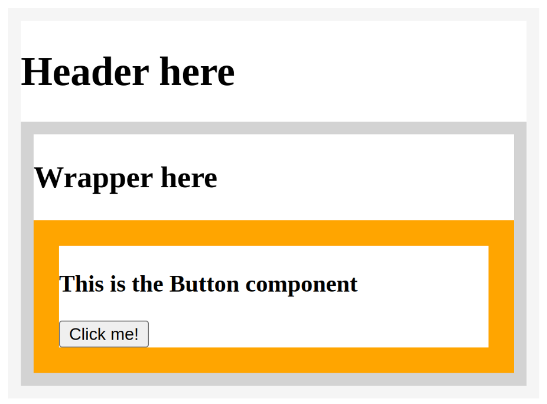
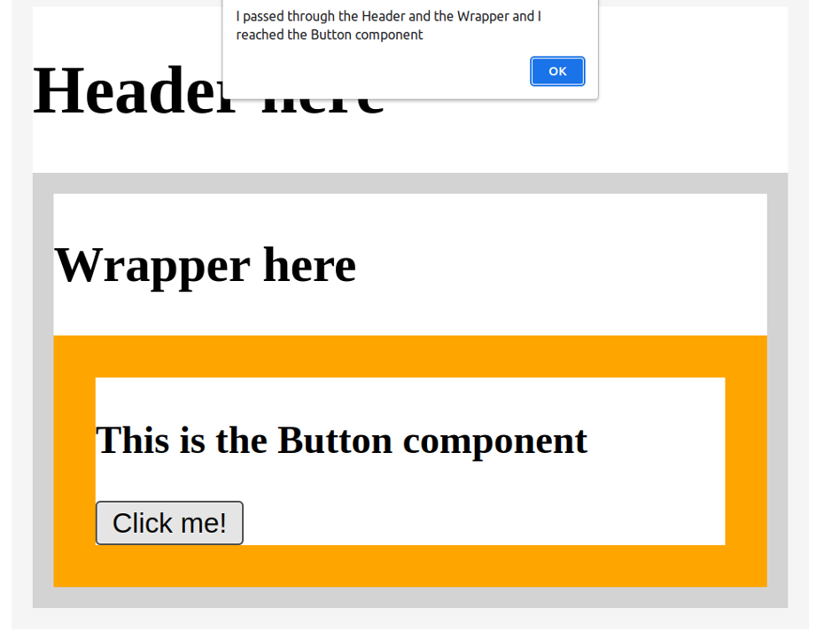
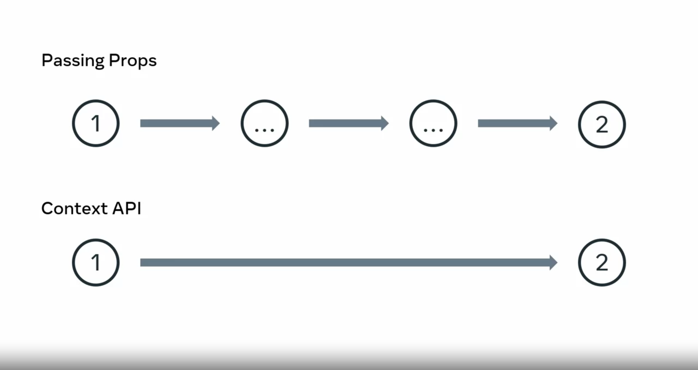

# states

States, allows you to easily change how the component behaves in order to suit a given need. 

It helps to think of State as a component's internal data that determines the current behavior of a component. It's often used to store data that affects the behavior of a component. 
States is important because it allows components to stay in sync with each other and ensure that your app behaves as intended, for example, if one component updates its State, all other components that depend on that State will automatically update too. This means that a component sends its State to its children by using props. 
```
Parent component
    ▼  props
Child component 
    ▼  props
grandchild component
```
If the child components have their own grandchild components, then the child components might have some States that they send us props to those grandchild components. In React, State is kept in a state of variables. The main way to change State is to alter these variables. When a component is created, it gets an initial State. The State is used to initialize the component's properties.
```
component created
    ▼  
Initial state
    ▼  
component properties initialized
```
Components can be either stateful or stateless, but what exactly does that mean? To gain a better understanding, let's explore an example of each. First is an app component with no state defined. It performs a single action, which is to render the text a stateless component and
```jsx
function App(){
    return <h1>A state value: {word}</h1>
}
```
then you have a stateful function component. This component also renders some texts, but it references a variable to do so.
```jsx
function App(){
    const [ word, setWord ] = React.useState("Hello")
    return (
        <div>
            <h1>A state value: {word}</h1>
        </div>
    )
}
```
If you're familiar with how array destructuring works in plain JavaScript. This line of code might've already make sense to you, but to make things clear, consider an example array called fruits, which contains the three strings, apple, pear, and plum. With its ES6 version, JavaScript introduced the concept of array destructuring, which allows you to assign several variables from the array using a single line of code.
```jsx
var fruits = ['apple', 'pear', 'plum']
const fruits = ['apple', 'pear', 'plum']
const ['fruit1', 'fruit2', 'fruit3'] = fruits
```
Notice that the syntax used is similar to the array destructuring example you just examined but with an interesting bit of code. React.useState. Hooks allow developers to hook into some otherwise inaccessible functionality. For example, to access the State object you would use the `useState` hook.

To better understand what is being destructured in the app component, let's call a console log to the useState hook. The output reveals an array holding two things, the string Hello and a function. 

```js
[Hello, ƒ]
0: Hello 
1: ƒ ()length: 1
name: "bound dispatchSetState"
arguments: (...)
caller: (...)
[[Prototype]]: ƒ ()
[[TargetFunction]]: ƒ dispatchSetState(fiber, queue, action)
[[BoundThis]]: null
[[BoundArgs]]: Array(2)
length: 2
    [[Prototype]]: Array(0)

```
In this case, Hello is the state value assigned to the word state variable. The function is a built-in one that is not declared. The function can be destructured with any name you'd like, but there is a convention to follow. If you set the States variable name to be Greet, then the destructured state function should be setGreet. This is because the second destructured variable is a function that will be used to update the state of a variable. 
```jsx
function App(){
    const [ greet, setGreet ] = React.useState("Hello")
    return (
        <div>
            <h1>A state value: {greet}</h1>
        </div>
    )
}
```
Let's examine an updated version of this stateful function component. Notice that the setGreet variable is not actually run, that is something that is done elsewhere. 

You can't use the state's setting variable from your state directly. Instead of updating it directly, I can update it based on a click event. you must make sure that you use event handling attributes in JSX syntax or some other approaches to use state's setting variabe 


### Prop drilling

As you’ve learned previously, prop drilling is a situation where you are passing data from a parent to a child component, then to a grandchild component, and so on, until it reaches a more distant component further down the component tree, where this data is required.

Here is a very simple app that focuses on the process of props passing through several components. 
```jsx
function Main(props) { 
  return <Header msg={props.msg} />; 
};

function Header(props) { 
  return ( 
    <div style={{ border: "10px solid whitesmoke" }}> 
      <h1>Header here</h1> 
      <Wrapper msg={props.msg} /> 
    </div> 
  ); 
};

function Wrapper(props) { 
  return ( 
    <div style={{ border: "10px solid lightgray" }}> 
      <h2>Wrapper here</h2> 
      <Button msg={props.msg} /> 
    </div> 
  ); 
};

function Button(props) { 
  return ( 
    <div style={{ border: "20px solid orange" }}> 
      <h3>This is the Button component</h3> 
      <button onClick={() => alert(props.msg)}>Click me!</button> 
    </div> 
  ); 
};

function App() { 
  return ( 
    <Main  
      msg="I passed through the Header and the Wrapper and I reached the Button component"  
    /> 
  ); 
}; 

export default App;
```
This app is simple enough that you should be able to understand it on your own. Let’s address the main points to highlight what is happening in the code above.

The top-most component of this app is the App component. The App component returns the Main component. The Main component accepts a single attribute, named msg, as in “message”.

At the very top of the app, the Main function declares how the Main component should behave. The Main component is responsible for rendering the Header component. Note that when the Header component is rendered from inside Main, it also receives the msg prop.

The Header component’s function declaration renders an h1 that reads “Header here”, then another component named Wrapper. Note that the naming here is irrelevant – the components Header and Wrapper are named to make it a bit more like it might appear in a real app – but ultimately, the focus is on having multiple components, rather than describing specific component names properly.

So, the Header component’s function declaration has a return statement, which renders the Wrapper component with the msg prop passed to it.

In the Wrapper component’s function declaration, there’s an h2 that reads “Wrapper here”, in addition to the rendering of the Button component, which also receives the msg attribute.

Finally, the Button component’s function declaration is coded to receive the props object, then inside of the wrapping div, show an h3. The h3 reads “This is the Button component”, and then, under that, there’s a button element with an onClick event-handling attribute. This is passed to an arrow function which should alert the string that comes from the props.msg prop.

All this code results in the following UI rendered on the screen:
The three components rendered on screen.



This screenshot illustrates the boundaries of each component. The Main component can’t be found in the UI because it’s just rendering the Header component. The Header component then renders the Wrapper component, and the Wrapper component then renders the Button component.

Note that the string that was passed on and on through each of the children component’s props’ objects is not found anywhere. However, it will appear when you click the “Click me!” button, as an alert:



While passing props helps to manage states, it is like taking a bus and going through each stop before you get off at the end. In comparison, using the context API is like teleporting to your destination instantly. It's a way to bypass the redundant passing of data through multiple levels of components.  
 
To set it up, you need to add a piece of code that will be your context provider. It's also where the state will be stored. When a component needs to use the state, it becomes a context consumer. 
Now let's examine a simple app that utilizes the context API to control state. In my app.js file, I'll use some code for a star to set up. You can also find this file in the additional resources if you'd like to use it to practice working with context API. In the app components, I have import statements for meals provider and meals list. The meals provider provides contexts state data and gives it to all the components it wrapped inside the app components. Currently, it wraps two components, the meals list components and the counter components, which are between the div tags of the return statements. The meals provide a component to holds all the states which is organized with the help of the context API. First I set the meals contexts variable using the React.createContext function. Next, I declare the today's meals array, which contains several food items saved as strings. I then coach the meals provider as an ES6 function that accepts the children value. This value holds everything that we wrapped into the meals provider component when it gets rendered inside the app component. The children value is just returned from the meals provider, wraps into the MealsContexts.Provider JSX elements. The MealsContexts.Provider JSX elements comes with the value attribute. This value attributes gets assigned the meals object, which is the value I sent to the use of state variable earlier. Before exporting the meals provider component at the bottom of the file, I'm also setting the use meals list contexts variable to the React.useContexts core and passing it to the meals contexts as its single argument. This makes it easier for me to destructure the meals objects from the use meals list context variable. Finally, in the meals list component, I'm accessing the context date by importing the use meals list context from the meals provider file. Let's break down how this component works in more detail. First, I'm destructuring the meals property from the objects returned from the use meals list context call. The original object has a single property named meals, which holds an array of three meals strings. Once I destructure the meals property from that object, all I have left is the array of three strings saved in the meals variable, which allows me to map over the meals value where I'm rendering an H2 for each member of the meals array. This code is probably more complex than most of what you have encountered. Don't worry if it takes time for you to understand how it works. Just remember the important parts, that this setup gives you a nice starting point for working with the context API. Lastly, let's examine the counter component. Note that it gets the context data in the same way that the meals list component does. This is the usefulness of having a centralized state store. It allows me to simply reach into the states provider directly from whatever components needed without having to do prop drilling or lifting upstate. Next, let me show you how the useReducer hook works. Let's move on to the useReducer hook. You can think of it as a superpower to use states. While the use state hook starts with an initial state, the useReducer also gets a reducer function in addition to the initial state. Let me illustrate that with a code example. Let's say I have a rideshare app that represents the amount of money in my wallet. The initial state is a value of 100 and the action of picking up a customer increases the value while the action of refueling my vehicle decreases it. I've applied to reduce a function which takes in the state and the action. Instead of using set states like in the use state hook, I'll use the dispatch method of the useReducer hook, which accepts an object literal with a single property type set to a matching action.type whose behavior is defined inside the reducer function. Now when I interact with this app in the browser, I can increase the money value by clicking the a new customer button or decrease it by clicking be refilled the tank button. In this video, you learned how the useContext and useReducer hooks can be used to manage state more efficiently across multiple levels of components.
​