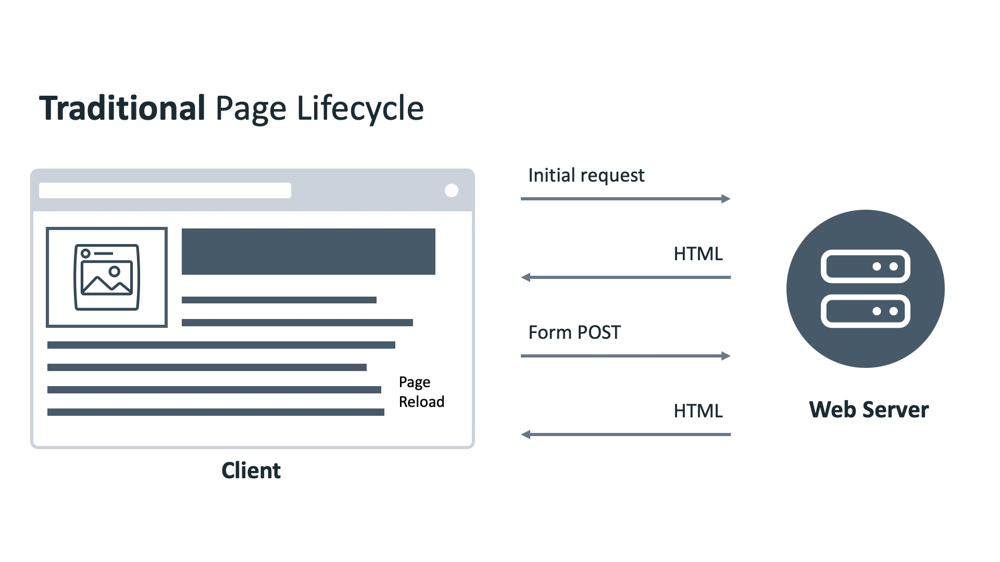
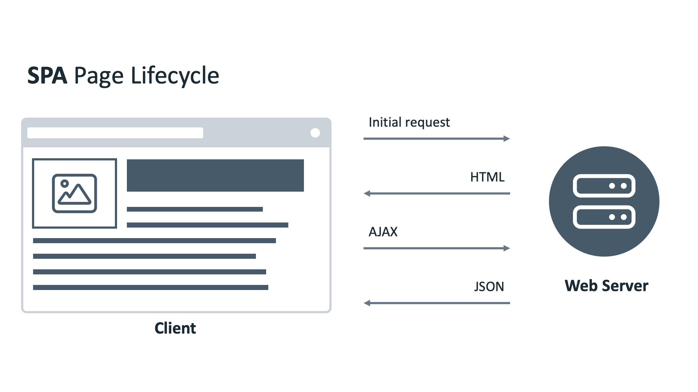
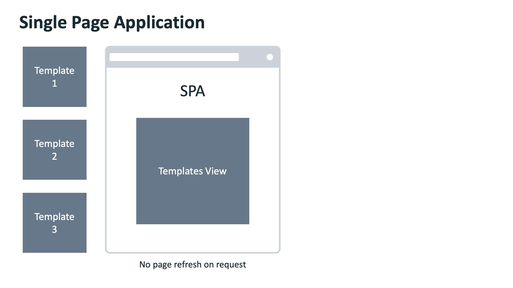
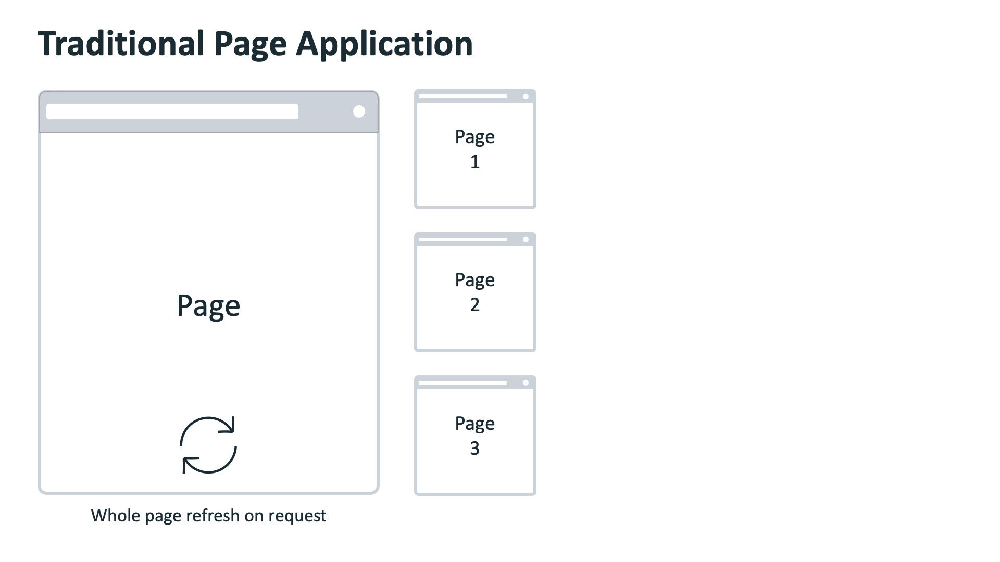

# Linking and Routing

there are common design or patterns of design when it comes to web page designing these are fixed components like: Navigation bar, Side bar, Footer

If you compare the navigation of websites built with React against HTML and CSS, you will likely find no visual difference. While visually everything looks the same, in the code, React navigation works a bit differently. This is because the entire app is loaded inside a single div. You're not actually visiting different pages like you would with hyperlinks and HTML files.  
```js
import React from 'react';
import ReactDOM from 'react-dom/client';
import App from './App';

const root = ReactDOM.createRoot(document.getElementById('root'));
root.render(
  <React.StrictMode>
    <App />
  </React.StrictMode>
);
```
```html
<div id="root">
    <!-- This element's contents will be replaced with 
     your components -->
</div>
```
Instead, the content of that single div is controlled by React, and it's based on changes to the virtual DOM. It either updates the existing view or loads a completely new view, giving the user the impression of visiting a completely different URL. 


Recall that with HTML, developers can use a list to make a navigation menu. 
```html
<ul>
    <li> <a href="index.html"/>Home</li>
    <li> <a href="about.html"/>About</li>
    <li> <a href="contact.html"/>Contact</li>
</ul>
```
To help illustrate how React's navigation works, think about how the buttons on the inside of an elevator work. Pressing the button will take you to the selected floor. Similarly, each link on a website takes you to a different page.  
  
If however, you're in a React elevator, It says if the elevator never moves. Instead, when you press a button in this React's elevator, the entire construction of that given flaw is injected into a single floor of this impossible building. That means that React by itself only takes care of the visuals of a single page but has no notion about navigaiton between pages.  
However, this functionality is not available to developers from the React's library itself. In order to achieve this illusion of a multi-page website, you need to add the React router library to your React projects. Once again, you add this using the import statements
```js
import {BrowserRouter} from 'react-router-dom'
```

## Navigation

In this reading, you’ll learn about the differences between traditional web pages and React-powered web pages (SPAs – single page applications).

Once you understand the difference between these two ways of building web pages, you will be able to understand the necessary difference between how navigation works in traditional web apps versus how it works in modern SPA websites.
Before Single-Page Apps

Before the advent of modern JavaScript frameworks, most websites were implemented as multi-page applications. That is, when a user clicks on a link, the browser navigates to a new webpage, sends a request to the web server; this then responds with the full webpage and the new page is displayed in the browser.

This can make your application resource intensive to the Web Server. CPU time is spent rendering dynamic pages and network bandwidth is used sending entire webpages back for every request. If your website is complex, it may appear slow to your users, even slower if they have a slow or limited internet connection.

To solve this problem, many web developers develop their web applications as Single Page Applications.
Single-Page Apps

You’re using many Single Page Applications every day. Think of your favorite social network, or online email provider, or the map application you use to find local businesses. Their excellent user experiences are driven by Single Page Applications.

A Single Page Application allows the user to interact with the website without downloading entire new webpages. Instead, it rewrites the current webpage as the user interacts with it. The outcome is that the application will feel faster and more responsive to the user.

### How Does a Single-Page App Work?

When the user navigates to the web application in the browser, the Web Server will return the necessary resources to run the application. There are two approaches to serving code and resources in Single Page Applications.

- When the browser requests the application, return and load all necessary HTML, CSS and JavaScript immediately. This is known as *bundling*. 
- When the browser requests the application, return only the minimum HTML, CSS and JavaScript needed to load the application. Additional resources are downloaded as required by the application, for example, when a user navigates to a specific section of the application. This is known as *lazy loading* or *code splitting*. 

Both approaches are valid and are used depending on the size, complexity and bandwidth requirements of the application. If your application is complex and has a lot of resources, your bundles will grow quite large and take a long time to download – possibly ending up slower than a traditional web application!

Once the application is loaded, all logic and changes are applied to the current webpage.  
  
  

### An Example of a Single-Page App  

Imagine there is a webpage that has a Label and a Button. It will display a random movie name when the button is clicked.

In a traditional website, when the button is clicked, the browser will send a POST request to the web server. The web server will return a new web page containing the button and movie name, and the web browser renders the new page.

In a Single Page Application, when the button is clicked, the browser will send a POST request to a web server. The web server will return a **JSON object**. The application reads the object and updates the Label with the movie name.

See, more efficient! But what if we need to have multiple pages with different layouts in our application?

### Practical Differences Between Single-Page Apps and Multi-Page Apps

Single Page Application diagram with multiple templates loaded into a single page
Traditional page application with multiple pages to be loaded  
  
  
You have a web application that has a navigation bar on top and two pages. One page shows the latest news, and the other shows the current user’s profile page. The navigation bar contains a link for each page.

In a traditional website, when the user clicks the Profile link, the web browser sends the request to the web server. The web server generates the HTML page and sends it back to the web browser. The web browser then renders the new web page.

In a Single Page Application, different pages are broken into templates (or views). Each view will have HTML code containing variables that can be updated by the application.

The web browser sends the request to the web server, and the web server sends back a JSON object. The web browser then updates the web page by inserting the template with the variables replaced by the values in the JSON object.

### Anchor Tag Elements in Single-Page Elements

A single-page application can’t have regular anchor tag elements as a traditional web app can. 

The reason for this is that the default behavior of an anchor tag is to load another HTML file from a server and refresh the page. This page refresh is not possible in a SPA that's powered by a library such as React because a total page refresh is not the way that a SPA works, as explained earlier in this lesson item. 

Instead, a SPA comes with its own special implementation of anchor tags and links, which only give an illusion of loading different pages to the end user when in fact, they simply load different components into a single element of the real DOM into which the virtual DOM tree gets mounted and updated.

That's why navigation in a single-page app is fundamentally different from its counterpart in a multi-page app.   

### Navbar Links

```bash
npm i react-router-dom
```
```js
// index.js
import React from 'react';
import ReactDOM from 'react-dom/client';
import App from './App';
import { BrowserRouter } from 'react-router-dom';

const root = ReactDOM.createRoot(document.getElementById('root'));
root.render(
    <React.StrictMode>
        <BrowserRouter>
            <App />
        </BrowserRouter>
    </React.StrictMode>
);
```
```js
// App.js
import Homepage from './Homepage'
import AboutMe from './AboutMe'
import {
    Routes,
    Route,
    Link
} from 'react-router-dom'

function App() {
    return ( 
        <div>
            <nav>
                <Link to="/">HomePage</Link>
                <Link to="/about-me">AboutMe</Link>
            </nav>
            <Routes>
                <Route path="/" element={<Homepage />} />
                <Route path="/about-me" element={<AboutMe />} />
           </Routes>
        </div>
    )
}
export default App
```

### Conditional rendering

