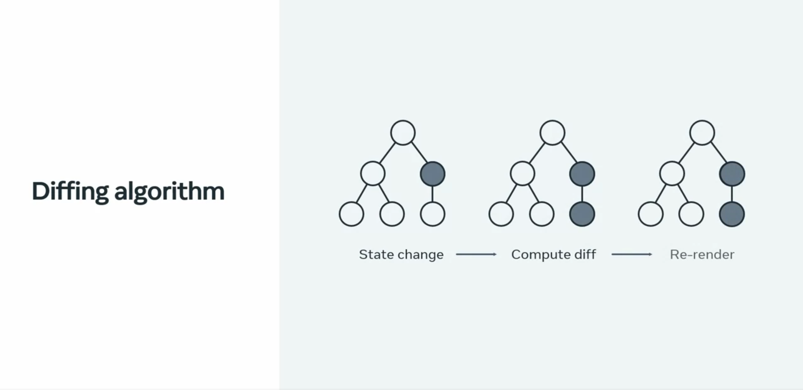
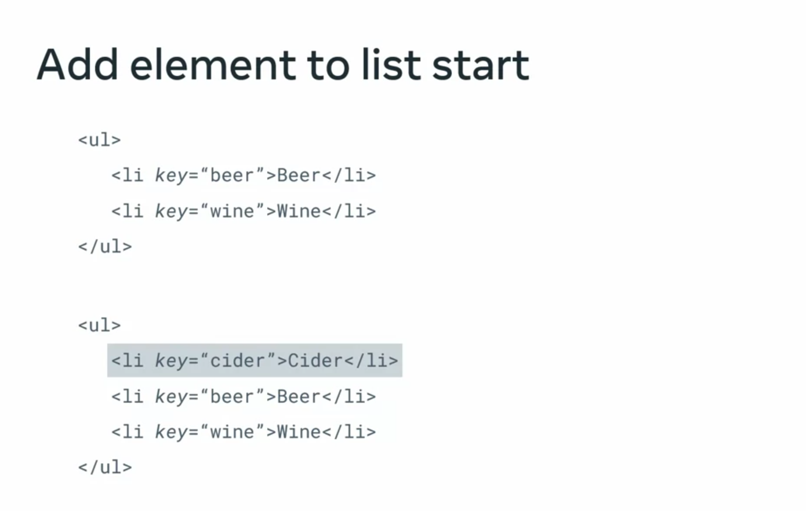
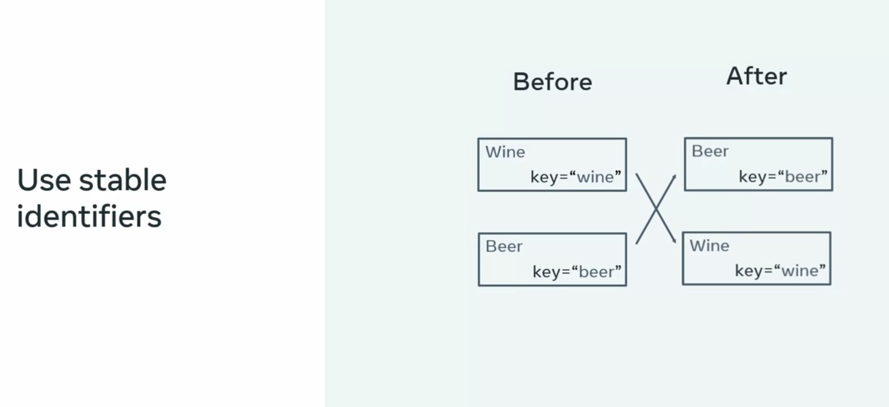
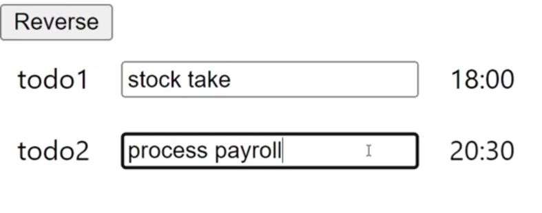
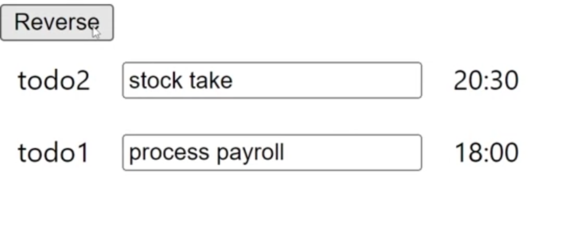

# Components

## Render and transform lists with keys in React. 

Inside the DessertsList  component return a `ul` element that contains a list of li elements, where each `li` text is a dessert with the following format: `${dessertName} - ${dessertCalories} cal`.

The list should be sorted by calories in an ascending manner and any desserts with more than 500 calories should be excluded. For that you have to use a combination of map, filter and sort array operators.
```js
// App file
import DessertsList from "./DessertsList";
const desserts = [
  {
    name: "Chocolate Cake",
    calories: 400,
    createdAt: "2022-09-01",
  },
  {
    name: "Ice Cream",
    calories: 200,
    createdAt: "2022-01-02",
  },
  {
    name: "Tiramisu",
    calories: 300,
    createdAt: "2021-10-03",
  },
  {
    name: "Cheesecake",
    calories: 600,
    createdAt: "2022-01-04",
  },
];

function App() {
  return (
    <div className="App">
      <h2>List of low calorie desserts:</h2>
      <DessertsList data={desserts} />
    </div>
  );
}
export default App;
```

### Create a basic List component

There are three types of operations you need to apply to the list of desserts: filtering, sorting and mapping. 

Although the order of the operations is not that important, it’s recommended to leave the final projection (mapping) to the end, since that final projection may skip some of the data needed for the filtering and sorting criteria.

##### Filtering

The first requirement is to display desserts that have less than 500 calories. That means `Cheesecake`, which has `600` cal, should be omitted. When you need to eliminate elements from your lists based on a certain condition or set of conditions, you need to use the `filter()` method.

The filter method creates a copy of the array, filtered down to just the elements from the original array that pass the test. In order words, it will return a new list with just the elements that fulfil the condition.

Each `dessert` from the list has a property called `calories`, which is an integer representing the number of calories. Therefore, the condition to be implemented should be as follows:
```js
const lowCaloriesDesserts = props.data 
 .filter((dessert) => { 
   return dessert.calories < 500; 
 }) 
```
`lowCaloriesDessert` variable will then hold a list of three desserts, without Cheesecake.

##### Sorting

The second requirement you have to implement is sorting the list by `calories`, from low to high or in ascending order. For that, arrays in JavaScript offer the `sort()` method, which sorts the elements of an array based on a comparison function provided. The return value from that comparison function determines how the sorting is performed:

##### The Compare Function

The purpose of the compare function is to define an alternative sort order.  
When the `sort()` function compares two values, it sends the values to the **compare function**, and sorts the values according to the returned (negative, zero, positive) value. by doing minus operation.  
The compare function should return a `negative`, `zero`, or `positive` value, depending on the arguments:
```js
function(a, b){return a - b}
```

| compareFn(a, b) return value | sort order                                          |
|------------------------------|-----------------------------------------------------|
| &gt; 0                       | sort&nbsp;a after&nbsp;b                            |
| &lt; 0                       | sort&nbsp;a&nbsp; before&nbsp;b&nbsp;               |
| === 0                        | keep original order of&nbsp;a&nbsp;and&nbsp;b&nbsp; |

EX:- The compare function compares all the values in the array, two values at a time `(a, b)`. When comparing 40 and 100, the `sort()` method calls the compare `function(40, 100)`.  

The function calculates `40 - 100 (a - b)`, and since the result is negative `(-60)`, the sort function will sort `40` as a value lower than `100`.

```js
const points = [40, 100, 1, 5, 25, 10];
points.sort(function(a, b){return a - b});
// [1, 5, 10, 25, 40, 100]
```
Use the same trick to sort an array descending:
```js
const points = [40, 100, 1, 5, 25, 10];
points.sort(function(a, b){return b - a}); 
// [100, 40, 25, 10, 5, 1]
```
You can chain one operation after another. Recall that filter returns the new array with the filtered down elements, so sort can be chained right after that The compare function makes sure the sorting occurs in ascending order, according to the table above.
```js
const lowCaloriesDesserts = props.data 
 .filter((dessert) => { 
   return dessert.calories < 500; 
 }) 
 .sort((a, b) => { 
   return a.calories - b.calories; 
 }) 
```
##### Mapping

Finally, to apply the desired projection and display the information as requested, you can chain the map operator at the end and return a `<li>` item with the dessert name and its calories, both separated by a dash character, and the word “cal” at the end.

```js
const DessertsList = (props) => {
 const lowCaloriesDesserts = props.data
   .filter((dessert) => {
     return dessert.calories < 500;
   })
   .sort((a, b) => { 
     return a.calories - b.calories; 
   })
   .map((dessert) => { 
     return ( 
       <li>
         {dessert.name} - {dessert.calories} cal 
       </li> 
     ); 
   }); 
 return <ul>{lowCaloriesDesserts}</ul>; 

}
export default DessertsList; 
```


**Pitfall**

Arrow functions implicitly return the expression right after =>, so you didn’t need a return statement:

```js
const listItems = chemists.map(person =>
  <li>...</li> // Implicit return!
);
```
However, you must write return explicitly if your => is followed by a { curly brace!
```js
const listItems = chemists.map(person => { // Curly brace
  return <li>...</li>;
});
```
Arrow functions containing => { are said to have a “block body”. They let you write more than a single line of code, but you have to write a return statement yourself. If you forget it, nothing gets returned!

##### Array.prototype.map()

The map() method of Array instances creates a new array populated with the results of calling a provided function on every element in the calling array. 

**callbackFn**

A function to execute for each element in the array. Its return value is added as a single element in the new array. The function is called with the following arguments:

**element**
- The current element being processed in the array.

**index**
- The index of the current element being processed in the array.

**array**
- The array map() was called upon.

**thisArg Optional**
- A value to use as this when executing callbackFn.

**Return value**
- A new array with each element being the result of the callback function.

**Description**

The map() method is an iterative method. It calls a provided callbackFn function once for each element in an array and constructs a new array from the results. Read the iterative methods section for more information about how these methods work in general.

callbackFn is invoked only for array indexes which have assigned values. It is not invoked for empty slots in sparse arrays.

The map() method is generic. It only expects the this value to have a length property and integer-keyed properties.

Since map builds a new array, calling it without using the returned array is an anti-pattern; use forEach or for...of instead.

**Using map to reformat objects in an array**

The following code takes an array of objects and creates a new array containing the newly reformatted objects.
```js
const kvArray = [
  { key: 1, value: 10 },
  { key: 2, value: 20 },
  { key: 3, value: 30 },
];

const reformattedArray = kvArray.map(({ key, value }) => ({ [key]: value }));

console.log(reformattedArray); // [{ 1: 10 }, { 2: 20 }, { 3: 30 }]
console.log(kvArray);
// [
//   { key: 1, value: 10 },
//   { key: 2, value: 20 },
//   { key: 3, value: 30 }
// ]
```


### Keys in React

When computing a change, React applies it's diffing algorithm to calculate the minimum number of changes that are necessary to perform an update in your tree of components.  



Although this algorithm works perfectly most of the time, as mentioned earlier, there are some cases where React can't make important assumptions to find the most optimal path for an update, which means the developer will need to step in.  

Let's explore one such example. Imagine the drink section in the little lemon online menu where restaurant managers can add new drinks depending on the season. When they add a new element at the end of the list, the different algorithm works well, since React will match the two beer trees, match the two wine trees, and then insert the cider tree.


However, when inserting a new element at the beginning of the list, the algorithm offers worse performance because React will mutate every child instead of realizing it can keep the beer and wine sub trees intact. This inefficiency can be a problem.

To solve These issue, React supports a key attribute. What are keys? 

Keys are identifier's that help React to determine which items have **changed** or **added** or are **removed**.  
They also instruct how to treat a specific element when an update occurs and whether its internal state should be preserved or not. 

To illustrate, adding a key to the last example can make the tree conversion efficient. That's because react now knows that the element with the key cider is the new one and the elements with the keys, beer and wine have just moved.   



The general rule of thumb with keys is to use a stable identifier that is unique among its siblings. This allows React to reuse as many elements from the list as possible, avoiding unnecessary recreations, especially when their content is exactly the same and the only thing that has changed is their position in the list.  



The key used most often is a unique ID that comes from your data. Those IDs typically mirror a database ID, which has an ID given to an item in a database that by nature is guaranteed to be unique. 

The potential problem of using a randomiser function that generates an integer number as a key for your list items

- The randomiser function does not entirely guarantee that the keys it generates will be different per item and a collision could happen, having two items with the same integer as keys.
Correct
- There is no persistence of the keys generated since the moment the component re-renders the keys will vary and that could cause unexpected UI changes. 
Correct

The potential problems of using indexes as keys

- If the order of items may change, that can negatively impact performance and may cause issues with component state. 
### Keeping list items in order with key 

You need to give each array item a key — a string or a number that uniquely identifies it among other items in that array:

```js
<li key={person.id}>...</li>
```
JSX elements directly inside a `map()` call always need keys!

**Keys tell React which array item each component corresponds to, so that it can match them up later. This becomes important if your array items can move (e.g. due to sorting), get inserted, or get deleted. A well-chosen key helps React infer what exactly has happened, and make the correct updates to the DOM tree.**

##### Displaying several DOM nodes for each list item

What do you do when each item needs to render not one, but several DOM nodes?

The short `<>...</>` Fragment syntax won’t let you pass a key, so you need to either group them into a single `<div>` or use the slightly longer and more explicit `<Fragment>` syntax:

```js
import { Fragment } from 'react';

// ...

const listItems = people.map(person =>
  <Fragment key={person.id}>
    <h1>{person.name}</h1>
    <p>{person.bio}</p>
  </Fragment>
);
```
Fragments disappear from the DOM, so this will produce a flat list of `<h1>`, `<p>`, `<h1>`, `<p>`, and so on.


##### Where to get your key

Different sources of data provide different sources of keys:

- Data from a database: If your data is coming from a database, you can use the database keys/IDs, which are unique by nature.
- Locally generated data: If your data is generated and persisted locally (e.g. notes in a note-taking app), use an incrementing counter, `crypto.randomUUID()` or a package like `uuid` when creating items.

**Rules of keys**

- Keys must be unique among siblings. However, it’s okay to use the same keys for JSX nodes in different arrays.
- Keys must not change or that defeats their purpose! Don’t generate them while rendering.

**Why does React need keys?**

Imagine that files on your desktop didn’t have names. Instead, you’d refer to them by their order — the first file, the second file, and so on. You could get used to it, but once you delete a file, it would get confusing. The second file would become the first file, the third file would be the second file, and so on.

File names in a folder and JSX keys in an array serve a similar purpose. They let us uniquely identify an item between its siblings. A well-chosen key provides more information than the position within the array. Even if the position changes due to reordering, the key lets React identify the item throughout its lifetime.

**Pitfall**  

You might be tempted to use an item’s index in the array as its key. In fact, that’s what React will use if you don’t specify a key at all. But the order in which you render items will change over time if an item is inserted, deleted, or if the array gets reordered. Index as a key often leads to subtle and confusing bugs.

Similarly, do not generate keys on the fly, e.g. with key={Math.random()}. This will cause keys to never match up between renders, leading to all your components and DOM being recreated every time. Not only is this slow, but it will also lose any user input inside the list items. Instead, use a stable ID based on the data.

Note that your components won’t receive key as a prop. It’s only used as a hint by React itself. If your component needs an ID, you have to pass it as a separate prop: `<Profile key={id} userId={id} />`.

**Example**

```js
const [todos, setTodos] = useState([{
    id: 'todo1',
    createdAt: '18:00',
}, {
    id: 'todo2',
    createdAt: '22:30',
}])
const reverseOrder = () => {
    // Reverse is a mutative operation, so we need to create a new array first.
   setTodos([...todos].reverse()) 
}
```
The reverse order function which effectively changes the order of the todo's. The reverse method from arrays is a **mutated operation**. That means that it modifies the original array rather than a copy. **To avoid mutating the react state which is something you should never do**, it's important to make a copy of the array first, which I'm doing by using the ES6 spread operator. 

When you're running your application in development mode, React does a great job of providing solutions to potential problems in your applications via contextual warnings as console errors. The warning clearly states that each child in the list should have a unique key prop and that I need to check the render method of the app component. The index position of the todo item fulfills the requirement that the React warning is asking about. So I'm going to use that. 

```js
const ToDo = props => {
    <>
    <div>props.id</div>
    <div><input /></div>
    <div>props.createdAt</div>
    </>
}
<button onClick={reverseOrder}>Reverse</button>
{todos.map((todo, index) => (
    <ToDo key={index} id={todo.id} createdAt={todo.createdAt} />
))}
```
Now I would like to reverse the order because the managers should do payroll first. That didn't work now, did it? The text inputs have not moved but everything else has. Well, you have just discovered one of the main problems when using indexes as keys when the order of your list items is prone to change. 

| Default | After reverse button |
|---------|------|
| |  |

when I reverse the order of the todos, the id and createdAt prop have changed. But the key is still the same because I'm using the index. Since it's the same, React is instructed to keep the internal state of that node. That's why the input state from the todo is preserved. 

To fix that, Coming back to the key requirement, it has to be something unique but that correctly identifies each todo, no matter what its position is in the list. In this case, I can definitely use the `id` property from the data model as my key. After all, that is guaranteed to be unique per todo. 

```js
const desserts = [
  {
    title: 'Chocolate Cake',
    description: 'Chocolate cake is a cake flavored with melted chocolate',
    calories: 500,
  }
]; 
let newDesserts= () => { desserts.map((dessert) => {
  console.log (
      {title: dessert.title.toUpperCase(),
    ...dessert,
    kCal: dessert.calories / 1000,}
  );
})}

// {title: 'Chocolate Cake', description: 'Chocolate cake is a cake flavored with melted chocolate', calories: 500, kCal: 0.5}
```

`...dessert` overwrites the title property you just set to uppercase. The `title` from dessert replaces the uppercase version
