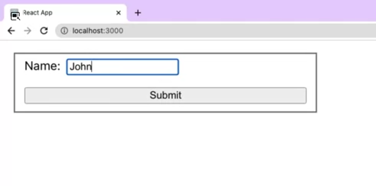
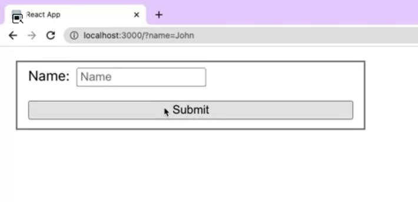

# Froms in React

## Differences between controlled and uncontrolled React components. 

Example of a controlled component, Imagine if there was a function that could handle the submission of the form and access the data that the user entered into it.  

That's where controlled components come in. Controlled components are a set of components that offer a declarative API to enable full control of the state of form elements at any point in time using React state.  

Rather than relying on the native state from DOM elements, the React state is made the single source of truth, controlling the displayed value of your form elements at all times.   

The way you perform this state delegation is via the value prop. **Value is a special property, the React added to most of the form elements to determine the input content at any point in time during the render life cycle**.  

In order to create a controlled component, you need to use a combination of local state and the value prop. Initially, you will assign the local state to the value property. But how do you get updates from any new text character entered in the input. Well for that, you need a second prop to complete the design of your controlled component, the `onChange callback`.   

The `onChange callback` receives an event parameter, which is an event object representing the action that just took place similar to events on DOM elements. To get the new value from every keystroke, you need to access the target property from the event and grab the value from that object, which is a string.   
```js
handleChange(event){
    setValue(event.target.value)
}
```
```js
<form onSubmit={handleSubmit}>
    ...
</form>
handleSubmit(event){
    validate(value)
    event.preventDefault()
}
```
Finally, to have control over the form values whenever the form is submitted, you can use the onSubmit prop in the form HTML element. The onSubmit callback also receives a DOM-like event as a parameter. There you can access your form values to perform any desired logic that must take place before submission, for example validating your input values. Also, if you would like to prevent the default HTML form behavior, you need to call `event.preventDefault` inside your `onSubmit` callback. 

### Controlled components vs. Uncontrolled components

This reading will teach you how to work with uncontrolled inputs in React and the advantages of controlled inputs via state design. You will also learn when to choose controlled or uncontrolled inputs and the features each option supports.

In most cases, React recommends using controlled components to implement forms. While this approach aligns with the React declarative model, uncontrolled form fields are still a valid option and have their merit. Let's break them down to see the differences between the two approaches and when you should use each method.

##### Uncontrolled Inputs

Uncontrolled inputs are like standard HTML form inputs:
```js
const Form = () => { 
 return ( 
   <div> 
     <input type="text" /> 
   </div> 
 ); 
}; 
```
They remember exactly what you typed, being the DOM itself that maintains that internal state. How can you then get their value? The answer is by using a React ref.

In the code below, you can see how a ref is used to access the value of the input whenever the form is submitted.
```js
const Form = () => { 
 const inputRef = useRef(null); 

 const handleSubmit = () => { 
   const inputValue = inputRef.current.value; 
   // Do something with the value 
 } 
 return ( 
   <form onSubmit={handleSubmit}> 
     <input ref={inputRef} type="text" /> 
   </form> 
 ); 
}; 
```
In other words, you must pull the value from the field when needed.

Uncontrolled components are the simplest way to implement form inputs. There are certainly valued cases for them, especially when your form is straightforward. Unfortunately, they are not as powerful as their counterpart, so let's look at controlled inputs next.

##### Controlled Inputs

Controlled inputs accept their current value as a prop and a callback to change that value. That implies that the value of the input has to live in the React state somewhere. Typically, the component that renders the input (like a form component) saves that in its state:
```js
const Form = () => { 
 const [value, setValue] = useState(""); 

 const handleChange = (e) => { 
   setValue(e.target.value) 
 } 

 return ( 
   <form> 
     <input 
       value={value} 
       onChange={handleChange} 
       type="text" 
     /> 
   </form> 
 ); 
}; 
```
Every time you type a new character, the handleChange function is executed. It receives the new value of the input, and then it sets it in the state. In the code example above, the flow would be as follows:

- The input starts out with an empty string:`""`
- You type `“a”` and `handleChange` gets an `“a”` attached in the event object, as `e.target.value`, and subsequently calls `setValue` with it. The input is then updated to have the value of `“a”`. 
- You type `“b”` and `handleChange` gets called with `e.target.value` being `“ab”`.and sets that to the state. That gets set into the state. The input is then re-rendered once more, now with `value = "ab"` .

This flow pushes the value changes to the `Form` component instead of pulling like the `ref` example from the uncontrolled version. Therefore, the `Form` component always has the input's current value without needing to ask for it explicitly.

As a result, your data (React state) and UI (input tags) are always in sync. Another implication is that forms can respond to input changes immediately, for example, by:

- Instant validation per field 
- Disabling the submit button unless all fields have valid data 
- Enforcing a specific input format, like phone or credit card numbers 

Sometimes you will find yourself not needing any of that. In that case uncontrolled could be a more straightforward choice.

##### The file input type

There are some specific form inputs that are always uncontrolled, like the file input tag. 

In React, an `<input type="file" />` is always an uncontrolled component because its value is read-only and can't be set programmatically. 

The following example illustrates how to create a ref to the DOM node to access any files selected in the form submit handler:
```js
const Form = () => { 
 const fileInput = useRef(null); 
 const handleSubmit = (e) => { 
   e.preventDefault(); 
   const files = fileInput.current.files; 
   // Do something with the files here 
 } 
 return ( 
   <form onSubmit={handleSubmit}> 
     <input 
       ref={fileInput} 
       type="file" 
     /> 
   </form> 
 ); 
}; 
```

**Conclusion**

Uncontrolled components with `refs` are fine if your form is incredibly simple regarding UI feedback. However, controlled input fields are the way to go if you need more features in your forms. 

Evaluate your specific situation and pick the option that works best for you.

The below table summarizes the features that each one supports:
| Feature                                   | Uncontrolled | Controlled |
|-------------------------------------------|--------------|------------|
| One-time value retrieval (e.g. on submit) | Yes          | Yes        |
| Validating on submit                      | Yes          | Yes        |
| Instant field validation                  | No           | Yes        |
| Conditionally disabling a submit button   | No           | Yes        |
| Enforcing a specific input format         | No           | Yes        |
| Several inputs for one piece of data      | No           | Yes        |
| Dynamic inputs                            | No           | Yes        |


## Create a controlled form component in React. 

```js
function App(){
    return (
        <div>
            <form>
                <fieldset>
                    <div className="field">
                        <label>Name:</label>
                        <input type="text"  name="name" />
                    </div>
                    <button type="submit">Submit</button>
                </fieldset>
            </form>
        </div>
    )
}

export default App
```  
| inserting | after submitting |
|-----------|------------------|
|  |  |

I type John as the name and click on the Submit button. By doing so, the default action of the form kicks in, which is a get request to the root and a page refresh. In React, this current implementation is considered an uncontrolled form, having all the states living in the DOM. 

```js
function App(){
    const [name, setName] = useState("")
    const handleSubmit = (e) => {
        e.preventDefault()
        setName("")
    }
    return (
        <div>
            <form onSubmit={handleSubmit}>
                <fieldset>
                    <div className="field">
                        <label htmlFor="name">Name:</label>
                        <input 
                        type="text" id="name"  name="name"
                        value={name} onChange={(e) => setName(e.target.value)}/>
                    </div>
                    <button disabled={!name} type="submit">Submit</button>
                </fieldset>
            </form>
        </div>
    )
}

export default App
```  

**General Overview**

- Controlled Components: A React form element whose value is controlled by React state using the value and onChange props.
- Benefits:
    - Keeps form state in sync with React state.
    - Allows enhanced control over form submission and validation.
    - Enables easier integration of dynamic form behavior.

##### Steps for Creating a Controlled Form

**Connect State to Input:**

- Use the value prop to bind the input to the state.
- Use the onChange prop to update the state on each keystroke.
```js
<input 
  type="text" 
  id="name" 
  name="name"
  value={name} 
  onChange={(e) => setName(e.target.value)} 
/>
```
**Form Submission Control:**

- Use the onSubmit event to handle form submission.
- Prevent the default page reload behavior using e.preventDefault().
```js
const handleSubmit = (e) => {
  e.preventDefault();
  console.log("Form submitted successfully");
  setName(""); // Clear input after submission
}
```
**Preventing Empty Submissions:**

- Disable the submit button when the input is empty.
```js
<button disabled={!name} type="submit">Submit</button>
```
**Accessibility Improvement:**

- Connect the label to the input using the `htmlFor` attribute.
```js
<label htmlFor="name">Name:</label>
```

**Key Concepts**

- Preventing Default Behavior:
    - Use `e.preventDefault()` in onSubmit to stop page refresh or form submission to the server.

- Button Disabling Logic:
    - If name is empty, disabled is `true`, preventing the form from submitting.

- Accessibility via Label-Input Association:
    - In React, use `htmlFor` instead of for to associate labels with their respective inputs, improving accessibility and usability.

**Common Mistakes to Avoid**

- Forgetting to call `preventDefault()` in the `handleSubmit` function can cause unexpected page reloads.
- Not binding value and `onChange` can result in an uncontrolled component warning.
- Using for instead of `htmlFor` will result in errors since for is reserved in JavaScript.

```js
import react from 'react'
import { useState } from "react"

function App(){
    const [score, setScore] = useState("10");
    const [comment, setComment] = useState("");
  const handleSubmit = (e) => {
    e.preventDefault()
    if (Number(score) <= 5 && comment.length <= 10) {
      alert("please provide a comment explaining why the experience was poor.")
      return

    }
      console.log("Form submitted")
      setComment("")
      setScore("10")
  }
    
  return (
    <div>
      <form onSubmit={handleSubmit}>
        <fieldset>
          <div>
            <label>Score: {score}</label>
            <input type="range" max="10" min="0" 
            value={score} onChange={e => setScore(e.target.value)}/>
          </div>
          <div>
            <label>Comment</label>
            <textarea  
            value={comment} onChange={e => setComment(e.target.value)}/>
          </div>
          <button type="submit">Submit</button>
        </fieldset>
      </form>
    </div>
  )
}

export default App
```

<button type="submit" disabled={!getIsFormValid()}>

Breakdown:

`<button>`
- This is an HTML button element. In this case, it is being used for form submission.

`type="submit"`
- Specifies that the button is of type "submit," meaning clicking it will trigger the form's onSubmit event.

`disabled` Attribute
- Determines whether the button is enabled or disabled. A disabled button cannot be interacted with or clicked by the user.

`!getIsFormValid()`
- `getIsFormValid()` is likely a function that returns a boolean value indicating whether the form is valid or not.
- The `!` operator negates the result of getIsFormValid(), meaning:
  - If `getIsFormValid()` returns true (form is valid), !true becomes false, and the button is enabled.
  - If `getIsFormValid()` returns false (form is invalid), !false becomes true, and the button is disabled.

```js
import "./App.css";
import { useState } from "react";
import { validateEmail } from "./utils";

const PasswordErrorMessage = () => {
  return (
    <p className="FieldError">Password should have at least 8 characters</p>
  );
};

function App() {
  const [firstName, setFirstName] = useState("");
  const [lastName, setLastName] = useState("");
  const [email, setEmail] = useState("");
  const [password, setPassword] = useState({
    value: "",
    isTouched: false,
  });
  const [role, setRole] = useState("role");

  const getIsFormValid = () => {
    // Implement this function
    if (firstName && password.value.length >= 8 &&
      (role === "individual" || role === "business") &&
      validateEmail(email)) {
      return true;
    } else {
        return false;
      }
  };
  const clearForm = () => {
    // Implement this function
    setFirstName("")
    setLastName("")
    setEmail("")
    setPassword({
    value: "",
    isTouched: false,
  })
    setRole("role")
  };

  const handleSubmit = (e) => {
    e.preventDefault()
    alert("Account created!");
    clearForm();
  };


  return (
    <div className="App">
      <form onSubmit={handleSubmit}>
        <fieldset>
          <h2>Sign Up</h2>
          <div className="Field">
            <label>
              First name <sup>*</sup>
            </label>
            <input placeholder="First name" value={firstName}
            onChange={e => setFirstName(e.target.value)}
            />
          </div>
          <div className="Field">
            <label>Last name</label>
            <input placeholder="Last name" value={lastName}
            onChange={e => setLastName(e.target.value)} />
          </div>
          <div className="Field">
            <label>
              Email address <sup>*</sup>
            </label>
            <input type="email" placeholder="Email address" value={email}
            onChange={e => 
              setEmail(e.target.value)
              } />
          </div>
          <div className="Field">
            <label>
              Password <sup>*</sup>
            </label>
            <input placeholder="Password" type="password" value={password.value}
              onChange={(e) => {
                setPassword({...password, value: (e.target.value)})
              }}
              onBlur={() => {
                setPassword({ ...password, isTouched: true })
              }} />
{password.isTouched && password.value.length < 8 && <PasswordErrorMessage />}          </div>
          <div className="Field">
            <label>
              Role <sup>*</sup>
            </label>
            <select value={role}
            onChange={e => setRole(e.target.value)}>
              <option value="role">Role</option>
              <option value="individual">Individual</option>
              <option value="business">Business</option>
            </select>
          </div>
          <button type="submit" disabled={!getIsFormValid()}>
            Create account
          </button>
        </fieldset>
      </form>
    </div>
  );
}

export default App;
```
