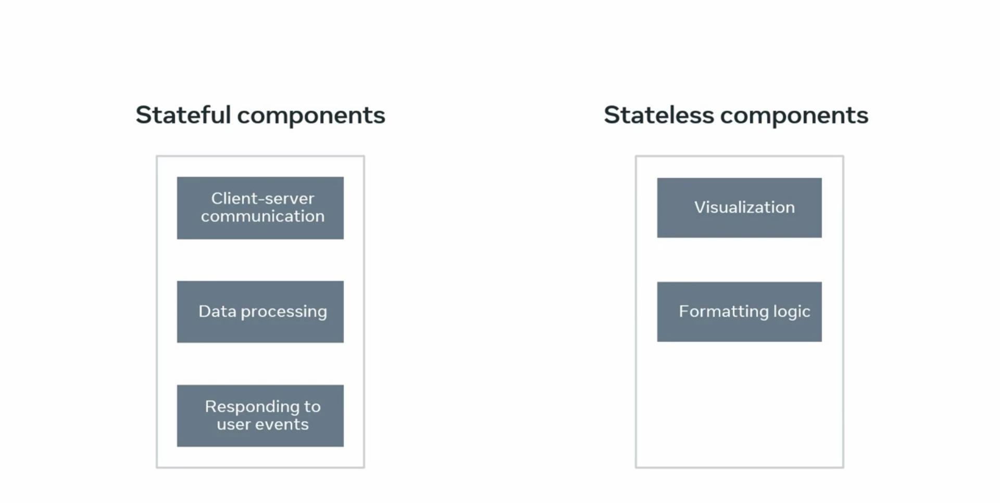

# State vs Props

What are props and state, They are both plain javascript objects. The react uses to hold information as you progress

While both props and state influence the render output, even though props and state are inherently different, there are areas where they overlap, notably when designing a component. Its main responsibility is to translate raw data into rich html in the react ecosystem.  

The props and the state together constitute the raw data that the html output derives from both props and states are plain Js objects and are deterministic. This means your component always generates the same output for the same combination of props and state.  

Another similarity is that props and state changes. Both trigger a render update now. The rule of thumb is that if a component needs to alter one of its attributes at some point in time, that attributes should be part of its state. Otherwise it should just be a prop for that component.  

Props which is a shorthand for properties are a components configuration. They are received from parents in the tree and are immutable as far as the component receiving them is concerned. A component cannot change its props but it is responsible for putting together the props of its child components.   

State which is react component's built in object. This object is a way to allow react to determine when it should re-render. A component react is set up so that any change to the value served in the state, object will trigger a re-render of a given component states. Life cycle starts with a default value when a component mount and then modifications of that value happen over time. Mostly generated from user events.   

So state is a serialize double representation of one point in time or in other words a snapshot A component manages its own state internally, You could also say the state is private.  

Stateless components have only props and no state there's not much going on besides the render function and all their logic revolves around the props they receive. This makes them very easy to follow and test.  

Stateful components on the other hand, have both props and state. They're in charge of client server, communication, processing data and responding to user events.  

 

These sorts of logistics should be encapsulated in a moderate number of state. Full components while all visualization and formatting logic should move downstream into as many stateless components as possible. 
## Share component state by lifting state up to the closest common ancestor. 

If I have a light or dark theme that changes the background and text colors of all elements, or some general preferences like a specific locale, depending on the visitors' geolocation that multiple components should be aware of. these pieces of data represent a global state for your entire application.  

The Props Drilling Problem

- As your app grows, passing props through multiple layers of components can become cumbersome.
- Props drilling occurs when parent components pass data through intermediary components that don't need it, just to reach the necessary child components.

Solving Props Drilling with Context API

- Eliminates the need to manually pass props at every level.
- Efficiently shares global data across a tree of components.

### User Authentication Example

Problem: Sharing Authenticated User Data

- Components Needing User Data:
    - LoggedInUser Component inside the Header.
    - Page Component for blog entries.
- Challenge: Both components need access to the authenticated user, making this a clear case for global state.
 
```js
// UserContext.js
import { createContext } from 'react'
```
This is the function that gives you a new context object back. 

The function argument is the default value, which in this case, 
```js
// UserContext.js
const UserContext = createContext(undifined)
// I will declare as undefined since the app doesn't know beforehand who the logged in user will be. 
```

Second, you need to create a provider component. To do so, I will call it UserProvider and render the UserContext.Provider component. 

```js
// UserContext.js
export const UserProvider = ({children}) => {
    const [user] = useState({
        name: "John",
        email: "john@example.net"
        dob: "03/12/2012"
    })
    return <UserContext.Provider></UserContext.Provider>
}
// The UserContext.Provider component is what allows consuming components to subscribe to context changes. This component accepts a value prop, which is what will be passed to consuming components that are descendants of this provider.
// the value prop is the authenticated user, 
```

Note that this is an oversimplification that already assumes a specific user, as in a real-world scenario, you will have to fetch the authenticated user first and then set it as a state. 

So now that the state is defined, I will hook it to the value prop. Next, it's necessary to provide a way for components to subscribe to the context. For that, I am going to create a custom hook that wraps the use context hook, which is the way to consume a context value. 

```js
// UserContext.js
export const UserProvider = ({children}) => {
   return <UserContext.Provider value={{ user }}></UserContext.Provider>
}
export const useUser = () => useContext(UserContext)
```

This external function is created just for convenience, so there's no need to export the user context to external components. 

```js
// App.js
import { UserProvider } from './UserContext'

const LoggedInUser = () => {
    const {user} = useUser()
    return (
        <p>
        Hello <span>{user.name}</span>
        </p>
    )
}

const Header = () => {
    <header>
        <LoggedInUser />
    </header>
}

const Page = () => {
    const {user} = useUser()
    return (
        <div>
            <h2>What is Lorem ipsum?</h2>
            <p>Lorem, ipsum dolor sit amet consectetur adipisicing elit. Expedita ipsum officia nihil facere dolore exercitationem beatae tempore maiores quidem in quos, similique ducimus alias, repellendus commodi aliquam? Laudantium commodi minus mollitia. Exercitationem natus placeat aut, eveniet in ut quisquam eaque nemo quaerat molestias repellat laboriosam odit amet consectetur possimus quibusdam!</p>
            <p> written by {user.name}</p>
        </div>
    )
}
function App() {
    return (
        <div>
            <Header />
            <Page />
        </div>
    )
}

function Root(){
    return (
        <UserProvider>
            <App />
        </UserProvider>
    )
}
export default Root
```
the app is not aware of userContext. So I'll go ahead and wrap the whole app with it. The last step is to consume the user context in the places where the username has to be displayed, which are in the logged in user component and the page component. I'll go ahead and use the custom hook defined earlier. Use user and destructure the authenticated user from there. Finally, that information can be embedded in both render methods.

You've learned about context and why it's used and worked through a practical example of how to use it. But keep in mind that although context is useful for global state, it's still recommended that you stick to props and state as much as possible. That way your app data flow will be easier to follow. 

## Share global state using React Context

### How re-rendering works with Context

In this reading you will learn about the default behavior of React rendering and when context is used. You will discover how to prevent unnecessary top-level re-renders with `React.memo` and how object references work in JavaScript. You will also learn how to utilize the `useMemo` hook to guarantee object references don’t change during re-rendering.

So far, you have learned that when a component consumes some context value and the value of this context changes, that component re-renders.

But what happens with all components in between? Is React wise enough to only re-render the consumers and bypass the intermediary components in the tree? Well, as it turns out, that doesn’t always happen and extra care should be taken when designing your React Context.

When it comes to the default behavior of React rendering, if a component renders, React will recursively re-render all its children regardless of props or context. Let’s illustrate this point with an example that uses some context.

Imagine the following component structure, where the top level component injects a Context provider at the top:

**`App (ContextProvider) > A > B > C`**

```js
const App = () => {
return (
   <AppContext.Provider\>
     <ComponentA />
   </AppContext.Provider\>
 );
};

const ComponentA = () => <ComponentB />;
const ComponentB = () => <ComponentC />;
const ComponentC = () => null;
```

If the outermost App component re-renders for whatever reason, all ComponentA, ComponentB and ComponentC components will re-render as well, following this order:


**`App (ContextProvider) -> A -> B -> C`**

If some of your top level components are complex in nature, this could result in some performance hit. To mitigate this issue, you can make use of the top level API React.memo().

If your component renders the same result given the same props, you can wrap it in a call to React.memo for a performance boost by memoizing the result.

Memoization is a programming technique that accelerates performance by caching the return values of expensive function calls.

This means that React will skip rendering the component, and reuse the last rendered result. This is a trivial case for ComponentA, since it doesn’t receive any props.

**`const ComponentA = React.memo(() => <ComponentB />);`**

React.memo takes the component definition as a first argument. An optional second argument can be included if you would like to specify some custom logic that defines when the component should re-render based on previous and current props.

After that little adjustment, you will prevent any rendering from happening in all ComponentA, ComponentB and ComponentC if the App component re-renders.
```js
const App = () => {
return (
   <AppContext.Provider\>
     <ComponentA />
   </AppContext.Provider\>
 );
};

const ComponentA = React.memo(() => <ComponentB />);
const ComponentB = () => <ComponentC />;
const ComponentC = () => null;
```
A good rule of thumb is to wrap the React component right after your context provider with React.memo.

In real-life applications, you will find yourself in need of passing several pieces of data as context value, rather than a single primitive like a string or number, so you’ll be working most likely with JavaScript objects.

Now, according to React context rules, all consumers that are descendants of a provider will re-render whenever the provider’s value prop changes.

Let’s go through the following scenario built upon the previous example, where the context value that gets injected is defined as an object called value with two properties, ‘a’ and ‘b’, being both strings. Also, ComponentC is now a consumer of context, so any time the provider value prop changes, ComponentC will re-render.

```js
const App = () => {
  const value = {a: 'hi', b: 'bye'};
  return (
    <AppContext.Provider value={value}>
      <ComponentA />
    </AppContext.Provider>
  );
};

const ComponentA = React.memo(() => <ComponentB />);
const ComponentB = () => <ComponentC />;
const ComponentC = () => {
  const contextValue = useContext(AppContext);
  return null;
};
```
Imagine that the value prop from the provider changes to {a: ‘hello’, b: ‘bye’}.

If that happens, the sequence of re-renders would be:

**`App (ContextProvider) -> C`**

That’s all fine and expected, but what would happen if the App component re-renders for any other reason and the provider value doesn’t change at all, being still {a: ‘hi’, b: ‘bye’}? 

It may be a surprise to you to find out that the sequence of re-renders is the same as before:

**`App (ContextProvider) -> C`**

Even though the provider value doesn’t seem to change, ComponentC gets re-rendered.

To understand what’s happening, you need to remember that in JavaScript, the below assertion is true:

**`{a: ‘hi’, b: ‘bye’} !== {a: ‘hi’, b: ‘bye’}`**

That is because object comparison in JavaScript is done by reference. Every time a new re-render happens in the App component, a new instance of the value object is created, resulting in the provider performing a comparison against its previous value and determining that it has changed, hence informing all context consumers that they should re-render.

This problem can be resolved by using the useMemo hook from React as follows. 
```js
const App = () => {
  const a = 'hi';
  const b = 'bye';
  const value = useMemo(() => ({a, b}), [a, b]);

  return (
    <AppContext.Provider value={value}>
      <ComponentA />
    </AppContext.Provider>
  );
};

const ComponentA = React.memo(() => <ComponentB />);
const ComponentB = () => <ComponentC />;
const ComponentC = () => {
  const contextValue = useContext(AppContext);
  return null;
};
```
Hooks will be covered in depth in the next module, so don’t worry too much if this is new for you.

For the purpose of this example, it suffices to say that useMemo will memoize the returned value from the function passed as the first argument and will only re-run the computation if any of the values are passed into the array as a second argument change.

With that implementation, if the App re-renders for any other reason that does not change any of ‘a’ or ‘b’ values, the sequence of re-renders will be as such:

**`App (ContextProvider)`**

This is the desired result, avoiding an unnecessary re-render on ComponentC. useMemo guarantees keeping the same object reference for the value variable and since that’s assigned to the provider’s value, it determines that the context has not changed and should not notify any consumer.

**Conclusion**

You have learned about how re-rendering works in React when context is used and how React.memo and useMemo APIs from React can help you perform some optimizations to avoid unnecessary re-renders in your components tree.