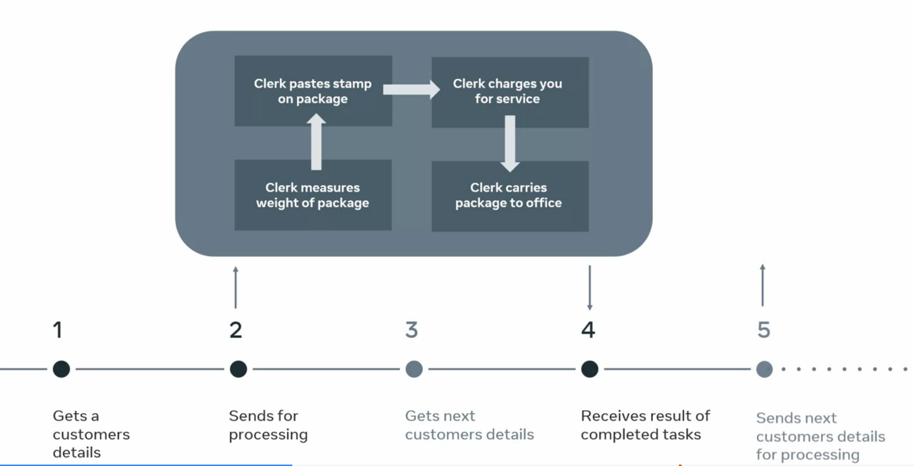

## Use hooks to fetch data in React. 


**The four main rules of hooks are as follows.**
- First, you should only call hooks from a React component function.
- Second, you should only call hooks at the top level of a React component function.
- Third, you are allowed to call multiple state hooks or
effect hooks inside a component.
- Finally, always make these multiple hook calls in the same sequence.

The first rule means that you should not be calling hooks from regular Javascript functions, instead you should only call them from 
- inside a React component function. 
- From a built-in hook call, for example, from the useEffect hook.
- from a custom hook. 
```js
function App() {
    const [petName, setPetName] = useState("Fluffy")

    function nameLooper() {
        if (petName === "Fluffy") {
            setPetName("Rexy")
        } else if (petName === "Rexy") {
            setPetName("Gizmo")
        } else if (petName === "Gizmo") {
            setPetName("Fluffy")
        }
    }
    return (
        <>
            <h1>I'm thinking to name my pet {petName}</h1>
            <button onClick={namelooper}>Pick a name</button>
        </>
    )
}
```
Notice that the useState hook is accessed at the outermost scope of the app function, it has not been used anywhere other than this. For example, inside the nameLooper function scope. However, you may have observed that this rule does not prevent you from using the state setting function which is named setPetName. State setting calls can be used wherever required.

The second rule means you must call your hooks before a return statement outside of loops, conditions or nested functions. If you use a hook in a condition, you're breaking rules. For example, 
```js
if (data !== '') {
    useEffect(() => {
        setData('test data')
    })
}
```
the useEffect hook has been used inside the if conditional statement, that makes the use of the hook in this code **invalid**. 


The third rule is straightforward. There can be multiple hook calls as long as they are always in the same order. What that means is that you cannot place hook calls inside conditional because that might result in an invocation of a hook being skipped when compared with the previous render. 
```js
function App() {
    const [petName, setPetName] = useState("Fluffy")

    function nameLooper() {
        if (petName === "Fluffy") {
            useState("Rexy")
        } else if (petName === "Rexy") {
            useState("Gizmo")
        } else if (petName === "Gizmo") {
            useState("Fluffy")
        }
    }
    return (
        <>
            <h1>I'd like to name my pet {petName}</h1>
            <button onClick={namelooper}>Pick a name</button>
        </>
    )
}
```
the useState hook has been used incorrectly. Rather than using the state setting function setPetName inside the nameLooper function, the useState hook has been used instead. If you were to compile the code and run the app, you may find that the expected output is returned. For example, "I'd like to name my pet fluffy" with a pick a new name button rendered beneath. However, as soon as you click the pick a new name button, you would receive an invalid hook called error.  

That would violate the fourth rule. In other words, it might disrupt the sequence of invocation from one render to the next. Such a violation would result in errors. **If you want to call an effect conditionally you can still do so, but make sure to place the condition inside the hook.** 
```js
useEffect(() => {
    if (data !== '') {
        setData('test data')
    }
})
```
Here, the useEffect hook is invoked initially followed by the if conditional statement. So now, you're not breaking the rules and the code is valid. So let's recap on the four main rules of hooks. 

You should only call hooks from a React component function. 
You should only call hooks at the top level of a React component function. 
You are allowed to call multiple state hooks or effect hooks inside a component. 
And finally, always make these multiple hook calls in the same sequence

In React, the statement "You have to always make multiple hook calls in the same sequence" refers to the Rules of Hooks, which ensure that hooks behave predictably. This rule is essential because React uses the order of hook calls to associate state and effects with the correct components.

**Explanation**:

When you use hooks in a component, React tracks their order in which they are called. Hooks cannot be called conditionally or inside loops or nested functions that may alter their order during subsequent renders.

**Why the Order Matters**:

React doesn’t track hooks by name but by the order in which they are called. If the order of hooks changes between renders, React loses track of which state or effect corresponds to which hook.

**Correct Example**:

```js
function MyComponent() {
  const [name, setName] = React.useState(""); // Hook 1
  const [age, setAge] = React.useState(0);    // Hook 2

  React.useEffect(() => {
    console.log("Effect triggered");          // Hook 3
  }, []);

  return (
    <div>
      <p>Name: {name}</p>
      <p>Age: {age}</p>
    </div>
  );
}
```
Here, the hooks are always called in the same sequence.

**Incorrect Example (Violating Hook Order Rule):**

```js
function MyComponent({ showAge }) {
  const [name, setName] = React.useState("");  // Hook 1

  // Hook conditionally called, leading to potential issues
  if (showAge) {
    const [age, setAge] = React.useState(0);   // Hook 2 (conditionally used)
  }

  React.useEffect(() => {
    console.log("Effect triggered");           // Hook 3 (may shift position)
  }, []);

  return <p>Name: {name}</p>;
}
```

Problem: If showAge changes, the order of hooks becomes inconsistent, and React may lose track of the state.
How to Fix Conditional Hook Use:

Instead of calling hooks conditionally, manage the condition inside the hook:

```js
function MyComponent({ showAge }) {
  const [name, setName] = React.useState("");  // Hook 1
  const [age, setAge] = React.useState(0);     // Hook 2

  React.useEffect(() => {                      // Hook 3
    if (showAge) {
      console.log("Age is displayed");
    }
  }, [showAge]);

  return <p>Name: {name}</p>;
}
```
**Summary**:

The phrase "make multiple hook calls in the same sequence" means:

- Do not call hooks conditionally (inside if, switch, etc.).
- Do not call hooks inside loops.
- Do not call hooks inside nested functions

### What you need to know before fetching data

Fetch is used to make a server requests to retrieve some JSON data from it. Fetch API is a set of functionalities that we have at our disposal to use in JavaScript to make such a server request. 

It's a bit like a clerk at the post office. Say you're bringing a package to the post office and you're the first in the queue. The clerk on the other side of the service desk is JavaScript. Since they can only do one thing at a time. They go through the process of getting your details, measuring the weight of the package, pasting stamps onto the package, charging you for the service, and go into the back-office and carrying the package there, then taking time to find the correct place for the package before it gets shipped.  

The problem with this approach is that the next step cannot start before the previous one is finished. That's what's known as single-threaded execution. Since JavaScript is not at all equipped to multitask, a way to go around this issue is as follows. 



First, JavaScript gets your details. At the same time, it calls a clerk to measure the weight of the package. Then JavaScript calls yet another clerk to paste some stamps onto the package. Javascript calls yet another clerk to charge you for the service, and yet another clerk is called to carry the package to the back-office, allowing JavaScript to take care of the next customer.  

Essentially, this delegation of duties is what's referred to as asynchronous JavaScript. In this metaphor, you can think of the browser as the post office, Javascript as one clerk in the post office and all these other clerks can be referred to as browser APIs or web APIs. 

Now let's explore a practical example of how this delegation of duties works in JavaScript. I have a local HTML file. The most important part of this file is the script tag, which is getting some JavaScript code from the file named script.js located in the same folder as this HTML file. 

Let me inspect this HTML file in the browser. Currently it only shows H_1 heading that reads fetching data. Now, let me take a step back and let's say the JavaScript, the post office worker, needs to get some user data from the computer database. Here is the JavaScript code inside the link to script.js file. let's explore what the javascript is doing step-by-step.

```js
console.log('Another customer approaching')

fetch('https://randomuser.me/api/?results=1')
    .then(response => response.json())
    .then(data => console.log(data))

console.log(`Our valued customer, please
    give me a moment while I get some
    information back from the Records Dept`)
```

It performs a console log. Then it contacts the Fetch API, which is a browser API that is external and separate from JavaScript. Rather than waiting for the Fetch API to return the information, it keeps on executing the code that comes after it, outputting the texts that begins our valued customer. In the meantime, the Fetch API requests some user data from a third party web-based API available at "randomuser.me" Website.

The fetch function is what's known as a "facade" function. Meaning it's a function that looks like it's part of JavaScript, but actually it is just a way for me to call a browser API from JavaScript. In other words, it's a way for me to access a piece of browser functionality that's outside of JavaScript. You can think of it as the JavaScript post office clerk calling the records department of the post office to get some data about a customer. 

When the other clerk gets back with the information and hands it over to the post office clerk, then they will get a JSON representation, and finally, we'll log that data to the console. That means that the sequence of console logs from the code will be as follows. 

- An initial console log that outputs another customer approaching 
- a second console log that outputs our valued customer please wait a moment while I get some information back from the records department, 
- and a final console log that outputs the data.  

Now, I first get another customer approaching then the our valued customer. Finally, the result of the call to the third party API.

```json
Another customer approaching debugger eval code:1:9
Our valued customer, please
    give me a moment while I get some
    information back from the Records Dept

Object { results: (1) […], info: {…} }
info: Object { seed: "6d71287df568fb7e", results: 1, page: 1, … }
results: Array [ {…} ]
<prototype>: Object { … }
```

This is how JavaScript, although being single-threaded, can perform asynchronous operations. 

### Data fetching using hooks

You learned more about fetching data using hooks and that fetching data from a third-party API is considered a side-effect that requires the use of the useEffect hook to deal with the Fetch API calls in React.

You also explored how the response from fetching third-party data might fail, or be delayed, and that it can be useful to provide different renders, based on whether or not the data has been received.

In this reading, you will explore the different approaches to setting up the useEffect hook when fetching JSON data from the web. You will also learn why it can be useful to provide different renders, based on whether or not the data has been received.

You have previously learned about using the Fetch API to get some JSON data from a third-party website in plain JavaScript.

You'll be glad to learn that data fetching is not that different in React.

*There is only one more ingredient that you need to keep in mind when working with React, namely, that fetching data from a third-party API is considered a side-effect.*

Being a side-effect, you need to use the useEffect hook to deal with using the Fetch API calls in React.

To understand what that entails, let me illustrate it with a code example where a component is fetching some data from an external API to display information about a cryptocurrency.
```js
import { useState, useEffect } from "react"; 
 
export default function App() { 
  const [btcData, setBtcData] = useState({}); 
  useEffect(() => { 
    fetch(`https://api.coindesk.com/v1/bpi/currentprice.json`) 
      .then((response) => response.json()) 
      .then((jsonData) => setBtcData(jsonData.bpi.USD)) 
      .catch((error) => console.log(error)); 
  }, []); 
 
  return ( 
    <> 
      <h1>Current BTC/USD data</h1> 
      <p>Code: {btcData.code}</p> 
      <p>Symbol: {btcData.symbol}</p> 
      <p>Rate: {btcData.rate}</p> 
      <p>Description: {btcData.description}</p> 
      <p>Rate Float: {btcData.rate_float}</p> 
    </> 
  ); 
} 
```
```json
{
    "code": "USD",
    "symbol": "&#36;",
    "rate": "97,249.746",
    "description": "United States Dollar",
    "rate_float": 97249.7457
}
```
This example shows that in order to fetch data from a third party API, you need to pass an anonymous function as a call to the useEffect hook. 
```js
useEffect( 
    () => { 
        // ... data fetching code goes here 
    }, 
    [] 
); 
```

The code above emphasizes the fact that the useEffect hook takes two arguments, and that the first argument holds the anonymous function, which, inside its body, holds the data fetching code.

Alternatively, you might extract this anonymous function into a separate function expression or function declaration, and then just reference it.

Using the above example, that code could be presented as follows:
```js
import { useState, useEffect } from "react"; 
 
export default function App() { 
  const [btcData, setBtcData] = useState({}); 
 
  const fetchData = () => { 
    fetch(`https://api.coindesk.com/v1/bpi/currentprice.json`) 
      .then((response) => response.json()) 
      .then((jsonData) => setBtcData(jsonData.bpi.USD)) 
      .catch((error) => console.log(error)); 
  }; 
 
  useEffect(() => { 
    fetchData(); 
  }, []); 
} 
```

The code essentially does the same thing, but this second example is cleaner and better organized.

One additional thing that can be discussed here is the return statement of the above example.

Very often, the response from fetching third-party data might fail, or be delayed. That's why it can be useful to provide different renders, based on whether or not the data has been received.

The simplest conditional rendering might involve setting up two renders, based on whether or not the data has been successfully fetched.

For example:
```js
 return someStateVariable.length > 0 ? ( 
    <div> 
      <h1>Data returned:</h1> 
      <h2>{someStateVariable.results[0].price}</h2> 
    </div> 
  ) : ( 
    <h1>Data pending...</h1> 
  ); 
```

In this example, I'm conditionally returning an h1 and h2, if the length of the someStateVariable binding's length is longer than 0.

This approach would work if the someStateVariable holds an array.

If the someStateVariable is initialized as an empty array, passed to the call to the useState hook, then it would be possible to update this state variable with an array item that might get returned from a fetch() call to a third-party JSON data provider.

If this works out as described above, the length of the someStateVariable would increase from the starting length of zero - because an empty array's length is zero.

Let's inspect the conditional return again:
```js
 return someStateVariable.length > 0 ? ( 
    <div> 
      <h1>Data returned:</h1> 
      <h2>{someStateVariable.results[0].price}</h2> 
    </div> 
  ) : ( 
    <h1>Data pending...</h1> 
  ); 
```

If the data fetching fails, the text of "Data pending..." will render on the screen, since the length of the someStateVariable will remain being zero.

**Conclusion**

You learned more about fetching data using hooks and that fetching data from a third-party API is considered a side-effect that requires the use of the useEffect hook to deal with the Fetch API calls in React.

You also explored how the response from fetching third-party data might fail, or be delayed, and that it can be useful to provide different renders, based on whether or not the data has been received.

### Fetching data - Example

```js
import { useState, useEffect } from "react"; 
 
export default function App() { 
  const [user, setUser] = useState([]); 
 
  const fetchData = () => { 
    
    fetch('https://randomuser.me/api/?results=1')
      .then((response) => response.json()) 
      .then((data) => setUser(data)) 
      .catch((error) => console.log(error)); 
  }; 
 
  useEffect(() => { 
    fetchData(); 
  }, []); 
} 
return Objects.keys(user).length > 0 ? (
    <div>
        <h1>Data returned</h1>
        <h2>First Name: {user.results[0].name.first}</h2>
        <h2>Last Name: {user.results[0].name.last}</h2>
) : (
    <h1>Data pending...</h1>
)
```
I have the app function and inside of it, following the rules of hook, I'm invoking the use state hook at the top level of the component. The initial value of the state variable is an empty array.

Next, I have defined the fetch data function, which is fetching data from the random user.name API, then it retrieves the response from the API in JSON format. It then updates the state variable with this JSON data.

**I'm not using a hook inside the fetch data function because that's against the rules of hooks.**

After that, I'm calling the use effect hook and from inside they use effect hook, I'm calling the fetch data function which I've defined previously. Finally, I'm using conditional logic to decide what to return.

First, I'm using the object.keys code snippet to put all the keys of the user object into an array. Since object.keys returns an array, I can access the length property on this array and check the length

If the length of this array is greater than zero. If it is, it means that the contents of the state array has changed because the state variables array was empty. So if the array is no longer empty, then the div section will be returned with the H1 tag and a couple of H2 tags. Otherwise, the H1 tag below is returned that reads data pending.  

Sometimes it can take a little bit of time for the fetch data function to retrieve the data requested. Therefore, the data pending message will be displayed initially after the code is executed.

**Once the data has arrived from the fetch data call, this change in state causes a re-render of my component. So the return statements ternary operator is re-evaluated and that returns all the data from my call to the fetch API.**
