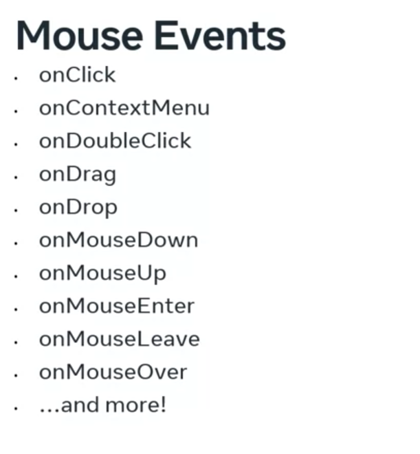
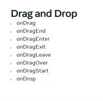

# Dynamic Events and How to handle them

### Type of Events
in JSX click handling that is equevilent to html `onclick` is `onClick` is camelCase 
There are many events supported in React, which can be divided into several groups. Those groups include: 
- clipboard events,
- composition Events, 
- keyboard events, 
- Mouse events, 
- Selection events, 
- Touch events, 
- Wheel events, 
- Animation events, 
and more

Each group holds multiple events
| Mouse events | Clipboard events | Drag and Drop |
|--------------|------------------|---------------|
|  |  |  |

these events are not specific to React Also keep in mind that many of these events are related to specific use cases. 

```jsx
function Btn() {
    const clickHandler = () => {
        console.log('clicked')
    }
    return (
        <div>
            <button onClick={clickHandler}>submit</button>
        </div>
    );
}

### Eventful issues

You’re now aware that React can work with most of the same events found in HTML, although React handles them differently.

This means that you may encounter unfamiliar errors when you run your event-driven React code. However, in this reading, you’ll learn about some of the most common errors associated with events and how you can deal with them.
##### Event Errors

When you work in any programming environment, language, or framework, you are bound to write code that throws errors, for a variety of reasons.

Sometimes it's just about writing the wrong syntax. Other times it's about not thinking of all the possible scenarios and all the possible ways that things can go wrong in your code.

Regardless of what causes them, errors are a part of everyday life for a developer.

The JavaScript language comes with a built-in error handling syntax, the try...catch syntax.

Let’s examine an example of an error in JavaScript:
```js
(5).toUpperCase()
```
Obviously, you cannot uppercase a number value, and thus, this throws the following error:
```bash
Uncaught TypeError: 5.toUpperCase is not a function
```
To handle this TypeError, you can update the code with a try...catch block that instructs the code to continue running after the error is encountered:
```js
try {
    (5).toUpperCase();
} 
catch(e) {
    console.log(`Oops, you can't uppercase a number. 
        Trying to do it resulted in the following`, e);
}
```
The try-catch block will output some text in the console:

Oops, you can't uppercase a number. Trying to do it resulted in the following TypeError: 5.toUpperCase is not a function

here's an example of a simple error in a React component:
```jsx
function NumBillboard(props) {
    return (
      <>
        <h1>{prop.num}</h1>
      </>
    )
  }

export default NumBillboard;
```
In React, an error in the code, such as the one above, will result in the error overlay showing in the app in the browser.

In this specific example, the error would be:
- ReferenceError
- prop is not defined

Since event-handling errors occur after the UI has already been rendered, all you have to do is use the error-handling mechanism that already exists in JavaScript – that is, you just use the try...catch blocks.

### syntax of handlers

```html
<button id="js-btn" onclick="clickHandler()">click me!</button>
```
```js
const jsBtn = document.getElementById('js-btn')
jsBtn.addEventListener('click', function() {
    console.log('clicked')
})
```


In React. The rule is to avoid manipulating the DOM directly as much as possible. You should set everything up declaratively, meaning that you describe updates to React and let it figure out the rest. 

_**But note that there is no function invocation syntax in event handling attribute in React.**_   
In other words, while in plain JavaScript, you would need to pass an invocation to an event handling function as a value to the on click events.  
In React, you should not invoke a function. Instead, you just pass a reference to the event handling function without invoking it. To illustrate that point, let's compare the syntax of an HTML click handler event and it's reactor JSX equivalent. 

```html
<button id="js-btn" onclick="clickHandler()">click me!</button>
```
```jsx
<button onClick={clickHandler}>Click me!</button>
```
**only using React is the passing of function declarations as props.** 
```jsx
return (
    <Counter onClick={clickHandler}/>
)
```

### Event handling and embedded expressions

##### Handling events using inline anonymous ES5 functions

This approach allows you to directly pass in an ES5 function declaration as the onClick event-handling attribute’s value:
```jsx
<button onClick={function() {console.log('first example')}}>
    An inline anonymous ES5 function event handler
</button>
```

Although it's possible to write your click handlers using this syntax, it's not a common approach and you will not find such code very often in React apps.

##### Handling events using inline anonymous ES6 functions (arrow functions)

With this approach, you can directly pass in an ES6 function declaration as the onClick event-handling attribute’s value:
```js
<button onClick={() => console.log('second example')}>
    An inline anonymous ES6 function event handler
</button>
```

This approach is much more common then the previous one. If you want to keep all your logic inside the JSX expression assigned to the onClick attribute, use this syntax.

##### Handling events using separate function declarations

With this approach, you declare a separate ES5 function declaration, and then you reference its name in the event-handling onClick attribute, as follows:
```js
function App() {
    function thirdExample() {
        console.log('third example');
    };
    return (
        <div className="thirdExample">
            <button onClick={thirdExample}>
                using a separate function declaration
            </button>
        </div>
    );
};
export default App;
```

This syntax makes sense to be used when your onClick logic is too complex to easily fit into an anonymous function. While this example is not really showing this scenario, imagine a function that has, for example, 20 lines of code, and that needs to be ran when the click event is triggered. This is a perfect use-case for a separate function declaration.

##### Handling events using separate function expressions

Tip: A way to determine if a function is defined as an expression or a declaration is: if it does not start the line with the keyword function, then it’s an expression.

In the following example, you’re assigning an anonymous ES6 arrow function to a const variable – hence, this is a function expression.

You’re then using this const variable’s name to handle the onClick event, so this is an example of handling events using a separate function expression.
```js
function App() {
    const fourthExample = () => console.log('fourth example');

    return (
        <div className="fourthExample">
            <button onClick={fourthExample}>
                using a separate function expression
            </button>
        </div>
  );
};
export default App;
```

The syntax in this example is very common in React. It uses arrow functions, but also allows us to handle situations where our separate function expression spans multiple lines of code.

