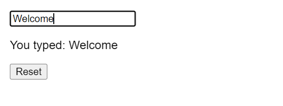
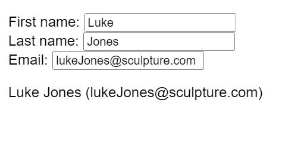

# Data and Events

### Parent-child data flow
Assume I have this code
```jsx
// Promo.js file
import PormoHeading from './PromoHeading'
function Promo(){
    return(
        <div>
            <PromoHeading />
        </div>
    )
}

// PromoHeading.js file
function PromoHeading(){
    return(
        <div>
            <h1>90% off</h1>
        </div>
    )
}
```
let's explore a situation: you have to call the `PromoHeading` component in the sidebar and footer components of the web app in addition to the primary component. and display messages "99 percent of all items" and "everything must go".

if you update the child component you'd have to update multiple components with the same data.

You rather establish a **single source of truth** that contains the two strings that store the values for the texts, "99 percent of all items" and "everything must go". This will be contained within the parent component so that any data needed can be passed onto the child component using **props**. 

Recall the props is a feature of React that essentially allows you to hold information about the UI in the browser. 

let's use this approach First, you create a single source of truth, a JavaScript object named data
```js
const data = {
    heading: '99% off all items'
    callToAction: 'Everything must go'
}
```

Next, you update the `Promo` component to pass the `heading` and the `callToAction` values of the data object to the `PromoHeading` component. This is known as passing data from the parent to the child component. 

```jsx
import PormoHeading from './PromoHeading'
function Promo(){
    return(
        <div>
            <PromoHeading  heading={props.heading} callToAction={props.callToAction}/>
        </div>
    )
}
// PromoHeading.js
function PromoHeading(props){
    return(
        <div>
            <h1>{props.heading}</h1>
            <h2>{props.callToAction}</h2>
        </div>
    )
}
```

### Data flow in React

##### Parent-child data flow

In React, data flow is a one-way street. Sometimes it's said that the data flow is unidirectional. Put differently, the data in React flows from a parent component to a child component. The data flow starts at the root and can flow to multiple levels of nesting, from the root component (parent component) to the child component, then the grandchild component, and further down the hierarchy.

A React app consists of many components, organized as a component tree. The data flows from the root component to all the  components in the tree structure that require this data, using props. Props are immutable (cannot be changed).


Here’s a practical example of this, Imagine that the parent component passes a prop (name) to the child component. The child component then uses this prop to render the name in the UI.  
Parent component:
```js
function Dog() {
    return (
        <Puppy name="Max" bowlShape="square" bowlStatus="full" />
    );
};
```
Child component:
```js
function Puppy(props) {
    return (
        <div>
            {props.name} has <Bowl bowlShape="square" bowlStatus="full" />
        </div>
    );
};
```
Grandchild component:
```js
function Bowl(props) {
    return (
        <span>
            {props.bowlShape}-shaped bowl, and it's currently {props.bowlStatus}
        </span>
    );
};
```

Having data move through props in only one direction makes it simpler to understand the logic of how the components interact. If data were moving everywhere, all the time, then it would be much harder to comprehend its logical flow. 


In React, data is passed down from parent components to a child components via props. A child components can't mutate or change its props. It can only read them and re-render. This means that the data comes from the parents and it's just consumed in the child components. 

All the data in React can be divided into props data and states data. Props data is data outside the components that it receives and works with but cannot mutate. State data is data inside the components that it controls and can mutate. The prop data are belongs to the parent that renders the components. The state data belongs to the component itself. 


# Hooks

One key benefit of hooks is that they solve the problem of unnecessary code reuse across components. 
Hooks are functions that were introduced in React version 16 They let you hook into React state and lifestyle features from components. 
useState hook is the most commonly used one. This hook is used to manage the state within a component and keep track of it and it's built directly into React. 
```jsx
import React, {useState} from 'react';
const [showMenu, setShowMenu] = useState(false) 
```

Notice that the convention is to name the state variable and the set of function using array destructuring. When you declare a state variable using the useState, it returns a pair which is an array with two items. Without array destructuring, the code would be long and cumbersome. 

Since it's more confusing and tedious to access the array items by index, array destructuring is preferred and it significantly simplifies the code. You now have a new state variable called showMenu. The useState then sets the initial value of showMenu as false.

```js
[false, ƒ]
0: false
1: ƒ ()length: 1
name: "bound dispatchSetState"
arguments: (...)
caller: (...)
[[Prototype]]: ƒ ()
[[TargetFunction]]: ƒ dispatchSetState(fiber, queue, action)
[[BoundThis]]: null
[[BoundArgs]]: Array(2)
length: 2
    [[Prototype]]: Array(0)

```
So to summarize calling the useState hook does two things. It creates a state variable with an initial value that represents the current state, which in this example is showMenu. And it creates a function to set that states variable value, which in this case is setShowMenu. The function setShowMenu is used to update the value of show menu bypassing the Boolean value to it. It does not matter what names you use for the state variables. 

The useState hook should be called at the top level of your component. In this example, notice that the useState hook was used to track the Boolean state value. You can use the useState hook to track any type of data. It could be strings, numbers, arrays, Booleans or objects. For instance, you can even track the number of times a button is pressed.

```jsx
import React, {useState} from 'react';
function Component(){
    const [showMenu, setShowMenu] = useState(false) 
    return(
    )
}
```

In addition to the hooks that come out of the box with React, you can also build your own hooks, which will let you extract custom component logic into reusable functions. 


## Using hooks

Let’s say you have a component with an input text field. The user can type into this text field. The component needs to keep track of what the user types within this text field. You can add state and use the useState hook, to hold the string.

As the user keeps typing, the local state that holds the string needs to get updated with the latest text that has been typed.

```js
import { useState } from 'react';
export default function InputComponent() { 
  const [inputText, setText] = useState('hello'); 

  function handleChange(e) { 
    setText(e.target.value); 
  } 

  return ( 
    <> 
      <input value={inputText} onChange={handleChange} /> 
      <p>You typed: {inputText}</p> 
      <button onClick={() => setText('hello')}> 
        Reset 
      </button> 
    </> 
  ); 
} 
```
To do this, let's define a React component and call it `InputComponent`. This component renders three things:

- An input text field 
- Any text that has been entered into the field 
- A Reset button to set the field back to its default state 

As the user starts typing within the text field, the current text that was typed is also displayed.

  

The state variable `inputText` and the `setText` method are used to set the current text that is typed. The `useState` hook is initialized at the beginning of the component.
```jsx
const[inputText, setText] = useState('hello');
```

By default, the `inputText` will be set to “hello”.

As the user types, the `handleChange` function, reads the latest input value from the browser’s input DOM element, and calls the `setText` function, to update the local state of `inputText`.
```jsx
function handleChange(e) {
    setText(e.target.value);
};
```
Finally, clicking the reset button will update the `inputText` back to “hello”. 

Keep in mind that the `inputText` here is local state and is local to the `InputComponent`. This means that outside of this component, `inputText` is unavailable and unknown. **In React, state is always referred to the local state of a component.**


### Rules of Hooks 

- You can only call hooks at the top level of your component or your own hooks. 
- You cannot call hooks inside loops or conditions. 
- You can only call hooks from React functions, and not regular JavaScript functions. 

To demonstrate, let’s extend the previous example, to include three input text fields within a single component. This could be a registration form with fields for first name, last name and email. 
Text fields of first name, last name and email


```jsx
import { useState } from 'react'; 

export default function RegisterForm() { 
  const [form, setForm] = useState({ 
    firstName: 'Luke', 
    lastName: 'Jones', 
    email: 'lukeJones@sculpture.com', 
  }); 

  return ( 
    <> 
      <label> 
        First name: 
        <input 
          value={form.firstName} 
          onChange={e => { 
            setForm({ 
              ...form, 
              firstName: e.target.value 
            }); 
          }} 
        /> 
      </label> 
      <label> 
        Last name: 
        <input 
          value={form.lastName} 
          onChange={e => { 
            setForm({ 
              ...form, 
              lastName: e.target.value 
            }); 
          }} 
        /> 
      </label> 
      <label> 
        Email: 
        <input 
          value={form.email} 
          onChange={e => { 
            setForm({ 
              ...form, 
              email: e.target.value 
            }); 
          }} 
        /> 
      </label> 
      <p> 
        {form.firstName}{' '} 
        {form.lastName}{' '} 
        ({form.email})
      </p> 
    </> 
  ); 
} 
```
Notice that you are using a `form` object to store the state of all three text input field values:
```jsx
const[form, setForm] =useState({
firstName:'Luke',
lastName:'Jones',
    email:'lukeJones@sculpture.com',
});
```

You do not need to have three separate state variables in this case, and instead you can consolidate them all together into one form object for better readability.

In addition to the `useState` hook, there are other hooks that come in handy such as `useContext`, `useMemo`, `useRef`, etc. When you need to share logic and reuse the same logic across several components, you can extract the logic into a custom hook. Custom hooks offer flexibility and can be used for a wide range of use-cases such as form handling, animation, timers, and many more. 

Next, I'll give you an explanation of how the `useRef` hook works.

### The useRef hook

We use the `useRef` hook to access a child element directly.

When you invoke the useRef hook, it will return a ref object. The ref object has a property named current.

```js
function TextInputWithFocusButton() {
  const inputEl = useRef(null);
  const onButtonClick = () => {
    // `current` points to the mounted text input element
    inputEl.current.focus();
  };
  return (
    <>
      <input ref={inputEl} type="text" />
      <button onClick={onButtonClick}>Focus the input</button>
    </>
  );
}
```

Using the `ref` attribute on the input element, I can then access the current value and invoke the `focus()` method on it, thereby focusing the input field.

There are situations where accessing the DOM directly is needed, and this is where the `useRef` hook comes into play.
Conclusion

