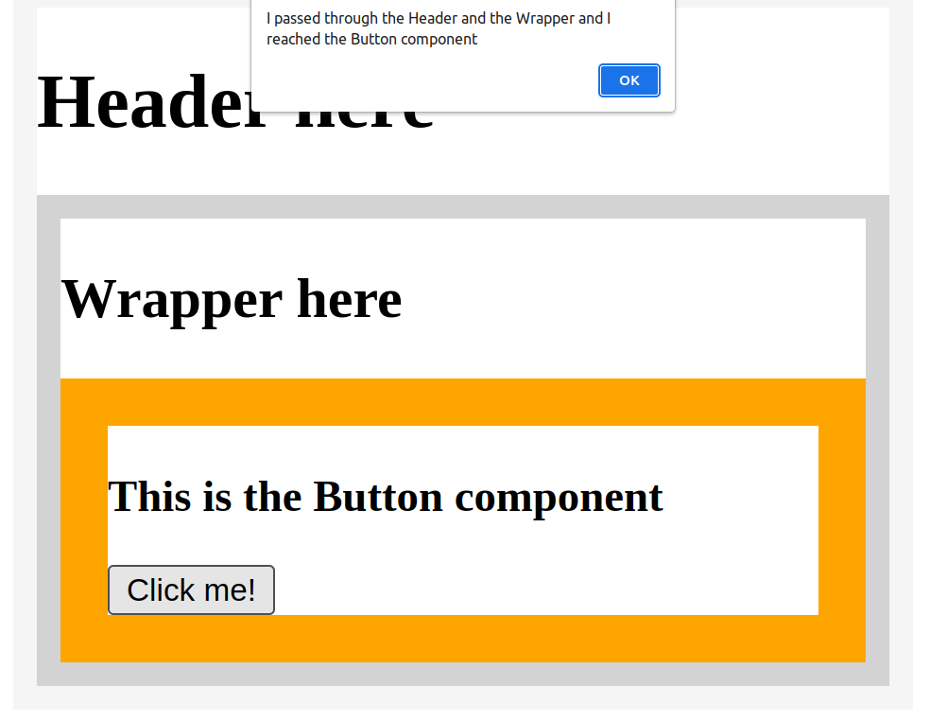
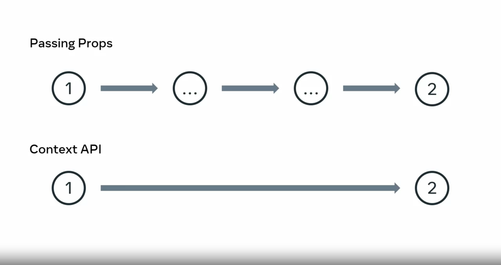
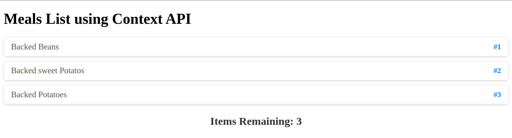

# React States

States, allows you to easily change how the component behaves in order to suit a given need. It helps to think of State as a component's internal data that determines the current behavior of a component. It's often used to store data that affects the behavior of a component.   

States is important because it allows components to stay in sync with each other and ensure that your app behaves as intended, for example, if one component updates its State, all other components that depend on that State will automatically update too. This means that a component sends its State to its children by using props. 
```
Parent component
    ▼  props
Child component 
    ▼  props
grandchild component
```
If the child components have their own grandchild components, then the child components might have some States that they send as props to those grandchild components. In React, State is kept in a state of variables. The main way to change State is to **alter** these variables. When a component is created, it gets an initial State. The State is used to initialize the component's properties.
```
component created
    ▼  
Initial state
    ▼  
component properties initialized
```
Components can be either stateful or stateless, First is an app component with no state defined. It performs a single action, which is to render the text a stateless component 
```jsx
function App(){
    return <h1>A state value: {word}</h1>
}
```
Then you have a stateful function component. This component also renders some texts, but it references a variable to do so.
```jsx
function App(){
    const [ word, setWord ] = useState("Hello")
    return (
        <div>
            <h1>A state value: {word}</h1>
        </div>
    )
}
```

In this case, `Hello` is the state value assigned to the word state variable. The function is a built-in one that is not declared. The function can be destructured with any name you'd like, but there is a convention to follow. If you set the States variable name to be greet, then the destructured state function should be `setGreet`. This is because the second destructured variable is a function ( its whole job ) that **will be used to update the state of a variable**. 
```jsx
function App(){
    const [ greet, setGreet ] = useState("Hello")
    return (
        <div>
            <h1>A state value: {greet}</h1>
        </div>
    )
}
```
Let's examine an updated version of this stateful function component. Notice that the `setGreet` variable is not actually run, that is something that is done elsewhere. 

**You can't use the state's setting variable (setVar) from your state directly. Instead of updating it directly, I can update it based on a click event. you must make sure that you use event handling attributes in JSX syntax or use it in function that is refrenced by event handling**

### Prop drilling

prop drilling is a situation where you are passing data from a parent to a child component, then to a grandchild component, and so on, until it reaches a more distant component further down the component tree, where this data is required.

Here is a very simple app that focuses on the process of props passing through several components. 
```jsx
function Main(props) { 
  return <Header msg={props.msg} />; 
};

function Header(props) { 
  return ( 
    <div style={{ border: "10px solid whitesmoke" }}> 
      <h1>Header here</h1> 
      <Wrapper msg={props.msg} /> 
    </div> 
  ); 
};

function Wrapper(props) { 
  return ( 
    <div style={{ border: "10px solid lightgray" }}> 
      <h2>Wrapper here</h2> 
      <Button msg={props.msg} /> 
    </div> 
  ); 
};

function Button(props) { 
  return ( 
    <div style={{ border: "20px solid orange" }}> 
      <h3>This is the Button component</h3> 
      <button onClick={() => alert(props.msg)}>Click me!</button> 
    </div> 
  ); 
};

function App() { 
  return ( 
    <Main  
      msg="I passed through the Header and the Wrapper and I reached the Button component"  
    /> 
  ); 
}; 

export default App;
```
This app is simple enough that you should be able to understand it on your own. 


This screenshot illustrates the boundaries of each component. The Main component can’t be found in the UI because it’s just rendering the Header component. The Header component then renders the Wrapper component, and the Wrapper component then renders the Button component.

Note that the string that was passed on and on through each of the children component’s props’ objects is not found anywhere. However, it will appear when you click the “Click me!” button, as an alert:



## React state management

While passing props helps to manage states, it is like taking a bus and going through each stop before you get off at the end. In comparison, using the context API is like teleporting to your destination instantly. It's a way to bypass the redundant passing of data through multiple levels of components.  

  

To set it up, you need to add a piece of code that will be your **context provider**. It's also where the state will be stored. When a component needs to use the state, it becomes a **context consumer**. 


React Context is a way to manage state globally. It can be used together with the useState Hook to share state between deeply nested components more easily than with useState alone.  
The Problem State should be held by the highest parent component in the stack that requires access to the state. To illustrate, we have many nested components. The component at the top and bottom of the stack need access to the state. To do this without Context, we will need to pass the state as "props" through each nested component. This is called "prop drilling".

### The Problem

State should be held by the highest parent component in the stack that requires access to the state. To illustrate, we have many nested components. The component at the top and bottom of the stack need access to the state. To do this without Context, we will need to pass the state as "props" through each nested component. This is called "prop drilling".
```js
function Component1() {
  const [user, setUser] = useState("Jesse Hall");
  return (
    <>
      <h1>{`Hello ${user}!`}</h1>
      <Component2 user={user} />
    </>
  );
}
function Component2({ user }) {
  return (
    <>
      <h1>Component 2</h1>
      <Component3 user={user} />
    </>
  );
}
function Component3({ user }) {
  return (
    <>
      <h1>Component 3</h1>
      <h2>{`Hello ${user} again!`}</h2>
    </>
  );
}
```
### The Solution

The solution is Create Context To create context, you must Import createContext and initialize it
```js
import { useState, createContext } from "react";
import ReactDOM from "react-dom/client";
const UserContext = createContext()
```
Next we'll use the Context Provider to wrap the tree of components that need the state Context.
Context Provider Wrap child components in the Context Provider and supply the state value.
```js
function Component1() {
  const [user, setUser] = useState("Jesse Hall");

  return (
    <UserContext.Provider value={user}>
      <h1>{`Hello ${user}!`}</h1>
      <Component2 user={user} />
    </UserContext.Provider>
  );
}
```
Now, all components in this tree will have access to the `userContext`. Use the `useContext` Hook In order to use the Context in a child component, we need to access it using the `useContext` Hook. First, include the useContext in the import statement:
```js
import { useState, createContext, useContext } from "react";
```
Then you can access the user Context in all components:
```js
function Component5() {
  const user = useContext(UserContext);

  return (
    <>
      <h1>Component 5</h1>
      <h2>{`Hello ${user} again!`}</h2>
    </>
  );
}
```
```js
// PROVIDER COMPONENT
import {createContext} from 'react';
export const MyContext = createContext();
<MyContext.Provider value={value}>
<Child />
</MyContext.Provider>
```
```js
// CONSUMER COMPONENTS
import React, { useContext } from 'react';
import { MyContext } from './ComponentA';
const value = useContext(MyContext);
```
### Real-world Implementation

`MealsProvider` provide context states data and gives to all commponents wrapped inside App component  
`MealsProvider` components holds all the states which is organized with help of context API 
```js
// App.js
import MealsProvider from './MealsProvider'
import MealsList from './MealsList'
import Counter from './Counter'

function App() {
  return (
    <div>
      <MealsProvider />
        <MealsList />
        <Counter />
      <MealsProvider />
    </div>
  )
}
export default App
```
```jsx
// MealsProvider.js
import React from 'react'
// First I set the meals contexts variable using the createContext function.  
const MealsContext = createContext()
// Next, I declare the todaysMeals array, which contains several food items saved as strings.  
const todaysMeals = ['Backed Beans', 'Backed sweet Potatos', 'Backed Potatoes']
```   
I then code the `mealsProvider` as an ES6 function that accepts the children value. **This value holds everything that we wrapped into the `mealsProvider` component when it gets rendered inside the `App` component.**    
which in this case it `MealsList` and `Counter` components as a children of `MealsProvider` component  
The children value is just returned from the `mealsProvider`, wraps into the `MealsContexts.Provider` JSX elements.   
The `MealsContexts.Provider` JSX elements comes with the `value` attribute. This value attributes gets assigned the `meals` object, which is the value I sent to the `useState` variable earlier. 
**All `children` has access to the `value` prop**
```JS
const MealsProvider = ({children}) => {
  const [meals, setMealsList] = useState(todaysMeals)
  return (
    <MealsContext.Provider value={{meals}}>
    {children}
    </MealsContext.Provider>
      )
}

export const useMealsListContext = () => useContext(MealsContext)
export default MealsProvider
``` 
Before exporting the `mealsProvider` component, set a `useMealsListContexts` variable to the `useContext` and passing the `mealsContexts` as its single argument.   
This makes it easier for me to destructure the meals objects from the `useMealsListContext` variable.  

Finally, in the `mealsList` component,   I'm accessing the context date by importing the `useMealsListContext` from the `mealsProvider` file.   
 
```js
// MealsList.js
import {useMealsListContext} from './MealsProvider'
```
Let's break down how this component works in more detail. First, I'm destructuring the meals property from the objects returned from the `useMealsListContext` call.  
The original object has a single property named meals, which holds an array of three meals strings.  
```js
const MealsList = () => {
  const {meals} = useMealsListContext()
// the value of the context
  return (
    <div>
      <h1>Meals List using Context API</h1>
      {meals.map((meal, index) => (
        <h2 key={index}>{meal}</h2>
      ))}
    </div>
  )
}
export default MealsList
```
Once I destructure the `meals` property from that object, all I have left is the array of three strings saved in the `meals` variable, which allows me to **map** over the `meals` value where I'm rendering an `H2` for each member of the `meals` array.  

Lastly, let's examine the `Counter` component. Note that it gets the context data in the same way that the `mealsList` component does. This is the usefulness of having a centralized state store. It allows me to simply reach into the states provider directly from whatever components needed without having to do prop drilling or lifting upstate. 



Next, let me show you how the `useReducer` hook works. You can think of it as a superpower to `useStates`. While the `useStates` hook starts with an initial state, the `useReducer` also gets a reducer function in addition to the initial state. 
```js
// App.js
const reducer = (state, action) => {
  if (action.type === 'ride') return {money: state.money + 10}
  if (action.type === 'fuel') return {money: state.money - 50}
  return new Error()
}
function App() {
  const initialState = {money: 100}
  const [state, dispatch] = useReducer(reducer, initialState)
```
Let's say I have a rideshare app that represents the amount of money in my wallet. The initial state is a value of `100` and the action of picking up a customer increases the value while the action of refueling my vehicle decreases it. I've applied to `reducer` a function which takes in the `state` and the `action`. Instead of using `setState` like in the `useState` hook, I'll use the `dispatch` method of the `useReducer` hook, which accepts an object literal with a single property `type` set to a matching `action.type` whose behavior is defined inside the reducer function.  if we console.log `useReducer` 
```js
Array(2)
0: {money: 100}
    money: 100
1: ƒ ()
    length: 1
```
```js
import react from 'react'
import { useReducer } from 'react'
const reducer = (state, action) => {
  if (action.type === 'ride') return {money: state.money + 10}
  if (action.type === 'fuel') return {money: state.money - 50}
  return new Error()
}
function App() {
  const initialState = {money: 100}
  const [state, dispatch] = useReducer(reducer, initialState)
    return (
    <div>
    <h1>Wallet: {state.money}</h1>
      <button onClick={() => dispatch({type: 'ride'})}> new customer</button>
      <button onClick={() => dispatch({type: 'fuel'})}> Refill tank</button>
    </div>
)
    }

export default App
```


​