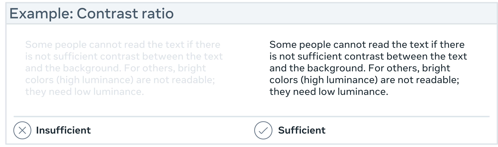
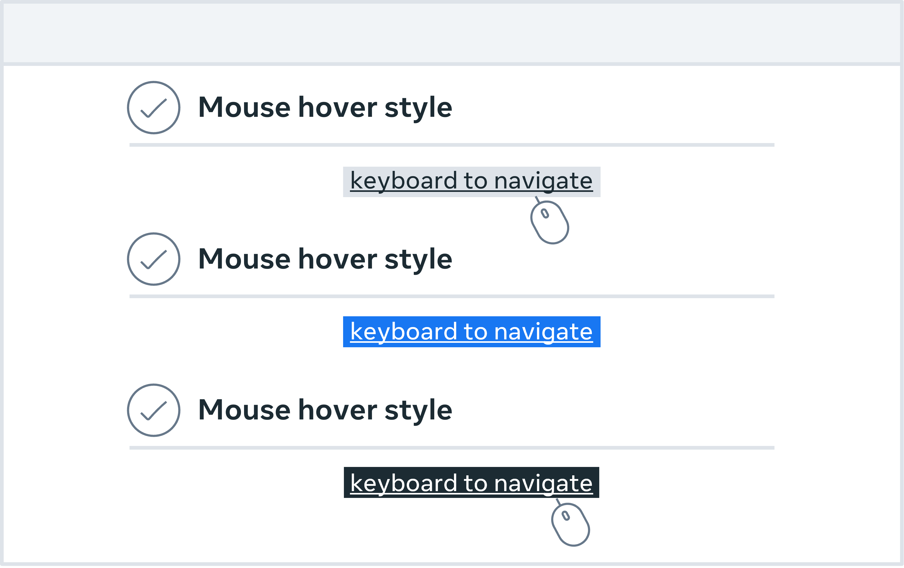
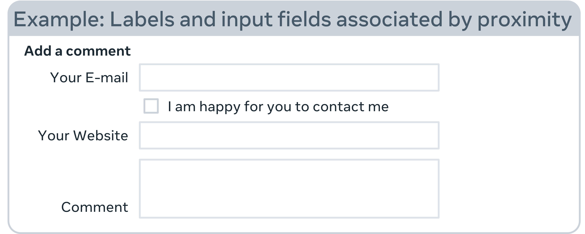
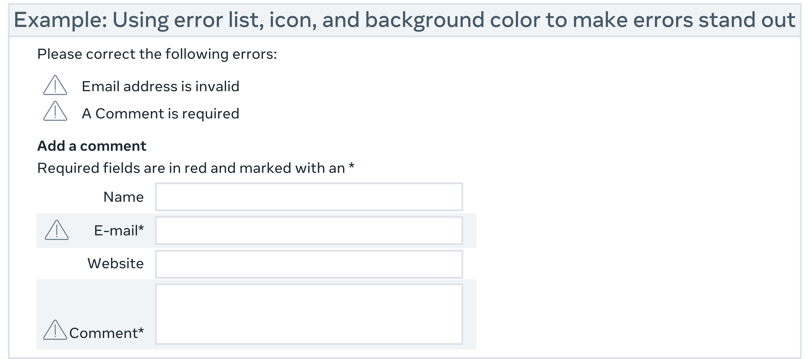
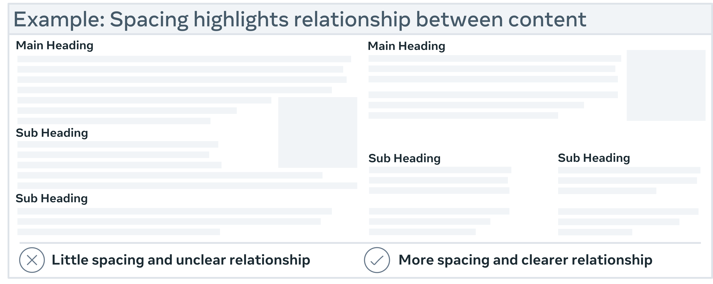
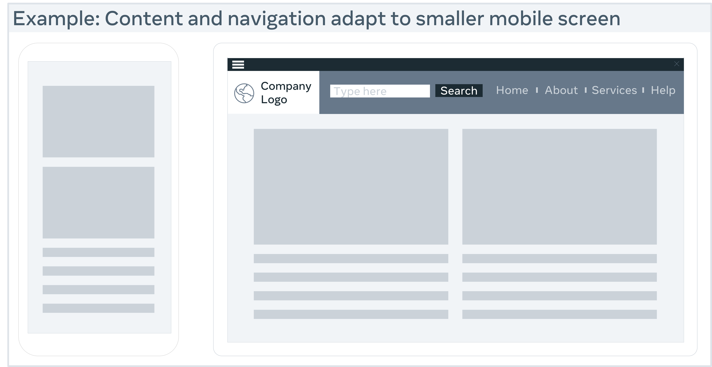
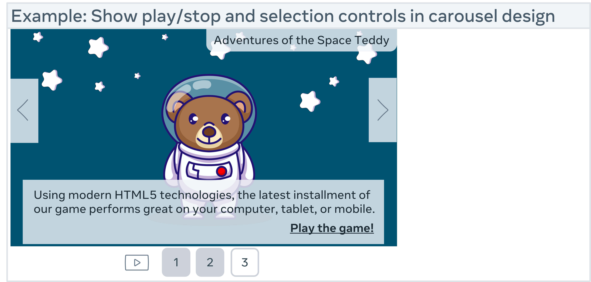

# Evaluation cheat sheets

You have previously learned about popular UX and UI evaluation methodologies and how and where these can be applied to improve your designs. Let's explore them in greater detail. 

## Dieter Ram's 10 Principles of Good Design
### Good design is innovative

Whether you are making a change or doing something in a new way, developing new ideas or making improvements to existing designs and working alongside new technology, all of these offer a multitude of opportunities for you to be innovative within a design. 
Good design makes a product useful

It doesn't matter how stunning a product looks if it is practically unusable as it becomes completely worthless. Products are not pieces of art to be admired. They are there to serve a purpose and solve a problem. 

### Good design is aesthetic

Beautiful items tend to make us feel comfortable. If a product is beautiful, you may be more inclined to use and want it. Some may argue against this point as you may have your own subjective idea of what is beautiful, and some well-designed items do prioritize utility over beauty. Regardless of your taste, you may like the things around you to be beautiful irrespective of how you define beauty. 

### Good design makes a product understandable

For example, handles on doors that don't indicate if they should be pushed or pulled or taps that don't indicate if they are hot or cold just leave the user confused. The opposite of this is an instantly understandable product that is completely self-explanatory and communicates what it's about, what it's for and how to use it. This saves a user from breaking the product or spending time reading through instruction manuals. 

### Good design is unobtrusive

An obtrusive product is an over-designed product. Products that tend to fail are those created with the designer in mind or with presumptions of who the user might be and or how they might use it. The very best products allow the user to do exactly what they want to do. These products should also help the user to complete their intended tasks effectively and happily. The design should not hinder the individual's intuitive process. 

### Good design is honest

Good design doesn't have tricks! It doesn't pretend to be something that it isn't, and it doesn't try to manipulate you into buying it by making promises that can't be kept. It should always have the user's best interests in mind, so it shouldn't have to try to lie to you or try to be something that it isn't. 
### Good design is long-lasting

Design should always be thorough to the last detail and avoids being fashionable which means that it never appears old or antiquated.

### Good design is thorough down to the last detail

A Good design should be detail-oriented and leave nothing to chance. Every single aspect of the design should be considered, and all the elements should qualify to be a part of that design. Products should be designed with care, thoroughness, and concern for the intended user. 

### Good design is environmentally friendly

Pollution can arise from wasted resources throughout a product's lifespan. Design shouldn't be wasteful and should save resources where it can, both physically and digitally. 

### Good design is as little as possible

Design should always be intentional. Anything that doesn't serve a purpose for the user should be excluded. With less clutter, a design will achieve more clarity for the user. 

## Jakob Nielsen's Heuristics: 10 Usability Principles to Improve UI Design

### Visibility of system status

Explore your smartphone. Right after the screen lights up, it informs you about its battery and if you have a Wi-Fi connection, any received messages, missed calls and much more. Imagine how insecure you would feel if this information were missing. The system communicates its status and assists users in making better, more informed decisions by using signs, icons and indicators. 

### Match between the system and the real world

Users may make assumptions about how a system will work based on their previous experiences with similar systems. You can help them overcome their initial discomfort by using language they are familiar with. 
### User control and freedom

Digital spaces, like physical spaces, require quick 'emergency exits'. Users frequently select system functions by accident and need a clearly marked way to leave the unwanted position without going through an extended dialogue. So, support the undo and redo functions. 
### Consistency and standards

Consistency is the key. A 'submit' button on one page should look the same across the site on any page. If you show information in a particular format on one page, it should look the same on all pages. 
### Error prevention

A careful design that prevents a problem from occurring in the first place is even better than good error messages. Remove conditions that may cause errors in your design, or look for them and give your users a confirmation option so that they can make an informed decision before tapping or selecting anything. 

### Recognition rather than recall

Allow your users to recognize information in the user interface rather than expecting them to remember or recall it. Simply put, don't make your users work any harder than necessary! Make your navigation as clear, detailed and straightforward as possible. Offer them hints, remind them when something time-sensitive needs to be done and notify them when a screen or a process has been changed. 

### Flexibility and efficiency of use

Simply put, your system must be designed so that both experienced and inexperienced users can use it. Think of designing a system where a new user can find a way to perform a task without knowing any shortcuts. However, also design your system in such a way that an experienced user can use shortcuts to complete the action quickly and efficiently. 

### Aesthetic and minimalistic design

Make a fantastic first impression! Users notice aesthetics or how visually appealing your system is in the first 50 milliseconds of landing on a page, which is ten times faster than it takes them to read it. This means that you should make sure that you establish and reinforce your system's brand identity and credibility. 

### Help users recognize, diagnose and recover from errors

A good error message should be polite, easy to understand, precise, constructive, clearly visible, and take as little time as possible to fix the problem as well as educate your users. 

### Help and documentation

Even though it is preferable that your system can be used without documentation. It is important that any such information should be: easy to find, focused on the user's task, include the actual steps they should take, and not be too large. 

## Ben Shneidermann's 8 Golden Rules of Interface Design

### Strive for consistency

Consistency is critical to maintaining uniformity throughout the site, whether it's the layout, the size of the button, the color code, or the tone used when writing the page. Consistency will enable you to establish your identity and stop users from abandoning your site. 

### Enable frequent users to use shortcuts

Think about allowing your users to access all areas of your website with a few clicks. To accomplish this, you should create a good hierarchy in the menu and make things clear. Consider including features for both advanced and novice users, such as keyboard shortcuts or macro-capabilities. 

### Offer informative feedback

If your users have completed or are completing activities on your website, it is best to provide feedback as soon as possible so that they can understand where they are in the system. 

### Design dialog to yield closure

All interactions must have a beginning, middle and end. Once a task is completed, maybe give your users some peace of mind by providing them with informative feedback and well-defined choices for the next step, if applicable. Don't keep them guessing! 

### Offer simple error handling

An interface should be designed to eliminate as many errors as possible. If something goes wrong, the system should make it simple for users to understand and resolve the problem. A good idea is to display clear error notifications and descriptive hints to resolve the problem. These are examples of simple ways to deal with system errors. 

### Permit easy reversal of actions

Finding that there is an "undo" option after making a mistake is a huge relief. Your users should feel less anxious and more likely to explore options if they know there is a simple way to undo any mistakes. This rule applies to any action, sequence of steps or data entry in your system. This can range from a single button to a complete set of actions. 

### Support internal locus of control

It is essential to give your users control and freedom so that they feel in control of the system instead of the other way around. As the designer, try to avoid surprises, interruptions and anything that the users didn't request. Users should be the ones who initiate actions. 

### Reduce short-term memory load

As users, our attention span may be limited, so anything you can do to make your users' jobs easier is a win-win situation. Your users may prefer to recognize information rather than recall it. Try to keep interfaces simple and consistent and keep to patterns, standards and conventions. This may contribute to better recognition and ease of use. Depending on your users' objectives, you can add various features to help them. In an e-commerce setting, for example, a list of recently viewed or purchased items can be presented. 

**Final thoughts**

While heuristic-based decisions can be taken lightly, adhering to a set of rules and guidelines helps to point you in the right direction and allow you to identify significant usability issues early in the design process. These guidelines apply to most user interfaces. You can take inspiration from these examples to develop your own set of heuristics, or you can combine them to solve your own design problems.

## Designing for accessibility

Accessibility enables people with disabilities to interpret, understand, navigate, interact with and contribute to the web. Think of a world in which developers know everything there is to know about accessibility. You design it and they build it perfectly. However, if you only consider the design of a product, it may make it difficult for people with disabilities to use it.

Choosing which 'needs' to design for is one of the most common issues when designing for accessibility. We don't intentionally exclude users; rather, 'we don't know what we don't know'. As a result, there is a lot to learn about accessibility. Let's consider some accessibility guidelines that may guide you in the right direction. These guidelines cover the major points you need to know for your products to be design-ready and meet the Section 508 and Web Content Accessibility Guidelines (WCAG) 2.0 minimum standards. The rest is up to development and quality assurance testing. For a detailed explanation of accessibility, you can access the WCAG 2.0

**Access to information is not a barrier to innovation**

Accessibility may not persuade you to produce an ugly, boring or cluttered product. It may initiate a set of constraints you'll need to consider as you design. These design constraints will offer you new ideas to explore, resulting in improved products for all your users.

Bear in mind that you may not want to design for your peers as you read these guidelines. What is important is that you design for a wide range of users who will engage with your products, including people who are blind, color blind or have poor eyesight, those who are deaf or have poor hearing, people with permanent or temporary mobility impairments and people with cognitive disabilities. When you design, you may want to take all the possible users into consideration. They can be young, old, power users, casual users and those who purely enjoy a good experience. 
 
**Don't use color alone to convey information**

Don't use color alone to convey information. This may be useful for users who are unable or have difficulty distinguishing one color from another. People who are colorblind (1 in 12 men and 1 in 200 women), have low vision (1 in 30 people) or are blind are included (1 in 188 people).

While color can be used to convey information, it should not be the only way to do so. When using color to distinguish elements, it may be useful to provide additional identification that is not dependent on color perception. To indicate required form fields, you can use an asterisk in addition to color and labels to differentiate areas on graphs. 

**Provide sufficient contrast between foreground and background**

The contrast between the foreground and background colors must be sufficient. This includes text on images, gradient backgrounds, buttons and other elements. This does not apply to logos or incidental text, such as text found in a photograph. A contrast ratio between text and background of at least 4.5 to 1 is recommended in the Web Content Accessibility Guidelines. The minimum drops to 3 to 1 if your font is at least 24 pixels or 19 pixels bold. 

**Ensure that interactive elements are easily identifiable**

To make interactive elements such as links and buttons easier to identify, consider using distinct styles. This can be done by, for example, changing the appearance of links on mouse hover, keyboard focus and touch-screen activation. Ensure that the interactive elements' styles and naming are consistent throughout the website. Some users may not be able to use a mouse and may rely solely on their keyboard to navigate web pages. It is critical that users can use the keyboard to access all interactive elements and that it is clear which element is interactive. A border or highlight that moves as you tab through the web page could be used to indicate visible keyboard focus. 

**Ensure that form elements include clearly associated labels**

It is important that each field has a descriptive label, except for checkboxes and radio buttons. Checkboxes are typically placed to the right, and labels are from left to right. Languages are positioned to the left or above the area. It is always good to check that there isn't too much space between the labels and the fields. 

**Make navigation options clear and consistent**

Navigation across pages on a website should be consistent in terms of naming, styling and positioning. A good tactic is to provide more than one way to navigate your websites, such as a site search or a site map. You can also use orientation cues, such as breadcrumbs and clear headings, to help users understand where they are on a website or page. 

**Provide easily identifiable feedback**

Feedback for interactions such as form submission confirmation and notifying the user when something goes wrong can be very valuable. If there are any instructions, they should be clear. Important feedback that includes user action should be displayed in a place where it can easily be seen. 

**Use headings and spacing to group related content**

Whitespace and proximity help to highlight relationships between content. Headings can help you to organize content, decrease clutter and make it simpler to scan and understand. 

**Design for different viewport sizes**

Think about how page information is displayed in different viewport sizes, such as mobile phones or zoomed browser windows. The placement and appearance of main elements, such as the header and navigation, can be changed to make the most of the space. It is helpful to check that the text size and line width are set to maximize readability and legibility

**Provide controls for content that starts automatically**

You can allow users to stop any animations or auto-playing sounds with visible controls. This holds true for carousels, image sliders, background music and videos. 

Final thoughts

The more sensitive you are to your users' needs, the more accessible your design will be. Users within your target demographic, users outside your target demographic, users with disabilities and even users from different cultures and countries should all be included. Once you have a keen understanding of your user's needs, it may help you to create more accessible experiences for them. 

## Form design best practice

Even though forms seem simple, poorly designed forms can frustrate users and disrupt the experience. This video (set in the context of the Little Lemon website) highlights why form design matters and outlines best practices to improve usability and user satisfaction.

Companies use forms on their websites to allow visitors to sign up to create an account, buy a product, pay for an item and more. That is why online form design is so important. You may not be able to entice your visitors to take the time to provide you with all their personal information if you don't have a simple, user-friendly, visually or aesthetically pleasing form. 

### What exactly is form design?

Form design is about creating a web form where your site visitors can enter and submit information while keeping the layout, format, user experience (UX), appearance and other factors in mind. A well-designed form improves the user experience and increases conversions, which means that you turn users into customers.

The design of your form influences your website's overall UX, affecting the number of happy visitors and conversions. A well-designed form demonstrates to users that your company is helpful, thoughtful, professional, technologically savvy and enjoyable to work with.

On the other hand, a poorly designed form may result in page and website abandonment or a frustrated user, resulting in a drop in conversions and sales. Expedia, for example, discovered that one extraneous form field box alone was costing them $12 million in profits per year! In this reading, you'll learn about some of the best practices and guidelines of form design. 

### Why Good Form Design Matters

Forms are critical touchpoints in user journeys—like signing in or placing an order. Designing them well involves:

- Prioritizing usability
- Supporting the user’s goals
- Ensuring clarity, structure, and feedback

### Key Best Practices in Form Design

1. **Clear Labeling & Spacing**

    - Problem: Enzo (a reviewer) found some form questions unclear, and input fields were too close together.
    - Solution:
        - Use adequate spacing between fields.
        - Make sure each input field has a clear, visible label.
        - Group related fields (e.g., payment vs. address) using visual cues like spacing or background shading.

2. **Logical Grouping**
    - Grouping related inputs helps users understand sections quickly.
    - Example: Separate personal info from payment details using color contrasts or headers.

3. **Progress Indicators**
    - Problem: Enzo didn’t know how far along he was in completing the form.
    - Solution:
        - Add a progress bar or step indicator.
        - Let users navigate back and forth through sections.

4. **Real-Time Validation & Feedback**

    - Problem: Errors were only shown after submitting the form, and they weren’t clear.
    - Solution:
        - Validate inputs as users fill out the form (e.g., password strength, required fields).
        - Show specific and contextual error messages near the affected field.

5. **Clear Instructions**

    - Problem: Password requirements were not explained.
    - Solution:
        - Clearly list requirements (e.g., “Must include a capital letter, number, and symbol”).
        - Use a strength indicator to give users immediate feedback.

### Deeper Insight

- This feedback-based approach to design (like Enzo’s review) emphasizes iterative improvement.
- It highlights how small UI tweaks—like field spacing or inline validation—can significantly enhance the user experience.
- Form design isn’t just about layout—it’s about aligning the design with both user needs and business goals, like reducing abandoned forms or increasing sign-ups.

### Final Takeaway

Designing effective forms means focusing on:

- Clarity
- Structure
- Guidance
- Feedback
- Security
- User-centered testing and iteration

By implementing these best practices, you're more likely to create forms that are not just functional—but also welcoming, efficient, and accessible.

## Form design best practices and guidelines

### Keep forms simple and straightforward

Avoid adding any unnecessary fields or questions. Include only the required information in your form. 

**Use one column**

When possible, use a single-column web form layout — this is especially important when creating long multi-step forms. Single-column layouts are more straightforward for visitors to follow, understand, complete and submit than forms with multiple columns. 

### Clearly label your form

Give your form a title that lets your visitors know what will happen once they submit it. For example, a simple form title like 'create an account' clearly states that once a visitor submits their information, they will have created an account. 

### Sort your form fields from the simplest to the most difficult 

Begin your form with the most straightforward field questions (such as name and email) before moving on to the more time-consuming questions, for example, billing and shipping information. When visitors start filling out your form and think, 'OK, I can quickly add my name and email,' they are far less likely to leave the page since they have already decided to commit. 

### Make use of inline form field validation 

Inline form validation is a procedure that checks a visitor's information in real-time as they fill out the form. Suppose your visitors enter incorrect information into a field, such as an incorrect credit card number or email. An error message will show below or inside the form field, alerting the visitor to their mistake and allowing them to quickly correct it and move on to the next question. 

### The text should be aligned to the left

Align all your text – including queries and labels - to the left side of the form so that it is easy for your visitors to read and complete. Researchers at the University of Basel observed that aligning text on the left side, above the form field box, decreases the time required to fill out the form. This alignment reduces the time a user's eyes have to move around, making the form easier to read. 

### Do not request phone numbers

Unless collecting your visitors' phone numbers is critical, for example, a quote request or product demo, don't include it in your form. Asking for your visitors' phone numbers can create a feeling of suspicion unless they know a legitimate reason for the request. When possible, request an email address instead and use that to contact your visitors with their permission. Alternatively, make the phone number field in your form voluntary. 

### Use browser auto-fill 

Completing specific form fields is now quicker than ever, thanks to autofill features in browsers that draw from prior data entered from a visitor's device, like their first and last name. To help your visitors speed up the completion process, it's best practice to title each field with a word that browsers will recognize. 

### Create mobile-friendly forms

Many people browse, purchase products and complete forms on their mobile devices, which is why mobile-friendly form design is critical. This helps visitors to your website to easily view a site on any mobile device and ensures that all the form information fits the screen size. 

### Error messages should be positive

Make sure to sound positive when creating web form error messages. This is a great way to ensure that only correct information is submitted. Never blame the user; instead, use clear and concise language and include information that guides the visitor to the error. This way, they know precisely where it is and how it needs to be corrected. 

### Include smart defaults

Enabling smart defaults is another excellent way to help speed up the form completion process while maintaining accuracy. Smart defaults use information like your user's current location to instantly enter details like city or town, saving them time. 

### For long forms, add progress bars

Have you ever filled out a long form or survey and thought, "How many other questions are there?" Progress bars show how many questions your visitors must answer. They will give them a clue of how long it will take them to finish the task and may act as a form of motivation to finish the task at hand. These are especially helpful on long, multi-step forms. 

### Use reCAPTCHAs rather than CAPTCHAs 

Have you ever been asked to look at a relatively challenging image with numbers and letters and then to type those numbers and letters into a form field to confirm you're "not a robot" after completing a form?

A security measure called CAPTCHA (Completely Automated Public Turing test to tell Computers and Humans Apart)  is intended to distinguish between automated systems (bots) and human users. It stops automated software from doing specific things on websites, such making multiple accounts, sending unsolicited messages, or abusing online services.   They are still helpful; you may want to include this additional security measure in your forms.  If this is the case, you should use reCAPTCHAs in your forms instead. reCAPTCHAs identify fake accounts and bots not only successfully but also require that a visitor checks only a box before submitting a form. A CAPTCHA uses lettering for security whereas a ReCAPTCHA asks the user to identify elements of images.

### Allow users to navigate to the following form field by tab

There's no reason your form shouldn't support keyboard shortcuts, as there are many available. A good practice is to allow visitors to use the tab key on their keyboard to move to the following form field on your forms without having to take their hands off their keyboards. 

**Final thoughts**

Chances are there is at least one type of web form on your website. Implementing these UX UI form design best practices will give your visitors a positive experience. So, consider the forms you need to include on your site and start implementing design tips and takeaways most applicable to your needs and goals. 