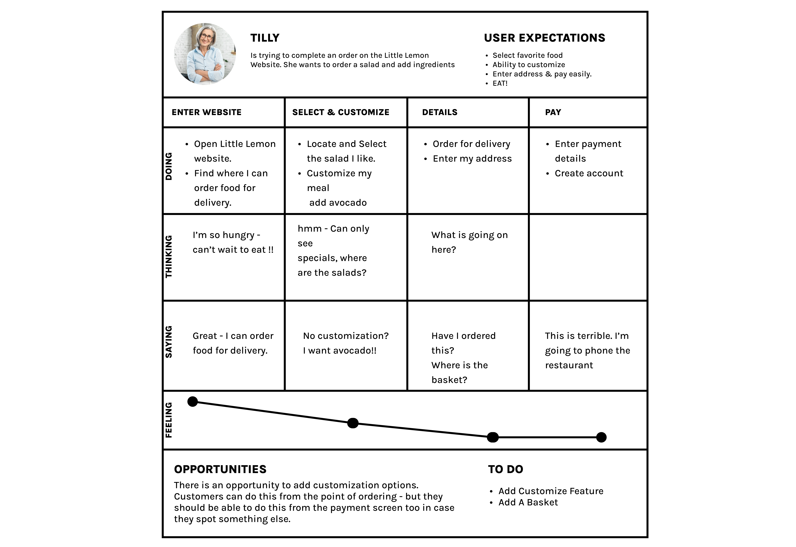

# What Is UX

UX is about a customer or user experience, UX is about asking questions, questions like what are the customers' needs? What's stopping them from achieving their goals? How intuitive is the website to use? Can users order food easily? Can customers get from one section to another quickly and efficiently, like selecting dishes and customizing their order? And it's about providing answers to those questions in the product.

UI provides information that users first see and then interact with, elements like type, color, buttons, shapes, icons and images. Successful UI design has to do with grouping and assembling these elements in a way that helps users achieve their goals quickly and efficiently while looking beautiful and adhering

UX and UI both inform each other, and when used together, they can combine to make beautiful products that are a joy to use.

For example, a UX designer will research and identify needs and iteratively proposed solutions via prototypes. A UI designer will create logical and beautiful layouts and interactive flows informed by a systemized design library. 

UX includes everything related to all the interactions that a user has with a company, its services and products. How does something like a remote control, a phone, an app or a website feel to use? How do you feel before, during and after interacting with the product? Can users achieve what they want easily from a product? Does the interface provide a smooth, enjoyable experience, making your users feel in control? Why do customers keep coming back for more?

The process is **iterative**, you may have to go back to previous steps to adjust your design to suit the customers and business goals several times. 
- If you are designing something, you observe people doing the task. 
- And from that you can identify problems that they may have completing that task 
- You then may have some ideas to work on. 
- Then you prototype your intended solution and test it

### Usability

Usability measures how intuitive or easier product is to use. "Jakob Nielsen" proposes to evaluate usability through five usability components.
- **learnability**: When the customers are trying to order for delivery, we wants the process to be easy to learn from the first time they do it. 
- **efficiency**: What if users want to change their order? Is it easy to do, and can they do it quickly and efficiently? 
- **memorability**: What if a user gets distracted? Is it easy to remember where they were when they return? How quickly can they find where they were?  
- **errors**: What if a user makes a mistake? The design should provide solutions to these mistakes and address them before they happen.  
- **satisfaction**: Is the website pleasant or satisfying to use? Do users enjoy using it? Is it easy to use? Measuring user satisfaction is not an easy task. However, you know how it feels when you use an intuitive and well-designed product. 

Considering your user's experience goals early is a methodology that you can employ to help remember the ever-changing nature of your user's experiences.

You can organize your experience goals into **desirable and undesirable** aspects.
Let's think about your customer and their goals. You want your product to be enjoyable and fun to use. You also want your design to be relaxing, satisfying, and efficient.

You will surely want your customers to be engaged, motivated, and stimulated. Another important point, you don't want them to have to think too hard to use your product. It should be intuitive. On the other hand, you don't want your website or app to be slow, confusing, or complicated to use.

You don't want your customers to feel bored, frustrated, or stressed. Customers need to easily find the correct part of the site to accomplish what they want. How can your solution be helpful without being patronizing or presumptive. 

# Empathy tools: Artifacts in the UX process

In this reading, you will learn about artifacts in the UX process. Artifacts are documents that design teams create to gather, organize and present information throughout the UX process. You will have an introduction to user personas, scenarios, user stories and storyboards. You will also cover UX-UI designers' processes to create them. 

## User personas

A user persona is a model or character that portrays a possible user of your website or app. Personas aid the design team in focusing on the end users while designing a product. Personas have been used in marketing since the middle of the 1990's. They are essential to the software development process's user experience research stage. Personas help a product team constantly focus on their target users, ensuring that the designed product fits their needs and requirements. 

Multiple user types can engage with a website or app. Developing user personas helps determine the range of users, their age group, sociometric position etc. User research is the first step in creating a user persona. UX designers can understand users' behavior and motivations by observing them and designing accordingly. A few user research methods are conducting customer interviews, making assumptions, and using web analytics, all of which are described in the next section. 

## Conducting customer interviews

Interview at least five people. After conducting several interviews, you'll notice that you're getting very little or no new information. That means you don't need to interview any more users. Also, make use of whatever information you already have. You may have some thoughts on your customers. Whether you have previously conducted research or you know something for sure. 

## Making assumptions

If you've been working on a product for quite some time. You may have enough information to make reasonably accurate assumptions about your customers. Just make sure to back them up later with research.

## Using web analytics

Web analytics tools are an excellent resource for quantitative data, so make the best of them. They can tell you how your customers behave but not why. You'll still need to talk to them to find out what motivates them. 

## Creating a customer persona group

Once your research is complete, you divide the information into customer persona groups which will then be consolidated into single-user personas, concentrating on the primary needs of the most important user group and one significant pain point.

First, add a header to your persona; this includes a fictional name, an image, a demographic profile and a quote that summarizes what matters most to your persona. These features ensure your persona is memorable and helps the design team focus on whom they're designing for. Add a personal background, a mini-biography of sorts. Then you create a psychological profile such as the user's needs, interests, motivations, and pain points. 

This allows you to understand better why your user behaves in a certain way, including why they need or want to use your product. For Tilly, in the above example, it would be for expediency. When creating user personas, remember to focus on the context of the product you're designing while you want to build up a realistic character. **There's no need to include pointless details that won't influence the final design**. 

## User stories

A user story is a brief statement or abstract that describes the user and their need or goal. It establishes who the user is, what they require, and why they require it. Each user persona typically has one user story. User stories usually adhere to a straightforward template:

As a (_type of user_), I want (_a goal_) for (_some reason_). 

- Type of _user:_ This is the end-user or the user's role in the application software. For example: "_As an online banking customer._"
-  A _goal_: This is the action taken by the user on the application software. For example: "_I want to add a payee to my account._" 
-  Some _reason_: - The outcome or desired value the user expects from the action performed. For example: "_so that I can transfer money to the payee."_

 In this example, the user story is:

 "As _an online banking customer_, I want to _add a payee to my account_, so I can _transfer money to the payee_."

User stories assist in documenting helpful information about users, such as the various needs and motivations for using a website or app. They also help the development team estimate the timeline required to deliver the final product. 

## Scenarios

A scenario is a situation that depicts how users interact with your website or app. Scenarios describe the user's motivations for being there (their task or goal) and a question they need to be answered. They also suggest possible ways to achieve these goals. Scenarios are essentially an extension of the user story and can be applied to various target users. However, they can also be divided into use cases, which describe the sequence of tasks that any given user performs in a provided functionality or path. 

For example, a scenario could describe how the user transfers money to a payee using a mobile device on his way to work. Scenarios help stakeholders visualize the design team's ideas by providing context for the intended user experience — frequently bridging communication gaps between creative and business thinking. Scenarios aid the design team in imagining the ideal solution to a user's problem. 

Scenario mapping is the first step in scenario planning. The design team, developers, and product owners gather to discuss ideas and design a plan centered on their user personas. They think about the critical task that the user hopes to achieve after defining the primary user through persona development. The following step is to conduct a scenario analysis, contextualize the user's goals and walk through the steps the user would take. 

## Storyboards

A storyboard is a visual representation of how a user will interact with a product. Designers can create different storyboards: sketches, illustrations and screenshots, slideshows and animations, or live demos.  
  

Storyboarding is an excellent method for visually communicating design concepts to teams, stakeholders, and end users. Visualizing a design idea with an interactive storyboard, like high-fidelity prototypes closely resembling the final product, will help the audience remember, empathize, and connect with it. 

### How to create a storyboard

To create a storyboard, set the scene by defining:

- your persona, 
- the environment (where the persona is) and 
- the plot (what they want to achieve). 

Then you begin to sketch out the basic idea for each scene and build it up with as many interactions as you want. 

## Summary

In this reading, you learned that the first step in designing for your users is to conduct user research, typically through user interviews, observations and other quantitative methods. You focused on empathy tools as artifacts in the UX process and how they are used. You specifically learned about user personas, scenarios, user stories, and storyboards. 
Remember that with each of these tools, it is essential to **document** the data you gather so you can use it as you create your artifacts in the UX process. It will also serve to back up your decision-making. Utilizing user personas, user stories, scenarios, and storyboards will assist you in identifying essential information about your users. They will help you create products that will delight them time and again. Everything you do to get closer to the user is a positive step towards a usable and enjoyable product.

### Overview of the UX process

UX is a very process driven discipline. There are several different models that you can follow in carrying out a UX design or redesign. While there is no one size fits all approach, following some key steps will help ensure the successful implementation of a rich user experience design. 

The five stages of the UX process are 
- empathize
- define 
- ideate
- prototype 
- test

It is important to keep in mind that UX is an iterative process which means you may have to go back to the previous stage to adjust and refine it.

Let's start with the empathize stage. You get permission to interview and observe Adrian's customers at various stages of trying to complete tasks on the restaurant website like ordering a meal for delivery. You want to listen to their frustrations. The key here is to understand your user's needs. From the results of this research, you can create a persona that you can then reference throughout the design process. You will also create an empathy, map a scenario and journey map to empathize more with this persona. This will also keep your ideas grounded so to avoid making assumptions. 

The second stage in the process you will follow is the defined stage. You collate and distill all of the information collected from your users and identify the key problems and needs that they are having.  
- You also prioritize these frustrations or pain points by importance.
- You now know who your users are, what their frustrations are and what problems you need to solve. 
- You will create a user needs statement that clearly outlines the needs your users have. 

Once you know the issues and who you're solving for, you can ideate. Ideating is about generating ideas. You can do this by sketching, brainstorming, mind mapping and even handwriting notes. The key here is to keep an open mind and not commit to one specific idea and this may be iterated throughout the design process. To iterate is to reflect on your work and refine and improve your design. You will sketch out your ideas into something that will address the little lemon customers needs. 

You will then develop them into wire frames. A wire frame is a two dimensional representation of the user interface which is concerned with the placement and hierarchy of content the functionalities that are offered. And the expected actions that users will take. 

Next comes the prototype, which is a simulation of the final product. You have iterated and refined your ideas into a fresh new solution but you cannot assume it will work for everyone and release it just yet. You should simulate how it will behave first with a prototype, take your wire frame and flesh it out. Give it some color, put in some buttons and text and make it interactive. You can simulate a real scenario for your customers to help them achieve their required goals. 

Since UX is an iterative process based on user and client feedback, you may also have to iterate at this stage. So your ideas are constantly being refined into something approaching a final design solution. 

Then you will test your design, the testing stages where you present your solution to users and get their feedback. You create a test script with some clear instructions focusing on achieving a task or tasks. Your test participants, customers in this case, interact with your prototype while trying to achieve the task at hand. Any frustrations can be communicated and highlighted at this stage and you can go back and address them before the next stage of the process. 

The final stages, the build stage, you have listened to users, empathize with them and aim to solve their needs through iterative design techniques. You've watched them use your product and have tweeted to make it easier and more intuitive. Now it's time to build, ensuring you follow these steps can help ensure you are going to build a product that addresses the needs of your users and offers a great user experience. 

# What is UI

A graphical user interface or GUI presents interactive visual components people can interact with on-screen to communicate with technology. For consistency, we refer to it as a UI. The information and how it is laid out, the icons, colors, text, shapes, and information that is all the UI. 

What happens when you tap or click something? That's the UI too. Interfaces are about communication and since the dawn of time, humans have used tools as a means to communicate with each other. Think of the modern keyboard, which is derived from the typewriter. Humans interacted with a typewriter by hitting keys with their fingers to assemble words. which what they do today to post a post on social media.

Interfaces are also about tasks. Think about a car. The dashboard is a perfect example of a user interface. If the driver performs a task like pressing the gas pedal, the car responds and the speedometer reacts on the dashboard and you also go faster. The importance of a well-designed user interface cannot be overestimated. The intuitiveness of their designs can help save lives. Xerox PARC was the first PC with a graphical user interface. This UI was refined over the years and the Xerox Star was launched in 1981 as a personal computer. 

The introduction and widespread application of many design metaphors such as the desktop, Windows, menus, and icons were and are still in use today. These design metaphors helped users complete tasks by associating familiar mental models with this then-new unfamiliar space. Another milestone was the introduction of smartphones and tablets, which utilize multi-touch screens, facilitating the use of gestures to interact with them. 

## Types of digital design

As design takes on new forms, its terminology has grown exponentially. Therefore, it's essential to have a better understanding of the design discipline. Before further exploring design in UX UI, let's first clarify where they lie within the design spectrum.

In the design spectrum, there are four types of design. First, there are Service design and Customer Experience design, which are typically analog. Then, there are User Experience design and User Interface design, which are generally digital. 

### Service design

Service design is all-encompassing. It takes into account all points of contact between a company and its customers, whether analog or digital. It defines the complete service. In a restaurant, for example, service design takes into consideration all the interactions the customer has in the real world. 

### Customer Experience design

Customer Experience, or CX, is concerned with the customer experience with a particular service or brand and thus designs all interactions between the service provider and the customer. 

### User Experience design

While CX focuses on interactions between the customer and the brand, UX (or User Experience) focuses on all interactions between the user and the specific touchpoint. UX design is mainly associated with the digital world, but in theory, it is in charge of the entire experience across all touchpoints (both digital and analog). UX design is NOT about visuals. It focuses on the overall feel of the experience. 

### User Interface design

User Interface design (or UI Design) looks into the pixel-perfect designs of digital interfaces, their usability, conversion, look and feel, and more. There are many components for digital designers to consider, but User Experience is key. It provides a solution to people's problems in order to achieve business goals. 

  
For example, there can be a situation where bank customers can't easily send or receive money via a mobile app. That is the problem customers are having. On the other hand, the bank wants more customers to use the app and increase their loyalty.

# User-centered design

User-centered design (UCD) is an iterative process in which the "needs", "wants", and "limitations" of the end users of a product are considered at each stage of the design process. The closeness and frequent interaction that results from **keeping the end user at the center of every stage of the product development process** will allow you to understand your user more thoroughly. You will better understand what they want and don't want from your design and how they will ultimately interact with each element of your product. The user is king. So, this is very abstract. How do we keep the user at the center of the design process? This is where design thinking that incorporates UX and UI comes in. 

## Design thinking

In reality, design thinking is a process for solving creative problems. Process and creativity are two words that may appear at odds with one another. A process is about following steps and rules, and creativity is more whimsical and spontaneous. But in fact, processes enable us to be more creative. More so than if we had a blank canvas of endless possibilities. We are more creative when we have limitations to work with, such as a methodology. While the output is concrete and measurable, how we look at and approach the problem and solution space is creative. There are five key steps in the Design Thinking Process: Empathize, Define, Ideate, Prototype and Test. 

Let's cover these steps now. Keep in mind that this is an iterative process, which means that after each step, you may go back to the previous step to improve your design. 

### Empathize

The first step is to relate to the problem you are attempting to solve. It enables us to delve deeper into understanding the user and develop solutions that not only meet a need but also significantly improve our users' lives by removing unnecessary discomfort or strife. For example, a user might be thinking: "This is taking too long to figure out." 

### Define

Now you must decide what to do with all this empathy. During the definition phase, you will analyze and synthesize observations to define the core problems. In his phase, a problem statement is developed, such as "As a user, I want to understand the product offering so I can make an informed decision quickly." 

### Ideate

Now that you have some empathy, an excellent contextual understanding of the problem, and a well-crafted problem statement, you're ready to start thinking about ways to solve it. The ideate phase is where you can get creative and there are hundreds of techniques for doing so. 

### Prototype

So, what do you do with those ideas that have been prioritized? You can now put together a prototype. A prototype can be pen on paper, wireframes, rough sketches, or a full-fledged high-fidelity prototype. 

### Test

After you create a prototype based on the information you gathered from the previous steps, you can now test it. Testing frequently entails getting a prototype into the hands of a real user. You see them completing a series of tasks or attempting to achieve a specific goal. You observe their actions and try to comprehend and empathize with their choices, and the design cycle continues. 

## Final thoughts

Using any or all of these five key steps or phases is an iterative and non-linear process. Consider it a toolbox. After you gain more experience, you will probably feel like you can pick and choose which steps to take for the problem you wish to solve. There are a lot of concepts and processes to comprehend. However, throughout this course, you will be guided through them in more detail.

### Little Lemon scenario

In this reading, you will learn how to present a scenario and a customer journey map documenting user requirements. You have already learned that scenarios define the stories and context that lead to a particular user or user group visiting your website. They help you make a list of the objectives and questions that need to be answered. Here are two Little Lemon scenarios. 
 
**Scenario 1**

Tilly has come home from a long hard day at work. She is hungry, tired and low on groceries. She has been craving a healthy meal all day and decides to treat herself to a meal from Little Lemon, her favorite local restaurant. 
 
### Customer journey

A customer journey map is a graphical representation of how a customer interacts with your brand at various stages. These visuals tell a story about how a customer moves through and experiences each interaction phase. Touchpoints and moments of truth, as well as potential customer feelings, such as frustration or confusion, should be included in your customer journey map. You should also include any actions you want the customer to take.

Customer journey maps are frequently based on a timeline of events. For example, it starts with the moment the customer accesses the website. Then you document their progression when trying to achieve their goals, going anywhere from viewing the product or dish they want, its customization, signing up for the website, and even canceling an order. These are just some of the actions you may want to perform while using the website, but there could be many others. 

The best customer journey maps are detailed and granular, and they help you understand the customer experience at every stage. Although there are different kinds of journey maps, they typically share these five elements. 

### Actor

The persona or user who goes on the journey is the actor. The journey map is about the actor — their point of view. Actors typically align with personas, and their actions on the map are data-driven. In the example you will explore below, Tilly is the actor.

To create a strong, clear narrative, you should provide one point of view per map: The Little Lemon in this instance. For example, you have Tilly as an actor and her journey while using the website. **You create an individual map for each actor you have.** 

### Scenario and expectations

The scenario describes the situation the journey map addresses and is associated with an actor's goal or need and specific expectations. For example, Tilly is ordering a meal online. And her expectation includes being able to easily find all the information required to make a decision and complete her order. 

### Journey phases

The journey phases are the various high-level stages of the journey. They organize the rest of the information in the journey map: actions, thoughts, and emotions. The phases will differ depending on the scenario. 

### Actions, attitudes and emotions

These are the actor's behaviors, thoughts, and feelings throughout the journey, mapped within each journey phase. Users' actions are their actual behaviors and steps. This part is not intended to be a detailed step-by-step list of each distinct interaction. Instead, it is a narrative of the actor's actions during that phase. At various stages, mindsets correspond to users' thoughts, questions, motivations, and the information they need. Ideally, these are direct quotes from customers. 

### Opportunities

Opportunities, along with additional contexts such as ownership and metrics, are mapping insights that inform how the user experience can be improved. Insights and opportunities assist the team in extracting knowledge from the map: 

- What should be done with this information?
- Where can you find the best opportunities?

  

Journey mapping uncovers moments of frustration and delight in a series of interactions to provide a detailed view of the customer experience. When executed correctly, it reveals opportunities to address customer pain points, reduce fragmentation and improve the user experience. 

## Create a persona: Overview

In this exercise, you will create a persona for the Little Lemon online booking using the template provided and empathize with this persona as a user. 

A persona is a fictitious yet realistic portrayal of your brand's typical customer. Effective personas aren't just vague outlines; they describe these fictional customers as real people with a name, a career, motivations, goals, and problems.

### Scenario

After researching the types of customers that order food online, the findings reveal that time constraints are a driving factor in why customers choose this method. With this scenario in mind, create a persona by using the steps below to fill in the blanks of the attached template.

**Step 1:  Name**

The first step is to name your persona. Because the persona represents your primary customer, you should refer to them as a natural person with real feelings and behaviors that you can empathize with while making designs and future decisions. Naming your persona adds a human element.

**Step 2: Image**

The next step is image selection. When selecting an image, remember that it should be a real person that effectively represents your target customer. Do not use a celebrity or cartoon.  You would rather use someone who realistically represents the age, gender, and personality of your persona.

**Step 3: Description** 

In step three, you will describe the persona by summarizing essential characteristics like age, gender, job and technical ability. Describing your persona this way will help create a more cohesive and realistic backstory."

**Step 4:  Quote**

Next, include a quote for your persona. This should be a quick snapshot of the persona's personality or something important to them. Remember, the goal is to create a persona that team members can empathize with, so this quote should further humanize your fictitious customer.

**Step 5:  Bio** 

Everyone appreciates a good backstory. Give your persona some context. Where do they live? What do they do in their spare time? Include some details that help make them unique. Include where they live, what they like doing, etc.

**Step 6: Core needs**

Next, you should outline your persona’s core needs. It is essential to understand their aspirations since you want your product or service to fit those needs. For example, Tilly is a busy professional who needs time to organize her life around her work. 

**Step 7: Frustrations**

In the final step, you will attempt to understand your persona's pain points. What things frustrate your persona? Do they hate doing busy work or routine tasks? Once you understand their frustrations, you can solve them and build better products that fit their needs.