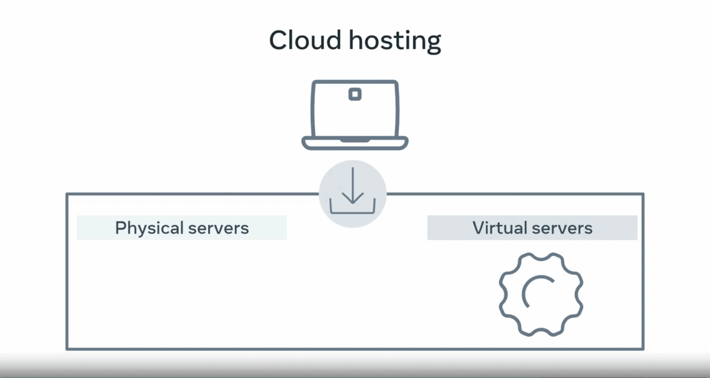

# How the Internet Works

### Network

- Two devices connected via wire or wireless connection forming a Network  

  

You can connect multiple devices together to this network but this become very complicated very quickly as each device need to connect to each device

### Network Switch

- this problem is solved by Network switch that connect multiple devices and allow them to communicate with each other

### Internet

- The network switch can connect to other network switches, These network switches then connect to more network switches until you have something called an interconnected network. aka **Internet**  

  

### Web Server

A server is a computer that runs applications and services.  
It's called a `server` because it provides a service to another computer and, it's user (browser) called `client`.

A web server has many functions which includes: Website storage, Administration, Security   
The primary function is to handle web requests

### Web browser

Browser is a software application that you use to browse the World Wide Web.

It works by sending a request to a web server and then receives a response containing the content that is to be displayed on the screen of your device.

The address of any website is called the Uniform Resource Locator (URL).

##### URL

If we have this URL `http://www.Meta.com/index.html` as an example

- `http` => Protocol
- `www.Meta.com` => Domain name
- `/index.html` => File path

### Request-Response Cycle

- You open a web browser and type the name of your favorite search engine (domain name). When you press Enter,  
  - The web browser sends a request across a network and connects to another computer on the Internet called a web server. which allows to make requests for data.
  - This data is stored in something called a database, which is connected to the web server. The web server then picks up that data and sends it back to the browser.
  - Once the browser receives all the response information, Search engine renders a visible webpage in the browser.

### How the browser render HTML code 

- When a copy of that webpage is sent from the **web server** to your **browser**, each line of code is processed in sequential order from first to last. As each line is interpreted, the browser creates the building blocks, which is the visual representation you see on the screen.

- This creation process is known as _**page rendering**_, the response from the web server must be a complete web page in order to fulfill the request (show the page in the browser).

Some engines may begin rendering before a page's resources are downloaded (css, js, images). This can result in visual changes as more data is received, such as images being gradually filled in or a flash of unstyled content.

### A browser engine

- It's a core software component of every major web browser. also known as a layout engine or rendering engine The primary job of a browser engine is to transform HTML documents and other resources of a web page into an interactive visual representation on a user's device.

- Every major browser supports JavaScript to provide a wide range of dynamic behavior for web pages.  

However, JavaScript is implemented as a separate JavaScript engine, which has enabled its usage elsewhere. In a browser, the two engines are coordinated via the DOM binding.

- The engine combines all relevant CSS rules to calculate precise graphical coordinates for the visual representation it will paint on the screen.

# Web hosting

Web hosting is a service where you place your website and files on the hosting companies web server. You're essentially renting the space in return for stable and secure storage.

## Shared Hosting

The cheapest form of web hosting is known as shared hosting. You pay for a location on a web server containing many web hosting accounts with shared hosting.

This means that you also share the service processing, power, memory, and bandwidth with other websites that might slow your performance.

- This option is best for a small website with a small number of visitors. Many developers also use this as a low-cost sandbox environment to practice deploying or hosting their personal websites. Some companies offer free shared hosting but with limitations and often have advertisements embedded in the webpages.

## Virtual Private Hosting

Sites with more considerable demands use virtual private surface or VPS. A VPS is a virtual server with dedicated CPU, memory, and bandwidth resources.

It will be running on a hardware server with other VPS instances but as the resources are fixed per VPS instance, your website is unlikely to be impacted by the performance of other VPS instances. A VPS instance will be more expensive than shared hosting.

## Dedicated Hosting

The next option up is to use dedicated hosting. This will be a hardware server that is dedicated to you only. All hardware, CPU, memory, and bandwidth resources are yours to use. Generally, this option is more expensive than a VPS hosting.

## Cloud Hosting.

Cloud hosting and the Cloud has grown in popularity over the last decade and is often mentioned in various news and services you use. With Cloud hosting, your website is run in something called a Cloud environment, which spans across multiple physical and virtual servers.

If a physical or virtual server fails, your website will run on a different server and stay online.

  

The main advantage of Cloud hosting is that: 
- You can use as many resources as you need without hardware limitations.
- However, you pay based on resource use.

For example, if you transfer a file from the Cloud to a web browser, you'll pay for the bandwidth used for that transfer at a fractional cent cost per megabyte.

- While this can quickly become more expensive, is allows websites and web applications to scale their costs as popularity grows. This is how many of the major web applications operate.

# Internet Protocols

To understand how data sent between computers across the internet you can Imagine that the computers are the destinations that request and recieve the data and the networks are the roads that the data travels across. What makes that possible is the Internet Protocol.

Think of it as postal system when you send a letter to a friend you need their address otherwise they won't receive your letter. Computers work in a similar way. Every computer on a network is assigned an IP address It's like an address of your house.

## IP protocol

When you send data across a network, you send the data as a series of messages called IP packets. Also known as data grams.  

At a high level IP packets contain a header and a payload or the data. Think of that as postal system, when you send a letter. You not only include the recipient's address but also your own address in case a return location is needed. IP packets are the same.  

They include the destination IP address and source IP address. These addresses are in the header along with some additional information to help deliver the packet, used by networking hardware to direct the packet to its destination.  

  

##### packet switching

packet switching is a method of grouping data into short messages in fixed format (packets), that are transmitted over a digital network. Packet switching is the primary basis for data communications in computer networks worldwide.

##### Other protocols

When sending multiple letters to a friend it's possible they may:   

- arrive out of order
- become damaged
- corrupted to in transit
- be dropped or lost during transit.

_**These issues can happen to IP packets too. To solve these problems, the payload part of the packets contains other protocols too. You can think of them as another message inside the payload of the IP packet.**_

### TCP | UDP

The two most common protocols are the **Transmission Control Protocol** referred to as **TCP** and the **User Datagram Protocol**, also known as **UDP**.

- TCP can solve three issues but at the cost of a small delay when sending the data. This protocol is used for sending the data that must arrive correctly and in order such as a text or image files.

- UDP solves the corrupt packet issue but packets can still arrive out of order or not arrive at all. This protocol is used for sending data that can tolerate some data loss such as voice calls or live video streaming.  

- TCP/IP protocol form the basic communication language of the internet which labels the packets of data and makes sure that even though some pieces of the same data take a different route, they all arrive at their destination and can be reassembled.

