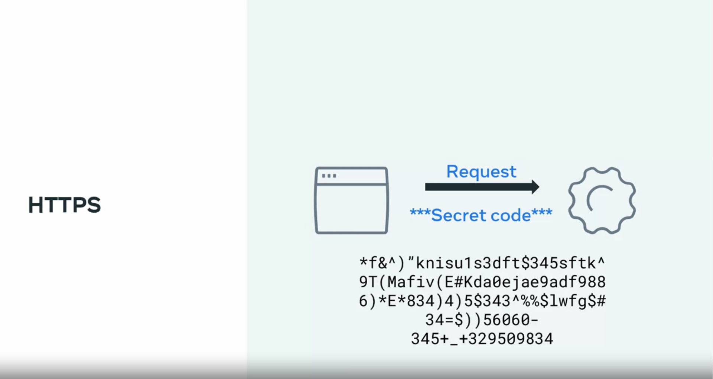
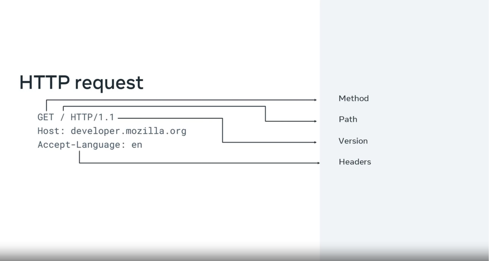
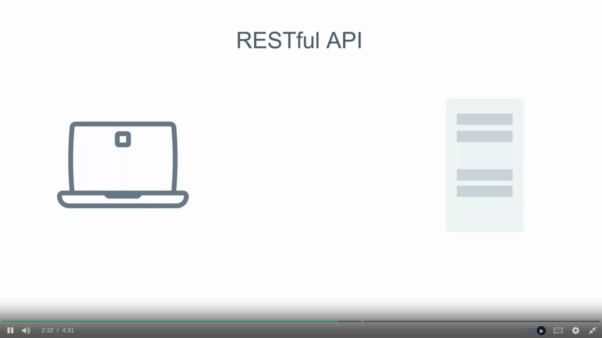

# HTTP

HTTP is a core operational protocol of the world wide web. It is what enables your web browser to communicate with a web server that hosts a website.   
HTTP stands for Hypertext Transfer Protocol. It is a protocol used for transferring web resources such as HTML documents, images, styles, and other files.  
HTTP is a request response based protocol. A web browser or client sends an HTTP request to a server and the web server sends the HTTP response back to the browser.

##### HTTPS is the secure version of HTTP

It is used for secure communication between two computers so that nobody else can see the information being sent and received. It does this by using something called encryption.

Like in HTTP, the requests and responses still behave in the same way and have the same content. The big difference is that before the content is sent, it is turned into a `secret code`. Only the other computer can turn the secret code back into its original content. If someone else was to look at the code, it wouldn't be understandable.  

  

You use HTTPS every day. This is the lock icon you see beside the URL in your web browser.

# Request and Response Cycle

## HTTP Request

Every HTTP request begins with the request line:  
`GET /home.html HTTP/1.1`  
This consists of the HTTP method `GET`, the requested resource `/home.html` and the HTTP protocol version `HTTP 1.1`. 

### HTTP methods

HTTP methods indicate the action that the client wishes to perform on the web server resource. Common HTTP methods are:

| HTTP Method | Description                                                |
|:-----------:|------------------------------------------------------------|
| GET         | The client requests a resource on the web server.          |
| POST        | The client submits data to a resource on the web server.   |
| PUT         | The client replaces a resource on the web server.          |
| DELETE      | The client deletes a resource on the web server.           |
| PATCH       | The client partially updates a resource on the web server. |


### HTTP Request Headers

After the request line, the HTTP headers are followed by a line break.

There are various possibilities when including an HTTP header in the HTTP request. A header is a case-insensitive `Name` followed by a colon `:` and then followed by a `value`. Common headers are:

```HTTP
Host: example.com
User-Agent: Mozilla/5.0 (Macintosh; Intel Mac OS X 10.9; rv:50.0) Gecko/20100101 Firefox/50.0
Accept: text/html,application/xhtml+xml,application/xml;q=0.9,*/*;q=0.8
Accept-Language: en
Content-type: text/json 
```

- The `Host` header specifies the host of the server and indicates where the resource is requested from.
- The `User-Agent` header informs the web server of the application that is making the request. It often includes the operating system (Windows, Mac, Linux), version and application vendor.
- The `Accept` header informs the web server what type of content the client will accept as the response.
- The `Accept-Language` header indicates the language and optionally the locale that the client prefers.
- The `Content-type` header indicates the type of content being transmitted in the request body.

### HTTP Request Body

HTTP requests can optionally include a request body. A request body is often included when using the HTTP POST and PUT methods to transmit data.

```HTTP
POST /users HTTP/1.1
Host: example.com
{
 "key1":"value1",
 "key2":"value2",
 "array1":["value3","value4"]
}
```

  

For certain requests methods, the request will also contain a body of content that the client is sending. 

## HTTP Responses

When the web server is finished processing the HTTP request, it will send back an HTTP response.

### HTTP response headers

The first line of the response is the status line. This line shows the client if the request was successful or if an error occurred.

```HTTP
HTTP/1.1 200 OK
```

The line begins with the HTTP protocol version `HTTP/1.1`, followed by the status code `200` and a reason phrase `OK`. The reason phrase is a textual representation of the status code.

### HTTP Status Codes

The first digit of an HTTP status code indicates the category of the response:  

- Information  
- Successful  
- Redirection  
- Client Error 
- Server Error

The common status codes you'll encounter for each category are:

##### `1XX Informational`

| Status Code | Reason Phrase       | Description |
|:-------------:|-----------------------------|:------------:|
| 100         | Continue            | The server received the request headers and should continue to send the request body.       |
| 101         | Switching Protocols | The client has requested the server to switch protocols and the server has agreed to do so. |

##### `2XX Successful`

| Status Code | Reason Phrase | Description |
|:-------------:|:---------------:|---------|
| 200         | OK            | Standard response returned by the server to indicate it successfully processed the request.   |
| 201         | Created       | The server successfully processed the request and a resource was created.                     |
| 202         | Accepted      | The server accepted the request for processing but the processing has not yet been completed. |
| 204         | No Content    | The server successfully processed the request but is not returning any content.               |

##### `3XX Redirection`

Redirection responses indicate to the web client that the requested resource has been moved to a different path. The most common response codes used are `301 moved permanently` and `302 found`.   
The difference them is that `302` indicates a temporary redirection. The resource has been temporarily moved. while `301` is moved permenently

```HTTP
HTTP/1.1 302 Found
Location: http://www.somemetaexamplesite.com/mypage.html
```

When web browsers receive these responses, they will automatically submit the request for the resource at the new path.

```HTTP
HTTP/1.1 301 Moved Permanently
Location: 'https://www.somemetaexamplesite.com/mypage.html' # New path
```

| Status Code | Reason Phrase     | Description      |
|:-------------:|:-------------------:|---------------|
| 301         | Moved Permanently | This request and all future requests should be sent to the returned location. |
| 302         | Found             | This request should be sent to the returned location.  |

##### `4XX Client Error`

| Status Code | Reason Phrase      | Description           |
|:-------------:|:--------------------:|--------------------|
| 400         | Bad Request        | The server cannot process the request due to a client error, invalid request or transmitted data is too large|
| 401         | Unauthorized       | The client making the request is unauthorized and should authenticate |
| 403         | Forbidden          | The request was valid but the server is refusing to process it This is usually returned due to the client having insufficient permissions for the website, requesting an administrator action but the user is not an administrator |
| 404         | Not Found          | The server did not find the requested resource   |
| 405         | Method Not Allowed | The web server does not support the HTTP method used   |

##### `5XX Server Error`

| Status Code | Reason Phrase         | Description    | 
|:-------------:|:-----------------------:|--------------|
| 500         | Internal Server Error | A generic error status code given when an unexpected error or condition occurred while processing the request |
| 502         | Bad Gateway           | The web server received an invalid response from the Application Server  |
| 503         | Service Unavailable   | The web server cannot process the request |

Following the status line, there are optional HTTP response headers followed by a line break.
Similar to the request headers, there are many possible HTTP headers that can be included in the HTTP response. Common response headers are:

```HTTP
Date: Fri, 11 Feb 2022 15:00:00 GMT+2
Server: Apache/2.2.14 (Linux)
Content-Length: 84
Content-Type: text/html
```

- The `Date` header specifies the date and time the HTTP response was generated.
- The `Server` header describes the web server software used to generate the response.
- The `Content-Length` header describes the length of the response.
- The `Content-Type` header describes the media type of the resource returned (e.g. HTML document, image, video).

### HTTP Response Body

Following the HTTP response headers is the HTTP response body. This is the main content of the HTTP response. This can contain images, video, HTML documents and other media types.

```HTTP
HTTP/1.1 200 OK
Date: Fri, 11 Feb 2022 15:00:00 GMT+2
Server: Apache/2.2.14 (Linux)
Content-Length: 84
Content-Type: text/html

<html>
  <head><title>Test</title></head>
  <body>Test HTML page.</body>
</html>
```
## Internet Protocols

Hypertext Transfer Protocols (HTTP) are used on top of Transmission Control Protocol (TCP) to transfer webpages and other content from websites.

### Dynamic Host Configuration Protocol (DHCP)

You've learned that computers need IP addresses to communicate with each other. When your computer connects to a network, the Dynamic Host Configuration Protocol or DHCP as it is commonly known, is used to assign your computer an IP address.

Your computer communicates over User Datagram Protocol (UDP) using the protocol with a type of server called a DHCP server. The server keeps track of computers on the network and their IP addresses. It will assign your computer an IP address and respond over the protocol to let it know which IP address to use. Once your computer has an IP address, it can communicate with other computers on the network.

### Domain Name System Protocol (DNS)

Your computer needs a way to know with which IP address to communicate when you visit a website in your web browser, for example, meta.com. The Domain Name System Protocol, commonly known as DNS, provides this function. Your computer then checks with the DNS server associated with the domain name and then returns the correct IP address.

### Internet Message Access Protocol (IMAP)

Your device needs a way to download emails and manage your mailbox on the server storing your emails. This is the purpose of the Internet Message Access Protocol or IMAP.

### Simple Mail Transfer Protocol (SMTP)

Now that your emails are on your device, you need a way to send emails. The Simple Mail Transfer Protocol, or SMTP, is used. It allows email clients to submit emails for sending via an SMTP server. You can also use it to receive emails from an email client, but IMAP is more commonly used.

### Post Office Protocol (POP)

The Post Office Protocol (POP) is an older protocol used to download emails to an email client. The main difference in using POP instead of IMAP is that POP will delete the emails on the server once they have been downloaded to your local device. Although it is no longer commonly used in email clients, developers often use it to implement email automation as it is a more straightforward protocol than IMAP.

### File Transfer Protocol (FTP)

When running your websites and web applications on the Internet, you'll need a way to transfer the files from your local computer to the server they'll run on. The standard protocol used for this is the File Transfer Protocol or FTP. FTP allows you to list, send, receive and delete files on a server. Your server must run an FTP Server and you will need an FTP Client on your local machine. You'll learn more about these in a later course.

### Secure Shell Protocol (SSH)

When you start working with servers, you'll also need a way to log in and interact with the computer remotely. The most common method of doing this is using the Secure Shell Protocol, commonly referred to as SSH. Using an SSH client allows you to connect to an SSH server running on a server to perform commands on the remote computer.
All data sent over SSH is encrypted. This means that third parties cannot understand the data transmitted. Only the sending and receiving computers can understand the data.

### SSH File Transfer Protocol (SFTP)

The data is transmitted insecurely when using the File Transfer Protocol. This means that third parties may understand the data that you are sending. This is not right if you transmit company files such as software and databases. To solve this, the SSH File Transfer Protocol, alternatively called the Secure File Transfer Protocol, can be used to transfer files over the SSH protocol. This ensures that the data is transmitted securely. Most FTP clients also support the SFTP protocol.

# APIs and services

An API is a set of functions and procedures for creating applications that access the features or data of an operating system, application or other service.

In Software development, API's are often the bridge between different components or systems. This earns them names like gateway or middleware. The term is used widely to represent many different tools and systems.

### Browser or Web APIs

They extend the functionality of the browser by adding new services and are designed to simplify complex functions and provide easy syntax for building advanced features. Let's take DOM API as an example:  

The DOM API turns the html document into a tree of nodes that are represented as JavaScript objects.  
Another example, is the geolocation API that returns coordinates of where the browser is located. There are also other API's available for

- Fetching data known as Fetch API
- Drawing graphics or Canvas API
- Keeping history or history API.
- Client side storage or Web Storage API.

## REST API.

REST or representational state transfer, is a set of principles that help build highly efficient API's.

  

One of the main responsibilities of these kinds of API's is sending and receiving data to and from a centralized database. We can query our own REST API or third party ones.

These API web servers are designed to provide the data backbone for a web client like a web page or mobile app. This means that these API's must be able to accomplish things like `get`, `post`, `put`, `delete` data

##### Sensor-Based API.

This is what the internet of things or IOT is based on. These are actual physical senses that are interconnected with each other. The sensors can communicate through API and track and respond to physical data. Some examples are smart lights and node bots.

These API's use endpoints to specify how different resources can be accessed. The endpoint is built into the URL when accessing the API. Once the endpoint is hit, the API performs whatever service side processing is needed to build the response. Two common forms of response are, full web pages and data form i.e. `Json`.


### Back-end framework

it handles functionality that is common to all web applications such as `receiving HTTP requests` and `sending HTTP responses`. The developer then adds their own code that implements the functionality of the web application.   For instance with the e-commerce website example, a framework would handle receiving `HTTP` requests. The developer would implement code that processes the request and returns a response from which the framework would send a response over `HTTP`.


