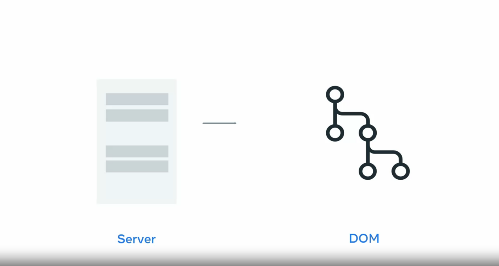

# Single page Application

## Static and dynamic content

when you open a website, a web server sends the website's content to your browser. The content can be static or dynamic.  
static content is files that the server transfers just as they are stored on the web server, such as videos or images.

Dynamic content on the other hand, is generated when the `HTTP` request is made. For example, the content may be generated based on input from a user, or when you visit a news website, it would be based on the current date. What actually happens, is that the web server communicates with another kind of server called an application server or a back-end. The application server generates the dynamic content that the web server sends back to the user's browser.  

Examples of how websites update static and dynamic content. Say for instance, you want to watch a video on a website, you click on the Play button and a request is sent to the web server.
The web server responds by sending the file to your browser. Now, how does this compare to dynamic content, Because dynamic content is generated while you use a website, it typically takes longer to generate than it takes to send back static content.

  

For example, when you log in to a website, the web server communicates with an application server to check that you are in fact you have account. The application server confirms your enrollment and specifies what content should show for your profile **specifically**.   
Application servers perform more complex processing than web servers. For instance, they have to run the application logic, communicate with the database, and check permissions.

### Caching

_Application servers typically have a limited capacity on how many requests they can process per second._
But fortunately, this is where the web server can help out. Web servers use a process called caching instead of generating content dynamically for every request. Caching means the web server keeps a copy of dynamic content.
If the content is requested again, the web server can immediately send this cached version instead of passing the request again to the application server.

On the first request for dynamic content, the web server checks if the content exists in the cache.  

  

**If it does not exist,**

the content is requested from the application server and stored in the cache. The web server then sends back the dynamic content to the browser.

  

On subsequent requests, the web server immediately sends back the content stored in the cache. This reduces the amount of dynamic content that the application server has to generate.  

  

Then, after a period of time or with the next user interaction, the web server updates the cache with the latest content.

## SPA

How traditional website works. Before the advent of modern JavaScript frameworks, most websites were implemented as multi-page applications.

But this makes traditional applications resource intensive to web servers. because sending entire web pages for every request consumes excessive bandwidth and uses CPU time to generate dynamic pages.   
If your website is complex, the site browsing experience may appear slow to users. It will be even slower if they have a poor or limited internet connection. To solve this problem, many web developers build their web applications as SPAs.

It's called single-page, but that doesn't mean your website has only one page of content. What it means is that there is only one HTML page that gets sent from the server to the browser, but that page will update its content as your users interact with your website.   

A SPA allows the user to interact with the website without the application needing to download entire new web pages. Instead, it rewrites the current web page as the user interacts with it. The result is a browsing experience that feels faster and more responsive to user input. When the user navigates to the web application in the browser, the web server returns the necessary resources to run the application.

An SPA has two approaches to serving code and resources.

### Bundling VS Lazy Loading 

  

First is bundling, when the browser requests the application, the server returns and loads all necessary HTML, CSS, and JavaScript Delivering all resources immediately. 

  

Second is lazy loading, the browser requests the application and the server returns only the minimum HTML, CSS, and JavaScript needed to load the application. while delivering resources dynamically as required.

  

For instance, with the bundling approach, if your application is complex and has a lot of resources, your bundles will grow quite large and take a long time to download. You could end up with a site that is slower than a traditional web application.  

In a traditional website, when the button is clicked, the browser will send a post request to the web server. The web server returns a new web page. The web browser then renders the new page.   
In an SPA,  when the button is clicked, the browser will send a post request to the web server. The web server will return a JSON object. 

  

The application reads the object and updates by displaying the only change the user interact with. That's more efficient because the rest of the page remains as it was and it's content does not need to be sent by the server and rendered by the browser.

If you need to update the majority of the page to display a different form of content, In a single-page application, different pages are broken into templates, also known as views.
Each view will have HTML code that can be updated by the application. For instance, the profile page would have a username, a first name, and a last name. The web browser sends the request to the web server and the web server sends back a file called a JSON object.    
This contains only the data to be displayed, such as the user's first name and last name, and the SPA will update the HTML. This is much smaller than sending an entire web page. The web browser then updates the web page by inserting the template with items replaced by the values in the JSON object.  

  

If all resources are delivered when the application is loaded, the single-page application must include the views for every page on initial load. If resources are loaded dynamically, the single-page application requests the views as required and stores views in the browser for subsequent requests.

## What is React

React is focused on working with components, which makes it simple to build functional user interfaces on web and mobile.

Developers use React to develop single page applications and you can also develop mobile applications with React native.

### Reacts components

The key concept behind React is that it allows you to define components that you can combine to build a web application.

A component is basically a small piece of user interface, such as a music player or photo gallery.

This component model allows you to do several things: Isolated Development, Isolated Testing, Re-useing components

Ex, Most Web applications have user profiles with pictures. Normally several parts of the application use a version of this profile picture, such as in the navigation bar beside the user's name. It could also show in a user search result along with several other user pictures and the user picture might also display an instant message notifications.  

  

Instead of programming the logic for every instance of a user profile picture, React allows you to create a user icon component that displays a version of a profile picture every time it is used. You can then reuse this component throughout the application.

There are many open source libraries that provide pre-made components to add a video player or to embed a map. You can then reuse this component throughout the application

React approaches building user interfaces differently by breaking them into components. This means React uses a real, full-featured programming language to render views, which we see as an advantage over templates for a few reasons:

JavaScript is a flexible, powerful programming language with the ability to build abstractions. This is incredibly important in large applications.
By unifying your markup with its corresponding view logic, React can actually make views easier to extend and maintain.
By baking an understanding of markup and content into JavaScript, there’s no manual string concatenation and therefore less surface area for XSS vulnerabilities.

## How React Works

when your web browser receives an HTML page, it constructs a DOM, to represent it.

  

But updating the DOM is considered expensive, because it is very time intensive for the web browser to do so.

  

Every time the browser DOM is updated, it causes the browser to re compute the page. Yet many big and popular websites still load in no time today, by computing its own virtual DOM.

React component, has a one to one relationship to an HTML element that is displayed on the webpage. React keep track of which HTML elements need to be updated by virtual DOM, When React builds out its tree of components, it builds out its own DOM in memory called the virtual DOM.

  

The virtual DOM is a representation of the browser DOM that is kept in memory. React uses this virtual DOM to update the browser DOM, **only when it needs to**. This ensures that your application is fast and responsive to user input.

jsx is an optional syntax extension, in case you prefer the readability of HTML to raw JavaScript. React updates are dead simple. React really shines when your data changes over time.

### This is the core concept of how react works

*When your component is first initialized, the render method is called,  generating a lightweight representation of your view. From that representation, a string of markup is produced and injected into the document. When your data changes, the render method is called again.*

In order to perform updates as efficiently as possible, we diff the return value from the previous call to render with the new one and generate a minimal set of changes to be applied to the DOM.

_**First, the virtual DOM is updated. Then React, compares the virtual DOM to the previous version of the virtual DOM, and determines which elements have changed. The changed elements, and only those elements are updated in the browser DOM. Changes on the browser DOM, cause the displayed web page to change.**_

*React checks to see if the HTML components in the virtual DOM matches the browser DOM. If a change is required, the browser dom is updated. If nothing has changed, then no update is performed. This process is called reconciliation. The data returned from render is neither a string nor a DOM node it’s a lightweight description of what the DOM should look like.*

Because this re-render is so fast (around 1ms for TodoMVC), the developer doesn’t need to explicitly specify data bindings. We’ve found this approach makes it easier to build apps. HTML is just the beginning.

  

## Summary: The Virtual DOM

React builds a representation of the browser Document Object Model or DOM in memory called the virtual DOM.  

As components are updated, React checks to see if the component’s HTML code in the virtual DOM matches the browser DOM. If a change is required, the browser DOM is updated. If nothing has changed, then no update is performed.

As you know, this is called **the reconciliation process** and can be broken down into the following steps:  

Step 1: The virtual DOM is updated.  
Step 2: The virtual DOM is compared to the previous version of the virtual DOM and checks which elements have changed.  
Step 3: The changed elements are updated in the browser DOM.  
Step 4: The displayed webpage updates to match the browser DOM.  

## React Fiber Architecture

As updating the browser DOM can be a slow operation, this process helps to reduce the number of updates to the browser DOM by only updating when it is necessary.

But even with this process, if a lot of elements are updated by an event, pushing the update to the browser DOM can still be expensive and cause slow performance in the web application.

The React team invested many years of research into solving this problem. The outcome of that research is what’s known as the React Fiber Architecture.

The Fiber Architecture allows React to incrementally render the web page. What this means is that instead of immediately updating the browser DOM with all virtual DOM changes, React can spread the update over time. But what does "over time" mean?

Imagine a really long web page in the web browser. If the user scrolls to the bottom, the top of the web page is no longer visible. The user then clicks a button on the bottom of the web page that updates some text on the top of the web page.

But the top of the page isn’t visible. Therefore, why update it immediately?

Perhaps there is text currently displayed on the bottom of the page that also updates when the button is clicked. Wouldn’t that be a higher priority to update than the non-visible text?

This is the principle of the React Fiber Architecture. React can optimize when and where updates occur to the browser DOM to significantly improve application performance and responsiveness to user input. Think of it as a priority system. The highest priority changes, the elements visible to the user, are updated first. While lower priority changes, the elements not currently displayed, are updated later.

While you’re unlikely to interact with the virtual DOM and Fiber Architecture yourself, it’s good to know what’s going on if issues occur during the development of your web application.

# Component hierarchy

### How the component hierarchy works in React

Every React application contains at least one component, the root component or app component. Components are added to the app component to build out a tree structure of components that make up the application.

### How an application might be structured as components

Suppose your application is a shopping list of items that needs to be picked up from the grocery store. At the root we have the app component. The app component has two child components, new item bar and shopping list. The new item by component allows us to add new items to the list. The shopping list component contains a shopping item, child component for each item in the shopping list.   Even though the item itself might be different, such as chicken or noodles, it is displayed in the same manner as other items.

  

Therefore, you can reuse the shopping item component to display multiple items. When a user takes off the items the list will update and remove the corresponding shopping item child component from the shopping list component.

  

