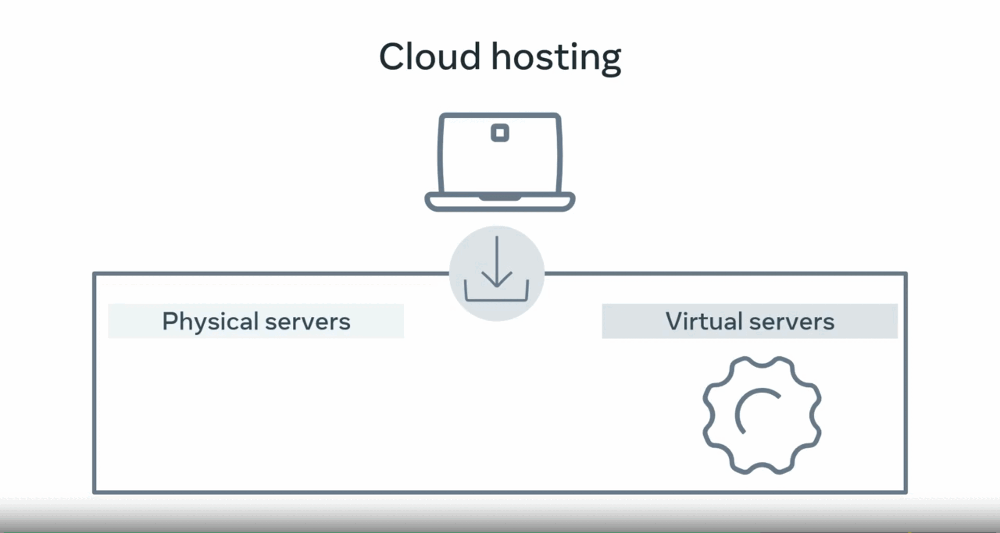

# How the Internet Works

### Network

- two devices connected via wire or wireless connection
  forming a Network
- you can connect multiple devices together to this network

  but this become very complicated very quickly as each device
  need to connect to each device
  

### Network Switch

- this problem is solved by Network switch that connect multiple devices
  and allow them to communicate with each other
  

### Internet

- the network switch can connect to other network switches


These network switches then connect to more network switches until you have something called an interconnected network. aka **Internet**


# Web Server

> A server is a computer that runs applications and
> services ranging from websites to instant messaging.
> It's called a server because it provides a service to another computer and
> its user also known as the client.

**A web server has many functions which includes**

- website storage, administration, data storage, security, managing email.

**The primary function is to handle something known as a web request**

# Websites and Webpages Differences

> A web page is a document that displays images, texts, videos and other content in
> the web browser, a website is a collection of webpages that link together.

### How does the HTML code get traslated on the browser

- When a copy of that webpage is sent from the **web server** to your **browser**,
  - each line of code is processed in sequential order from first to last.
    - As each line is interpreted, the browser creates the building blocks,
  - which is the visual representation you see on the screen.
- This creation process is known as **page rendering**,
  - the response from the web server must be a complete web page in order to fulfill the request, to show the page in the browser.

Some engines may begin rendering before a page's resources are downloaded. This can result in visual changes as more data is received, such as images being gradually filled in or a flash of unstyled content.

**Difference between a website,
and web application**
The terms website and
web application are often used interchangeably. but
The key difference between a website,
and web application is the level of
interactivity, and dynamic content.
The easy way to remember this is that a website
is more informative and
a web application is more interactive.

# Web browser, how does it work

> Browser is a software application that you use to browse the World Wide Web.

- It works by sending a request to a web server and then
- receives a response containing the content that is to be displayed on the screen of your device.


- Once the browser is open on your device,
  there is the address bar where you input
  the address of the website that you want to visit.
- The address is commonly known as
  the Uniform Resource Locator or URL for short.

- The URL contains the protocol
  or the HTTP, the domain name,
  usually the name of the website,
  and the file path, or the
  path to the page that is displayed.

### URL

```
http://www.example.com/index.html
http => Protocol
www.example.com => Domain name
/index.html => File path
```
### HTTP
#### Request-Response Cycle
- First, you open a web browser,
  which is a software application.
- Next, you type the name of your favorite search engine.
  The name you type contains
  something called a domain name.
- Then when you press Enter,
  the web browser sends a request across a network and
  connects to another computer on
  the Internet called a web server.
- <span style='color : #C63; font-weight: bold; font-size: 20px;'>The web server is a special type of computer that allows other computers to make requests for data.
  </span>


- The web server responds by sending a webpage back to the browser.
- Once the browser receives all the response information,
  the search engine webpage is made visible.


- The web page is a coded document that is rendered by
  the browser and then presented
  visually to you, the end-user.
- Now that the search engine webpage
  is loaded in the browser,
  you interact with that page to
  search for what you want to find.
- For example, type restaurants near
  me in the search bar and press the search button.
- Once again, the browser prepares and sends
  a request to the same search engine web server.


- This time, the request contains
  the added instructions to search for
  the phrase restaurants near me.
- The search engine web server processes the request by
  taking the keyword and
  using it to find the requested data.
- This data is stored in something called a database,
  which is connected to the web server.

- <span style='color : #C63; font-weight: bold; font-size: 20px;'>The web server then picks up
  that data and sends it back to the browser.</span>


- When the web browser receives
  the full response from the web server,
  it again renders a visible webpage
  with links to some restaurants,
  a map showing nearby locations and
  more related information

# packet switching

> is a method of grouping data into short messages in fixed format, i.e. packets, that are transmitted over a digital network.

- Packets are made of a header and a payload. Data in the header is used by networking hardware to direct the packet to its destination
- where the payload is extracted and used by an operating system, application software, or higher layer protocols.
- Packet switching is the primary basis for data communications in computer networks worldwide.


## A browser engine

### (also known as a layout engine or rendering engine)

- is a core software component of every major web browser.
  The primary job of a browser engine is to transform HTML documents and other resources of a web page into an interactive visual representation on a user's device.

- Every major browser supports JavaScript to provide a wide range of dynamic behavior for web pages.  
  However, JavaScript is implemented as a separate JavaScript engine, which has enabled its usage elsewhere.  
  In a browser, the two engines are coordinated via the DOM binding.

### Layout and rendering

- The layout of a web page is typically specified by Cascading Style Sheets (CSS).
- Each style sheet is a series of rules for how the page should be presented.
- For example, some rules specify typography details, such as font, color, and text size, while others determine the placement of images.
- The engine combines all relevant CSS rules to calculate precise graphical coordinates for the visual representation it will paint on the screen.

# Web hosting

> Web hosting is a service where you place
> your website and files on
> the hosting companies web server.
> You're essentially renting the space in
> return for stable and secure storage.

**Different hosting options available include:**

## Shared Hosting,

The cheapest form of web hosting
is known as shared hosting.
You pay for a location on a web server
containing many web hosting accounts with shared hosting.


**This means that you also share
the service processing power,
memory, and bandwidth with
other websites that might slow your performance.**

- _This option is best for
  a small website with a small number of visitors._
- _Many developers also use this as
  a low-cost sandbox environment to practice
  deploying or hosting their personal websites._
- _Some companies offer free shared hosting,
  but with limitations and often
  have advertisements embedded in the webpages._


## Virtual Private Hosting,

Sites with more considerable demands use
virtual private surface or VPS.
A VPS is a virtual server with dedicated CPU,
memory, and bandwidth resources.

It will be running on a hardware server with
other VPS instances but as
the resources are fixed per VPS instance,
your website is unlikely to be impacted by
the performance of other VPS instances.
A VPS instance will be
more expensive than shared hosting.

## Dedicated Hosting

The next option up is to use dedicated hosting.
This will be a hardware server
that is dedicated to you only.
All hardware, CPU, memory,
and bandwidth resources are yours to use.
Generally, this option is more
expensive than a VPS hosting.


## Cloud Hosting.

Cloud hosting and the Cloud has grown in popularity over
the last decade and is often
mentioned in various news and services you use.
With Cloud hosting, your website
is run in something called a Cloud environment,
which spans across multiple physical and virtual servers.


**If a physical or virtual server fails,
your website will run on
a different server and stay online.**


The main advantage of Cloud hosting is that you can use
as many resources as you
need

- without hardware limitations.
- However, you pay based on resource use.
  For example, if you transfer
  a file from the Cloud to a web browser,
  you'll pay for the bandwidth used for
  that transfer at a fractional cent cost per megabyte.
- While this can quickly become more expensive,
  is allows websites and web applications
  to scale their costs as popularity grows.
  This is how many of the major web applications operate.
