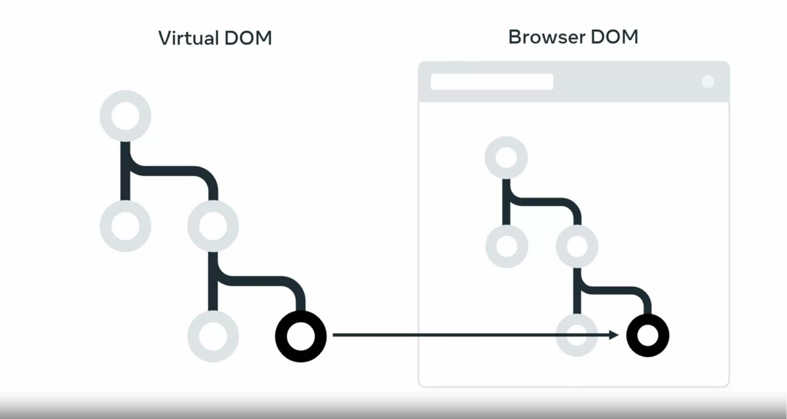
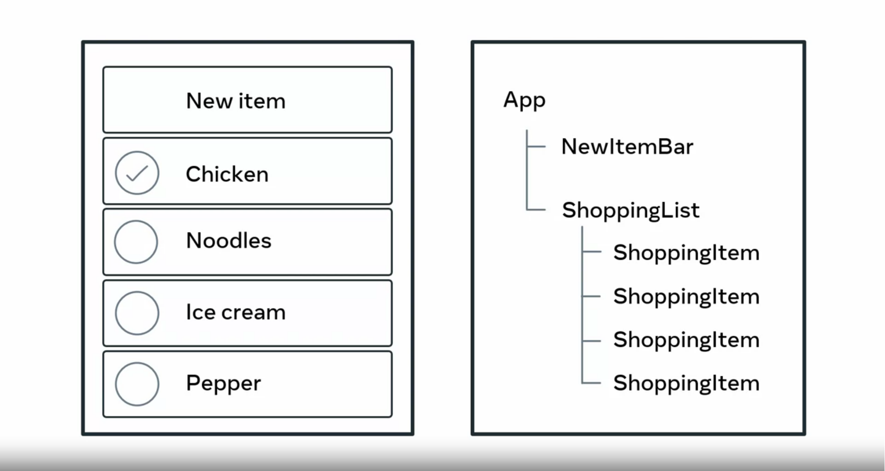

# What is React

> React is focused on working with components,
> which makes it simple to build functional user interfaces on web and mobile.

Developers use React to develop single page applications and
you can also develop mobile applications with React native.
Consider user interface and the navigation and
how the app will request data from a web server.

Therefore React is used in conjunction with other JavaScript libraries during
development.  
What makes React so
useful is that it allows developers to write less code to create functionality.

This in turn makes it easier to maintain code in the long term and
simplifies testing.
Because it is so central to front end development,
there are many tools that you can use with the React.

These tools can help you understand how React is running your code and
how you can improve performance.

### Reacts components

The key concept behind React is that it allows you
to define components that you can combine to build a web application.

> A component is basically a small piece of user interface, such as a music player or
> photo gallery.

This component model allows you to do several things

- Isolated Development
- Isolated Testing
- Re-useing components

Let's explore an example.
Most Web applications have user profiles with pictures.  
_Normally several parts of the application use a version of this profile picture,
such as in the navigation bar beside the user's name._

It could also show in a user search result along with several other user pictures  
and the user picture might also display an instant message notifications.  


Instead of programming the logic for
every instance of a user profile picture React allows you to create a user icon
component that displays a version of a profile picture every time it is used.
You can then reuse this component throughout the application.

There are many open source libraries that provide pre made components.

**_For example,_**

- to add a video player to your website.
- to embed a map.

**<span style='color:#C63;'>You can then reuse this component throughout the application.</span>**

# Case Study: Why did Facebook engineers create React?

There are a lot of JavaScript Model-View-Controller (MVC) frameworks out there.  
Why did we build React and why would you want to use it?
React isn’t an MVC framework.

React is a library for building composable user interfaces.
It encourages the creation of reusable UI components which present
data that changes over time. React doesn’t use templates.

Traditionally, web application UIs are built using templates or HTML directives.  
These templates dictate the full set of abstractions that you are allowed to use to build your UI.

React approaches building user interfaces differently by breaking them into **components**.
This means React uses a real, full-featured programming language to render views,
which we see as an advantage over templates for a few reasons:

- _JavaScript is a flexible, powerful programming language_ with
  **the ability to build abstractions**. This is incredibly important in large applications.
- By unifying your markup with its corresponding view logic,
  React can actually make views easier to extend and maintain.
- By baking an understanding of markup and content into JavaScript,
  there’s no manual string concatenation and therefore less surface area for XSS vulnerabilities.

# How React Works

when your web browser receives an HTML page, it constructs a DOM,
to represent it.

But updating the DOM is considered expensive,
because it is very time intensive for the web browser to do so.

Every time the browser DOM is updated, it causes the browser to re compute the page.
Yet many big and popular websites still load in no time today, by computing its own virtual DOM.

React component, has a one to one relationship to an HTML element that is displayed on the webpage.
React keep track of which HTML elements need to be updated by virtual DOM,


When React builds out its tree of components,
it builds out its own DOM in memory called the virtual DOM.

The virtual DOM is a representation of the browser DOM that is kept in memory.
React uses this virtual DOM to update the browser DOM, **only when it needs to**.
This ensures that your application is fast and responsive to user input.

**We’ve also created JSX**

an optional syntax extension, in case you prefer the readability of HTML to raw JavaScript.
React updates are dead simple.

React really shines when your data changes over time.

When your component is first initialized, the render method is called,
generating a lightweight representation of your view.

From that representation, a string of markup
is produced and injected into the document.  
When your data changes, the render method is called again.

In order to perform updates as efficiently as possible,
we diff the return value from the previous call to render
with the new one and generate a minimal set of changes
to be applied to the DOM.

React updates the virtual DOM and compares it to the previous version of the virtual DOM.
If a change has occurred, only that element is updated in the browser DOM.
Changes on the browser DOM cause the displayed webpage to change.


React checks to see if the HTML components in
the virtual DOM matches the browser DOM.
If a change is required, the browser dome is updated.
If nothing has changed, then no update is performed.
This process is called reconciliation.

The data returned from render is neither a string nor a DOM node —
it’s a lightweight description of what the DOM should look like.

**We call this process reconciliation.**

Firstly, the virtual DOM is updated.
Then React, compares the virtual DOM to the previous version of the virtual DOM,
and determines which elements have changed.
The changed elements, and only those elements are updated in the browser DOM.
Changes on the browser DOM, cause the displayed web page to change.

Because this re-render is so fast (around 1ms for TodoMVC), the developer doesn’t need to explicitly specify data bindings. We’ve found this approach makes it easier to build apps.
HTML is just the beginning.

Because React has its own lightweight representation of the document, we can do some pretty cool things with it:

- Facebook has dynamic charts that render to `<canvas>` instead of HTML.
- Instagram is a “single page” web app built entirely with React and Backbone.Router. Designers regularly contribute React code with JSX.
- We’ve built internal prototypes that run React apps in a web worker and use React to drive native iOS views via an Objective-C bridge.

## Summary: The Virtual DOM

React builds a representation of the browser Document Object Model or DOM in memory called the virtual DOM.  
As components are updated, React checks to see if the component’s HTML code in the virtual DOM
matches the browser DOM. If a change is required, the browser DOM is updated.  
If nothing has changed, then no update is performed.

As you know, this is called **the reconciliation process** and can be broken down into the following steps:

Step 1: The virtual DOM is updated.

Step 2: The virtual DOM is compared to the previous version of the virtual DOM and checks which elements have changed.

Step 3: The changed elements are updated in the browser DOM.

Step 4: The displayed webpage updates to match the browser DOM.

As updating the browser DOM can be a slow operation, this process helps to reduce the number of updates
to the browser DOM by only updating when it is necessary.

But even with this process, if a lot of elements are updated by an event,
pushing the update to the browser DOM can still be expensive and cause slow performance in the web application.

The React team invested many years of research into solving this problem. The outcome of that research is
what’s known as the React Fiber Architecture.

The Fiber Architecture allows React to incrementally render the web page. What this means is that
instead of immediately updating the browser DOM with all virtual DOM changes, React can spread the update
over time. But what does "over time" mean?

Imagine a really long web page in the web browser. If the user scrolls to the bottom, the top of the web page
is no longer visible. The user then clicks a button on the bottom of the web page that updates some text
on the top of the web page.

But the top of the page isn’t visible. Therefore, why update it immediately?

Perhaps there is text currently displayed on the bottom of the page that also updates when the button is clicked.
Wouldn’t that be a higher priority to update than the non-visible text?

This is the principle of the React Fiber Architecture. React can optimize when and where updates occur
to the browser DOM to significantly improve application performance and responsiveness to user input.
Think of it as a priority system. The highest priority changes, the elements visible to the user,
are updated first. While lower priority changes, the elements not currently displayed, are updated later.

While you’re unlikely to interact with the virtual DOM and Fiber Architecture yourself, it’s good to know what’s
going on if issues occur during the development of your web application.

# Component hierarchy

### How the component hierarchy works in React

Every React application contains at least one component,
the root component or app component.
Components are added to the app component to build out
a tree structure of components
that make up the application.

### How an application might be structured as components

Suppose your application is a shopping list of
items that needs to be picked up from the grocery store.
At the root we have the app component.  
The app component has two child components,
new item bar and shopping list.  
The new item by component
allows us to add new items to the list.  
The shopping list component contains a shopping item,
child component for each item in the shopping list.  
Even though the item itself might be different,
such as chicken or noodles,
it is displayed in the same manner as other items.



Therefore, you can reuse the shopping item component to display multiple items. When a user takes off the items the list will update and remove the corresponding shopping item child component from the shopping list component.


```react.js
<app/>
    <navBar>
        <title>
        <searchBar>
    <main>
</app>
```

## Alternatives to React

React is a library and not a framework. This means you'll often use other JavaScript libraries with it to build your application. In this reading, you will be briefly introduced to some JavaScript libraries commonly used with React.

### Lodash

As a developer, there's a lot of logic you'll commonly write across applications. For example, you might need to sort a list of items or round a number such as 3.14 to 3. Lodash provides common logic such as these as a utility library to save you time as a developer.
Other Javascript libraries: Lodash

### Luxon

You'll be working with dates and times often as a developer. Think of viewing a list of orders and when they were placed, or displaying a calendar schedule for an event. Dates and times are everywhere.

Luxon helps you work with dates and times by providing functions to manipulate and display them. For example, think of how dates are formatted in different countries. In the United States the format is Month Day Year but in Europe it is Day Month Year. This is one area where Luxon can help you display the date in the user's local format.
Other Javascript libraries: Luxon

### Redux

When building a web application, you'll need to keep track of its state. Think of when you shop online. The web application tracks items currently in your shopping cart. When you remove an item from the cart, the application needs to update what displays on the screen. This is where Redux comes in. It helps you manage your application state and even has advanced features such as undo and redo.
Other Javascript libraries: Redux

### Axios

As a developer you'll be communicating with APIs over HTTP frequently. The Axios library helps to simplify sending HTTP requests and processing the response. It also provides advanced features allowing you to cancel requests and to change data received from the web server before your application uses the data.
Other Javascript libraries: Axios

### Jest

It is good practice to write automated tests for your code as a professional developer. The jest library helps you to do this and works with many libraries and frameworks. It also provides reporting utilities such as providing information on how much of your code is tested by your automated tests.
