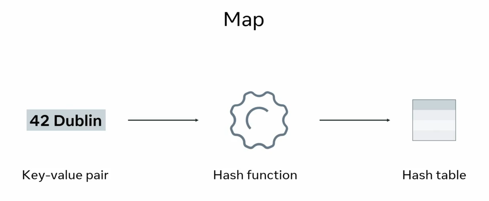

## Data Structures

JavaScript is somewhat limited in the types of data structures available compared to other programming languages, such as, Java or Python. However, some of the most common that you will encounter are `objects`, `arrays`, `maps` and `sets`.

Now you may recall that an **object is unordered, noniterable collection of key value pairs** and you use objects when you need to store and later `access a value under a key`. 

Similarly, you may also recall an **array is an ordered iterable collection of values.** Likewise, you use arrays when you need to store and later `access a value under an index`. 
And remember, we do not specify the index, JavaScript does this automatically. You only use the index to access the specific value stored in the array. 

The next data structure is **Map is like an array because it's iterable**. However, **it consists of key value pairs**.



It's important not to confuse a map with an object. With maps any value can be used as a key. With objects, keys can only be strings or symbols. 

**Finally, the last data structure is a set.**  
This is another collection where **each item in the collection must be unique**. For example, if you try to add a non-unique item to a set, this operation will simply not be run. In other words, no errors will be thrown and no updates will be made to a set. 

### Data Structures examples

Note that this reading will not include a discussion of some data structures that exist in some other languages, such as **Queues or Linked Lists**.  Although these data structures (and other data structures too!) can be custom-coded in JavaScript.

**Working with arrays in JavaScript**


There are a few important topics such as working with some built-in methods. In this reading, the focus is on three specific methods that exist on arrays:

- forEach 
- filter
- map

 Let's explore these methods.

#### The `forEach()` method

Arrays in JavaScript come with a handy method that allows you to loop over each of their members. 

Here's the basic syntax:
```js
const fruits = ['kiwi','mango','apple','pear'];
function appendIndex(fruit, index) {
    console.log(`${index}. ${fruit}`)
}
fruits.forEach(appendIndex);

// 0. kiwi
// 1. mango
// 2. apple
// 3. pear
```
To explain the syntax, the `forEach()` method accepts **a function that will work on each array item**. That function's first parameter is the current array item itself, and the second (optional) parameter is the index.

Very often, the function that the `forEach()` method needs to use is passed in directly into the method call, like this:
```js
const veggies = ['onion', 'garlic', 'potato'];
veggies.forEach( function(veggie, index) {
    console.log(`${index}. ${veggie}`);
});
```

This makes for more compact code, but perhaps somewhat harder to read. To increase readability, sometimes arrow functions are used. 

```js
var forEach = function(arr, fn) {
    if (typeof fn !== 'function') {
        throw new TypeError(fn + ' is not a function');
    }
    for (let i = 0; i < arr.length; i++) {
        if (arr.hasOwnProperty(i)) {
            fn(arr[i], i, arr);
        }
    }
};
```

**arr.hasOwnProperty(i)**  

Why is this check needed? When looping over an array using a for loop, (especially with a for...in loop) (which we’re not using here but is still relevant), the iteration might include properties that are inherited from the array's prototype chain. This can cause unexpected behavior. By using:
```js
if (this.hasOwnProperty(i)) {
```
we ensure that we're only processing elements that are directly present in the array and not inherited properties from `Array.prototype`. Example Without This Check (Unexpected Behavior)
```js
Array.prototype.extraProp = "I'm not part of the array!";
const arr = [1, 2, 3];
for (let key in arr) {
    console.log(arr[key]); // 1, 2, 3, and also "I'm not part of the array!"
}
```
**callback(`this[i]`, i, this)**


This line is where we apply the transformation function (callback) to each element of the array.
Breaking It Down

- `this[i]`: The current element of the array.
- `i`: The index of the current element.
- `this`: The original array (in case the callback needs access to it).

This mirrors how native array methods like forEach, map, or filter operate. The callback can use these parameters to perform actions based on the element's value, its position, or even reference the whole array if needed

#### The `filter()` method

Another very useful method on the array is the `filter()` method. It filters your arrays based on a specific test. Those array items that pass the test are returned.

Here's an example:
```js
const nums = [0,10,20,30,40,50];
nums.filter( function(num) {
    return num > 20;
})

// Here's the returned array value:  
[30,40,50]
```
Similar to the forEach() method, the filter() method also accepts a function and that function performs some work on each of the items in the array.

This built-in function can be easily implemented manually 

```js
var filter = function(arr, fn) {
    if (typeof fn !== 'function') {
        throw new TypeError(fn + ' is not a function');
    }
    let filteredArr = [];
    for (let i = 0; i < arr.length; i++) {
        if (arr.hasOwnProperty(i) && fn(arr[i], i, arr) === true) {
            filteredArr.push(arr[i]);
        }
    }
    return filteredArr;
};
```

#### The `map` method

Finally, there's a very useful map method. 

This method is used to map each array item over to another array's item, based on whatever work is performed inside the function that is passed-in to the map as a parameter. 

For example:
```js
[0,10,20,30,40,50].map( function(num) {
    return num / 10
})

// The return value from the above code is:  
[0,1,2,3,4,5]
```
As already discussed, choosing a proper data structure affects the very code that you can write. This is because the data structure itself comes with some built-in functionality that makes it easier to perform certain tasks or makes it harder or even impossible without converting your code to a proper data structure.

also we can implement built-in map function manaully

```js
var map = function(arr, fn) {
    // return arr.map(fn)
    let newArray = []
    for(let i=0; i < arr.length; i++){
        if (arr.hasOwnProperty(i)) {
            newArray.push(fn(arr[i], i, arr))
        }
    }
    return newArray
};
```

#### The `reduce()` method

The `reduce()` method in JavaScript is a powerful tool for transforming an array into a single accumulated value. It works by iterating over the array and executing a callback function on each element, passing along an accumulator that gathers the result over each iteration.

**How reduce() Works**

The syntax of `reduce()` is as follows:
```js
array.reduce(callback, initialValue);
```
**Parameters:**

- `callback`: A function that is executed on each element of the array. This callback function takes up to four parameters:
    - `accumulator`: The accumulated value previously returned in the last invocation of the callback, or the `initialValue` if provided.
    - `currentValue`: The current element being processed in the array.
    - `currentIndex` (optional): The index of the current element.
    - `array` (optional): The original array upon which `reduce()` was called.
- `initialValue` (optional): A value to use as the first argument to the first call of the `callback`. 
**If no initial value is supplied, the first element in the array will be used as the `accumulator`, and the iteration will start from the second element.**

**How It Operates:**

- With an `initialValue`:
- The accumulator is set to the provided initial value, and the iteration starts from the first element.

- Without an `initialValue`:
- The first element of the array is used as the `accumulator`, and the iteration starts from the second element.

- `Callback` Execution:
- For each iteration, the callback function is called with the current `accumulator` and the current array element (plus optional index and array). The value returned from the callback becomes the new `accumulator` for the next iteration.

- `Return` Value:
- After iterating over every element, `reduce()` returns the final accumulated value.

**Example 1**: Summing an Array

Let's start with a simple example where we sum all the numbers in an array:
```js
const numbers = [1, 2, 3, 4, 5];

// Using an initial value of 0 for the accumulator
const sum = numbers.reduce((accumulator, currentValue) => {
  return accumulator + currentValue;
}, 0);

console.log(sum); // Output: 15
```

- Iteration 1: `accumulator` is 0 (initialValue) and `currentValue` is 1. The `callback` returns `0 + 1 = 1`.
- Iteration 2: `accumulator` is now 1 and `currentValue` is 2. The `callback` returns 
`1 + 2 = 3.`
- Iteration 3: `accumulator` is 3 and `currentValue` is 3. The `callback` returns 
`3 + 3 = 6.`
- Iteration 4: `accumulator` is 6 and `currentValue` is 4. The `callback` returns 
`6 + 4 = 10.`
- Iteration 5: `accumulator` is 10 and `currentValue` is 5. The `callback` returns 
`10 + 5 = 15.`

At the end, `reduce()` returns 15.

**Example 2**: Flattening an Array of Arrays

You can also use `reduce()` to flatten an array of arrays:

```js
const nestedArrays = [[1, 2], [3, 4], [5, 6]];

const flatArray = nestedArrays.reduce((accumulator, currentValue) => {
  return accumulator.concat(currentValue);
}, []);

console.log(flatArray); // Output: [1, 2, 3, 4, 5, 6]
```
- The accumulator starts as an empty array [].
- For each sub-array, we concatenate it to the accumulator, building a flat array as we iterate.

**Example 3**: Counting Occurrences

Suppose you want to count the occurrences of each word in an array:
```js
const words = ['apple', 'banana', 'apple', 'orange', 'banana', 'apple'];

const wordCount = words.reduce((accumulator, word) => {
  if (accumulator[word]) {
    accumulator[word]++;
  } else {
    accumulator[word] = 1;
  }
  return accumulator;
}, {});

console.log(wordCount);
// Output: { apple: 3, banana: 2, orange: 1 }
```
- The accumulator is an empty object {} that will hold word counts.
- For each word, we check if it already exists in the accumulator. If it does, increment the count; if not, **set it** to 1.

And you can implement it manually as well: 
```js
var reduce = function(nums, fn, init) {
    if (nums.length == 0) return init
    let val = fn(init, nums[0])
    for(let i=1; i < nums.length; i++){
        val = fn(val, nums[i])
    }
    return val
};
```

## Working with Objects in JavaScript

The example below demonstrates how to use the object data structure to complete a specific task. This task is to convert an object to an array:
```js
const result = [];
const drone = {
    speed: 100,
    color: 'yellow'
}
const droneKeys = Object.keys(drone);
droneKeys.forEach((key) => {
    result.push(key, drone[key])
})
console.log(result)

// This is the result of executing the above code:  
['speed',100,'color','yellow']
```
Although this is possible and works, having to do something like this might mean that you haven't chosen the correct data structure to work with in your code.

On the flip side, sometimes you don't get to pick the data structure you're working with. Perhaps that data comes in from a third-party data provider and all you can do is code your program so that it consumes it. 

### Working with Maps in JavaScript

To make a new `Map`, you can use the Map constructor:  
`new Map();`

A map can feel very similar to an object in JS.

However, **it doesn't have inheritance. No prototypes! This makes it useful as a data storage.**

For example:
```js
let bestBoxers = new Map();
bestBoxers.set(1, "The Champion");
bestBoxers.set(2, "The Runner-up");
bestBoxers.set(3, "The third place");

console.log(bestBoxers); 
// Here's the console output:  
Map(3) {1 => 'The Champion', 2 => 'The Runner-up', 3 => 'The third place'}

// To get a specific value, you need to use the get() method. For example:  
bestBoxers.get(1); // 'The Champion'
```
Another Example be like
```js
const map1 = new Map();

map1.set('a', 1);
map1.set('b', 2);
map1.set('c', 3);

console.log(map1.get('a'));
// Expected output: 1

map1.set('a', 97);

console.log(map1.get('a'));
// Expected output: 97

console.log(map1.size);
// Expected output: 3

map1.delete('b');

console.log(map1.size);
// Expected output: 2
```
### Working with Sets in JavaScript

A set is a collection of unique values.

To build a new set, you can use the Set constructor:  
`new Set();`

The Set constructor can, for example, accept an array.

This means that we can use it to quickly filter an array for unique members.
```js
const repetitiveFruits = ['apple','pear','apple','pear','plum', 'apple'];
const uniqueFruits = new Set(repetitiveFruits);
console.log(uniqueFruits);

// The above code outputs the following in the console:  
{'apple', 'pear', 'plum'}
```
### Other data structures in JavaScript

Besides the built-in data structures in JavaScript, it's possible to build non-native, custom data structures.

These data structures come built-in natively in some other programming languages  or even those other programming languages don't support them natively.

Some more advanced data structures that have not been covered include:

- Queues
- Linked lists (singly-linked and doubly-linked)
- Trees
- Graphs

