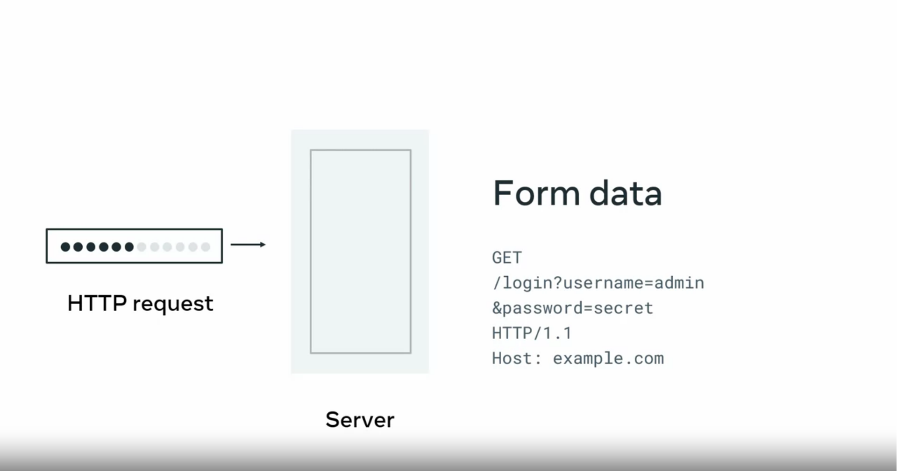
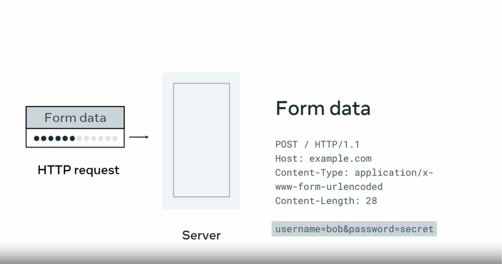

# Forms in HTML
### Input types

You already learned about the input HTML tag and how the type property determines the data your users can type in. This cheat sheet should be a reference to decide what type best suits your use case. Most of the inputs go hand in hand with the label tag for best accessibility practices.
#### Button

This displays a clickable button and it’s mostly used in HTML forms to activate a script when clicked. `<input type='button' value='Click me' onclick='msg()' />`

Keep in mind you can also define buttons with the `<button>` tag, with the added benefit of being able to place content like text or images inside the tag.
```html
<button onclick="alert('Are you sure you want to continue?')"> 
    
</button> 
```

#### Checkbox

Defines a check box allowing single values to be selected or deselected. They are used to let a user select one or more options of a limited number of choices.
```html
<input type="checkbox" id="dog" name="dog" value="Dog">
<label for="dog">I like dogs</label>
<input type="checkbox" id="cat" name="cat" value="Cat">
<label  for="cat">I like cats</label>
```

#### Radio

Displays a radio button, allowing only a single value to be selected out of multiple choices. They are normally presented in radio groups, which is a collection of radio buttons describing a set of related options that share the same "name" attribute.
```html
<input type="radio" id="light" name="theme" value="Light"> 
<label for="light">Light</label> 
<input type="radio" id="dark" name="theme" value="Dark"> 
<label for="dark">Dark</label> 
```

#### Submit

Displays a submit button for submitting all values from an HTML form to a form-handler, typically a server. The form-handler is specified in the form’s "action" attribute:
```html
<form action="myserver.com" method="POST">
  …
<input type="submit" value="Submit" />
</form>
```

#### Text

Defines a basic single-line text field that a user can enter text into. 
```html
<label for="fname">First name:</label> 
<input type="text" id="fname" name="fname"> 
```

#### Password

Defines a single-line text field whose value is obscured, suited for sensitive information like passwords.
```html
<label for="pwd">Password:</label> 
<input type="password" id="pwd" name="pwd"> 
```

#### Date

Displays a control for entering a date with no time (year, month and day).
```html
<label for="dob">Date of birth:</label>
<input type="date" id="dob" name="date of birth">
```

#### Datetime-local

Defines a control for entering a date and time, including the year, month and day, as well as the time in hours and minutes.
```html
<label for="birthdaytime">Birthday (date and time):</label>
<input type="datetime-local" id="birthdaytime" name="birthdaytime">
```

#### Email

Defines a field for an email address. It’s similar to a plain text input, with the addition that it validates automatically when submitted to the server.
```html
<label for="email">Enter your email:</label>
<input type="email" id="email" name="email">
```

#### File

Displays a control that lets the user select and upload a file from their computer. To define the types of files permissible you can use the "accept" attribute. Also, to enable multiple files to be selected, add the "multiple" attribute.
```html
<label for="myfile">Select a file:</label>
<input type="file" id="myfile" name="myfile">
```

#### Hidden

Defines a control that is not displayed but whose value is still submitted to the server.
```html
<input type="hidden" id="custId" name="custId" value="3487">
```

#### Image

Defines an image as a graphical submit button. You should use the “src” attribute to point to the location of your image file.
```html
<input type="image"src="submit_img.png" alt="Submit" width="48" height="48">
```

#### Number

Defines a control for entering a number. You can use attributes to specify restrictions, such as min and max values allowed, number intervals or a default value.

```html
<input type="number" id="quantity" name="quantity" min="1" max="5">
```

#### Range

Displays a range widget for specifying a number between two values. The precise value, however, is not considered important. This is typically represented using a slider or dial control. To define the range of acceptable values, use the “min” and “max” properties.

```html
<label for="volume">Volume:</label>
<input type="range" id="volume" name="volume" min="0" max="10">
```

#### Reset

Displays a button that resets the contents of the form to their default values.

```html
<input type="reset">
```

#### Search

Defines a text field for entering a search query. These are functionally identical to text inputs, but may be styled differently depending on the browser.

```html
<label for="gsearch">Search in Google:</label>
<input type="search" id="gsearch" name="gsearch">
```

#### Time

Displays a control for entering a time value in hours and minutes, with no time zone.

```html
<label for="appt">Select a time:</label>
<input type="time" id="appt" name="appt">
```

#### Tel

Defines a control for entering a telephone number. Browsers that do not support “tel” fall back to standard text input. You can optionally use the "pattern" field to perform validation.

```html
<label for="phone">Enter your phone number:</label>
<input type="tel" id="phone" name="phone" pattern="[+]{1}[0-9]{11,14}">
```

#### Url

Displays a field for entering a text URL. It works similar to a text input, but performs automatic validation before being submitted to the server.

```html
<label for="homepage">Add your homepage:</label>
<input type="url" id="homepage" name="homepage">
```

#### Week

Defines a control for entering a date consisting of a week-year number and a year, with no time zone. Keep in mind that this is a newer type that is not supported by all the browsers.

```html
<label for="week">Select a week:</label>
<input type="week" id="week" name="week">
```

#### Month

Displays a control for entering a month and year, with no time zone. Keep in mind that this is a newer type that is not supported by all the browsers.
```html
<label for="bdaymonth">Birthday (month and year):</label>
<input type="month" id="bdaymonth" name="bdaymonth" min="1930-01" value="2000-01">
```

### Creating a form

```html
<main>
    <form>
        <div>
            <label for="user_first_name">First Name: </label>
            <input type="text" id="user_first_name" name="user_first_name" >
        </div>
        <div>
            <label for="user_last_name">Last Name: </label>
            <input type="text" id="user_last_name" name="user_last_name" >
        </div>
        <div>
            <label for="user_email">Email: </label>
            <input type="email" id="user_email" name="user_email" >
        </div>
        <div>
            <label for="user_password">Password</label>
            <input type="password" id="user_password" name="user_password" >
        </div>
        <div>
            <label for="user_confirm_password">Confirm Password</label>
            <input type="password" id="user_confirm_password" name="user_confirm_password" >
        </div>
        <div>
            <button type="submit">Sign Up</button>
    </form>
</main>
```

### Client-side validation

- No empty fields

Now with the required attribute in the code, if one of the fields is empty and the user clicks the submit button, the request will not be submitted to the web server. 

```html
<input type="text" required>
```

The web browser will focus on the first empty input element and inform the user that a field is empty. 

- Length of input

user input that is too short or too long would also result in unnecessary submissions to the web server. So another way to validate user input is to specify the required length for data. 

```html
<input type="text" minlength="3" maxlength="12">
```

- Invalid input

To highlight a field in red when the data is invalid, you use the input element selector. You then apply the pseudo-class selector called invalid. 

```css
input:invalid {
    border: 2px solid red;
}
```

But since all the form fields are empty when the form loads initially, their state is still practically invalid. This will cause all form fields to display read from   
Ideally, you only want fields to appear red as the user enters invalid data. To do this, you need to apply another pseudo-class called focus, which checks if the user is currently entering data into this field.

```css
input:focus:invalid {
    border: 2px solid red;
}
```
#### Radio buttons

Radio buttons are ideal for forum that need to allow set up groups of options of which only one option and the group can be selected. 

First I'll set my ground to add radio buttons with form element in body tag
Next, I'll add to fieldset elements, one for the table size and one for location.
The fieldset element defines a group for the radio buttons. Without the fieldset elements, all radio buttons will belong to the same group or form, but for this form, we need two groups
There are three different tables sizes available at Little Lemon Inside the first fieldset element, I add three input elements representing the three different tables sizes. 
**It is important to set the name attribute value in radio input to match the value of the id attribute in the fieldset. This tells the browser, which fieldset the input belongs to.**
```html
<main>
    <form method="POST">
        <fieldset id="size">
            <label>
                <input type="radio" value="2" name="size"> 2-persion table
            </label>
        <!-- Since the four-person table is the most common booking, I want to have this option selected by default.  -->
        <label>
            <input type="radio" value="4" name="size" checked> 4-persion table
        </label>
        <label>
            <input type="radio" value="6" name="size"> 6-persion table
        </label>
        </fildset>
        <fieldset id="location">
        <label>
            <input type="radio" value="indoors" name="location" checked> Indoors
        </label>
        <label>
            <input type="radio" value="outdoors" name="location"> Outdoors
        </label>
        </fieldset>
        <button type="submit">Book table</button>
    </form>
</main>
```

### Cheat sheet: Interactive form elements

When filling in HTML forms, we expect users to abide by certain rules, like using numbers when asked to, or properly formatting a URL or an email when needed. However, humans are prone to errors and in some cases, they may overlook some of the data they input. That’s why it’s important to ensure the shape of the data we expect in each field is correct. HTML form validation is a set of attributes we can add to form inputs to perform automatic validation on the user’s behalf. 
The most important attributes you’ll find yourself using for validation are the following.

##### Required

Denotes a mandatory input that the user can’t leave empty. It can be used with any input type, like password, radio, text and so on. 


`<input type="text" id="firstName" name="firstName" required>` 

##### Maxlength 

Specifies the maximum length of a text input, in other words, the maximum number of characters that can be entered for a specific field. If provided, it will prevent the user from entering more characters than the limit. 


`<input type="text" id="description" name="description" maxlength="50">` 

##### Minlength 

Specifies the minimum length of a text input. If set, the input will not accept fewer characters than those specified. 


`<input type="password" id="password" name="password" minlength="8">` 

##### Min and max attributes 

Determine the minimum and maximum values allowed for an input field. They are usually applied to numerical text inputs, range inputs or dates. 


`<input type="number" id="quantity" name="quantity" min="1" max="10">` 


`<input type="range" id="volume" name="volume" min="1" max="100">` 

##### Multiple 

Indicates that the user can enter more than one value in a single input field. This attribute can only be used for email and file 

##### input types. 

`<input type="file" id="gallery" name="gallery" multiple>`

##### Pattern 

Defines a particular pattern that an input field value has to fulfill to be considered valid. This attribute expects a regular expression to specify the pattern. It works with text, date, search, URL, tel, email and password input types. For example, you can restrict phone numbers to be only from the UK. 

`<input type="tel" id="phone" name="phone" pattern=”^(?:0|\+?44)(?:\d\s?){9,10}$” >` 

Another Example that has `output` element
```html
<main>
    <form method="POST">
        <div>
            <label for="booking_date">Booking Date</label>
            <input type="date" id="booking_date" name="booking_date"> 
        </div>
        <div>
            <label for="booking_people">Number of People</label>
            <input type="range" id="booking_people" name="booking_people"
            min="1" max="10" value="4"> 
            <output>4</output>
        </div>
       <button type="submit">Book table</button>
    </form>
</main>
```
The `output` element is a semantic element that contains the result of a calculation
To do this you have to add js code in `input` element 
```html
<div>
    <input type="range" id="booking_people" name="booking_people" min="1" max="10" value="4" 
    oninput="this.nextElementSibling.value = this.value"> 
    <output>4</output>
</div>
```
```html
<div>
    <label for="booking_location">Location</label>
    <input id="booking_location" name="booking_location" list="location">
    <datalist id="location">
        <option value="Downtown"></option>
        <option value="Uptown"></option>
    </datalist>
</div>
```
### Form submission

This is how form send data to the web server. In fact, there are two ways a form can send data to the web server using the HTTP GET method or the HTTP POST method. 

```html
<form method="get">
    <input type="text">
    <input type="email">
    <input type="submit" value="Log In">
</form>
```

How would it work if the method attribute is set to `GET`? When the Login button is clicked, the form data is sent as part of the request URL. This means that the user data is appended to the end of the URL in the web browser navigation bar. The web server receives the HTTP GET request, and extracts the form data from the URL. 

  

While this is an easy way to submit data, it has three key problems. 
- First, the length of a URL has limited characters depending on the web browser you're using. So if you have a large form, some data may be lost when it sent via the GET Method to the web server. 
- Second, the length of a requested URL is also limited on some web servers. 
- The final problem is security. Since the data is included as part of the URL, it means that your data is stored in your web browser history and possibly in the request logs on the web server. If you're transmitting personal information such as addresses or credit card numbers, this is a major privacy and security risk. 


When the form is submitted using the post method, the form data is inserted into the content of the HTTP request. When the submit button is pressed, it will send an HTTP post request with the data contained in the body of the request. 

  

The HTTP post method is more secure than the HTTP GET method. However, the data could still be read by a third party listening to the HTTP request. To secure this completely, HTTPS is used to encrypt the data so that only the sender and receiver can understand the data. Once the web server receives the request, it processes it and sends back an HTTP response. If the request was successful, the response will direct the web browser to a new webpage. 

### Submit

##### Action and method 


Form submissions are an essential part of the world wide web. Nearly every website uses forms, from buying items online to ordering food for delivery. When you click the login button on a website, it sends your username and password to a web server to log you into your account. 


As you know by now, you add a form to your web page using the form tag. 
```html
<form> 
</form> 
```


But how the form is submitted is determined by two essential attributes: action and method. 


***The action attribute specifies to which web address the form must be sent. This is address is location of server-side code that will process the request.***
```html
<form action="/login"> 
</form> 
```


It is important to note that action can be a full URL address such as `https://meta.com`, an absolute path such as `/login`, or a relative path such as `login`. 


The absolute path, which starts with a forward slash, will use the base address of the current website, such as `https://meta.com` and combine it with the absolute path. For example, if `/login` is the absolute path, the form will be submitted to `https://meta.com/login`. If the address is `https://meta.com/company-info/` and `/login` is the absolute path, the submission address will still be `https://meta.com/login`.


Similarly, a relative path will combine the current web address with a relative path. For example, if the web browser is currently on the web page `https://meta.com/company-info/`, and the relative path is set to login, the form will be submitted to `https://meta.com/company-info/login`. 


The method attribute specifies which HTTP method is used to submit the form; GET or POST. 
```html
<form method="get"> 
</form> 
```

```html
<form method="post"> 
</form> 
```


The form will default to the HTTP GET method when the method attribute is not provided. 


As you may already know, when the form is submitted using the HTTP GET method, the data in the form's fields are encoded in the URL. And when the form is submitted using the HTTP POST method, the data is sent as part of the HTTP request body. 


When the web server receives the request, it processes the data and sends back an HTTP response. The response indicates the result of the submission, which can be successful or fail due to invalid or incorrect data. 


However, as a front-end developer, it is essential to know that forms are not the only way to submit data to the web server. As you learn more about JavaScript and front-end libraries, you’ll discover that developers often submit HTTP requests directly via code and send data as part of the HTTP request body in a JSON format

### Browser differences

There are many web browsers available today for browsing the World Wide Web. However, each one is developed by a different company using different technologies. As a result, you will find that your HTML forms will appear differently when you view them on different web browsers. But a form may even appear differently on the same browser when you view the form on a Windows PC or a Mac. This makes the creation of a consistent user experience challenging. 

The same input type HTML code displays differently in web browsers such as Firefox, Microsoft Edge, Chrome, and Safari. For example, there are subtle differences in the height and corners of the input box. There is also a difference in the default input box widths of Firefox and Safari compared to other browsers like Microsoft Edge and Chrome. Safari on Mac OS differs a lot from the other browsers using a thinner border on regular corners. 

And It applies in most elements

how to solve appear inconsistently across different web browsers. As you know, CSS allows you to define the visual styling of HTML elements. Defining CSS rules for the different HTML form elements will ensure that your element is styled consistently across web browsers. For example, you can use elements selectors to select a different element types and apply CSS properties to them. It's also possible to study the individual input types using CSS rules. 


 
